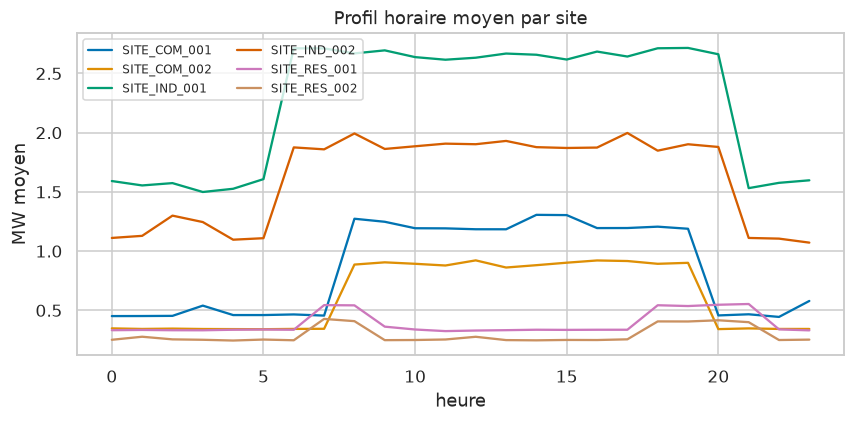
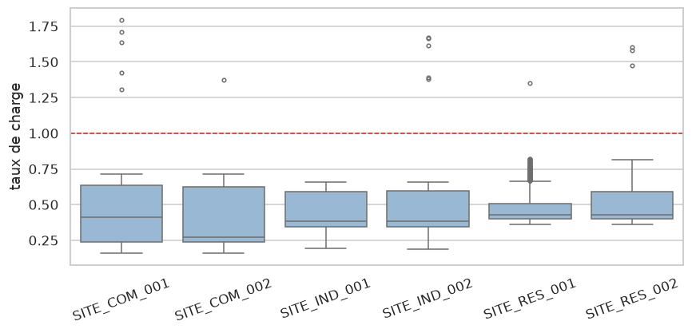
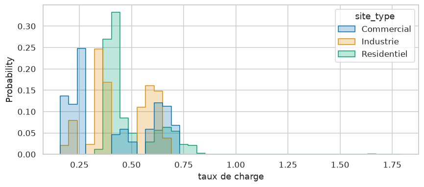

# WORKSHOP 2: PYTHON FOR MICROSOFT FABRIC — DATA STRUCTURES, NUMPY, PANDAS AND GRAPHICS

**Environnements** : deux environnements virtuels distincts : `venv-base`(Python pure and NumPy)`venv-data` (pandas, matplotlib, seaborn, pyarrow)
**Livrables** : `workshop2.ipynb`, `qualite_pandas.py`, `requirements-base.txt`, `requirements-data.txt`
**Objective**: Manipulate data with the native structures of Python, NumPy and Pandas, visualize them, and choose the virtual environment adapted to each need

---

## Business context

The previous workshop validated the quality chain of **EnergiaNord** on a single day (150 lines). Management is now requesting follow-up on **30 days** for the six sites:

- **time profiles** (day, night, weekend)
- **load rate** relative to the capacity of each site
- a **rate of anomalies** per site, with the same rules as at Workshop 1
- **graphics** for the Steering Committee

The file makes more than 4,000 lines: the loops of Workshop 1 become heavy, and the calculation tools on tables are required.

## 

| File                         | Lines | Description                                                                                              |
| ------------------------------- | ------ | -------------------------------------------------------------------------------------------------------- |
| `data/consommation_30jours.csv` | 4 365  | 1 to 30 January 2025, 6 sites, hourly measurements (4 320) + 45 duplicates. Same columns as at Workshop 1 |
| `data/sites_reference.csv`      | 6      | Reference of the six sites (identical to Workshop 1)                                                      |
| `energie_utils.py`              | —      | Module created at Workshop 1                                                                                |
| `analyse_sites.py`              | —      | Script created at Workshop 1, reused in **cross control** (Cell 47)                                 |
| `codegen_30jours.py`            | —      | Data generator (fixed seed). Optional                                                         |

**Aomalies present**: 3 timestamp formats, **260 error codes** (−999 × 110, -888 × 85, -777 × 65), **90 empty values**, **15 aberrant peaks** (overcapacity consumption) and **45 exact duplicates**. After cleaning: 350 missing values out of 4,320, or **8.1 %**.

**To be done**: copy`consommation_30jours.csv`in`data/`. `energie_utils.py`and`analyse_sites.py`are already in the folder if Workshop 1 was made in the same place (otherwise, copy them from`scripts/`). Detailed location in Part 1 ("Where to place files").

---

# PART 1: PLACE THE BASIC ENVIRONMENT

## Workshop plan

| Parties | Environnement | Contenu                                                               |
| ------- | ------------- | --------------------------------------------------------------------- |
| 1-4   | `venv-base`   | Environment, native structures, objects and magic methods, NumPy |
| 5       | both      | Creation of`venv-data`and demonstration                              |
| 6-9   | `venv-data`   | pandas and quality, aggregation, graphics, bridge to Fabric           |

## Prerequisites

- **Workshop 1 completed**: the file`python_fabric_training`exists, with`data/`.
- **Two files from Workshop 1** at the root of the folder:`energie_utils.py`and`analyse_sites.py`.
- **New data file**:`consommation_30jours.csv`in`data/`.

### Where to place files

```
python_fabric_training\
├── .venv-base\
├── data\
│   ├── consommation_30jours.csv
│   └── sites_reference.csv
├── energie_utils.py          <- à côté du notebook
├── analyse_sites.py          <- à côté du notebook
└── workshop2_basics.ipynb       <- à ouvrir depuis ce dossier
```

- **Rule**:`data\`, `energie_utils.py`, `analyse_sites.py`and the notebook are in ** the same folder**, at the same level as`.venv-base`.
- **Why** : Python first looks for a module in the notebook folder. Nothing to install.
- **Do not copy** modules in`site-packages`(neither the environment, nor the central Python): the environments are isolated, the file should be copied in each and after each modification.
- **Files elsewhere (VS Code, Jupyter)**: Cell 2 seeks`energie_utils.py`in the work file, his parents and`scripts\`Then show where she found him.

### 1. Create`.venv-base`

Open a terminal **in**`python_fabric_training`.

```powershell
py -m venv .venv-base
.venv-base\Scripts\activate.bat
py -m pip install --upgrade pip
py -m pip install ipython notebook numpy
py -m pip freeze > requirements-base.txt
```

**What you need to see on screen**:

- the prompt prefixed by`(.venv-base)`
- `requirements-base.txt`contains`numpy`,`ipython`,`notebook`... but **not**`pandas`

> 💡 L'environnement `.venv`Workshop 1 can remain in place: we leave a clean environment, dedicated to this workshop.

### 2. Save environment as Jupyter kernel

A **core** is the engine that executes the code of a notebook. Save`.venv-base`under a legible name allows you to choose it in the notebook.

```powershell
py -m ipykernel install --user --name venv-base --display-name "Python (venv-base)"
```

```text
Installed kernelspec venv-base in C:\Users\formation\AppData\Roaming\jupyter\kernels\venv-base
```

### 3. Run Jupyter with the right kernel

```powershell
jupyter notebook
```

- Click **New → Notebook**, then select the kernel **Python (venv-base)**.
- Rename Notebook`workshop2`.
- Check the kernel: name displayed at the top right of the notebook.

**What you need to see on screen**:

- name`Python (venv-base)`Top right
- Cell 1 (below) displays an interpreter located in`.venv-base`

### 4. Working rules

- **One notebook**:`workshop2.ipynb`, cells seized in order.
- **Deux noyaux** : `venv-base`for Parties 1 to 4,`venv-data`from Part 5.
- ** Shortcuts**: **Shift + Enter** (execute), **B** / **A** (insert), **D D** (delete), **M** / **Y** (Markdown / code).
- **Reference**:`scripts/workshop2_basics.ipynb`and`scripts/workshop2_data.ipynb`(executed) to compare.
- **En cas de doute** : **Kernel → Restart Kernel and Run All Cells**.

---

# PART 2: NATIONAL DATA STRUCTURES

This part and the next two are in the notebook`workshop2`, with the kernel **Python (venv-base)**. **Comments (`#`) are part of the explanation: read them before executing. **

---

## Cell 1: Environmental verification

### Before executing

- **Objective**: confirm that the notebook is running in the correct environment **before** to write code.
- **`sys.executable`** : path of the Python running the cell; it must contain`.venv-base`.
- **`import numpy as np`** : load the NumPy library under the short name`np`(universal convention). She's already settled here.
- **`Path.cwd()`** : working file of the notebook; it must contain`data/`and`energie_utils.py`.
- **`glob("*.csv")`**: list files from a folder whose name ends up`.csv`.

### 💻 Code

```python
# === CELLULE 1 : Vérification de l'environnement ===
import sys                                   # informations sur l'interpréteur Python
from pathlib import Path                     # manipulation de chemins de fichiers

import numpy as np                           # calcul sur tableaux (installé dans .venv-base)

# --- Le Python qui exécute cette cellule
print(f"Python       : {sys.version.split()[0]}")        # numéro de version
print(f"Interpréteur : {sys.executable}")                 # doit passer par .venv-base

# --- Les bibliothèques et le dossier de travail
print(f"NumPy        : {np.__version__}")                 # version de NumPy
print(f"Dossier      : {Path.cwd().name}")                # nom du dossier de travail

# --- Les fichiers attendus
print(f"Fichiers     : {sorted(p.name for p in Path('data').glob('*.csv'))}")   # CSV présents dans data/
print(f"Module A1    : {Path('energie_utils.py').exists()}")                    # le module de l'Workshop 1 est-il là ?
```

### Results

Example under Windows (versions and paths vary):

```
Python       : 3.12.x
Interpréteur : C:\Users\formation\python_fabric_training\.venv-base\Scripts\python.exe
NumPy        : 2.x.x
Dossier      : python_fabric_training
Fichiers     : ['consommation_30jours.csv', 'sites_reference.csv']
Module A1    : True
```

### Interpretation

- **Scope of the interpreter**: it must contain`.venv-base`. Otherwise, the kernel is not the right one (menu **Kernel → Change kernel**).
- **NumPy present**: installed with environment; **pandas is voluntarily absent** (demonstration in Part 5).
- **Files**: both CSV and`energie_utils.py`must appear; Otherwise, the launch record is false.

---

## Cell 2: Load the 30-day file

### Before executing

- **Reuse**:`lire_csv`, `convertir_mesure`, `parse_timestamp`and`qualifier_mesure`come from the module`energie_utils`created at the Workshop 1. No reading line is rewritten.
- **Generator**:`lire_csv`produces the lines **one by one**;`list(...)`gather them in a **list**.
- **List of dictionaries**: each line of the CSV issues a dictionary`{colonne: valeur}`; all values are **text**.
- **Volume**: 6 sites × 24h × 30 days plus duplicates.
- **`sys.path`**: list of folders where Python searches for modules. According to the tool (Jupyter, VS Code), the notebook folder is not always there.
- **Research**: the cell seeks`energie_utils.py`in the work file, his parents and`scripts/`, then ** add** the right file to`sys.path`.
- **Si `FileNotFoundError`**: the file is nowhere; the cell displays the work folder and the`.py`it contains (check also that the name is not`energie_utils.py.txt`).

### 💻 Code

```python
# === CELLULE 2 : Charger les mesures ===
import sys
from pathlib import Path

# --- 1. Trouver energie_utils.py : dossier de travail, dossiers parents, sous-dossier scripts
dossier = Path.cwd()                                   # dossier de travail du kernel
candidats = [dossier, dossier / "scripts", *dossier.parents[:3]]
trouve = next((d for d in candidats if (d / "energie_utils.py").exists()), None)

# --- 2. Rendre ce dossier visible pour import (sans effet s'il l'est déjà)
if trouve is None:
    print("Dossier de travail :", dossier)             # chemin complet, pour diagnostiquer
    print("Fichiers .py       :", sorted(p.name for p in dossier.glob("*.py")))
    raise FileNotFoundError("energie_utils.py introuvable : le copier dans le dossier de travail")
if str(trouve) not in sys.path:
    sys.path.insert(0, str(trouve))                    # Python cherchera d'abord ici
print("energie_utils.py trouvé dans :", trouve.name)

# --- 2. On importe les quatre fonctions du module de l'Workshop 1
from energie_utils import convertir_mesure, lire_csv, parse_timestamp, qualifier_mesure

# --- 3. lire_csv est un générateur ; list() le consomme et garde toutes les lignes en mémoire
lignes = list(lire_csv("data/consommation_30jours.csv"))

print(len(lignes), "lignes")                       # nombre de lignes lues
print(type(lignes).__name__, type(lignes[0]).__name__)   # une liste de dictionnaires
print(lignes[0])                                   # la première ligne, valeurs en texte
```

### Results

```
energie_utils.py trouvé dans : python_fabric_training
4365 lignes
list dict
{'timestamp': '2025-01-30T03:00:00', 'site_id': 'SITE_COM_001', 'consumption_mw': '0.479', 'voltage_v': '223.3', 'frequency_hz': '50.02', 'status': 'OK'}
```

### Interpretation

- **4 365 lines**: 4,320 measurements (6 sites × 720 hours) and **45 duplicates**.
- **`list` de `dict`**: each line is a dictionary of which **all values are text** (`'0.479'`).
- **Mixed Order**: the file is not sorted and mixes three date formats.

---

## 📝 Cellule 3 : Listes : indexation, tranches, tri

### Before executing

- **List**: sequence of values in square brackets, editable:`[10, 20, 30, 40, 50]`.
- **Index**: the position, beginning at **0**.`liste[0]` = 10 ; **`liste[-1]`** = last (50).
- **Tranche** `liste[a:b:pas]` : de `a`to`b` **exclu**. `liste[1:3]` = `[20, 30]` ; `liste[::2]` = `[10, 30, 50]`(one in two items).
- **`sorted(liste)`**: returns a **new** sorted list; **`liste.sort()`** sort the list itself.
- **`None`**: "no value"; We've got to keep it apart before`min`, `max`and`sum`.

### 💻 Code

```python
# === CELLULE 3 : Listes ===

# Les 10 premières consommations, converties du texte en nombres (une valeur vide donne None)
conso = [convertir_mesure(l["consumption_mw"]) for l in lignes[:10]]
print(conso)

# Indices et tranches
print(conso[0], conso[-1], conso[2:5], conso[::3])    # premier, dernier, éléments 2 à 4, un sur trois

# On écarte d'abord les None et les codes d'erreur négatifs, puis on calcule
valides = [c for c in conso if c is not None and c >= 0]
print(sorted(valides, reverse=True)[:3])              # les trois plus fortes (tri décroissant, sans toucher à conso)
print(min(valides), max(valides), round(sum(valides) / len(valides), 3))   # minimum, maximum, moyenne
```

### Results

```
[0.479, 1.288, 1.218, 0.672, 0.288, 0.662, 0.41, 2.302, 2.069, 2.874]
0.479 2.874 [1.218, 0.672, 0.288] [0.479, 0.672, 0.41, 2.874]
[2.874, 2.302, 2.069]
0.288 2.874 1.226
```

### Interpretation

- **`conso[0]`, `conso[-1]`**: first and last of the 10 elements;`conso[::3]`takes one in three.
- **Trois plus fortes** : `[2.874, 2.302, 2.069]` ; `sorted` **ne modifie pas** `conso`.
- **Filter before calculating**: a`None`in the list would fail`min`, `max`and`sum`.

---

## Cell 4: Lists: addition, withdrawal and useful methods

### Before executing

- **Method**: a function attached to an object, called with a point:`liste.append(x)`.
- **Add**:`append(x)`add at the end;`extend([...])`adds several elements;`insert(i, x)`add to position`i`.
- **Retirer** : `pop()`removes **and returns** the last;`remove(x)`remove the **first** occurrence of`x`.
- **Chercher** : `x in liste`(presence),`liste.index(x)` (position), `liste.count(x)` (nombre d'occurrences).

### 💻 Code

```python
# === CELLULE 4 : Méthodes de liste ===

# On construit la liste des sites dans leur ordre d'apparition, sans répétition
sites_vus = []
for l in lignes:
    if l["site_id"] not in sites_vus:        # « not in » : pas encore rencontré
        sites_vus.append(l["site_id"])       # on l'ajoute à la fin
print(sites_vus)

# Ajouts
sites_vus.extend(["SITE_TEST_999"])          # ajoute un élément à la fin
sites_vus.insert(0, "SITE_ENTETE")           # ajoute au début (position 0) : tout le reste est décalé

# Retrait et recherche
print(sites_vus.pop(),                       # retire et renvoie le dernier : SITE_TEST_999
      sites_vus.index("SITE_IND_001"),       # sa position (décalée d'un cran par SITE_ENTETE)
      sites_vus.count("SITE_IND_001"))       # combien de fois il apparaît
sites_vus.remove("SITE_ENTETE")              # retire la première occurrence de cette valeur
print(len(sites_vus))                        # nombre d'éléments restants
```

### Results

```
['SITE_COM_001', 'SITE_COM_002', 'SITE_RES_002', 'SITE_IND_002', 'SITE_IND_001', 'SITE_RES_001']
SITE_TEST_999 5 1
6
```

### Interpretation

- **Order of Appearance**: the 6 sites, not sorted or duplicated by Python.
- **`pop()`**: removes **and returns** the last element (`SITE_TEST_999`) ; `index` renvoie 5, car `SITE_ENTETE`shifted positions.
- **`remove`**: deletes the **first** occurrence; There are six sites left.
- **`in`on a list**: correct here (6 elements), expensive on large volumes (Cell 11).

---

## Cell 5: Mutability: alias, superficial copy, deep copy

### Before executing

- **Modifiable (mutable)**: a list or dictionary may change after it is created. A variable does not contain the list, it **points** to it.
- **Alias** : `b = a` ne copie rien ; `a`and`b`are **two names for the same list**.
- **Copie superficielle** `a.copy()`: new list, but its elements (here dictionaries) remain **shared** with the original.
- **Copie profonde** `copy.deepcopy(a)`: copy also the content; Totally independent.
- **Test**: you modify the original in two ways (an internal element, then an addition) and look at the following.

### 💻 Code

```python
# === CELLULE 5 : Alias et copies ===
import copy                                   # module qui fournit deepcopy

a = [{"site": "SITE_IND_001", "mw": 2.5}, {"site": "SITE_COM_001", "mw": 1.0}]

alias = a                                     # même liste, deux noms
superficielle = a.copy()                      # nouvelle liste, mêmes dictionnaires
profonde = copy.deepcopy(a)                   # tout est recopié

a[0]["mw"] = 99.0                             # modification d'un dictionnaire INTERNE
a.append({"site": "SITE_RES_001", "mw": 0.4}) # ajout à la liste elle-même

print(len(alias), len(superficielle), len(profonde))          # taille de chaque version
print(alias[0]["mw"], superficielle[0]["mw"], profonde[0]["mw"])   # la valeur modifiée est-elle visible ?
```

### Results

```
3 2 2
99.0 99.0 2.5
```

### Interpretation

- **Alias** : `alias`see the addition (3 items) is **the same list**.
- **Surface copie**: independent for`append`(2 elements), but`99.0`also appears: **internal dictionaries are shared**.
- **Copie profonde** : garde `2.5`, totally independent.
- **Danger**: A function that changes a received list to a parameter changes the caller's list.

---

## 📝 Cellule 6 : Tuples : `namedtuple`( yesterday) and`dataclass` (aujourd'hui)

### Before executing

- **Tuple** : suite de valeurs **non modifiable** : `("SITE_IND_001", 2.5)`. It can be used as a dictionary key.
- **Problem**:`t[1]`does not say what position 1 is.
- **Hier : `namedtuple`**: gives a **name** to each position (`t.mw`).
- **Aujourd'hui : `@dataclass`**: a class where typed fields, default values and methods are declared. Python writes`__init__`and`__repr__`For us.
- **`frozen=True`** : objet non modifiable ; **`slots=True`**: less memory, no attribute added by mistake.

### 💻 Code

```python
# === CELLULE 6 : namedtuple et dataclass ===
from collections import namedtuple
from dataclasses import dataclass

# Hier : un tuple dont les positions ont un nom
MesureNT = namedtuple("MesureNT", ["site_id", "mw", "statut"])

# Aujourd'hui (3.10+) : une classe de données, non modifiable
@dataclass(frozen=True, slots=True)
class Mesure:
    site_id: str                  # champ obligatoire, de type texte
    mw: float | None              # un décimal, ou None si la mesure manque
    statut: str = "OK"            # valeur par défaut

    def est_valide(self) -> bool:                       # une méthode : du comportement attaché aux données
        return self.mw is not None and self.mw >= 0

nt = MesureNT("SITE_IND_001", 2.5, "OK")
dc = Mesure("SITE_IND_001", 2.5)                        # « statut » prend sa valeur par défaut
print(nt, "|", dc)                                      # affichage automatique des deux objets
print(nt.mw, dc.mw, dc.est_valide())                    # accès par nom, appel d'une méthode

# Un objet « frozen » refuse toute modification
try:
    dc.mw = 0.0
except AttributeError as erreur:
    print(f"Modification refusée : {type(erreur).__name__}")
```

### Results

```
MesureNT(site_id='SITE_IND_001', mw=2.5, statut='OK') | Mesure(site_id='SITE_IND_001', mw=2.5, statut='OK')
2.5 2.5 True
Modification refusée : FrozenInstanceError
```

### Interpretation

- **Same content, two entries**:`dataclass`declares the types and adds a method.
- **`FrozenInstanceError`** : `frozen=True`prohibits modification; the object becomes usable as ** dictionary key**.
- **`slots=True`** (3.10+): less memory and no attribute added by mistake.
- **Affichage** : `Mesure(site_id='SITE_IND_001', mw=2.5, statut='OK')`from a`__repr__`generated automatically (see Cell 13).
- **Choix** : `namedtuple`for a simple grouping,`dataclass`when there are default values or methods.

---

## Cell 7: Dictionaries: safe reading and default values

### Before executing

- **Dictionary**: combines a**key** with a **value**:`{"SITE_IND_001": 5.0}`. We read the key, not the position.
- **`d[cle]`**: lift`KeyError`If the key is missing.
- **`d.get(cle, defaut)`** : renvoie `defaut`(or`None`) instead of raising an error.
- **`d.setdefault(cle, valeur)`** : read the key; if it does not exist, the **created** with`valeur`without crushing an existing key.

### 💻 Code

```python
# === CELLULE 7 : Dictionnaires ===
capacites = {"SITE_IND_001": 5.0, "SITE_IND_002": 3.5, "SITE_COM_001": 2.0}

# Lecture : directe, avec repli, ou avec repli chiffré
print(capacites["SITE_IND_001"],            # clé présente : 5.0
      capacites.get("SITE_XXX"),            # clé absente : None, sans erreur
      capacites.get("SITE_XXX", 0.0))       # clé absente : la valeur de repli 0.0

# Une clé absente avec [] provoque une erreur
try:
    capacites["SITE_XXX"]
except KeyError as erreur:
    print(f"KeyError : {erreur}")

# setdefault : ajoute la clé seulement si elle n'existe pas
capacites.setdefault("SITE_COM_002", 1.5)
print(list(capacites.items())[-1], len(capacites))    # dernier couple (clé, valeur) et nombre de clés
```

### Results

```
5.0 None 0.0
KeyError : 'SITE_XXX'
('SITE_COM_002', 1.5) 4
```

### Interpretation

- **`d[cle]`** : `KeyError`if the key is missing; **`get`** renvoie `None`or the withdrawal value.
- **`setdefault`**: creates the key (4 keys now) without overwriting an existing key.
- **Order**: that of insertion (guaranteeed since Python 3.7).

---

## Cell 8: Count and group:`Counter`and`defaultdict`

### Before executing

- **`Counter(iterable)`** : dictionary which **counts** occurrences ;`most_common(n)`gives the`n`more frequent.
- **`defaultdict(list)`** : dictionary that creates an empty **list** at the first use of a key. Without it, should we test "does the key exist?" before each`append`.
- **Location**: group valid measurements **by site**.
- **Warning**: duplicates are not yet removed here; the figures are provisional.

### 💻 Code

```python
# === CELLULE 8 : Counter et defaultdict ===
from collections import Counter, defaultdict

# Combien de lignes par site ? (le générateur entre parenthèses produit un site_id par ligne)
par_site = Counter(l["site_id"] for l in lignes)
print(par_site.most_common(3))               # les trois sites les plus fréquents

# Regrouper les mesures VALIDES par site
groupes = defaultdict(list)                  # chaque nouvelle clé démarre avec une liste vide
for l in lignes:
    v = convertir_mesure(l["consumption_mw"])          # texte -> décimal (ou None)
    if qualifier_mesure(v) == "VALIDE":                 # règle de qualité de l'Workshop 1
        groupes[l["site_id"]].append(v)                 # pas besoin de créer la liste avant

# Une ligne de résumé par site
for site_id, valeurs in sorted(groupes.items()):
    print(f"{site_id} : {len(valeurs):>4} mesures valides, moyenne {sum(valeurs)/len(valeurs):.3f} MW")
```

### Results

```
[('SITE_COM_002', 729), ('SITE_IND_001', 729), ('SITE_RES_001', 729)]
SITE_COM_001 :  662 mesures valides, moyenne 0.848 MW
SITE_COM_002 :  677 mesures valides, moyenne 0.615 MW
SITE_IND_001 :  679 mesures valides, moyenne 2.256 MW
SITE_IND_002 :  662 mesures valides, moyenne 1.615 MW
SITE_RES_001 :  655 mesures valides, moyenne 0.387 MW
SITE_RES_002 :  677 mesures valides, moyenne 0.293 MW
```

### Interpretation

- **729 lines** for three sites: the **doublons** inflate the meters (720 measurements + duplicates).
- **Provisional figures**: Valid (655 to 679) still include duplicates; They differ from those of pandas later.
- **`defaultdict(list)`**: delete the test "Does the key exist?".
- **Moyennes** : de 2,256 MW (`SITE_IND_001`) at 0.293 MW (`SITE_RES_002`).

---

## Cell 9: Sets: duplicates and comparisons

### Before executing

- **`set`**: collection of unique ** elements**, without order:`{1, 2, 3}`. Adding twice the same value does not change anything.
- **Operators**: | b` union, `a & b` intersection, `a - b` éléments de `a` absents de `b`, `a ^ b is present in only one of the two.
- **Usage**: compare two lists (the repository and the data received) or count the separate values.
- **Double lines**: a line is a dictionary (not "hashable"), so we convert it to **tuple** to put it in a set.

### 💻 Code

```python
# === CELLULE 9 : Ensembles ===

# Les sites du référentiel et les sites présents dans les données
referentiel = {l["site_id"] for l in lire_csv("data/sites_reference.csv")}
recus = {l["site_id"] for l in lignes}
print(len(referentiel), len(recus), referentiel == recus)      # tailles, et égalité des deux ensembles

# Différence (-) et différence symétrique (^)
print(sorted(referentiel - {"SITE_RES_002"}), "|", sorted({"A", "B"} ^ {"B", "C"}))

# Quels jours du mois sont présents ? (un ensemble ne garde qu'une fois chaque jour)
jours = {parse_timestamp(l["timestamp"]).day for l in lignes}
print(len(jours), sorted(set(range(1, 32)) - jours))           # nombre de jours, et jours absents de 1 à 31

# Dédoublonner les lignes : chaque ligne devient un tuple de ses valeurs
uniques = {tuple(l.values()) for l in lignes}
print(len(lignes), "lignes ->", len(uniques), "uniques :", len(lignes) - len(uniques), "doublons")
```

### Results

```
6 6 True
['SITE_COM_001', 'SITE_COM_002', 'SITE_IND_001', 'SITE_IND_002', 'SITE_RES_001'] | ['A', 'C']
30 [31]
4365 lignes -> 4320 uniques : 45 doublons
```

### Interpretation

- **6 = 6**: all sites in the repository are present in the file.
- **`-`and`^`**: difference, and elements present in only one of the two sets (`A`and`C`).
- **30 days covered**; the 31st missing (`[31]`), the file stops at 30.
- **Doubs**: 4 365 → 4 320 unique lines; a set of **tuples** splits into one line (a list is not hashable).

---

## Cell 10: interlocked structures and JSON

### Before executing

- **Imbration**: a dictionary that contains dictionaries that contain lists. Here : site → day → values.
- **`defaultdict(lambda: defaultdict(list))`** : `lambda:`is a nameless mini-function that makes a`defaultdict(list)`on request; Each new site therefore receives its own dictionary of days.
- **JSON**: text format for data exchange (API, configuration files).`json.dumps` : objet → texte ; `json.loads` : texte → objet.
- **Options** : `indent` (mise en forme), `ensure_ascii=False`(guards accents),`default=str`(converts what JSON does not know, like dates).

### 💻 Code

```python
# === CELLULE 10 : Structures imbriquées ===
import json                                   # lecture et écriture de JSON
from datetime import datetime                 # pour fabriquer une date d'exemple

# --- 1. Construire l'arbre site -> jour -> liste de valeurs (400 premières lignes seulement)
arbre = defaultdict(lambda: defaultdict(list))        # chaque nouveau site reçoit son propre dictionnaire de jours
for l in lignes[:400]:
    v = convertir_mesure(l["consumption_mw"])         # texte -> décimal (ou None)
    if qualifier_mesure(v) == "VALIDE":               # on ne garde que les mesures valides
        jour = parse_timestamp(l["timestamp"]).date().isoformat()   # date au format texte « 2025-01-03 »
        arbre[l["site_id"]][jour].append(v)           # site, puis jour, puis on ajoute la valeur

# --- 2. Lire un chemin dans l'arbre
site = "SITE_IND_001"
premier_jour = sorted(arbre[site])[0]                 # le jour le plus ancien pour ce site
print(site, premier_jour, arbre[site][premier_jour])  # site, jour, valeurs de ce jour

# --- 3. Écrire en JSON : un petit document à exporter
extrait = {"site": site, "genere_le": datetime(2025, 2, 1, 8, 0),      # une vraie date, inconnue de JSON
           "jour": premier_jour, "valeurs": arbre[site][premier_jour][:3]}
texte = json.dumps(extrait, indent=2, ensure_ascii=False, default=str)  # default=str convertit la date en texte
print(texte)

# --- 4. Aller-retour : on relit le texte JSON et on regarde le type de la date
print(json.loads(texte)["genere_le"], type(json.loads(texte)["genere_le"]).__name__)
```

### Results

```
SITE_IND_001 2025-01-01 [1.833]
{
  "site": "SITE_IND_001",
  "genere_le": "2025-02-01 08:00:00",
  "jour": "2025-01-01",
  "valeurs": [
    1.833
  ]
}
2025-02-01 08:00:00 str
```

### Interpretation

- **Built structure** : site → day → list of values.
- **`default=str`**: date becomes`"2025-02-01 08:00:00"`.
- **Aller-retour** : `json.loads`makes a **chain**, not a`datetime` ; JSON n'a pas de type date.
- **One value**: the cell reads only the first 400 lines (unsorted file).

---

## Cell 11: Choosing the right structure: cost of research

### Before executing

- **Question**:`x in structure`Is it that fast in a list, a set and a dictionary?
- **List** : Python compares the elements **one to one** until you find ; This is a very important issue.
- **`set`and`dict`**: direct access by **hachage** (value gives location); Almost instantaneous.
- **`timeit.timeit(fonction, number=n)`**: Implemented`fonction` `n`times and returns the total duration.`lambda: cherche in struct`is the mini-function that does the research. In IPython,`%timeit`Do the same.

### 💻 Code

```python
# === CELLULE 11 : Liste, ensemble, dictionnaire : coût de `in` ===
import timeit

# Trois structures contenant les mêmes 20 000 clés
cles_liste = [f"K{i:05d}" for i in range(20_000)]      # K00000, K00001, ... K19999
cles_set = set(cles_liste)
cles_dict = dict.fromkeys(cles_liste, 0)               # dictionnaire dont toutes les valeurs valent 0
cherche = "K19999"                                     # la clé la plus éloignée dans la liste : pire cas

# On mesure 2 000 recherches par structure, puis on divise pour avoir le coût d'une seule
for nom, struct in [("liste", cles_liste), ("ensemble", cles_set), ("dictionnaire", cles_dict)]:
    duree = timeit.timeit(lambda: cherche in struct, number=2_000) / 2_000
    print(f"{nom:<13}: {duree * 1e6:10.2f} µs par recherche")     # en microsecondes
```

### Results

```
liste        :     181.67 µs par recherche
ensemble     :       0.05 µs par recherche
dictionnaire :       0.04 µs par recherche
```

### Interpretation

- **List**: several hundred μs per search; **set and dictionary**: approximately **0.05 μs**.
- **Ordre de grandeur** : plusieurs **milliers de fois** plus rapide.
- **Cause**: the list is browsed element by element; the set and dictionary use hash.
- **Rule**: to test membership often, use a`set`or`dict`. Durations vary from position to position.

---

## 📝 Cellule 12 : `pairwise`, `batched`and`nlargest`

### Before executing

- **`itertools.pairwise(seq)`** (3.10+): consecutive couples`(a, b), (b, c), …`; practice for **variations** between two measurements.
- **`itertools.batched(seq, n)`** (**3.12+**) : lots de taille `n`. Under Python 3.11, the cell uses an equivalent folding function (`try` / `except ImportError`).
- **`heapq.nlargest(n, seq)`**:`n`larger values, without sorting the entire list.
- **`yield`**: keyword that makes a function a generator (values produced one by one), as`lire_csv`.

### 💻 Code

```python
# === CELLULE 12 : itertools et heapq ===
import heapq
from itertools import islice, pairwise

serie = groupes["SITE_COM_001"][:8]                    # 8 mesures d'un site
print([round(b - a, 3) for a, b in pairwise(serie)])   # variation entre chaque mesure et la suivante

# batched n'existe qu'à partir de Python 3.12 : on prévoit un repli pour 3.11
try:
    from itertools import batched
except ImportError:
    def batched(iterable, n):                          # même résultat, écrit à la main
        it = iter(iterable)
        while lot := tuple(islice(it, n)):             # prend n éléments à la fois jusqu'à épuisement
            yield lot                                  # yield : produit un lot puis reprend ici

lots = list(batched(range(10), 4))                     # 10 nombres en lots de 4 : le dernier est plus court
print(lots)
print(heapq.nlargest(3, groupes["SITE_IND_001"]))      # les 3 plus fortes consommations du site
```

### Results

```
[0.809, -0.07, -0.726, 0.354, 0.144, 0.423, -0.188]
[(0, 1, 2, 3), (4, 5, 6, 7), (8, 9)]
[3.3, 3.3, 3.298]
```

### Interpretation

- **`pairwise`** : 7 variations for 8 values (`b - a`on each torque).
- **`batched`**: lots of 4, the last shorter; native in 3.12, **replies** in 3.11.
- **`nlargest(3)`**: several measurements reach the theoretical maximum of the profile (3.3 MW).

---

---

# PART 3: MAGIC OBJECTS AND METHODS FROM THE LIST TO DATAFRAME

A **DataFrame** pandas handles with`len(df)`, `df["colonne"]`, `df.colonne`, `"colonne" in df`, `df[df.x > 3]`. These syntaxes are not magic: they are based on **magic methods** (`__len__`, `__getitem__`, `__getattr__`...). You write them here on tiny objects, to understand what pandas does in the suite.

- **Magic method**: method whose name is surrounded by`__`(also known as "dunder"). **Python calls it by itself** when using a language syntax:`len(x)` appelle `x.__len__()`, `x[0]` appelle `x.__getitem__(0)`, `a == b` appelle `a.__eq__(b)`.
- **Class**: a plan that makes objects.`self`means the current object;`__init__`executes at its creation.

---

## Cell 13: Display an object clean:`__repr__`and`__str__`

### Before executing

- **Problem**: Viewing an ordinary object gives a memory address, without any useful information.
- **`__repr__`**: text of **diagnosis**, displayed by the notebook, in lists and error messages. Ideally, it looks like the code that recreates the object.
- **`__str__`**: **readable text**, used by`print`. Sans `__str__`, Python utilise `__repr__`.
- **Fabric Interest**: a DataFrame, a Series or a Spark session are displayed thanks to their`__repr__`; write one for your own objects accelerates debugging.
- **Cell 6**:`dataclass`manufactured a`__repr__` automatiquement.

### 💻 Code

```python
# === CELLULE 13 : __repr__ et __str__ ===

# Classe SANS méthode magique d'affichage
class ReleveBrut:
    def __init__(self, site_id, mw):          # __init__ : appelée à la création de l'objet
        self.site_id = site_id                # les données sont rangées dans l'objet (self)
        self.mw = mw

# Même classe AVEC __repr__ et __str__
class Releve:
    def __init__(self, site_id, mw):
        self.site_id = site_id
        self.mw = mw

    def __repr__(self):                       # diagnostic : ressemble à l'appel qui recrée l'objet
        return f"Releve({self.site_id!r}, {self.mw})"

    def __str__(self):                        # lisible : pour l'utilisateur
        return f"{self.site_id} : {self.mw} MW"

brut = ReleveBrut("SITE_IND_001", 2.5)
r1, r2 = Releve("SITE_IND_001", 2.5), Releve("SITE_COM_001", 1.0)

print(brut)               # sans méthode magique : une adresse mémoire
print(r1)                 # print utilise __str__
print(repr(r1))           # repr() appelle __repr__
print([r1, r2])           # une liste affiche le __repr__ de chaque élément
```

### Results

```
<__main__.ReleveBrut object at 0x000001F3A2B4C8C0>
SITE_IND_001 : 2.5 MW
Releve('SITE_IND_001', 2.5)
[Releve('SITE_IND_001', 2.5), Releve('SITE_COM_001', 1.0)]
```

### Interpretation

- **`<...ReleveBrut object at 0x...>`**: illegible, no content information.
- **`print(r1)`** : `SITE_IND_001 : 2.5 MW` (`__str__`).
- **`repr(r1)`** : `Releve('SITE_IND_001', 2.5)` (`__repr__`) ; This is also what the list displays.
- **Rule**: Always write`__repr__`; add`__str__`only if the legible display must differ.

---

## Cell 14: Compare and sort objects:`__eq__`and`__lt__`

### Before executing

- **`__eq__(self, autre)`**: called by`a == b`; **you** decide what "equal" means.
- **`__lt__(self, autre)`**: called by`a < b`; it is sufficient for`sorted`, `min`and`max`. Python deducted`a > b` de `b < a`.
- **Sans elles** : `==`compares **memory addresses** (two identical statements would be "different") and`sorted`fails.
- **Heritage**:`class ReleveOrdonne(Releve)`repeats everything that does`Releve` (`__init__`, `__repr__`, `__str__`) and add its own methods.

### 💻 Code

```python
# === CELLULE 14 : __eq__ et __lt__ ===
class ReleveOrdonne(Releve):                  # hérite de Releve : affichage déjà écrit
    def __eq__(self, autre):                  # a == b : même site ET même valeur
        return self.site_id == autre.site_id and self.mw == autre.mw

    def __lt__(self, autre):                  # a < b : on compare les valeurs en MW
        return self.mw < autre.mw

# Six relevés valides pris dans le fichier
releves = []
for l in lignes:
    v = convertir_mesure(l["consumption_mw"])
    if qualifier_mesure(v) == "VALIDE":
        releves.append(ReleveOrdonne(l["site_id"], v))
    if len(releves) == 6:
        break

print(releves[0] == ReleveOrdonne(releves[0].site_id, releves[0].mw))   # True : __eq__
print(releves[0] is ReleveOrdonne(releves[0].site_id, releves[0].mw))   # False : deux objets distincts
print(releves[0] < releves[1], releves[0] > releves[1])                 # __lt__, et > déduit de <

print(sorted(releves)[:2])                    # sorted utilise __lt__ : les deux plus petits
print("plus fort :", max(releves))            # max aussi
```

### Results

```
True
False
True False
[Releve('SITE_RES_002', 0.288), Releve('SITE_COM_001', 0.479)]
plus fort : SITE_COM_001 : 1.288 MW
```

### Interpretation

- **`True`then`False`**: content is equal (`__eq__`), but these are two distinct objects (`is`).
- **`<`and`>`**: only one written operator (`__lt__`), both work.
- **`sorted`and`max`**: order business objects without`key=`.
- **In DataFrames**:`df["x"] > 3`produces a mask the same way (Next Cell).

---

## Cell 15: A series of measures:`__len__`, `__iter__`, `__contains__`, `__getitem__`

### Before executing

- **`__len__`**: called by`len(s)` (taille).
- **`__iter__`**: called by`for v in s`and by`list(s)`, `sum(s)`… (parcours).
- **`__contains__`**: called by`x in s`(presence).
- **`__getitem__`**: called by`s[0]`, `s[1:3]`and`s[masque]`. It receives what is between the square brackets: one whole, one slice (`slice`) or another object.
- **`__gt__`**: called by`s > 3.5`; here it returns a series of`True`/`False`, a **mask**.
- **But**: reconstruct in 20 lines the behavior of a`Series` pandas.

### 💻 Code

```python
# === CELLULE 15 : Serie ===
class Serie:
    def __init__(self, valeurs):
        self.valeurs = list(valeurs)                  # les données, dans une liste

    def __repr__(self):                               # affichage : 3 premières valeurs et la taille
        debut = ", ".join(str(v) for v in self.valeurs[:3])
        suite = ", ..." if len(self) > 3 else ""
        return f"Serie([{debut}{suite}], {len(self)} valeurs)"

    def __len__(self):                                # len(s)
        return len(self.valeurs)

    def __iter__(self):                               # for v in s
        return iter(self.valeurs)

    def __contains__(self, x):                        # x in s
        return x in self.valeurs

    def __getitem__(self, cle):                       # s[cle] : trois cas selon ce qu'on reçoit
        if isinstance(cle, Serie):                    # un masque de True/False : on filtre
            return Serie(v for v, garder in zip(self.valeurs, cle) if garder)
        if isinstance(cle, slice):                    # une tranche : on renvoie une Serie
            return Serie(self.valeurs[cle])
        return self.valeurs[cle]                      # un entier : une valeur

    def __gt__(self, seuil):                          # s > 3.5 : un masque
        return Serie(v > seuil for v in self.valeurs)

ind2 = Serie(groupes["SITE_IND_002"])                 # mesures valides d'un site (capacité 3,5 MW)

print(ind2)                                           # __repr__
print(len(ind2), ind2[0], ind2[1:3])                  # __len__, entier, tranche
print(ind2[0] in ind2, 99.0 in ind2)                  # __contains__
print(round(sum(v for v in ind2), 1))                 # __iter__ : parcours pour additionner

masque = ind2 > 3.5                                   # __gt__ : un masque de True/False
print(masque)
pics = ind2[masque]                                   # __getitem__ avec un masque : filtre
print(len(pics), sorted(pics.valeurs))                # les valeurs au-dessus de la capacité
```

### Results

```
Serie([0.662, 2.302, 2.069, ...], 662 valeurs)
662 0.662 Serie([2.302, 2.069], 2 valeurs)
True False
1069.0
Serie([False, False, False, ...], 662 valeurs)
5 [4.82, 4.872, 5.655, 5.835, 5.846]
```

### Interpretation

- **`len`, `[ ]`, `in`, `for`**: four ordinary syntaxes, four magic methods.
- **Tranche** : `ind2[1:3]`again`Serie`.
- **Masque** : `ind2 > 3.5`returns a`Serie`Booleans;`ind2[masque]`keep the corresponding values.
- **Pics**: measurements above 3.5 MW are aberrant **pics** (site capacity).
- **Same writing in pandas**:`s[s > 3.5]`.

---

## Cell 16: A mini-DataFrame: columns by`[ ]`and by`.`with`__getattr__`

### Before executing

- **Objective**: a table of several columns, manipulated like a DataFrame.
- **`__getitem__`with text**:`t["conso_mw"]`returns the column; with a mask, it filters **all** columns.
- **`__getattr__(self, nom)`**: called **only** when an attribute does not exist. It allows`t.conso_mw`in place of`t["conso_mw"]`.
- **`AttributeError`** : to be raised for an unknown name; if not`hasattr` se comporte mal.
- **`__iter__`on an array**: browsing a DataFrame pandas gives the **column names**; We do the same.
- **`__contains__`** : `"colonne" in t`Test columns like pandas.

### 💻 Code

```python
# === CELLULE 16 : Tableau ===

# --- 1. Un mini-DataFrame : un dictionnaire de colonnes, chaque colonne étant une Serie
class Tableau:
    def __init__(self, colonnes):
        self.colonnes = {nom: Serie(vals) for nom, vals in colonnes.items()}

    def __repr__(self):                               # résumé lisible dans le notebook
        return f"Tableau({len(self)} lignes, colonnes={list(self.colonnes)})"

    def __len__(self):                                # nombre de lignes = taille de la première colonne
        return len(next(iter(self.colonnes.values())))

    def __iter__(self):                               # parcourir un tableau donne les noms de colonnes (comme pandas)
        return iter(self.colonnes)

    def __contains__(self, nom):                      # "conso_mw" in t : la colonne existe-t-elle ?
        return nom in self.colonnes

    # --- 2. __getitem__ : quatre façons de sélectionner, selon ce qu'on met entre crochets
    def __getitem__(self, cle):
        if isinstance(cle, str):                      # t["conso_mw"] : une colonne
            return self.colonnes[cle]
        if isinstance(cle, list):                     # t[["site_id", "conso_mw"]] : plusieurs colonnes
            return Tableau({nom: self.colonnes[nom].valeurs for nom in cle})
        if isinstance(cle, int):                      # t[0] : une ligne, sous forme de dictionnaire
            return {nom: col[cle] for nom, col in self.colonnes.items()}
        if isinstance(cle, Serie):                    # t[masque] : on filtre TOUTES les colonnes
            return Tableau({nom: col[cle].valeurs for nom, col in self.colonnes.items()})
        raise TypeError(f"clé non prise en charge : {type(cle).__name__}")

    # --- 3. __getattr__ : t.conso_mw à la place de t["conso_mw"]
    def __getattr__(self, nom):                       # appelée seulement si l'attribut n'existe pas
        colonnes = self.__dict__.get("colonnes", {})  # on passe par __dict__ pour éviter une boucle infinie
        if nom in colonnes:
            return colonnes[nom]
        raise AttributeError(f"pas de colonne {nom!r}")

# --- 4. Un tableau à deux colonnes, construit à partir des mesures valides
valides_l = [l for l in lignes if qualifier_mesure(convertir_mesure(l["consumption_mw"])) == "VALIDE"]
t = Tableau({"site_id": [l["site_id"] for l in valides_l],
             "conso_mw": [convertir_mesure(l["consumption_mw"]) for l in valides_l]})

# --- 5. Essais
print(t)                                              # __repr__
print(len(t), list(t))                                # __len__ et __iter__ (noms de colonnes)
print("conso_mw" in t, "tension" in t)                # __contains__
print(t[0])                                           # __getitem__ avec un entier : la première ligne
print(t[["site_id"]])                                 # __getitem__ avec une liste : une sélection de colonnes
print(t["conso_mw"] is t.conso_mw)                    # [ ] et . donnent la même colonne

forts = t[t.conso_mw > 3.5]                           # masque + __getitem__ : lignes au-dessus de 3,5 MW
print(forts, sorted(set(forts.site_id)))              # sites concernés

try:
    t.tension                                         # colonne inexistante
except AttributeError as erreur:
    print("AttributeError :", erreur)
```

### Results

```
Tableau(4012 lignes, colonnes=['site_id', 'conso_mw'])
4012 ['site_id', 'conso_mw']
True False
{'site_id': 'SITE_COM_001', 'conso_mw': 0.479}
Tableau(4012 lignes, colonnes=['site_id'])
True
Tableau(6 lignes, colonnes=['site_id', 'conso_mw']) ['SITE_COM_001', 'SITE_IND_002']
AttributeError : pas de colonne 'tension'
```

### Interpretation

- **`Tableau(... lignes, colonnes=['site_id', 'conso_mw'])`**:`__repr__`sum up the object.
- **`t["conso_mw"] is t.conso_mw`** : `True`; Two scriptures, one column.
- **`t[t.conso_mw > 3.5]`** : filters all columns at once; alone`SITE_COM_001`and`SITE_IND_002`more than 3.5 MW.
- **`AttributeError`**: An unknown column name fails properly.
- **Continued**: in Part 5,`df["conso_mw"]`, `df.conso_mw`, `len(df)`, `"conso_mw" in df`and`df[df.conso_mw > 3.5]`write to the same**.
- **Autres usages de `__getattr__`**: an object that wraps a DataFrame or API and transmits attributes to it.

---

## Cell 17: Objects called functions:`__call__`

### Before executing

- **`__call__`**: if a class defines it, its objects**are called functions**:`en_kw(0.865)`execute`en_kw.__call__(0.865)`.
- **Advantage on a function**: the object **guards a status** (here a call counter) and **parameters** (the conversion factor).
- **`callable(x)`** : vrai si `x`may be called.
- **`map(objet, liste)`**: applies a callable object to each item in a list.
- **Changing chain**: several linked callable objects form a **pipeline** (concealed by scikit-learn and by`df.pipe`).

### 💻 Code

```python
# === CELLULE 17 : __call__ ===

# --- 1. Une transformation paramétrée : multiplie par un facteur et compte ses usages
class Convertisseur:
    def __init__(self, facteur, unite):
        self.facteur = facteur                        # paramètre de la transformation
        self.unite = unite
        self.appels = 0                               # état : combien de fois l'objet a servi

    def __call__(self, valeur):                       # appelée par en_kw(valeur)
        self.appels += 1
        return round(valeur * self.facteur, 3)

# --- 2. Une transformation qui plafonne une valeur
class Plafonneur:
    def __init__(self, maximum):
        self.maximum = maximum

    def __call__(self, valeur):                       # ramène la valeur au maximum autorisé
        return min(valeur, self.maximum)

# --- 3. Une chaîne de transformations : chaque étape reçoit la sortie de la précédente
class Chaine:
    def __init__(self, *etapes):
        self.etapes = etapes                          # les objets appelables, dans l'ordre

    def __call__(self, valeur):
        for etape in self.etapes:
            valeur = etape(valeur)
        return valeur

# --- 4. Utilisation
en_kw = Convertisseur(1000, "kW")
print(en_kw(0.865), callable(en_kw))                  # appelé comme une fonction ; callable() le confirme
print(list(map(en_kw, [0.5, 1.2, 2.0])), en_kw.appels)   # passé à map ; le compteur a avancé (1 + 3 = 4)

# Chaîne : plafonner à la capacité (3,5 MW) puis convertir en kW
neutralise = Chaine(Plafonneur(3.5), en_kw)
print([neutralise(v) for v in pics])                  # appliquée aux pics de la Cellule 15
```

### Results

```
865.0 True
[500.0, 1200.0, 2000.0] 4
[3500.0, 3500.0, 3500.0, 3500.0, 3500.0]
```

### Interpretation

- **`865.0 True`**: the object behaves as a function, and`callable`confirms it.
- **`map`** : accepte l'objet tel quel ; `appels`account for all uses.
- ** Chain**: each peak is reduced to 3.5 MW and then converted (`3500.0`).
- **Benefit**: parameters and visible status (`en_kw.facteur`, `en_kw.appels`), what a closure hides.
- **Then met**:`df.pipe(objet)`, `Series.map(objet)`, and the transformations of scikit-learn (Workshop 3).

---

## Cell 18: Manage a resource properly:`__enter__`and`__exit__`

### Before executing

- **Resource**: a file, a connection to a database, a session. It must be closed**, even if an error occurs.
- **`with objet as x:`** : appelle `objet.__enter__()`at the beginning (its result goes in`x`), then`objet.__exit__(...)`at the end, **whatever happens**.
- **`__exit__(type_erreur, erreur, trace)`**: receipt of any error; Return`False`the lead **up**.
- **Example**: a CSV drive that counts the read lines and always closes the file. It's the mechanics of`with open(...)`.

### 💻 Code

```python
# === CELLULE 18 : with, __enter__ et __exit__ ===
import csv                                            # lecture de CSV ligne par ligne

# --- 1. Un lecteur qui ouvre le fichier, compte les lignes et le referme toujours
class LecteurCSV:
    def __init__(self, chemin):
        self.chemin = chemin
        self.nb_lues = 0                              # état : lignes déjà lues
        self.fichier = None                           # le fichier n'est pas encore ouvert

    def __enter__(self):                              # début du bloc with : on ouvre la ressource
        self.fichier = open(self.chemin, encoding="utf-8-sig", newline="")
        print("  ouverture")
        return self                                   # devient la variable après « as »

    def __exit__(self, type_erreur, erreur, trace):   # fin du bloc with, même après une erreur
        self.fichier.close()                          # nettoyage garanti
        print(f"  fermeture après {self.nb_lues} lignes | erreur : {type_erreur.__name__ if type_erreur else 'aucune'}")
        return False                                  # False : une éventuelle erreur continue de remonter

    def __iter__(self):                               # permet « for ligne in lecteur »
        for ligne in csv.DictReader(self.fichier):
            self.nb_lues += 1
            yield ligne                               # produit une ligne à la fois

# --- 2. Cas normal : lecture complète
with LecteurCSV("data/consommation_30jours.csv") as lecteur:
    total = sum(1 for _ in lecteur)                   # on compte les lignes en les parcourant
print(total, "lignes | fichier fermé :", lecteur.fichier.closed)

# --- 3. Cas d'erreur : le fichier est refermé quand même
try:
    with LecteurCSV("data/consommation_30jours.csv") as lecteur:
        for ligne in lecteur:
            if lecteur.nb_lues == 3:
                raise ValueError("arrêt volontaire")  # simule une panne en cours de lecture
except ValueError as erreur:
    print("erreur propagée :", erreur, "| fichier fermé :", lecteur.fichier.closed)
```

### Results

```
  ouverture
  fermeture après 4365 lignes | erreur : aucune
4365 lignes | fichier fermé : True
  ouverture
  fermeture après 3 lignes | erreur : ValueError
erreur propagée : arrêt volontaire | fichier fermé : True
```

### Interpretation

- ** Normal cases**:`ouverture`, then close after 4365 lines: none`.
- **Cash of error**: `closure after 3 lines | Error: ValueError`, then the error goes up; the file is **closed** despite everything.
- **Sans `with`**: one`try` / `finally`for each use.
- **In Fabric**: same mechanics for connection to a base, sessions, files from Lakehouse.

---

---

# PART 4: NUMPY, CALCULATION ON TABLES

## 🔍 NumPy en bref

- **NumPy**: Computation library on **number tables** (`ndarray`), written in C.
- **Quickness**: one operation applies to **the whole table** at once, without Python loop (**vectorization**). About 100 times faster than a loop (Cellule 23).
- **Compact memory**: numbers are stored side by side, not applicable Python by value (Cellule 19).
- **Broadcasting**: combines tables of different shapes without copying them (Cellule 24).
- **Valeurs manquantes** : `NaN`and functions`nanmean`, `nansum`… (Cellule 25).
- **Ecosystem base**: pandas, matplotlib, scikit-learn and SciPy are based on NumPy.
- **Limit**: an array contains **one type** of value; for columns of different types, pandas takes over (Part 5).

---

## Cell 19: From the list to the table:`dtype`, `shape`, memory

### Before executing

- **`ndarray`**: table of values **all of the same type**, stored contiguously.`np.array(liste)`creates it.
- **`dtype`**: type of elements (`float64`= decimal on 8 bytes,`int64` = entier).
- **`shape`** : dimensions, sous forme de tuple : `(679,)`= an axis of 679 values. **`ndim`** : nombre d'axes. **`size`**: total number of items.
- **`nbytes`**: memory actually occupied by data.
- **Homogeneity**: Mix NumPy force types to choose a common type.

### 💻 Code

```python
# === CELLULE 19 : Premiers tableaux NumPy ===
import sys

# Les mesures valides d'un site, en liste puis en tableau
valeurs = [float(v) for v in groupes["SITE_IND_001"]]
tab = np.array(valeurs)

print(tab.dtype, tab.shape, tab.ndim, tab.size)          # type, dimensions, nombre d'axes, nombre d'éléments

# Comparaison mémoire : la liste stocke un objet Python par valeur, le tableau non
print(f"liste : {sys.getsizeof(valeurs) + sum(sys.getsizeof(v) for v in valeurs):>7} octets")
print(f"array : {tab.nbytes:>7} octets")

# Homogénéité : NumPy choisit un type commun
print(np.array([1, 2.5, 3]).dtype,        # entiers + décimal -> float64
      np.array([1, 2, 3]).dtype,          # entiers seulement -> int64
      np.array([1, "a"]).dtype)           # texte présent -> tout devient du texte
```

### Results

```
float64 (679,) 1 679
liste :   22432 octets
array :    5432 octets
float64 int64 <U21
```

### Interpretation

- **`float64`, `(679,)`**: 679 valid values for`SITE_IND_001`, one axis.
- **Memory**: 22,432 bytes for the list (each`float`is an object) against **5,432** for the table.
- **Uniformity**: whole →`int64`, whole/decimal mixture →`float64`, text present → everything becomes`<U21` (texte).

---

## Cell 20: Create tables:`arange`, `linspace`, `zeros`, `reshape`

### Before executing

- **`np.arange(n)`**: integers from 0 to n-1. **`np.linspace(a, b, k)`** : `k`regularly spaced values`a`to`b` (incluses).
- **`np.zeros(forme)`,`np.ones(forme)`,`np.full(forme, x)`**: pre-girled tables.`np.nan`means "unknown value".
- **`reshape(lignes, colonnes)`** : reorganizes the same data** into another form;`-1`Let NumPy calculate the size. **`.T`**: transposed (lines and columns exchanged).
- **Vue, pas copie** : `reshape`Don't copy the data.

### 💻 Code

```python
# === CELLULE 20 : Création et forme ===
heures = np.arange(24)                            # 0, 1, ..., 23
print(heures)
print(np.linspace(0, 1, 5))                       # 5 points de 0 à 1 : 0, 0.25, 0.5, 0.75, 1
print(np.zeros((2, 3)), np.full((2, 2), np.nan), sep="\n")   # tableaux préremplis (forme = tuple)

grille = np.arange(24).reshape(4, 6)              # 24 valeurs réorganisées en 4 lignes x 6 colonnes
print(grille)
print(grille.shape, grille.T.shape, grille.reshape(-1).shape)   # forme, transposée, aplatie
```

### Results

```
[ 0  1  2  3  4  5  6  7  8  9 10 11 12 13 14 15 16 17 18 19 20 21 22 23]
[0.   0.25 0.5  0.75 1.  ]
[[0. 0. 0.]
 [0. 0. 0.]]
[[nan nan]
 [nan nan]]
[[ 0  1  2  3  4  5]
 [ 6  7  8  9 10 11]
 [12 13 14 15 16 17]
 [18 19 20 21 22 23]]
(4, 6) (6, 4) (24,)
```

### Interpretation

- **`arange(24)`** and **`linspace(0, 1, 5)`** 24 hours; 5 equidistant points.
- **`np.full(..., np.nan)`**: "Unknown" table, ready to be completed.
- **`reshape(4, 6)`** : 24 valeurs en 4 × 6 ; `.T` transpose ; `-1`Let NumPy calculate the size.
- **Vue, pas copie** : `reshape`shares the memory of the original table.

---

## Cell 21: Build site matrix × hours

### Before executing

- **Objective**: a table with **two axes** of form`(6, 720)`6 sites (lines) and 30 days × 24 h = 720 hours (columns).
- **Position of a measurement**: line = site rank; column = number of hours since 1 January 00:00.
- **Doubs**: the same box is written twice with the same value; They disappear on their own.
- **Unvalid measurements**: error codes and empty values remain at`np.nan`(start value of the table).

### 💻 Code

```python
# === CELLULE 21 : La matrice de consommation ===
sites = sorted(referentiel)                          # les 6 sites, par ordre alphabétique
rang = {s: i for i, s in enumerate(sites)}           # dictionnaire site -> numéro de ligne
debut = parse_timestamp("2025-01-01 00:00:00")       # origine du temps

conso = np.full((len(sites), 30 * 24), np.nan)       # tableau (6, 720) rempli de NaN

for l in lignes:
    ts = parse_timestamp(l["timestamp"])                       # texte -> datetime (3 formats gérés)
    heure_abs = (ts - debut).days * 24 + ts.hour               # colonne : heures écoulées depuis le 1er janvier
    v = convertir_mesure(l["consumption_mw"])                  # texte -> décimal (ou None)
    if qualifier_mesure(v) in ("VALIDE", "NEGATIVE"):          # on écarte codes erreur et vides
        conso[rang[l["site_id"]], heure_abs] = v               # écriture dans la bonne case

print(sites)
print(conso.shape, conso.dtype, f"{conso.nbytes / 1024:.1f} Ko")
print("valeurs NaN :", int(np.isnan(conso).sum()), "sur", conso.size)    # cases restées vides
```

### Results

```
['SITE_COM_001', 'SITE_COM_002', 'SITE_IND_001', 'SITE_IND_002', 'SITE_RES_001', 'SITE_RES_002']
(6, 720) float64 33.8 Ko
valeurs NaN : 350 sur 4320
```

### Interpretation

- **`(6, 720)`** : 6 sites × 720 heures, soit 33,8 Ko.
- **350 `NaN`** out of 4,320 (8.1%): 260 error codes and 90 empty values.
- **Doubs absorbed**: same box is rewritten with the same value.
- **Line 0**:`SITE_COM_001`(Alphabetical order of`sites`).

---

## Cell 22: Indexation, slices and masks

### Before executing

- **`conso[i, j]`** : line`i`, column`j`. **`:`** means "all axis".
- **Tranche** : `conso[:, :24]`= all rows, first 24 columns (first day).
- **Indexation par liste** : `conso[[0, 5], :3]`take lines 0 and 5.
- * Boolean mask**:`conso > 3.5`gives a table of`True`/`False` ; `conso[masque]`only keeps true values, without loop (same idea as Cell 15).

### 💻 Code

```python
# === CELLULE 22 : Indexation ===
print(conso[0, :6])                              # site 0, six premières heures
print(conso[:, 12].round(2))                     # midi du 1er jour, pour les 6 sites
print(conso[1, 24:48].shape)                     # 2e site, 2e jour : 24 valeurs
print(conso[[0, 5], :3].round(2))                # lignes 0 et 5, trois premières heures

# Masque : valeurs du site 3 au-dessus de 3,5 MW (sa capacité)
print(conso[3][conso[3] > 3.5].round(2))
```

### Results

```
[0.458   nan 0.487   nan 0.548 0.544]
[1.4  1.02 3.08 2.19 0.34  nan]
(24,)
[[0.46  nan 0.49]
 [0.25 0.22 0.23]]
[5.85 4.87 4.82 5.66 5.84]
```

### Interpretation

- **`conso[0, :6]`** : first six hours of site 0; on`nan`are the missing measurements.
- **`conso[:, 12]`**: noon of the first day, for the 6 sites.
- **`conso[1, 24:48]`** : `(24,)`, the second day of the second site.
- **Indexation par liste** : `conso[[0, 5], :3]`take lines 0 and 5.
- **Mask**: the 5 values of`SITE_IND_002`above 3.5 MW (its capacity) are aberrant **pics**.

---

## Cell 23: Vectorization: loop against table

### Before executing

- **Vectorization**: an operation is written once and applies to **all** the table, in quick C code.
- **Loading rate**: consumption capacity of each site; 1.0 = 100% capacity.
- **`cap[:, None]`**: transforms the vector of the 6 capacities into a column`(6, 1)`, to divide each line by **sa** capacity (detail to next cell).
- **`tolist()`**: converts an array to Python lists for the loop version.
- **`allclose`** : compares two tables to the nearest thousandth.

### 💻 Code

```python
# === CELLULE 23 : Taux de charge — boucle et vectorisation ===

# --- 1. Les capacités des 6 sites, dans le même ordre alphabétique que les lignes de la matrice
cap = np.array([float(l["capacity_mw"]) for l in sorted(lire_csv("data/sites_reference.csv"),
                                                          key=lambda s: s["site_id"])])
print(cap)

# --- 2. Deux façons de calculer la même chose
def taux_boucle():                                   # version Python : une boucle dans une boucle
    return [[c / cap[i] for c in ligne] for i, ligne in enumerate(conso.tolist())]

def taux_numpy():                                    # version NumPy : une seule opération
    return conso / cap[:, None]                      # chaque ligne divisée par la capacité de son site

# --- 3. Mesurer : chaque version est exécutée 20 fois, on garde la durée moyenne
t_boucle = timeit.timeit(taux_boucle, number=20) / 20
t_numpy = timeit.timeit(taux_numpy, number=20) / 20
print(f"boucle : {t_boucle * 1e3:7.2f} ms | numpy : {t_numpy * 1e3:7.3f} ms | x{t_boucle / t_numpy:.0f}")

# --- 4. Vérifier que les deux donnent le même résultat (equal_nan : un NaN est « égal » à un NaN)
print(np.allclose(np.array(taux_boucle()), taux_numpy(), equal_nan=True))
```

### Results

```
[2.  1.5 5.  3.5 0.8 0.6]
boucle :    0.54 ms | numpy :   0.007 ms | x76
True
```

### Interpretation

- **Approximately 100 times faster**: 0.94 ms for the loop against 0.010 ms for NumPy (machine-specific durability).
- **`cap[:, None]`**: adds an axis so that each site is divided by **sa** capacity.
- **`allclose` = `True`** : both methods give the same results;`equal_nan=True`because one`NaN`is never equal to a`NaN`.

---

## Cell 24: Broadcasting: combining different forms

### Before executing

- **Broadcasting**: NumPy** Virtually stretches a size 1 axis to align it with the other table, without copying the data.
- **Rule**: the shapes are compared **from right to left**; Two axes are compatible if they are equal or one is **1**.
- **Exemple** : `(6, 720)`with`(6, 1)`works (1 is stretched to 720);`(6, 720)`with`(6,)`Failed (720 - 6).
- **`cap[:, None]`**: adds an axis of size 1 → shape`(6, 1)`.
- **`keepdims=True`**: Keep the aggregated axis, with a size of 1, to remain compatible.

### 💻 Code

```python
# === CELLULE 24 : Broadcasting ===

# --- 1. Cas qui fonctionne : (6, 720) avec (6, 1) ; l'axe de taille 1 est étiré à 720
taux = conso / cap[:, None]
print(conso.shape, cap.shape, cap[:, None].shape, "->", taux.shape)

# --- 2. Cas qui échoue : (6, 720) avec (6,) ; comparées à droite, 720 et 6 sont incompatibles
try:
    conso / cap
except ValueError as erreur:
    print(f"ValueError : {erreur}")

# --- 3. Écart à la moyenne de chaque site : keepdims garde la forme (6, 1) de la moyenne
moyenne_site = np.nanmean(conso, axis=1, keepdims=True)      # une moyenne par site, en ignorant les NaN
ecart = conso - moyenne_site                                 # (6, 720) - (6, 1) : broadcasting
print(moyenne_site.shape, ecart.shape, np.nanmean(ecart, axis=1).round(6))    # la moyenne des écarts vaut 0
```

### Results

```
(6, 720) (6,) (6, 1) -> (6, 720)
ValueError : operands could not be broadcast together with shapes (6,720) (6,) 
(6, 1) (6, 720) [ 0.  0. -0.  0. -0.  0.]
```

### Interpretation

- **`(6, 720)`and`(6, 1)`** : the axis of size 1 is **stretched**; the result keeps the shape`(6, 720)`.
- ** Error with`(6,)`**: the shapes align **from the right** (720 to 6).
- **`keepdims=True`**: Keep the shape`(6, 1)`then subtraction is direct.
- **Control**: average deviations are 0 (the`-0.`are rounded).

---

## 📝 Cellule 25 : Valeurs manquantes : `NaN`and functions`nan*`

### Before executing

- **`NaN`** ("Not a Number") is the special value of decimals for "unknown".
- **Contagion**: one`NaN`in an amount or average makes the **result`NaN`**.
- **`np.nanmean`, `np.nansum`, `np.nanmax`** : the same calculations by **not knowing** the`NaN`.
- **`np.isnan(x)`**: the right test.`x == np.nan`is **always false**, because a`NaN`is equal to nothing, not even to himself.

### 💻 Code

```python
# === CELLULE 25 : NaN ===
site0 = conso[0]                                     # les 720 heures du premier site
print(np.mean(site0), np.nanmean(site0).round(3))    # nan contre 0.847 : la moyenne ignorant les NaN

print(np.nan == np.nan, np.isnan(np.nan))            # False True : le bon test est isnan

manquants = np.isnan(conso).sum(axis=1)              # combien de NaN par site (True compte pour 1)
print(dict(zip(sites, manquants.tolist())))
print((np.isnan(conso).mean(axis=1) * 100).round(1)) # la même chose en pourcentage
```

### Results

```
nan 0.847
False True
{'SITE_COM_001': 66, 'SITE_COM_002': 51, 'SITE_IND_001': 50, 'SITE_IND_002': 62, 'SITE_RES_001': 73, 'SITE_RES_002': 48}
[ 9.2  7.1  6.9  8.6 10.1  6.7]
```

### Interpretation

- **`np.mean`** : `nan`as soon as a value is missing; **`np.nanmean`** : 0,847 MW.
- **`np.nan == np.nan`** : `False` ; toujours `np.isnan`.
- **Missing per site**: from 48 to 73, or 6.7% to 10.1% (`SITE_RES_001`is most affected).

---

## Cell 26: Agregations per axis: the average hourly profile

### Before executing

- **Axe** : `axis=0`aggregates **on lines** (one value per column);`axis=1`aggregates **on columns** (one value per row).
- **`reshape(6, 30, 24)`**: separates 720 hours in 30 days × 24 hours; the 3-axis table is (site, day, hour).
- **Average hourly profile**: day axis average (`axis=1`) → (6, 24).
- **`argmax` / `argmin`** : maximum / minimum position (peak / hollow hour).

### 💻 Code

```python
# === CELLULE 26 : Profil horaire moyen ===
cube = conso.reshape(6, 30, 24)                   # (site, jour, heure)
profil = np.nanmean(cube, axis=1)                 # moyenne sur les 30 jours -> (6, 24)
print(cube.shape, profil.shape)

# Pour chaque site : heure et valeur de la pointe et du creux
for site, courbe in zip(sites, profil):
    print(f"{site} : pointe à {courbe.argmax():02d}h ({courbe.max():.2f} MW), creux à {courbe.argmin():02d}h ({courbe.min():.2f} MW)")
```

### Results

```
(6, 30, 24) (6, 24)
SITE_COM_001 : pointe à 14h (1.31 MW), creux à 22h (0.44 MW)
SITE_COM_002 : pointe à 12h (0.92 MW), creux à 05h (0.34 MW)
SITE_IND_001 : pointe à 19h (2.71 MW), creux à 03h (1.50 MW)
SITE_IND_002 : pointe à 17h (2.00 MW), creux à 23h (1.07 MW)
SITE_RES_001 : pointe à 21h (0.55 MW), creux à 11h (0.32 MW)
SITE_RES_002 : pointe à 07h (0.43 MW), creux à 04h (0.24 MW)
```

### Interpretation

- **`(6, 30, 24)`then average on axis 1**: a profile of 24 hours per site.
- **Day/night period**:`SITE_IND_001`increase from about 1.5 MW to more than 2.6 MW;`SITE_COM_001`0.44 to 1.31 MW.
- **The exact peak time is noise**: simulated profiles are flat during the day; only the day/night difference is reliable.

---

## Cell 27: Detect anomalies:`where`, `clip`, percentiles

### Before executing

- **Pic aberrant**: consumption **greater than the capacity** of the site (so impossible).
- **`np.where(condition, a, b)`** : for each box, take`a`if the condition is true, otherwise`b`. It's a`if`applied to the whole table.
- **`np.clip(x, mini, maxi)`**: returns the values in an interval.
- **Percentile** : `np.nanpercentile(x, 95)`is the value below which 95% of the data are located.

### 💻 Code

```python
# === CELLULE 27 : Pics aberrants ===
depasse = conso > cap[:, None]                    # True où la mesure dépasse la capacité de SON site (NaN > x vaut False)
print("pics par site :", dict(zip(sites, depasse.sum(axis=1).tolist())))

# where : les pics deviennent NaN (ils ne sont pas des mesures fiables)
propre = np.where(depasse, np.nan, conso)
print(np.isnan(propre).sum() - np.isnan(conso).sum(), "valeurs neutralisées")

# clip : autre choix, ramener les pics à la capacité
plafonne = np.clip(conso, 0, cap[:, None])
print(np.nanmax(conso, axis=1).round(2), np.nanmax(plafonne, axis=1).round(2), sep="\n")   # maxima avant / après

# Percentiles : médiane, 95 % et 99 % des mesures propres
print(np.nanpercentile(propre, [50, 95, 99]).round(3))
```

### Results

```
pics par site : {'SITE_COM_001': 5, 'SITE_COM_002': 1, 'SITE_IND_001': 0, 'SITE_IND_002': 5, 'SITE_RES_001': 1, 'SITE_RES_002': 3}
15 valeurs neutralisées
[3.59 2.06 3.3  5.85 1.08 0.96]
[2.  1.5 3.3 3.5 0.8 0.6]
[0.633 2.892 3.224]
```

### Interpretation

- **15 aberrant peaks** (5 + 1 + 0 + 5 + 1 + 3): these are the 15 values injected above capacity.
- **`np.where`**: replaced by`NaN` ; **`np.clip`** reduces them to capacity (`5,85` → `3,5`for`SITE_IND_002`).
- **Percentiles**: median 0.633, 95% to 2.892: useful only in **mixing** sites, which remains coarse.

---

## 📝 Cellule 28 : Tri, `argsort`and correlation

### Before executing

- **`np.argsort(x)`**: returns **positions** that would sort`x`, which allows to find *when* a value has occurred.
- **`i // 24`and`i % 24`**: whole and remaining division; they transform a position into (day, hour).
- **Correlation**: number between -1 and 1 which measures if two series evolve together (1 = similar, 0 = no link, negative = opposite).`np.corrcoef`the calculation but **refuses the`NaN`**.
- ** Common mask**: only the hours when **the two** sites have value.

### 💻 Code

```python
# === CELLULE 28 : Top pics et corrélation ===
ind1 = propre[0]                                                   # une ligne de la matrice propre
ordre = np.argsort(np.nan_to_num(ind1, nan=-1))[::-1][:3]          # positions triées, en ordre décroissant, top 3
print([(int(i // 24 + 1), int(i % 24), round(float(ind1[i]), 2)) for i in ordre])   # (jour, heure, MW)

# Corrélation entre deux sites, sur les heures valides des deux
ok = ~np.isnan(propre[0]) & ~np.isnan(propre[1])                   # ~ = « non » ; & = « et »
print(np.corrcoef(propre[0][ok], propre[1][ok]).round(3))          # matrice 2 x 2

ok = ~np.isnan(propre[0]) & ~np.isnan(propre[4])
print(np.corrcoef(propre[0][ok], propre[4][ok])[0, 1].round(3))    # seulement le coefficient entre les deux
```

### Results

```
[(24, 16, 1.43), (9, 13, 1.43), (6, 10, 1.43)]
[[1.    0.981]
 [0.981 1.   ]]
-0.109
```

### Interpretation

- **Top 3**: three equal values (1.43 MW), the ceiling of the`SITE_COM_001` ; `argsort`also gives the **day** and**hour**.
- **Correlation 0.981** between`SITE_COM_001`and`SITE_COM_002`Same behavior.
- **Correlation -0.109** between a commercial site and a residential site: opposite profiles.
- **Masque commun** : `corrcoef`refuses the`NaN`, we only keep the valid hours of both sites.

---

## Cell 29: Random Numbers:`np.random.seed` (hier), `default_rng` (aujourd'hui)

### Before executing

- **Graine (seed)**: number that sets the "random" sequence; same seed, same prints. Essential for **reproducing** an experiment.
- **Hier** : `np.random.seed(42)`sets a **global** state, shared by the entire program.
- **Aujourd'hui** : `rng = np.random.default_rng(42)`creates a **local** generator, recommended.
- **Methods**:`rng.normal(moyenne, écart, n)` (loi normale), `rng.choice(liste, size=n, replace=False)` (tirage sans remise).

### 💻 Code

```python
# === CELLULE 29 : Générateurs aléatoires ===
np.random.seed(42)                                # Hier : état global
ancien = np.random.normal(230, 4, 3).round(1)     # 3 tensions autour de 230 V

rng = np.random.default_rng(42)                   # Aujourd'hui : générateur local
nouveau = rng.normal(230, 4, 3).round(1)
print(ancien, nouveau)                            # valeurs différentes : algorithmes différents

# Même graine -> mêmes tirages
rng = np.random.default_rng(42)
print(np.array_equal(nouveau, rng.normal(230, 4, 3).round(1)))

bruit = rng.normal(0, 0.05, size=(6, 24))         # un tableau de bruit (6, 24)
print(bruit.shape, rng.choice(sites, size=3, replace=False))   # 3 sites tirés sans remise
```

### Results

```
[232.  229.4 232.6] [231.2 225.8 233. ]
True
(6, 24) ['SITE_COM_001' 'SITE_COM_002' 'SITE_IND_001']
```

### Interpretation

- **Different values** with the same seed: the two generators do not use the same algorithm.
- **`True`**: same seed returns the same prints; base of any reproducible experience.
- **`default_rng`**: **local** generator, without shared global status; This is the recommended form.
- **`choice(replace=False)`** : tirage sans remise.

---

## 📝 Cellule 30 : Sauvegarder : `.npy`, `.npz`, `savetxt`

### Before executing

- **`np.save` / `np.load`** : format binaire natif (`.npy`), rapide, qui conserve `dtype`and form.
- **`np.savez_compressed`** : several tables in **an archive** compressed (`.npz`), found **by name**.
- **`np.savetxt`** : texte lisible (`.csv`), plus lourd, sans type ni forme.
- **`mkdir(exist_ok=True)`** : creates the folder`out` s'il manque.

### 💻 Code

```python
# === CELLULE 30 : Sauvegarde ===
Path("out").mkdir(exist_ok=True)                                   # dossier de sortie
np.save("out/conso_30jours.npy", conso)                            # un tableau
np.savez_compressed("out/conso_30jours.npz", conso=conso, capacites=cap, sites=np.array(sites))   # trois tableaux nommés
np.savetxt("out/profil_horaire.csv", profil, delimiter=";", fmt="%.3f")   # le profil (6 x 24), en texte

# Taille de chaque fichier
for nom in ("conso_30jours.npy", "conso_30jours.npz", "profil_horaire.csv"):
    print(f"{nom:<20} {Path('out', nom).stat().st_size:>7} octets")

# Relecture et vérification
relu = np.load("out/conso_30jours.npy")
print(np.array_equal(relu, conso, equal_nan=True), np.load("out/conso_30jours.npz")["sites"][:2])
```

### Results

```
conso_30jours.npy      34688 octets
conso_30jours.npz      10634 octets
profil_horaire.csv       864 octets
True ['SITE_COM_001' 'SITE_COM_002']
```

### Interpretation

- **`.npy`**: 34,688 bytes (6 × 720 × 8 bytes + header); **`.npz`*: 10,634 bytes`NaN`Repeated compresses).
- **`.csv`**: readable but without shape or type; Here only the profile (6 × 24).
- **`equal_nan=True`**: necessary to compare tables containing`NaN`.
- **`.npz`** : several tables, found ** by name**.

---

## Cell 31: NumPy 1.x and NumPy 2.x: which disappeared

### Before executing

- **NumPy 2.0** removed several old aliases: from the code found online can therefore fail.
- **Remplacements** : `np.float_` → `np.float64` ; `np.NaN` → `np.nan` ; `np.product` → `np.prod` ; `np.in1d` → `np.isin`.
- **`hasattr(objet, "nom")`**: test if`objet.nom`exists, without causing error.
- **Good practice**: write new names, which also exist in NumPy 1.x.

### 💻 Code

```python
# === CELLULE 31 : Alias supprimés dans NumPy 2 ===
print("NumPy", np.__version__)                       # version installée

# --- 1. Pour chaque ancien nom : existe-t-il encore ? et son remplaçant ? (hasattr teste sans provoquer d'erreur)
for ancien, nouveau in [("float_", "float64"), ("NaN", "nan"), ("product", "prod"), ("in1d", "isin")]:
    print(f"np.{ancien:<8} {'présent' if hasattr(np, ancien) else 'ABSENT ':<8} -> np.{nouveau:<8} {'présent' if hasattr(np, nouveau) else 'ABSENT'}")

# --- 2. Les remplaçants en action
print(np.isin([1, 5], [1, 2, 3]),                    # chaque valeur de la 1re liste est-elle dans la 2e ?
      np.prod([2, 3, 4]))                            # produit des valeurs : 24
```

### Results

```
NumPy 2.5.3
np.float_   ABSENT   -> np.float64  présent
np.NaN      ABSENT   -> np.nan      présent
np.product  ABSENT   -> np.prod     présent
np.in1d     ABSENT   -> np.isin     présent
[ True False] 24
```

### Interpretation

- **4 aliases missing** in NumPy 2.x; their replacements are present (and also exist in 1.x).
- **Portable code** : write`np.float64`, `np.nan`, `np.prod`, `np.isin`.
- **Manufacture**: the NumPy version depends on runtime;`np.__version__`the data (to be confirmed for each runtime).

---

# PART 5: THE SECOND VIRTUAL ENVIRONMENT

Parts 1 to 4 shot in`.venv-base`(Python pure, NumPy). The following parts (pandas, graphs) live in a separate ** environment**,`.venv-data`. This part shows why.

## Create`.venv-data`

Open a **second** terminal in`python_fabric_training`(The first one runs Jupyter, we don't stop him).

```powershell
py -m venv .venv-data
.venv-data\Scripts\activate.bat
py -m pip install --upgrade pip
py -m pip install pandas matplotlib seaborn pyarrow ipykernel
py -m pip freeze > requirements-data.txt
py -m ipykernel install --user --name venv-data --display-name "Python (venv-data)"
```

```text
Installed kernelspec venv-data in C:\Users\formation\AppData\Roaming\jupyter\kernels\venv-data
```

| Paquet       | Role                                                          |
| ------------ | ------------------------------------------------------------- |
| `pandas`     | Data tables (DataFrame); install **NumPy** with him |
| `matplotlib` | Graphiques de base                                            |
| `seaborn`    | Statistical graphs, built on matplotlib and pandas  |
| `pyarrow`    | Reading and writing **Parquet** (Manric's)   |
| `ipykernel`  | Allows Jupyter to use this environment as **core** |

**What you need to see on screen**:

- the prompt of the second terminal prefixed by`(.venv-data)`
- `requirements-data.txt`created (net longer than`requirements-base.txt`)
- message`Installed kernelspec venv-data ...`

## Four-step demonstration

**Time 1: stay in`venv-base`* Notebook`workshop2`still uses the kernel **Python (venv-base)**. Run Cells 32 and 33 below: pandas cannot be found.

**Time 2: go to`venv-data`.**

- Reload the notebook page (F5) if`venv-data`does not appear in the list.
- Menu **Kernel → Change kernel → Python (venv-data)**.
- Re-executing Cells 32 and 33: everything is present.

**Time 3: Return to`venv-base`.** **Kernel → Change kernel → Python (venv-base)**, then re-executing Cell 33: the error ** returns**. Libraries have not disappeared: they have never been in this environment.

**Time 4: start again on`venv-data`** for the entire workshop suite.

| Situation                | Result of`import pandas`     |
| ------------------------ | ------------------------------- |
| Noyau **venv-base**      | `ModuleNotFoundError`           |
| Noyau **venv-data**      | Fonctionne                      |
| Return to **venv-base** | `ModuleNotFoundError`again |

> All cells in Parts 6 to 9 reload their data for this reason.

> **The same principle in Fabric**: two **Environments** may contain different libraries, and each notebook chooses its own. A notebook without the proper environment fails with the same`ModuleNotFoundError`.

---

## Cell 32: Control of available libraries

### Before executing

- **Active core**: the one executing the cell. Initially, it was **Python (venv-base)**.
- **Objective**: see what *cet* environment sees, package by package.
- **`find_spec(nom)`** : renvoie `None`if the package is not found, **without** cause error (unlike`import`).
- **`metadata.version(nom)`**: installed version of a package.

### 💻 Code

```python
# === CELLULE 32 : Ce que voit le noyau actif ===
import importlib.metadata as metadata      # versions des paquets installés
import sys
from importlib.util import find_spec       # teste la présence d'un paquet sans l'importer

# --- 1. Quel Python exécute cette cellule ?
print("Interpréteur :", sys.executable)

# --- 2. Pour chaque paquet : absent, ou sa version
for nom in ("numpy", "pandas", "matplotlib", "seaborn", "pyarrow"):
    if find_spec(nom) is None:                        # None = introuvable dans cet environnement
        print(f"{nom:<11} ABSENT")
    else:
        print(f"{nom:<11} {metadata.version(nom)}")
```

### Results

**Noyau venv-base** :

```
Interpréteur : C:\Users\formation\python_fabric_training\.venv-base\Scripts\python.exe
numpy       2.5.3
pandas      ABSENT
matplotlib  ABSENT
seaborn     ABSENT
pyarrow     ABSENT
```

**Noyau venv-data** :

```
Interpréteur : C:\Users\formation\python_fabric_training\.venv-data\Scripts\python.exe
numpy       2.5.3
pandas      3.0.6
matplotlib  3.11.2
seaborn     0.13.2
pyarrow     25.0.1
```

### Interpretation

- **Noyau `venv-base`** : NumPy is present; pandas, matplotlib, seaborn and pyarrow are **absent**.
- **Same machine, same file**: the**environment** decides, not the post.
- **Continued**: the following cell shows the error that a`import pandas`.

---

## Cell 33: Import Pandas: Error, then Success

### Before executing

- **`import pandas`**: succeeds only if the package is installed in the ** core** environment.
- **`ModuleNotFoundError`**: the error to be recognized; the cause is the**environment**, not the code.
- **Alias conventionnels** : `np` (NumPy), `pd` (pandas), `plt` (matplotlib.pyplot), `sns`(seaborn). All examples of the web use them.
- **To be done**: execute the cell in`venv-base`(error), then in`venv-data`(Viewed versions).

### 💻 Code

```python
# === CELLULE 33 : Importer les bibliothèques de données ===
import numpy as np                       # calcul sur tableaux
import pandas as pd                      # tableaux de données (DataFrame)
import matplotlib                        # graphiques : bibliothèque de base
import matplotlib.pyplot as plt          # son interface de dessin
import seaborn as sns                    # graphiques statistiques

print("pandas", pd.__version__, "| matplotlib", matplotlib.__version__, "| seaborn", sns.__version__)
```

### Results

**Noyau venv-base** :

```
---------------------------------------------------------------------------
ModuleNotFoundError                       Traceback (most recent call last)
Cell In[2], line 2
      1 import numpy as np
----> 2 import pandas as pd
      3 import matplotlib
      4 import matplotlib.pyplot as plt
      5 import seaborn as sns

ModuleNotFoundError: No module named 'pandas'
```

**Noyau venv-data** (example versions):

```
pandas 3.0.6 | matplotlib 3.11.2 | seaborn 0.13.2
```

### Interpretation

- **In`venv-base`** : `ModuleNotFoundError: No module named 'pandas'`. The code is correct, the environment is incomplete.
- **In`venv-data`**: versions are displayed.
- ** Bad reflex**: throw`pip install pandas`in`venv-base`; We'd lose the separation.
- **Good reflex**: choose the right kernel, and check`sys.executable`.

---

## Cell 34: Read CSV file with`read_csv`

### Before executing

- **New kernel**: the kernel change deleted the variables; We're leaving the file.
- **DataFrame**: row array and **typed columns** (numbers, text, dates), the equivalent of a spreadsheet or SQL table.
- **`pd.read_csv(chemin)`**: read a CSV and **describes** the type of each column.
- **`encoding="utf-8-sig"`**: removes invisible BOM from Windows CSV (Workshop 1, Cell 41).
- **`shape`** : (lines, columns); **`head(n)`**:`n`First lines.

### 💻 Code

```python
# === CELLULE 34 : read_csv ===
from pathlib import Path

df = pd.read_csv("data/consommation_30jours.csv", encoding="utf-8-sig")   # lecture, BOM retiré
print(df.shape)                       # (nombre de lignes, nombre de colonnes)
print(df.columns.tolist())            # noms des colonnes
print(df.head(4))                     # aperçu des 4 premières lignes
```

### Results

```
(4365, 6)
['timestamp', 'site_id', 'consumption_mw', 'voltage_v', 'frequency_hz', 'status']
             timestamp       site_id  consumption_mw  voltage_v  frequency_hz status
0  2025-01-30T03:00:00  SITE_COM_001           0.479      223.3         50.02     OK
1  2025-01-08 18:00:00  SITE_COM_001           1.288      229.1         49.95     OK
2  2025-01-30T16:00:00  SITE_COM_001           1.218      233.6         49.96     OK
3  2025-01-12T17:00:00  SITE_COM_002           0.672      230.2         49.83     OK
```

### Interpretation

- **`(4365, 6)`**: 4,365 rows, 6 columns.
- **Types deducted**:`consumption_mw`is in`float64`(the voids become`NaN`) ; with the module`csv`everything remained of the text.
- **`timestamp`still in text**: three mixed formats, to be converted (Part 6).
- **`encoding="utf-8-sig"`**: to be reported systematically for Windows CSV.

---

## 📝 Cellule 35 : Explorer : `info`, `dtypes`, `describe`

### Before executing

- **`df.info()`**: for each column, its type, the number of values **not null** and total memory.
- **`describe()`**: numerical column statistics (number, average, standard deviation, minimum, quartiles, maximum).
- **`value_counts()`**: number of occurrences of each value in a text column.
- **To be monitored**: an absurd minimum or average report data to be cleaned.

### 💻 Code

```python
# === CELLULE 35 : Explorer le DataFrame ===
df.info()                                              # structure du tableau
print()
print(df["consumption_mw"].describe().round(3))        # statistiques de la colonne de consommation
print(df["status"].value_counts())                     # répartition des statuts
```

### Results

```
<class 'pandas.DataFrame'>
RangeIndex: 4365 entries, 0 to 4364
Data columns (total 6 columns):
 #   Column          Non-Null Count  Dtype  
---  ------          --------------  -----  
 0   timestamp       4365 non-null   str    
 1   site_id         4365 non-null   str    
 2   consumption_mw  4275 non-null   float64
 3   voltage_v       4365 non-null   float64
 4   frequency_hz    4365 non-null   float64
 5   status          4365 non-null   str    
dtypes: float64(3), str(3)
memory usage: 346.4 KB

count    4275.000
mean      -54.830
std       219.226
min      -999.000
25%         0.324
50%         0.531
75%         1.326
max         5.846
Name: consumption_mw, dtype: float64
status
OK       4012
ERROR     353
Name: count, dtype: int64
```

### Interpretation

- **`consumption_mw`**: 4,275 non-zero values on 4,365, thus **90 empty**.
- **Type `str`**: Since pandas 3, the text columns have this type; in pandas 2.x, it was`object`.
- **Distorted statistics**: minimum`-999`and medium`-54,8`** error codes** are counted as measurements.
- **`status`** : 353 lines`ERROR`(including doubles).

---

## 📝 Cellule 36 : `Series`, `loc`and`iloc`

### Before executing

- **Series**: a **column** of a DataFrame.`df["col"]`gives a Series;`df[["a", "b"]]`(list of names) gives a DataFrame.
- **`loc`**: selection by ** tags** (column name, index value):`df.loc[0, "site_id"]`.
- **`iloc`** : selection by **positions** (like a list):`df.iloc[0, 1]`.
- **Tranches** : `iloc[0:3]`excludes the end terminal;`loc[0:3]` l'**inclut**.
- **Already seen in Part 3**:`len(df)`,`"col" in df`,`df.col`and`for c in df`function as on the`Tableau`(`__len__`,`__contains__`,`__getattr__`,`__iter__`).

### 💻 Code

```python
# === CELLULE 36 : Séries, loc et iloc ===
s = df["consumption_mw"]                              # une colonne = une Series
print(type(s).__name__, s.dtype, len(s))              # type de l'objet, type des valeurs, nombre de valeurs

print(df.loc[0, "site_id"], "|", df.iloc[0, 1])       # même case : par étiquette, puis par position
print(df.iloc[0:3, 1:3])                              # lignes 0 à 2, colonnes 1 et 2
print(df.loc[df["site_id"] == "SITE_IND_001", "consumption_mw"].head(3).tolist())   # masque + colonne

# Les mêmes syntaxes que sur le Tableau de la Partie 3
print(len(df), "site_id" in df, list(df)[:3])         # __len__, __contains__, __iter__ (noms de colonnes)
print(df.site_id.equals(df["site_id"]))               # __getattr__ : df.site_id est df["site_id"]
```

### Results

```
Series float64 4365
SITE_COM_001 | SITE_COM_001
        site_id  consumption_mw
0  SITE_COM_001           0.479
1  SITE_COM_001           1.288
2  SITE_COM_001           1.218
[2.874, 1.769, 1.595]
4365 True ['timestamp', 'site_id', 'consumption_mw']
True
```

### Interpretation

- **`type` = `Series`**: one column, 4,365 values`float64`.
- **`loc`and`iloc`**: label`0`and position`0`coincide here, because the index is`0, 1, 2…`.
- **Tranche `iloc[0:3, 1:3]`**: end-point **excluded**; with`loc`, the end point is **included**.
- **`loc[masque, "colonne"]`**: Standard form to read a subset.
- **`4365 True ['timestamp', 'site_id', 'consumption_mw']`**:`len`,`in`and`list(df)`behave as on the`Tableau`.
- **`True`** : `df.site_id`and`df["site_id"]`designate the same column.

---

## 📝 Cellule 37 : Filtrer : masques, `isin`, `between`, `query`

### Before executing

- **Masque** : `df["col"] > 3.5`produces a Series of`True`/`False`. `df[masque]`keep the lines true (like`t[t.conso_mw > 3.5]`Part 3.
- **Combiner** : `&`(and), `|` (ou), `~` (no), **each condition in brackets**.
- **`isin([...])`**: true if the value is in the list. **`between(a, b)`**: true if the value is between`a`and`b` (bornes incluses).
- **`query("texte")`**: the same idea, written as a sentence:`df.query("site_id == 'SITE_X' and mw > 3")`.

### 💻 Code

```python
# === CELLULE 37 : Filtres ===
fort = df[df["consumption_mw"] > 3.5]                 # lignes au-dessus de 3,5 MW
print(len(fort), fort["site_id"].unique().tolist())   # combien, et de quels sites

# Deux conditions : parenthèses obligatoires autour de chacune
masque = (df["site_id"] == "SITE_IND_002") & (df["consumption_mw"] > 3.5)
print(masque.sum())                                   # True compte pour 1

print(df["site_id"].isin(["SITE_RES_001", "SITE_RES_002"]).sum())   # lignes des deux sites résidentiels
print(df["consumption_mw"].between(1, 2).sum())                     # mesures entre 1 et 2 MW

# La même sélection que « masque », écrite avec query
print(len(df.query("site_id == 'SITE_IND_002' and consumption_mw > 3.5")))
```

### Results

```
6 ['SITE_COM_001', 'SITE_IND_002']
5
1454
1064
5
```

### Interpretation

- **6 values > 3.5 MW**: peaks of`SITE_COM_001`(capacity 2 MW) and`SITE_IND_002`.
- **Required parenthesis** around each condition with`&`and `|`.
- **`isin`** : 1,454 residential lines; **`between`** : ** inclusive** terminals by default.
- **`query`**: same result (5 lines), more legible for simple conditions.

---

## 📝 Cellule 38 : Nouvelles colonnes : `assign`, `rename`, independent copy

### Before executing

- **`rename(columns={"ancien": "nouveau"})`** : Renames columns.
- **`assign(nom=...)`**: adds a column and returns a **new** DataFrame.`lambda d: ...`is a mini-function where`d`refers to the current DataFrame.
- **`.str.split("_").str[1]`**: cuts each text to`_`and keep the second piece (`SITE_IND_001` → `IND`).
- **Copy-on-Write (pandas 3)**: a derived DataFrame does not modify **never** the original.
- **Edit specific lines**:`df.loc[masque, "col"] = valeur`on the DataFrame itself.

### 💻 Code

```python
# === CELLULE 38 : Colonnes, renommage, Copy-on-Write ===

# --- 1. Renommer une colonne (nom plus court)
df = df.rename(columns={"consumption_mw": "conso_mw"})

# --- 2. Ajouter une colonne « famille » : le 2e morceau de site_id (SITE_IND_001 -> IND)
df = df.assign(famille=lambda d: d["site_id"].str.split("_").str[1])      # d = le DataFrame en cours
print(df["famille"].value_counts().to_dict())

# --- 3. Copy-on-Write : on ajoute une colonne à un DataFrame dérivé ; l'original reste intact
sous = df[df["site_id"] == "SITE_IND_001"]                                # un sous-ensemble
sous = sous.assign(conso_kw=sous["conso_mw"] * 1000)                      # nouvelle colonne, en kW
print("colonne conso_kw dans df :", "conso_kw" in df.columns, "| dans sous :", "conso_kw" in sous.columns)

# --- 4. Modifier des lignes précises : ici, aucune valeur ne dépasse 100
df.loc[df["conso_mw"] > 100, "conso_mw"] = np.nan
print(df["conso_mw"].max())
```

### Results

```
{'COM': 1457, 'RES': 1454, 'IND': 1454}
colonne conso_kw dans df : False | dans sous : True
5.846
```

### Interpretation

- **`assign`**: returns a **new** DataFrame, without changing the old.
- **Copy-on-Write (pandas 3)** : `conso_kw`exists only in`sous`Never in`df`.
- **Before pandas 3**: writing in a subset could modify the original or lift`SettingWithCopyWarning`.
- **`.loc[masque, "col"] = valeur`**: the correct writing; There is no more than 100 lines here. **Avoid`inplace`**

---

## 📝 Cellule 39 : Types : `astype`, `category`, `to_numeric`

### Before executing

- **`category`**: type for a column that has ** few separate values** (6 sites on 4,365 lines): each value is stored once, lines only have one code. Much less memory.
- **`astype("type")`**: explicit conversion of a column.
- **`pd.to_numeric(serie, errors="coerce")`**: converts text into numbers; what is unreadable becomes`NaN`Instead of failing.
- **`memory_usage(deep=True)`**: actual memory, including texts.

### 💻 Code

```python
# === CELLULE 39 : Types et mémoire ===

# --- 1. Convertir en « category » les colonnes à peu de valeurs distinctes, et mesurer le gain
avant = df.memory_usage(deep=True).sum()                 # mémoire avant conversion (textes compris)
df["site_id"] = df["site_id"].astype("category")         # 6 valeurs distinctes sur 4 365 lignes
df["famille"] = df["famille"].astype("category")         # 3 valeurs distinctes
apres = df.memory_usage(deep=True).sum()                 # mémoire après conversion
print(f"{avant / 1024:.0f} Ko -> {apres / 1024:.0f} Ko")
print(df.dtypes)                                         # les nouveaux types

# --- 2. Convertir du texte en nombres : ce qui est illisible devient NaN au lieu de faire échouer
texte = pd.Series(["0.865", "abc", "", "1.2"])
print(pd.to_numeric(texte, errors="coerce").tolist())
```

### Results

```
568 Ko -> 270 Ko
timestamp            str
site_id         category
conso_mw         float64
voltage_v        float64
frequency_hz     float64
status               str
famille         category
dtype: object
[0.865, nan, nan, 1.2]
```

### Interpretation

- **Approximately 570 KB → 270 KB** (the exact value varies according to the Python version):`category`stores the 6 values once, then complete codes.
- **To be reserved** for columns with few separate values.
- **`to_numeric(errors="coerce")`** : `'abc'`and`''` deviennent `NaN`instead of failing conversion.

---

---

# PART 6: DATA QUALITY WITH PANDAS

---

## Cell 40: Error codes:`isin`,`mask`,`replace`

### Before executing

- **Codes capteur** : `-999`, `-888`and`-777`are **not** measures; They report a breakdown or recalibration.
- **`mask(condition)`**: keep the value if the condition is false,`NaN`If it's true.
- **`replace(liste, nouvelle_valeur)`**: other writing of the same result.
- **Before cleaning**: **count**, to be able to check after.

### 💻 Code

```python
# === CELLULE 40 : Codes erreur en NaN ===
CODES = [-999, -888, -777]

# Compter avant de nettoyer
print(df["conso_mw"].isin(CODES).sum(), "codes erreur")
print(df.loc[df["conso_mw"].isin(CODES), "conso_mw"].value_counts().to_dict())

# Deux écritures du même nettoyage
nettoye = df["conso_mw"].mask(df["conso_mw"].isin(CODES))     # NaN là où la valeur est un code
equivalent = df["conso_mw"].replace(CODES, np.nan)            # remplace chaque code par NaN
print(nettoye.isna().sum(), nettoye.equals(equivalent))       # nombre de NaN, résultats identiques ?
print(nettoye.min(), nettoye.max())                           # plus aucune valeur négative
```

### Results

```
263 codes erreur
{-999.0: 111, -888.0: 85, -777.0: 67}
353 True
0.216 5.846
```

### Interpretation

- **263 lines** with code:`-999` × 111, `-888` × 85, `-777` × 67 (doublons compris).
- **`mask`and`replace`**: identical results (`True`) ; 353 `NaN` = 263 codes + 90 vides.
- **After cleaning**: minimum 0.216; no negative value.
- **Maximum 5.846** remains an aberrant peak: it will be treated by the load rate.

---

## 📝 Cellule 41 : Doublons : `duplicated`and`drop_duplicates`

### Before executing

- **Doublon**: line that repeats a previous line.
- **`duplicated()`** : Series `True`for each line that repeats a previous ** line**.
- **`subset=[...]`** : columns that define the identity of a measure (in the moment and the site).
- **`keep`** : `"first"`(default, first copy not marked),`"last"`, or`False`(All copies are marked).
- **`drop_duplicates()`**: remove duplicates.

### 💻 Code

```python
# === CELLULE 41 : Doublons ===
print(df.duplicated().sum(), "doublons exacts")                                        # ligne entière identique
print(df.duplicated(subset=["timestamp", "site_id"]).sum(), "doublons sur (timestamp, site)")   # même instant, même site

# Afficher les deux copies de quelques doublons (keep=False marque toutes les copies)
exemple = df[df.duplicated(keep=False)].sort_values(["site_id", "timestamp"]).head(4)
print(exemple[["timestamp", "site_id", "conso_mw"]])

sans_doublons = df.drop_duplicates()                   # on garde la première copie
print(len(df), "->", len(sans_doublons))
```

### Results

```
45 doublons exacts
45 doublons sur (timestamp, site)
                timestamp       site_id  conso_mw
125   13/01/2025 01:00:00  SITE_COM_001     0.544
3971  13/01/2025 01:00:00  SITE_COM_001     0.544
2506  2025-01-03T11:00:00  SITE_COM_001     1.398
2798  2025-01-03T11:00:00  SITE_COM_001     1.398
4365 -> 4320
```

### Interpretation

- **45 duplicates**: identical on the entire line **and** on (`timestamp`,`site_id`) ; No value conflicts.
- **`keep=False`** : displays both copies; **`drop_duplicates()`** keep the first: 4 365 → 4 320 (6 × 720).
- ** Crude text**: two writings of the same moment (`T`and`/`) would be **not** exact duplicates.

---

## 📝 Cellule 42 : Dates : `to_datetime`, formats multiples, `dt`

### Before executing

- **`pd.to_datetime(serie, format=...)`**: converts text to dates with an explicit format (`%Y`year,`%m` mois, `%d` jour, `%H` heure, `%M` minute, `%S` seconde).
- **Three formats** in`timestamp`(Workshop 1, Cell 38): we each try; what fails becomes`NaT`("No date") with **`errors="coerce"`**.
- **Hier (pandas 1.x)** : `infer_datetime_format=True`deleted since then.
- **`format="mixed"`** : lets pandas guess date by date; **piège** demonstrated in the cell (false dates without warning).
- **`fillna(autre)`**: completes the`NaT`with values of`autre`.

### 💻 Code

```python
# === CELLULE 42 : Dates ===

# --- 1. Les trois formats présents dans le fichier
FORMATS = ["%Y-%m-%dT%H:%M:%S", "%Y-%m-%d %H:%M:%S", "%d/%m/%Y %H:%M:%S"]

# --- 2. Convertir : on essaie chaque format, et on garde ce qui a réussi
def parser_dates(serie):
    resultat = pd.Series(pd.NaT, index=serie.index, dtype="datetime64[us]")     # départ : que des NaT (dates absentes)
    for fmt in FORMATS:
        # to_datetime avec errors="coerce" donne NaT quand le format ne correspond pas ;
        # fillna garde ce qui est déjà converti et complète le reste
        resultat = resultat.fillna(pd.to_datetime(serie, format=fmt, errors="coerce"))
    return resultat

# --- 3. Vérifier : type obtenu, dates illisibles, période couverte
ts = parser_dates(sans_doublons["timestamp"])
print(ts.dtype, ts.isna().sum(), "dates illisibles")
print(ts.min(), "->", ts.max())

# --- 4. Le piège : « mixed » devine chaque date seule, souvent à tort ; on compte les écarts avec notre résultat
brut_txt = sans_doublons["timestamp"]
mixte = pd.to_datetime(brut_txt, format="mixed")                        # sans indication
mixte_fr = pd.to_datetime(brut_txt, format="mixed", dayfirst=True)      # en privilégiant le jour en premier
print("mixed              : dates fausses =", int((mixte != ts).sum()))
print("mixed + dayfirst   : dates fausses =", int((mixte_fr != ts).sum()))
```

### Results

```
datetime64[us] 0 dates illisibles
2025-01-01 00:00:00 -> 2025-01-30 23:00:00
mixed              : dates fausses = 231
mixed + dayfirst   : dates fausses = 1353
```

### Interpretation

- **`datetime64[us]`** : 0 unreadable date ; 1 January 00:00 to 30 January 23:00. Unity`us`is pandas 3 (before:`ns`).
- **Trape`format="mixed"`** : **231** dates fausses (`05/01/2025`read as on 1 May).
- **With`dayfirst=True`** (pandas 3.0.6) : **1 353** dates fausses (`2025-01-08`read as on 1 August). **No warning.** In pandas 2.2, this same call gives 0 error: the behavior changes according to the version.
- **Rule**: explicit formats,`errors="coerce"`, then count the`NaT`.

---

## 📝 Cellule 43 : L'accesseur `.dt`and time zones

### Before executing

- **Accesseur `.dt`**: gives access over a whole date column to`hour`, `day`, `dayofweek` (lundi = 0), `day_name()`…
- **Fuseau horaire** : `tz_localize("UTC")`**declares the original zone;`tz_convert("Europe/Paris")`**converts** to another spindle.
- **Rule**: store in UTC, convert to display (Workshop 1, Cell 39).

### 💻 Code

```python
# === CELLULE 43 : Accesseur .dt et fuseaux ===
print(ts.dt.hour.head(3).tolist(), ts.dt.day_name().head(3).tolist())   # heure et nom du jour, sans boucle
print(ts.dt.dayofweek.value_counts().sort_index().to_dict())              # nombre de lignes par jour de semaine

utc = ts.dt.tz_localize("UTC")                        # les dates sont déclarées en UTC
paris = utc.dt.tz_convert("Europe/Paris")             # mêmes instants, vus à Paris
print(utc.iloc[0], "->", paris.iloc[0])
print(paris.dt.hour.iloc[0] - utc.dt.hour.iloc[0])    # décalage en heures (hiver : 1)
```

### Results

```
[3, 18, 16] ['Thursday', 'Wednesday', 'Thursday']
{0: 576, 1: 576, 2: 720, 3: 720, 4: 576, 5: 576, 6: 576}
2025-01-30 03:00:00+00:00 -> 2025-01-30 04:00:00+01:00
1
```

### Interpretation

- **`.dt`**: hour, weekday, no loop; 720 lines on Wednesday and Thursday (5 of each in January 2025), 576 on other days.
- **`tz_localize("UTC")`then`tz_convert`** : `03:00 UTC` devient `04:00+01:00`in Paris (winter time).
- **`tzdata`**: installed automatically with pandas; none`%pip install`necessary here.

---

## Cell 44: Chains: the accessor`.str`

### Before executing

- **Accesseur `.str`**: methods of texts (`replace`, `contains`, `split`...) applied to **a whole column**.
- **`str.contains("IND")`** : masque `True`/`False`(default regular expression search).
- **`str.extract(motif)`**: cutting with a **regular expression** (Workshop 1, Cells 43 and 44); one column per group in parentheses;`(?P<nom>...)`Name the column.
- **`regex=False`**: Replacement of a simple text, without reason.

### 💻 Code

```python
# === CELLULE 44 : Chaînes ===
ids = pd.Series(sans_doublons["site_id"].astype(str).unique())     # les 6 identifiants distincts
print(ids.str.replace("SITE_", "", regex=False).tolist())          # enlève le préfixe
print(ids.str.contains("IND").tolist())                            # quels sites sont industriels ?
print(ids.str.extract(r"SITE_(?P<famille>[A-Z]{3})_(?P<numero>\d+)"))   # deux colonnes : famille, numero
```

### Results

```
['COM_001', 'COM_002', 'RES_002', 'IND_002', 'IND_001', 'RES_001']
[False, False, False, True, True, False]
  famille numero
0     COM    001
1     COM    002
2     RES    002
3     IND    002
4     IND    001
5     RES    001
```

### Interpretation

- **`replace(..., regex=False)`**: simple replacement, without regular expression.
- **`contains("IND")`**: Boolean mask (`True`for both industrial sites).
- **`extract`with appointed groups**:`(?P<famille>...)`becomes the name of the column.

---

## Cell 45: Missing values: count and replace

### Before executing

- **`isna()`** : Series `True`where value is lacking;`.sum()`account,`.mean()`give the proportion.
- **Hier** : `fillna(method="ffill")`, removed in pandas 3. **Today**:`.ffill()`(takes the previous value),`.bfill()`(the following),`.interpolate()`(linear interpolation).
- **Per site**: a hole should not be filled with the value of a **other site**; we'll put together first with`groupby`.
- **`limit=3`** : ne comble pas plus de 3 valeurs de suite.

### 💻 Code

```python
# === CELLULE 45 : Manquants ===

# --- 1. DataFrame de travail : sans doublons, dates converties, codes remplacés par NaN
propre = sans_doublons.assign(timestamp=ts, conso_mw=nettoye[sans_doublons.index])
propre = propre.sort_values(["site_id", "timestamp"], ignore_index=True)     # tri par site puis par date

# --- 2. Compter les manquants : au total, puis en pourcentage par site
print(propre["conso_mw"].isna().sum(), "manquants au total")
print((propre.groupby("site_id", observed=True)["conso_mw"].apply(lambda s: s.isna().mean()) * 100).round(1).to_dict())

# --- 3. L'ancienne écriture : erreur en pandas 3, simple avertissement en pandas 2
import warnings
try:
    with warnings.catch_warnings():
        warnings.simplefilter("error")                 # un avertissement devient une erreur : même comportement dans les deux versions
        propre["conso_mw"].fillna(method="ffill")
except (TypeError, FutureWarning) as erreur:
    print(type(erreur).__name__, ":", str(erreur).split(". ")[0])

# --- 4. Comblement par interpolation, site par site (jamais d'un site à l'autre), trous de 3 heures maximum
comble = propre.groupby("site_id", observed=True)["conso_mw"].transform(lambda s: s.interpolate(limit=3))
print(propre["conso_mw"].isna().sum(), "->", comble.isna().sum())     # manquants avant -> après
```

### Results

```
350 manquants au total
{'SITE_COM_001': 9.2, 'SITE_COM_002': 7.1, 'SITE_IND_001': 6.9, 'SITE_IND_002': 8.6, 'SITE_RES_001': 10.1, 'SITE_RES_002': 6.7}
TypeError : NDFrame.fillna() got an unexpected keyword argument 'method'
350 -> 0
```

### Interpretation

- **350 missing** (8.1%), 6.7% to 10.1% depending on site: the same numbers as with NumPy.
- **`fillna(method=...)`** : `TypeError` en pandas 3, `FutureWarning` en pandas 2.2 (rendu visible par `warnings.simplefilter("error")`) ; in both cases, we write`.ffill()`or`.bfill()`.
- **`interpolate(limit=3)`by site**: 350 holes are filled (no holes of more than 3 hours).
- **Business decision**: whether or not to fill in with the trade;`propre`keep the`NaN`.

---

## Cell 46: Readable cleaning with`pipe`and one function

### Before executing

- **Objective**: group all steps into **a function**`nettoyer(brut)`, replayable on another file.
- ** Chain**: Each method returns a DataFrame, so we chain the points; parentheses allow you to write one step per line.
- **`df.pipe(fonction)`**: passes the DataFrame to the function and returns its result. An object with`__call__` (Cellule 17) fonctionne aussi.
- **Order** : duplicates (on raw texts) → dates → error codes → sort.

### 💻 Code

```python
# === CELLULE 46 : Fonction de nettoyage ===

# --- 1. Toutes les étapes dans une fonction : une étape par ligne, dans l'ordre
def nettoyer(brut: pd.DataFrame) -> pd.DataFrame:
    return (
        brut
        .drop_duplicates()                                                   # 1. doublons exacts
        .assign(
            timestamp=lambda d: parser_dates(d["timestamp"]),                # 2. dates converties (d = DataFrame en cours)
            conso_mw=lambda d: d["conso_mw"].mask(d["conso_mw"].isin(CODES)),   # 3. codes erreur -> NaN
        )
        .sort_values(["site_id", "timestamp"], ignore_index=True)            # 4. tri par site puis date
    )

# --- 2. On repart du fichier brut pour prouver que la fonction fait tout
brut = pd.read_csv("data/consommation_30jours.csv", encoding="utf-8-sig").rename(columns={"consumption_mw": "conso_mw"})
propre = brut.pipe(nettoyer)                     # pipe : équivaut à nettoyer(brut)

# --- 3. Contrôler le résultat
print(len(brut), "->", len(propre), "lignes")                                                   # doublons retirés
print(propre["conso_mw"].isna().sum(), "manquants,", propre["timestamp"].isna().sum(), "dates illisibles")
print(propre.dtypes)                                                                            # types corrects ?
```

### Results

```
4365 -> 4320 lignes
350 manquants, 0 dates illisibles
timestamp       datetime64[us]
site_id                    str
conso_mw               float64
voltage_v              float64
frequency_hz           float64
status                     str
dtype: object
```

### Interpretation

- **4 365 → 4,320 lines**, 350`NaN`, 0 unreadable date.
- **Types corrects** : `timestamp` en `datetime64`, `conso_mw` en `float64`.
- **Replayable**: the function`nettoyer`applies as is to the following month's file.
- **`pipe`**: inserts a function into a chain of operations.

---

## Cell 47: Check with Workshop 1 module

### Before executing

- **Cross control**:`analyse_sites.py`(Workshop 1, Python loops) and pandas must give ** the same numbers**.
- **Definition**: anomaly = error code or missing value.
- **`analyser(mesures, sites)`**: the function of the Workshop 1 script; it returns a dictionary of results per site.
- **Benefit**: a second independent method validates cleaning.

### 💻 Code

```python
# === CELLULE 47 : Comparaison avec analyse_sites.py ===
from analyse_sites import analyser                     # le script de l'Workshop 1, importé comme un module

# --- 1. Résultat de l'Workshop 1 (boucles Python) : taux d'anomalies par site
rapport = analyser(Path("data/consommation_30jours.csv"), Path("data/sites_reference.csv"))
ref = {s: v["taux_anomalies"] for s, v in rapport["sites"].items()}    # dictionnaire {site: taux}

# --- 2. Résultat pandas : proportion de NaN par site (un NaN = une mesure invalide ou manquante)
taux = propre.groupby("site_id", observed=True)["conso_mw"].apply(lambda s: round(s.isna().mean(), 3))

# --- 3. Comparaison côte à côte, puis verdict
print(pd.DataFrame({"pandas": taux, "atelier1": pd.Series(ref)}))     # deux colonnes, alignées par site
print("identiques :", taux.to_dict() == ref)                         # True si les deux méthodes donnent les mêmes taux
print(rapport["doublons_ecartes"], "doublons |", f"{rapport['taux_anomalies_global']:.1%} d'anomalies")
```

### Results

```
              pandas  atelier1
SITE_COM_001   0.092     0.092
SITE_COM_002   0.071     0.071
SITE_IND_001   0.069     0.069
SITE_IND_002   0.086     0.086
SITE_RES_001   0.101     0.101
SITE_RES_002   0.067     0.067
identiques : True
45 doublons | 8.1% d'anomalies
```

### Interpretation

- **Identical rate** for the 6 sites: 6.7% to 10.1%.
- **45 duplicates** and **8.1 %** of overall anomalies: pandas and`analyse_sites.py` concordent.
- **Two independent methods, same figures**: this is proof that cleaning is fair.

---

# PART 7: AGREE, JOIN, TEMPORAL SERIES

---

## 📝 Cellule 48 : `groupby`and named aggregations

### Before executing

- **`groupby("site_id")`**: Cuts the table into **groups**, one per site, to calculate on each.
- **`agg(...)`**: calculates several indicators at once. Named scripture:`nom_du_resultat=("colonne", "fonction")`.
- **`size`** Number of lines in the group (`NaN`including); **`count`** : non-zero lines**.
- **`observed=True`**: keeps only the categories present (`site_id`is of type`category`).
- **`round(3)`**: rounds the entire result to 3 decimal places.

### 💻 Code

```python
# === CELLULE 48 : groupby et agg ===

# --- 1. Regrouper les lignes par site, puis calculer plusieurs statistiques en une seule passe
#     observed=True : on ne garde que les sites réellement présents (utile car site_id est de type « category »)
resume = propre.groupby("site_id", observed=True).agg(
    # syntaxe : nom_de_la_colonne_resultat=("colonne_source", "fonction")
    mesures=("conso_mw", "size"),        # nombre de lignes par site, NaN compris
    valides=("conso_mw", "count"),       # nombre de lignes non nulles (donc mesures - manquants)
    moyenne_mw=("conso_mw", "mean"),     # moyenne ; les NaN sont ignorés automatiquement
    mediane_mw=("conso_mw", "median"),   # valeur du milieu : peu sensible aux pics
    max_mw=("conso_mw", "max"),          # plus forte consommation observée
    ecart_type=("conso_mw", "std"),      # dispersion autour de la moyenne
).round(3)                               # arrondi à 3 décimales pour la lisibilité

# --- 2. Afficher le tableau : une ligne par site, une colonne par statistique
print(resume)
```

### Results

```
              mesures  valides  moyenne_mw  mediane_mw  max_mw  ecart_type
site_id                                                                   
SITE_COM_001      720      654       0.847       0.824   3.591       0.447
SITE_COM_002      720      669       0.617       0.411   2.065       0.299
SITE_IND_001      720      670       2.254       1.904   3.300       0.721
SITE_IND_002      720      658       1.613       1.342   5.846       0.600
SITE_RES_001      720      647       0.387       0.344   1.082       0.101
SITE_RES_002      720      672       0.293       0.257   0.962       0.084
```

### Interpretation

- **720 mesures** par site ; `valides` (`count`) from 647 to 672 :`count`ignores the`NaN`, `size` non.
- **Average greater than median** for`SITE_IND_001`(2.254 versus 1.904): two diets, day and night.
- **`max_mw`**: 5.846 for`SITE_IND_002`(3.5 MW capacity) and 3.591 for`SITE_COM_001`These are the aberrant peaks.

---

## 📝 Cellule 49 : `transform`: keep the shape of the DataFrame

### Before executing

- **`agg`**: returns **one line per group** (6 lines).
- **`transform`**: returns **one value per original line** (4,320 lines), calculated **by group**. The result aligns with the table index and stores in a new column.
- **Exemple** : `g.transform("mean")`puts on each line the average of **son** site.
- **`rank(ascending=False, method="min")`** : classification of values (1 = highest);`NaN` n'a pas de rang.
- **`nsmallest(n, "col")`**:`n`rows of smaller column value.

### 💻 Code

```python
# === CELLULE 49 : transform ===

# --- 1. Préparer le regroupement : la colonne de consommation, découpée site par site
g = propre.groupby("site_id", observed=True)["conso_mw"]

# --- 2. Ajouter deux colonnes qui gardent le nombre de lignes d'origine (contrairement à agg)
propre = propre.assign(
    ecart_site=lambda d: d["conso_mw"] - g.transform("mean"),   # transform("mean") répète la moyenne du site sur chacune de ses lignes
    rang_site=g.rank(ascending=False, method="min"),            # 1 = plus forte valeur du site ; « min » : les égalités partagent le même rang
)

# --- 3. Contrôler : les 4 premières lignes avec les nouvelles colonnes
print(propre[["site_id", "timestamp", "conso_mw", "ecart_site", "rang_site"]].head(4).round({"conso_mw": 3, "ecart_site": 3}))

# --- 4. Les lignes de rang 1 : la plus forte consommation de chaque site
print(propre.nsmallest(2, "rang_site")[["site_id", "conso_mw", "rang_site"]])    # nsmallest : les 2 plus petits rangs
```

### Results

```
        site_id           timestamp  conso_mw  ecart_site  rang_site
0  SITE_COM_001 2025-01-01 00:00:00     0.458      -0.389      542.0
1  SITE_COM_001 2025-01-01 01:00:00       NaN         NaN        NaN
2  SITE_COM_001 2025-01-01 02:00:00     0.487      -0.360      468.0
3  SITE_COM_001 2025-01-01 03:00:00       NaN         NaN        NaN
           site_id  conso_mw  rang_site
335   SITE_COM_001     3.591        1.0
1216  SITE_COM_002     2.065        1.0
```

### Interpretation

- **`transform`**: 4,320 values, one per line;`ecart_site`= value - site average (0.458 → -0.389).
- **`NaN` reste `NaN`**: No row for missing measurement.
- **`nsmallest(2, "rang_site")`**: row 1 measurements here two aberrant peaks.

---

## Cell 50: Attach Reference:`merge`

### Before executing

- **Beginning**: combine two tables with a common column (`site_id`), as a`JOIN` SQL.
- **`how="left"`**: keep all** measurements and add columns to the site.
- **`validate="m:1"`**: "multiple measurements for a site"; error if`site_id`is **not unique** in the repository (do not duplicate lines).
- **`indicator=True`** : colonne `_merge`which indicates whether the line has found a site (`both`) or not.
- **Load rate**: capacity consumption; greater than 1 = excess capacity.

### 💻 Code

```python
# === CELLULE 50 : merge ===

# --- 1. Charger le référentiel : une ligne par site (type, capacité, flexibilité)
sites = pd.read_csv("data/sites_reference.csv", encoding="utf-8-sig")   # utf-8-sig : gère l'éventuel BOM du fichier
print(sites[["site_id", "site_type", "capacity_mw", "flexible"]])       # les colonnes utiles pour la suite

# --- 2. Jointure : chaque mesure reçoit les colonnes de son site
#     on="site_id"    : la colonne commune aux deux tableaux
#     how="left"      : on garde toutes les mesures, même sans site connu
#     validate="m:1"  : erreur si un site apparaît deux fois dans le référentiel (sinon les lignes seraient dupliquées)
#     indicator=True  : ajoute une colonne « _merge » qui dit si la ligne a trouvé son site
complet = propre.merge(sites, on="site_id", how="left", validate="m:1", indicator=True)
print(len(propre), "->", len(complet), "| sans correspondance :", int((complet["_merge"] != "both").sum()))   # même nombre de lignes, 0 orpheline

# --- 3. Taux de charge = consommation / capacité ; on retire la colonne technique _merge devenue inutile
complet = complet.assign(taux_charge=lambda d: d["conso_mw"] / d["capacity_mw"]).drop(columns="_merge")

# --- 4. Contrôle : taux moyen et taux maximum de chaque site (au-dessus de 1 = dépassement de capacité)
print(complet.groupby("site_id", observed=True)["taux_charge"].agg(["mean", "max"]).round(3))
```

### Results

```
        site_id    site_type  capacity_mw  flexible
0  SITE_IND_001    Industrie          5.0      True
1  SITE_IND_002    Industrie          3.5      True
2  SITE_COM_001   Commercial          2.0     False
3  SITE_COM_002   Commercial          1.5     False
4  SITE_RES_001  Residentiel          0.8      True
5  SITE_RES_002  Residentiel          0.6      True
4320 -> 4320 | sans correspondance : 0
               mean    max
site_id                   
SITE_COM_001  0.424  1.796
SITE_COM_002  0.411  1.377
SITE_IND_001  0.451  0.660
SITE_IND_002  0.461  1.670
SITE_RES_001  0.484  1.352
SITE_RES_002  0.488  1.603
```

### Interpretation

- **4 320 → 4 320** : no line duplicated thanks to`validate="m:1"`.
- **0 without correspondence**: all sites exist in the repository.
- **Average load rate**: 0.41 to 0.49; **maximum 1,796** (`SITE_COM_001`) : beyond 1, the measurement exceeds capacity.

---

## Cell 51: Time series:`resample`

### Before executing

- **Time series**: values indexed by dates.`set_index("timestamp")`date column**index**, which opens`resample`, `rolling`and date selection.
- **`resample("D")`** : regroupe par **jour** (`"h"` par heure, `"W"`then apply a function (`.mean()`).
- **`unstack(0)`**: transfers the first level of index (sites) to **columns**.
- **Hier** : `"H"`(majuscule) is **withdrawn** in pandas 3 ; use`"h"`.
- **Selection by date**:`serie.loc["2025-01-02"]`take all that day.

### 💻 Code

```python
# === CELLULE 51 : resample ===

# --- 1. Les dates deviennent l'index : nécessaire pour resample, rolling et la sélection par date
serie = complet.set_index("timestamp")

# --- 2. Moyenne journalière par site
#     groupby("site_id") : un calcul par site, pour ne jamais mélanger deux sites
#     resample("D")      : regrouper les mesures horaires par jour (D = day)
#     unstack(0)         : place les sites en colonnes (un tableau jour x site)
jour = serie.groupby("site_id", observed=True)["conso_mw"].resample("D").mean().unstack(0)
print(jour.round(2).head(4))                          # les 4 premiers jours
print(jour.shape)                                     # (30 jours, 6 sites)

# --- 3. L'ancienne fréquence « H » : erreur en pandas 3, avertissement en pandas 2.2 ; on écrit « h »
import warnings
try:
    with warnings.catch_warnings():
        warnings.simplefilter("error")                 # un avertissement devient une erreur : même comportement dans les deux versions
        serie[serie["site_id"] == "SITE_IND_001"]["conso_mw"].resample("H").mean()   # « H » : l'ancien nom, à ne plus utiliser
except (ValueError, FutureWarning) as erreur:
    print(type(erreur).__name__, ":", str(erreur).split(". ")[0])   # nom de l'erreur et première phrase du message

# --- 4. Sélection par date grâce à l'index : tout ce qui date du 2 janvier
print(serie.loc["2025-01-02", "conso_mw"].size, "mesures le 2 janvier")   # 6 sites x 24 h = 144 attendues
```

### Results

```
site_id     SITE_COM_001  SITE_COM_002  SITE_IND_001  SITE_IND_002  SITE_RES_001  SITE_RES_002
timestamp                                                                                     
2025-01-01          0.90          0.68          2.57          1.79          0.36          0.28
2025-01-02          0.92          0.66          2.52          1.73          0.37          0.31
2025-01-03          0.91          0.66          2.57          1.78          0.38          0.28
2025-01-04          0.61          0.47          1.54          1.07          0.43          0.32
(30, 6)
ValueError : Invalid frequency: H
144 mesures le 2 janvier
```

### Interpretation

- **`(30, 6)`** : 30 jours × 6 sites ; `unstack(0)`Place the sites in columns.
- **Week-end** : samedi 4 janvier, `SITE_IND_001`falls to 1.54 MW (2.57 per week);`SITE_RES_001`amounts to 0.43.
- **`"H"`** : `ValueError` en pandas 3, `FutureWarning`in pandas 2.2; in both cases, use **`"h"`**.
- **144 measurements** January 2nd: 6 sites × 24 hours.

---

## Cell 52: Slipper windows:`rolling`, `shift`, `diff`

### Before executing

- **`rolling("24h")`**: slippery window of the last **24 hours**;`.mean()`in fact a moving average (curve smoothed).
- **`min_periods=12`**: it takes at least 12 values in the window to produce a result.
- **`shift(24)`**: shifts the 24-step series; This compares every hour to ** the same time the day before**.
- **`diff()`**: difference with previous value.
- **Warning**:`rolling(24)`account 24 **lines**;`rolling("24h")`count 24 **hours** (requirements with date index).

### 💻 Code

```python
# === CELLULE 52 : rolling, shift, diff ===

# --- 1. Isoler la série d'un seul site : rolling et shift supposent une suite continue dans le temps
ind1 = serie[serie["site_id"] == "SITE_IND_001"]["conso_mw"]

# --- 2. Moyenne glissante : chaque point devient la moyenne des 24 dernières heures
#     "24h"          : fenêtre définie par une durée (et non par un nombre de lignes)
#     min_periods=12 : il faut au moins 12 mesures dans la fenêtre, sinon le résultat reste NaN
lisse = ind1.rolling("24h", min_periods=12).mean()

# --- 3. Comparer côte à côte : la mesure, sa moyenne glissante et sa variation depuis l'heure précédente
#     diff() : valeur de l'heure - valeur de l'heure précédente
print(pd.DataFrame({"mesure": ind1, "moyenne_24h": lisse, "variation": ind1.diff()}).iloc[24:28].round(3))   # lignes 24 à 27

# --- 4. Écart moyen avec la même heure de la veille
#     shift(24) : décale la série de 24 lignes, donc chaque heure est alignée avec celle de la veille
#     abs()     : on ne garde que la taille de l'écart ; dropna() : les 24 premières heures n'ont pas de veille
print((ind1.shift(24) - ind1).abs().dropna().mean().round(3), "MW d'écart moyen avec la veille")
```

### Results

```
                     mesure  moyenne_24h  variation
timestamp                                          
2025-01-02 00:00:00   1.924        2.575      0.072
2025-01-02 01:00:00   1.579        2.564     -0.345
2025-01-02 02:00:00   1.668        2.561      0.089
2025-01-02 03:00:00     NaN        2.606        NaN
0.392 MW d'écart moyen avec la veille
```

### Interpretation

- **`rolling("24h")`**: average of the last 24 hours;`min_periods=12`avoid a result on too few values.
- **`diff()`**: variation between two measurements (-0.345 and +0.089);`NaN`if one of them is missing.
- **0.392 MW** average deviation with the same time the previous day.
- **`rolling(24)` ≠ `rolling("24h")`**: the first line count, the second line count.

---

## 📝 Cellule 53 : `pivot_table`and`melt`: wide and long

### Before executing

- **Large format**: one column per site, one line per hour (easy to read). **Long format**: one line per (hour, site) with a column of values (expected by seaborn and SQL).
- **`pivot_table(index=..., columns=..., values=..., aggfunc=...)`**: goes from long to offshore, aggregate (here average).
- **`melt(id_vars=...)`** : makes the opposite way, from offshore to along.
- **`reset_index()`**: becomes column again what was index.

### 💻 Code

```python
# === CELLULE 53 : pivot_table et melt ===

# --- 1. Ajouter une colonne « heure » (0 à 23), lue dans l'index de dates
serie = serie.assign(heure=serie.index.hour)

# --- 2. Format LARGE : une ligne par heure, une colonne par site, valeur = consommation moyenne
#     index="heure"   : ce qui devient les lignes
#     columns="site_id": ce qui devient les colonnes
#     aggfunc="mean"  : comment combiner les 30 jours d'une même heure
profil = serie.pivot_table(index="heure", columns="site_id", values="conso_mw", aggfunc="mean", observed=True)
print(profil.shape)                                   # (24 heures, 6 sites)
print(profil.round(2).iloc[[0, 8, 12, 19]])           # lignes choisies : minuit, 8 h, midi, 19 h

# --- 3. Format LONG : une ligne par couple (heure, site), le format attendu par seaborn
#     melt fait l'opération inverse de pivot_table
#     id_vars="heure" : la colonne conservée telle quelle ; les colonnes sites deviennent des lignes
long = profil.reset_index().melt(id_vars="heure", var_name="site_id", value_name="mw_moyen")
print(long.shape, long.columns.tolist())              # 24 x 6 = 144 lignes, 3 colonnes
```

### Results

```
(24, 6)
site_id  SITE_COM_001  SITE_COM_002  SITE_IND_001  SITE_IND_002  SITE_RES_001  SITE_RES_002
heure                                                                                      
0                0.45          0.35          1.59          1.11          0.33          0.25
8                1.27          0.89          2.67          1.99          0.54          0.41
12               1.18          0.92          2.63          1.90          0.33          0.28
19               1.19          0.90          2.71          1.90          0.54          0.41
(144, 3) ['heure', 'site_id', 'mw_moyen']
```

### Interpretation

- **`(24, 6)`** : 24 heures × 6 sites ; `SITE_IND_001`increased from 1.59 MW at midnight to 2.67 MW at 8 a.m.
- **Residential**: stronger in the evening (0.54 MW at 19 h) than at noon (0.33 MW).
- **`melt`** : 144 lines (24 × 6) in long format`heure, site_id, mw_moyen`.

---

## 📝 Cellule 54 : Classer : `pd.cut`, `crosstab`, groupes multiples

### Before executing

- **`pd.cut(valeurs, bins=[...], labels=[...])`**: places a continuous value in **classes**. Here, the terminals 0 / 0.5 / 0.8 / 1.0 / infinite give NORMAL, SUPPORT, CRITIC, DEPASSMENT.
- **`pd.crosstab(a, b)`**: two column counting table.
- **Several keys**:`groupby(["site_type", "flexible"])`forms a group by combination.

### 💻 Code

```python
# === CELLULE 54 : cut, crosstab ===

# --- 1. Découper le taux de charge en 4 classes
#     bins   : les bornes (0-0,5 / 0,5-0,8 / 0,8-1,0 / au-delà de 1,0 = dépassement)
#     labels : le nom de chaque classe, dans l'ordre des intervalles
niveaux = pd.cut(complet["taux_charge"], bins=[0, 0.5, 0.8, 1.0, float("inf")],
                 labels=["NORMAL", "SOUTENU", "CRITIQUE", "DÉPASSEMENT"])
complet = complet.assign(niveau=niveaux)               # nouvelle colonne « niveau »
print(complet["niveau"].value_counts(sort=False))      # effectif de chaque classe (sort=False : ordre des classes conservé)

# --- 2. Tableau croisé : combien de lignes pour chaque couple (type de site, niveau) ?
print(pd.crosstab(complet["site_type"], complet["niveau"]))

# --- 3. Moyenne par type de site ET par flexibilité (regroupement sur deux colonnes)
print(complet.groupby(["site_type", "flexible"], observed=True)["conso_mw"].mean().round(3))
```

### Results

```
niveau
NORMAL         2520
SOUTENU        1425
CRITIQUE         10
DÉPASSEMENT      15
Name: count, dtype: int64
niveau       NORMAL  SOUTENU  CRITIQUE  DÉPASSEMENT
site_type                                          
Commercial      839      478         0            6
Industrie       715      608         0            5
Residentiel     966      339        10            4
site_type    flexible
Commercial   False       0.731
Industrie    True        1.937
Residentiel  True        0.339
Name: conso_mw, dtype: float64
```

### Interpretation

- **Levels**: 2,520 normal, 1,425 sustained, 10 critical, 15 exceedances (= 15 aberrant peaks).
- **Critical**: Only residential sites with small capacity (0.6 and 0.8 MW).
- **Total 3,970**: 350`NaN`have no level.
- **`groupby([..., ...])`**: average by site type and flexibility.

---

---

# PART 8: VISUALIZE WITH MATPLOTLIB AND SEABORN

The figures are displayed **under the cell** ; each cell also records them in`out/`.

---

## 📝 Cellule 55 : matplotlib : figure, axe, courbe

### Before executing

- **matplotlib**: graphic library. A **Figure** (`fig`) is the canvas ; a **axis** (`ax`) is a graph placed on it.
- **`fig, ax = plt.subplots(figsize=(largeur, hauteur))`**: creates both (sizes in inches).
- **Approche objet** : `ax.plot`, `ax.set_title`... (preferable to`plt.plot`, acting on a "hidden" axis).
- **`axhline(y)`**: draws a horizontal line (here the capacity). **`savefig`** : enregistre en PNG ; `bbox_inches="tight"`Avoid cut margins.

### 💻 Code

```python
# === CELLULE 55 : Première courbe ===

# --- 1. Préparer le dossier de sortie (sans erreur s'il existe déjà)
Path("out").mkdir(exist_ok=True)

# --- 2. Sélectionner une semaine (6 au 12 janvier) d'un seul site : trois conditions combinées avec &
semaine = complet[(complet["site_id"] == "SITE_IND_001") & (complet["timestamp"] >= "2025-01-06") & (complet["timestamp"] < "2025-01-13")]

# --- 3. Créer la figure : fig = la toile, ax = le graphique dessiné dessus
fig, ax = plt.subplots(figsize=(10, 3.6))              # figsize : largeur x hauteur en pouces

# --- 4. Dessiner la courbe et le seuil de capacité
ax.plot(semaine["timestamp"], semaine["conso_mw"], color="#1f77b4", linewidth=1.4, label="SITE_IND_001")   # x = dates, y = consommation
ax.axhline(5.0, color="#d62728", linestyle="--", linewidth=1, label="capacité 5 MW")                        # ligne horizontale pointillée

# --- 5. Habillage : titre, unité, légende, grille, dates lisibles
ax.set_title("Consommation horaire, semaine du 6 janvier")
ax.set_ylabel("MW")                                    # unité de l'axe vertical
ax.legend(loc="upper right", ncol=2)                   # légende en haut à droite, sur 2 colonnes
ax.grid(alpha=0.3)                                     # grille discrète (30 % d'opacité)
fig.autofmt_xdate()                                    # incline les dates pour qu'elles ne se chevauchent pas

# --- 6. Enregistrer l'image : dpi = netteté, bbox_inches="tight" = pas de marge inutile
fig.savefig("out/fig_courbe.png", dpi=110, bbox_inches="tight")
```

### Results


### Interpretation

- **Week**: approximately 3 MW per day and 1.7 MW per night; **week-end** (11 and 12 January) is lower and flatter, from 1 to 1.9 MW.
- **Interruptions**:`NaN`are not traced.
- **Red line**: 5 MW capacity, never approached by this site.
- **Approche objet** : `fig`and`ax`give total control.

---

## 📝 Cellule 56 : Plusieurs graphiques : `subplots`and shared axes

### Before executing

- **`plt.subplots(1, 3)`** : one figure with 1 line and 3 graphs;`axes`is a table of 3 axes.
- **`sharey=True`**: The 3 graphs share the same vertical scale for an honest comparison.
- **Data**: average hourly profile per site (`profil`, Cellule 53).
- **`zip(axes, familles.items())`** : combines each axis with a family.

### 💻 Code

```python
# === CELLULE 56 : Trois familles de sites ===

# --- 1. Regrouper les sites par famille : un dictionnaire {nom de la famille: liste de sites}
familles = {"Industrie": ["SITE_IND_001", "SITE_IND_002"],
            "Commercial": ["SITE_COM_001", "SITE_COM_002"],
            "Résidentiel": ["SITE_RES_001", "SITE_RES_002"]}

# --- 2. Créer 3 graphiques côte à côte (1 ligne, 3 colonnes)
#     sharey=True : même échelle verticale, pour comparer les familles honnêtement
#     axes est une liste de 3 graphiques, un par famille
fig, axes = plt.subplots(1, 3, figsize=(12, 3.4), sharey=True)

# --- 3. Remplir chaque graphique : zip associe un graphique à une famille
for ax, (nom, sites_famille) in zip(axes, familles.items()):
    for s in sites_famille:
        # profil = tableau heure x site de la cellule précédente ; marker="o" : un point par heure
        ax.plot(profil.index, profil[s], marker="o", markersize=3, label=s[-7:])   # s[-7:] : les 7 derniers caractères (ex. IND_001)
    ax.set_title(nom)                                  # titre du graphique = nom de la famille
    ax.set_xlabel("heure")
    ax.legend()

# --- 4. Finitions
axes[0].set_ylabel("MW moyen")                         # un seul libellé vertical, sur le graphique de gauche
fig.tight_layout()                                     # ajuste les marges pour éviter tout chevauchement
fig.savefig("out/fig_familles.png", dpi=110, bbox_inches="tight")
```

### Results


### Interpretation

- **`sharey=True`**: common scale, so honest comparison between families.
- **Industry**: 1 to 2.7 MW; **residential**: less than 0.6 MW.
- **`axes[0].set_ylabel`**: only one text for three graphs.

---

## 📝 Cellule 57 : seaborn : `lineplot`with`hue`

### Before executing

- **seaborn**: statistical graphs built on matplotlib, which work directly on a DataFrame.
- ** Long expected format**: one column for x, one for y, one for the category (this obtained by`melt`, Cellule 53).
- **`x=`, `y=`**: columns to be plotted. **`hue=`**: one color (one curve) per value of this column.
- **`sns.set_theme`**: overall style of the following charts; palette`colorblind`remains legible for Daltonians.

### 💻 Code

```python
# === CELLULE 57 : lineplot ===

# --- 1. Style global de seaborn, valable pour tous les graphiques suivants
#     style="whitegrid" : fond blanc avec quadrillage ; palette="colorblind" : couleurs distinctes pour les daltoniens
sns.set_theme(style="whitegrid", palette="colorblind")

# --- 2. Une courbe par site, à partir du DataFrame au format long de la cellule précédente
fig, ax = plt.subplots(figsize=(9, 3.8))
#     x, y : les colonnes à placer sur les axes ; hue : une couleur (donc une courbe) par valeur de site_id
sns.lineplot(data=long, x="heure", y="mw_moyen", hue="site_id", ax=ax)

# --- 3. Habillage et enregistrement
ax.set_title("Profil horaire moyen par site")
ax.set_ylabel("MW moyen")
ax.legend(title="", fontsize=8, ncol=2)               # légende sur 2 colonnes, sans titre, en petits caractères
fig.savefig("out/fig_profils.png", dpi=110, bbox_inches="tight")
```

### Results



### Interpretation

- **`hue="site_id"`** : one curve per site, without loop.
- **Two visible groups**: large sites at the top, two residential sites at the bottom.
- **Palette `colorblind`** : also readable for Daltonians.
- **Long format**: seaborn relies on the columns of the Long DataFrame.

---

## 📝 Cellule 58 : Distributions : `boxplot`and identification of anomalies

### Before executing

- ** mustache box**: the box contains the central half of the values, the middle line is **median**, the isolated points are **outliers**.
- **`taux_charge`** : capacity measurement; makes sites comparable despite different capacities.
- **Seuil** : `axhline(1)`= 100% capacity; Any point above is impossible.

### 💻 Code

```python
# === CELLULE 58 : boxplot ===

# --- 1. Créer la figure et son graphique
fig, ax = plt.subplots(figsize=(9, 3.8))

# --- 2. Une boîte par site : la boîte = 50 % des valeurs, la barre = médiane, les points = valeurs extrêmes
#     x = catégorie (site), y = valeur mesurée ; fliersize : taille des points extrêmes
sns.boxplot(data=complet, x="site_id", y="taux_charge", ax=ax, color="#8fb8de", fliersize=3)

# --- 3. Repère : ligne à 1 = 100 % de la capacité ; au-dessus, la mesure est physiquement impossible
ax.axhline(1, color="#d62728", linestyle="--", linewidth=1)

# --- 4. Habillage et enregistrement
ax.set_ylabel("taux de charge")
ax.set_xlabel("")                                      # pas de titre d'axe : les noms de sites suffisent
ax.tick_params(axis="x", labelrotation=20)             # noms des sites inclinés de 20 degrés
fig.savefig("out/fig_boxplot.png", dpi=110, bbox_inches="tight")

# --- 5. Compter les dépassements par site pour confirmer ce que montre le graphique
print(complet.loc[complet["taux_charge"] > 1, "site_id"].value_counts().to_dict())
```

### Results

```
{'SITE_COM_001': 5, 'SITE_IND_002': 5, 'SITE_RES_002': 3, 'SITE_COM_002': 1, 'SITE_RES_001': 1}
```



### Interpretation

- **Points above the red line**: the 15 aberrant peaks (`SITE_COM_001`and`SITE_IND_002` : 5 chacun).
- **Media**: from 0.27 to 0.43 capacity.
- **`SITE_RES_001`**: the cloud between 0.65 and 0.82 corresponds to the evening peaks, **normal**; Only the red line (1.0) reports an anomaly.
- **`SITE_IND_001`**: no overrun.

---

## 📝 Cellule 59 : Carte de chaleur : jour × heure

### Before executing

- **Heatmap**: a table with each box coloured according to its value.
- **Preparation**:`pivot_table`with days in lines and hours in columns, for a site.
- **What it reveals**: **motifs** (activity hours, weekends) invisible in a list of numbers.
- **Sequential pallet** (`cmap="Blues"`) : from light to dark for a growing magnitude. White cells are`NaN`.

### 💻 Code

```python
# === CELLULE 59 : heatmap ===

# --- 1. Ne garder qu'un site, et ajouter deux colonnes lues dans la date : le jour du mois et l'heure
un_site = complet[complet["site_id"] == "SITE_IND_001"].assign(
    jour=lambda d: d["timestamp"].dt.day,              # .dt.day : jour du mois (1 à 30)
    heure=lambda d: d["timestamp"].dt.hour)            # .dt.hour : heure (0 à 23)

# --- 2. Tableau jours (lignes) x heures (colonnes) ; chaque case = consommation moyenne du jour à cette heure
grille = un_site.pivot_table(index="jour", columns="heure", values="conso_mw", aggfunc="mean")

# --- 3. Dessiner : une couleur par case (plus foncé = plus forte consommation)
fig, ax = plt.subplots(figsize=(10, 5.2))
#     cmap="Blues" : dégradé de bleus ; cbar_kws : titre de la barre de couleurs ; les cases blanches sont des NaN
sns.heatmap(grille, cmap="Blues", cbar_kws={"label": "MW"}, ax=ax)
ax.set_title("SITE_IND_001 : consommation par jour et par heure")

# --- 4. Enregistrer, puis contrôler la forme du tableau
fig.savefig("out/fig_heatmap.png", dpi=110, bbox_inches="tight")
print(grille.shape)                                  # (30 jours, 24 heures)
```

### Results

```
(30, 24)
```


### Interpretation

- **Cases blanches** : mesures manquantes (`NaN`).
- **Dark colour** from 6 a.m. to 8 p.m.: hours of activity.
- **Clearer lines**: weekends (4-5, 11-12, 18-19, 25-26 January).

---

## 📝 Cellule 60 : Histogramme par famille de sites

### Before executing

- **Histogram**: Cuts the values into slices and counts how many fall into each.
- **`hue="site_type"`**: one histogram per family of sites.
- **`element="step"`**: contours rather than full bars, legible when curves overlap.
- **`stat="probability"`and`common_norm=False`**: Each family is reduced to 100 per cent separately, allowing comparison of families of different numbers.

### 💻 Code

```python
# === CELLULE 60 : histplot ===

# --- 1. Créer la figure
fig, ax = plt.subplots(figsize=(9, 3.6))

# --- 2. Histogramme du taux de charge, un par famille de sites
#     hue="site_type"       : une couleur par famille
#     bins=40               : 40 tranches de valeurs
#     element="step"        : contours plutôt que barres pleines (les familles se lisent même superposées)
#     stat="probability"    : hauteur = part des mesures (et non un simple compte)
#     common_norm=False     : chaque famille est ramenée à 100 % séparément, pour comparer leurs formes
sns.histplot(data=complet, x="taux_charge", hue="site_type", bins=40, element="step",
             stat="probability", common_norm=False, ax=ax)

# --- 3. Habillage et enregistrement
ax.set_xlabel("taux de charge")
fig.savefig("out/fig_histogramme.png", dpi=110, bbox_inches="tight")

# --- 4. Médiane du taux de charge par famille : la valeur « typique », insensible aux pics
print(complet.groupby("site_type", observed=True)["taux_charge"].median().round(3).to_dict())
```

### Results

```
{'Commercial': 0.275, 'Industrie': 0.383, 'Residentiel': 0.429}
```



### Interpretation

- **Median load rate**: commercial 0.275, industry 0.383, residential 0.429.
- **`common_norm=False`**: Each family is standardized separately.
- **`stat="probability"`** : compares families of different sizes.

---

## Cell 61: Export: CSV, Parquet and rereading

### Before executing

- **CSV**: text readable everywhere, but **without types** (dates become text again).`index=False`does not write lines numbering.
- **Parquet**: binary format **in columns**, compressed, which **preserves types** (dates, categories). It's the format of Fabric and Delta. Need`pyarrow`.
- **Check**: Reread each file and compare the types.

### 💻 Code

```python
# === CELLULE 61 : Exports ===

# --- 1. Choisir les colonnes utiles, puis écrire dans deux formats
final = complet[["timestamp", "site_id", "site_type", "conso_mw", "taux_charge", "niveau"]]
final.to_csv("out/mesures_propres.csv", index=False, encoding="utf-8-sig")   # CSV : lisible dans Excel ; index=False : sans numéros de ligne
final.to_parquet("out/mesures_propres.parquet", index=False)                 # Parquet : binaire, typé et compressé

# --- 2. Comparer le poids des deux fichiers
for nom in ("mesures_propres.csv", "mesures_propres.parquet"):
    print(f"{nom:<25} {Path('out', nom).stat().st_size / 1024:7.0f} Ko")     # taille en octets / 1024 = Ko

# --- 3. Relire les deux fichiers : les types survivent-ils ?
lu_csv = pd.read_csv("out/mesures_propres.csv", encoding="utf-8-sig")
lu_pq = pd.read_parquet("out/mesures_propres.parquet")
print(lu_csv["timestamp"].dtype, "|", lu_pq["timestamp"].dtype)     # CSV : texte ; Parquet : vrai datetime
print(lu_pq["niveau"].dtype)                                        # la catégorie est conservée par Parquet
```

### Results

```
mesures_propres.csv           289 Ko
mesures_propres.parquet        41 Ko
str | datetime64[us]
category
```

### Interpretation

- **CSV** : 289 Ko ; **Parquet** : 41 Ko, environ 7 fois moins.
- **CSV relu** : `timestamp`becomes text again; **Parquet** preserved`datetime64`and`category`.
- **Parquet**: native Fabric and Delta format.
- **`pyarrow`** : installed for this reason in`venv-data`.

---

---

# PART 9: OF THE LOCAL POST IN FABRIC

The useful code leaves the notebook: you create the module ** by hand in the Windows Explorer**, then you import it.

---

## Manual step: Create module`qualite_pandas.py`

- ** Same approach** as`energie_utils.py`(Workshop 1): the useful code leaves the notebook for a reusable file.
- **Contenu** : `parser_dates`, `nettoyer`and`resume_sites`from Cells 42, 46 and 48.
- **Dependance**: the module requires **pandas**, so it only matters in`venv-data`.
- **Location**: next to the notebook, in the working file (Workshop 1, Cell 50: Python first searches in this folder).
1. Open folder`python_fabric_training`in the**Windows Explorer**.
2. View extensions: tab **View** → check **File name extensions**.
3. Right click in folder → **New** → **Text document**. Rename it **`qualite_pandas.py`** (confirm extension change).
4. Right click on file → **Open with** → **Bloc-notes**. Paste the contents below, then **Ctrl + S**.
5. Check encoding: **File → Save As → Encoding: UTF-8**.

### Document structure

```
python_fabric_training\
├── .venv-base\
├── .venv-data\
├── data\
│   ├── consommation_30jours.csv
│   └── sites_reference.csv
├── out\
├── energie_utils.py
├── analyse_sites.py
├── qualite_pandas.py         ← NOUVEAU
├── requirements-base.txt
├── requirements-data.txt
└── workshop2.ipynb
```

### Content to be glued (`qualite_pandas.py`)

```python
"""qualite_pandas.py — Nettoyage des mesures EnergiaNord avec pandas (Workshop 2)."""
import pandas as pd

CODES = (-999, -888, -777)
FORMATS = ("%Y-%m-%dT%H:%M:%S", "%Y-%m-%d %H:%M:%S", "%d/%m/%Y %H:%M:%S")


def parser_dates(serie: pd.Series) -> pd.Series:
    """Convertit des timestamps en 3 formats ; NaT si aucun format ne convient."""
    resultat = pd.Series(pd.NaT, index=serie.index, dtype="datetime64[us]")
    for fmt in FORMATS:
        resultat = resultat.fillna(pd.to_datetime(serie, format=fmt, errors="coerce"))
    return resultat


def nettoyer(brut: pd.DataFrame) -> pd.DataFrame:
    """Doublons exacts, dates, codes erreur en NaN, tri par site et date."""
    return (
        brut
        .drop_duplicates()
        .assign(
            timestamp=lambda d: parser_dates(d["timestamp"]),
            conso_mw=lambda d: d["conso_mw"].mask(d["conso_mw"].isin(CODES)),
        )
        .sort_values(["site_id", "timestamp"], ignore_index=True)
    )


def resume_sites(propre: pd.DataFrame) -> pd.DataFrame:
    """Mesures, valides, taux d'anomalies et consommation moyenne par site."""
    return propre.groupby("site_id", observed=True).agg(
        mesures=("conso_mw", "size"),
        valides=("conso_mw", "count"),
        moyenne_mw=("conso_mw", "mean"),
    ).assign(taux_anomalies=lambda d: (1 - d["valides"] / d["mesures"]).round(3)).round(3)
```

---

## Cell 62: Import and reuse the module

### Before executing

- **`importlib.invalidate_caches()`**: the file has just been created during the session; Python must re-scan the file.
- **`import qualite_pandas as qp`** : load your file under the short name`qp`.
- **Expected result**: cell 47 figures (720 measurements per site, 6.7% to 10.1% anomalies).
- **Reuse**: Any other notebook in the same folder, with this kernel, can do the same.

### 💻 Code

```python
# === CELLULE 62 : Réutiliser qualite_pandas ===
import importlib, sys
from pathlib import Path

# --- 1. Préparer l'import : dossier de travail dans sys.path, et cache des dossiers rafraîchi
if str(Path.cwd()) not in sys.path:
    sys.path.insert(0, str(Path.cwd()))               # Python cherchera d'abord dans ce dossier
importlib.invalidate_caches()                         # le fichier vient d'être créé : Python doit re-scanner le dossier
print("qualite_pandas.py présent :", Path("qualite_pandas.py").exists(), "| dossier :", Path.cwd().name)   # doit afficher True

# --- 2. Importer votre module sous un nom court
import qualite_pandas as qp

# --- 3. Repartir du fichier brut, comme le ferait n'importe quel autre notebook
brut2 = pd.read_csv("data/consommation_30jours.csv", encoding="utf-8-sig").rename(columns={"consumption_mw": "conso_mw"})

# --- 4. Appeler les fonctions du module : plus aucune étape de nettoyage écrite dans le notebook
propre2 = qp.nettoyer(brut2)                          # doublons, dates, codes erreur, tri : tout est dans la fonction
print(qp.resume_sites(propre2))                       # tableau récapitulatif par site
print(len(propre2), "lignes | module :", qp.__name__)   # __name__ : nom sous lequel le module est connu
```

### Results

```
qualite_pandas.py présent : True | dossier : python_fabric_training
              mesures  valides  moyenne_mw  taux_anomalies
site_id                                                   
SITE_COM_001      720      654       0.847           0.092
SITE_COM_002      720      669       0.617           0.071
SITE_IND_001      720      670       2.254           0.069
SITE_IND_002      720      658       1.613           0.086
SITE_RES_001      720      647       0.387           0.101
SITE_RES_002      720      672       0.293           0.067
4320 lignes | module : qualite_pandas
```

### Interpretation

- **Same figures** as Cell 47: 720 measurements per site, from 6.7% to 10.1% of anomalies.
- **4,320 lines** after cleaning.
- **Reuse**: Another notebook of the folder, with this kernel, imports it without copying anything.

---

## Cell 63: Envelop a DataFrame with   getattr  

### Before executing

- **Wrapper**: A class that keeps a DataFrame inside and adds its own methods.
- **`__getattr__`** : everything the class does not know is **delegated** to DataFrame (`suivi.head()`, `suivi.shape`…).
- **`__getitem__`, `__len__`, `__repr__`**: The class behaves like a table, and is displayed properly in the notebook.
- **Same principle for an API**: a client sending`client.get_x()`to a URL without defining each method.

### 💻 Code

```python
# === CELLULE 63 : Un wrapper autour d'un DataFrame ===

# --- 1. La classe : un DataFrame à l'intérieur, une méthode métier à l'extérieur
class SuiviSite:
    def __init__(self, df):
        self._df = df                                     # le DataFrame enveloppé

    def __repr__(self):                                   # affichage court dans le notebook
        return f"SuiviSite({len(self)} mesures, {self._df['site_id'].nunique()} sites)"

    def __len__(self):
        return len(self._df)

    def __getitem__(self, cle):                           # suivi["conso_mw"], suivi[masque]... : délégué à pandas
        return self._df[cle]

    def __getattr__(self, nom):                           # appelée seulement si l'attribut n'existe pas ici
        if nom == "_df":                                  # évite une boucle infinie pendant la construction
            raise AttributeError(nom)
        return getattr(self._df, nom)                     # sinon : on demande au DataFrame

    def taux_anomalies(self):                             # méthode métier ajoutée par le wrapper
        return self._df["conso_mw"].isna().mean().round(3)

# --- 2. Utilisation sur le DataFrame nettoyé de la cellule précédente
suivi = SuiviSite(propre2)
print(suivi)                                              # __repr__
print(len(suivi), "|", suivi.shape)                       # __len__, puis .shape : délégué au DataFrame
print(suivi.taux_anomalies())                             # méthode du wrapper
print(suivi["conso_mw"].max())                            # __getitem__ délégué
print(suivi.head(2))                                      # .head() : jamais défini dans la classe
```

### Results

```
SuiviSite(4320 mesures, 6 sites)
4320 | (4320, 6)
0.081
5.846
            timestamp       site_id  conso_mw  voltage_v  frequency_hz status
0 2025-01-01 00:00:00  SITE_COM_001     0.458      234.8         49.87     OK
1 2025-01-01 01:00:00  SITE_COM_001       NaN      226.2         49.78  ERROR
```

### Interpretation

- **`suivi.shape`and`suivi.head()`** operate without writing:`__getattr__`transmit them to DataFrame.
- **`taux_anomalies()`** : the business logic lives in the class, pandas remains available below.
- **Actual use**: wrapper of a Reference DataFrame, or API client whose methods are delegated.

---

## Cell 64: A portable load: local and Fabric

### Before executing

- **Detection**: the module`notebookutils`exists only in Fabric;`find_spec`Look for him without causing any error.
- **Notebook Python Fabric**: Lakehouse files are visible under`/lakehouse/default/Files/...`and read directly with pandas.
- **Notebook Spark**: Spark reading, then **`toPandas()`** if the volume is kept in memory.
- **Rule**: Isolate environmental differences in **one function**.

### 💻 Code

```python
# === CELLULE 64 : Chargement portable ===
from importlib.util import find_spec

# --- 1. Détecter l'environnement : le module notebookutils n'existe que dans Fabric
DANS_FABRIC = find_spec("notebookutils") is not None   # find_spec cherche le module sans l'importer (donc sans erreur)

# --- 2. Une seule fonction porte la différence entre les deux mondes
def charger_mesures(nom="consommation_30jours.csv") -> pd.DataFrame:
    # Dossier du Lakehouse dans Fabric, dossier data/ en local
    dossier = Path("/lakehouse/default/Files/data_python") if DANS_FABRIC else Path("data")
    # Le reste de la lecture est identique partout : c'est le but
    return pd.read_csv(dossier / nom, encoding="utf-8-sig").rename(columns={"consumption_mw": "conso_mw"})

# --- 3. Utilisation : le code appelant ne change pas d'un environnement à l'autre
mesures = charger_mesures()
print(f"Dans Fabric : {DANS_FABRIC} | {len(mesures)} lignes | {len(qp.nettoyer(mesures))} après nettoyage")   # qp = module de la cellule précédente
```

### Results

```
Dans Fabric : False | 4365 lignes | 4320 après nettoyage
```

### Interpretation

- **Local** : `DANS_FABRIC` vaut `False`, the reading aims`data/`.
- **In Fabric**: same function, Lakehouse Road`/lakehouse/default/Files/data_python/`.
- **Notebook Spark**: read with Spark, then`toPandas()`if the volume allows.
- **Isolate**: environmental differences in **one function**.

---

## Summary of the workshop

- **Environnements** : `venv-base`and`venv-data` ; `ModuleNotFoundError`= almost always a bad core.
- **Native Python**: lists, tuples, dictionaries, sets, JSON; magic methods on a mini-DataFrame and a wrapper.
- **NumPy** : matrice sites × heures, vectorisation (environ 100 fois plus rapide), broadcasting, `NaN`.
- **pandas**: error codes, duplicates, dates, missing,`groupby`,`merge`,`resample`,`rolling`,`pivot_table`.
- **Panda Traps 3**:`format="mixed"`gives false dates without warning;`.ffill()`, `resample("h")`, `.loc[masque, "col"]`.
- **Cross control**: pandas and`analyse_sites.py`give the same rates (**8.1 %** overall).
- **Export**: Parquet retains the types, about 7 times lighter than the CSV.
- **Continued** : Workshop 3, scikit-learn in`venv-ml`, from`requirements-data.txt`.
