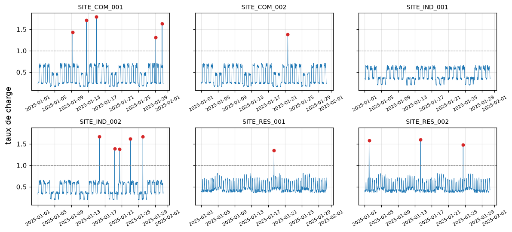
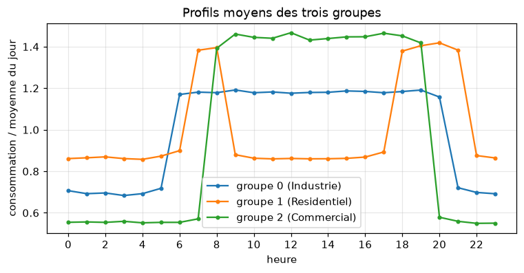

# ATELIER 3 : PYTHON POUR MICROSOFT FABRIC — APPRENTISSAGE AUTOMATIQUE LÉGER

**Environnements** : un troisième environnement virtuel, `venv-ml` (scikit-learn, pandas, matplotlib, seaborn, MLflow), pour tout l'atelier ; `.venv-ml-ancien` (scikit-learn 1.5.2) uniquement pour une démonstration de compatibilité
**Livrables** : `atelier3.ipynb` (notebook de travail), `prevision_conso.py`, `modele_conso.py`, `requirements-ml.txt`
**Objectif** : Préparer des données pour l'apprentissage automatique, prévoir la consommation, détecter des anomalies, regrouper et classer des sites, évaluer sans se tromper, puis sauvegarder et suivre un modèle avec MLflow

---

## 📊 Contexte métier

Les deux ateliers précédents ont fiabilisé les mesures de **EnergiaNord** (six sites, 30 jours). La direction pose maintenant quatre questions :

- **Prévoir** la consommation horaire de chaque site pour le **jour suivant**
- **Détecter** automatiquement les mesures aberrantes (pics au-dessus de la capacité)
- **Regrouper** les sites selon leur comportement, sans étiquette
- **Industrialiser** : sauvegarder le modèle, suivre les essais, le relancer sans notebook

Le choix de l'outil est volontairement sobre : **scikit-learn** couvre ces besoins sur des données tabulaires, s'installe partout et existe dans les runtimes Fabric. Les réseaux de neurones (TensorFlow, PyTorch) n'apportent rien sur 4 320 lignes et sont hors programme.

## 📁 Fichiers nécessaires

| Nom du fichier             | Lignes | Description                                                                                                              |
| -------------------------- | ------ | ------------------------------------------------------------------------------------------------------------------------ |
| `consommation_30jours.csv` | 4 365  | Fichier de l'Atelier 2 (30 jours, 6 sites, 4 320 mesures + 45 doublons, avec les mêmes anomalies).                       |
| `sites_reference.csv`      | 6      | Référentiel des six sites (type, capacité).                                                                              |
| `energie_utils.py`         | —      | Module de l'Atelier 1, requis par `qualite_pandas.py`.                                                                   |
| `qualite_pandas.py`        | —      | Module de l'Atelier 2 (`nettoyer`, `resume_sites`), réutilisé tel quel.                                                  |
| `requirements-ml.txt`      | —      | Bibliothèques de `venv-ml`, générées à la Partie 1.                                                                      |
| `prevision_conso.py`       | —      | **Créé à la main pendant l'atelier** (étape manuelle de la Partie 3) : préparation, évaluation, pipeline final.          |
| `modele_conso.py`          | —      | **Créé à la main pendant l'atelier** (étape manuelle de la Partie 7) : entraînement, sauvegarde, prévision du lendemain. |

Dossiers créés par les cellules : `out/` (figures), `modeles/` (modèles sauvegardés), `mlflow.db` et `mlruns/` (suivi MLflow). Ajouter ces quatre éléments au `.gitignore`.

Les deux modules `energie_utils.py` et `qualite_pandas.py` doivent se trouver à la racine de `formation_python_fabric`, à côté du dossier `data/`.

---

# PARTIE 1 : METTRE EN PLACE L'ENVIRONNEMENT `venv-ml`

## 🧭 Plan de l'atelier

| Partie | Contenu                                                                          |
| ------ | -------------------------------------------------------------------------------- |
| 1      | Environnement `venv-ml`, noyau, démonstration                                    |
| 2      | Préparer les données : variables, découpage temporel                             |
| 3      | Prévoir la consommation : régression, pipeline, module `prevision_conso.py`      |
| 4      | Évaluer proprement : fuites, validation, réglages                                |
| 5      | Détecter les anomalies                                                           |
| 6      | Regrouper et classer                                                             |
| 7      | Industrialiser : `joblib`, MLflow, module `modele_conso.py`, passage vers Fabric |

## 🛠️ Prérequis

- **Ateliers 1 et 2 terminés** : le dossier `formation_python_fabric` contient `data/`, `energie_utils.py` et `qualite_pandas.py`.
- **`.venv-data`** (Atelier 2) toujours présent : il servira à la démonstration.
- **`consommation_30jours.csv`** dans `data/`.

## 🔤 Vocabulaire de l'atelier

| Terme                            | Sens                                                       | Exemple de l'atelier                            |
| -------------------------------- | ---------------------------------------------------------- | ----------------------------------------------- |
| **Variable cible** (`y`)         | La valeur à prédire                                        | `conso_mw`                                      |
| **Variables explicatives** (`X`) | Les informations connues au moment de prévoir              | heure, week-end, consommation de la veille      |
| **Entraînement / test**          | Données pour apprendre / données jamais vues, pour mesurer | 8 au 23 janvier / 24 au 30 janvier              |
| **Surapprentissage**             | Le modèle mémorise ses exemples au lieu de généraliser     | score parfait à l'entraînement, mauvais au test |
| **Hyperparamètre**               | Réglage choisi avant l'apprentissage                       | `max_depth`, `learning_rate`                    |
| **Pipeline**                     | Prétraitement et modèle réunis en un seul objet            | Cellule 17                                      |

### 1. Créer `.venv-ml`

Ouvrir un terminal **dans** `formation_python_fabric`.

```powershell
py -m venv .venv-ml
.venv-ml\Scripts\activate.bat
py -m pip install --upgrade pip
py -m pip install ipython notebook ipykernel scikit-learn pandas matplotlib seaborn pyarrow mlflow
py -m pip freeze > requirements-ml.txt
```

**Ce que vous devez voir à l'écran** :

- l'invite préfixée par `(.venv-ml)`
- `requirements-ml.txt` contient `scikit-learn`, `mlflow`, `pandas`, `joblib`, `scipy`…

> 💡 Versions utilisées pour écrire cet atelier : **scikit-learn 1.9.1**, **MLflow 3.16.1**, **pandas 3.0.6**. Le code a été exécuté sous Python 3.11, 3.12 et 3.13 avec les mêmes résultats.

### 2. Enregistrer l'environnement comme noyau Jupyter

```powershell
py -m ipykernel install --user --name venv-ml --display-name "Python (venv-ml)"
```

```text
Installed kernelspec venv-ml in C:\Users\formation\AppData\Roaming\jupyter\kernels\venv-ml
```

### 3. Lancer Jupyter avec le bon noyau

```powershell
jupyter notebook
```

- Cliquer sur **New → Notebook**, choisir le noyau **Python (venv-ml)**, renommer le notebook `atelier3`.
- Vérifier le nom du noyau en haut à droite.

### 4. Règles de l'atelier

- **Un notebook** : `atelier3.ipynb`, cellules saisies dans l'ordre.
- **Après un redémarrage du noyau** : exécuter la Cellule 22 ; elle reconstruit l'état complet depuis `prevision_conso.py`.
- **Rappel des raccourcis** : **Maj + Entrée** (exécuter), **B** / **A** (insérer), **D D** (supprimer), **M** / **Y** (Markdown / code).
- **Référence** : `Playbooks/Playbook_Atelier3_ML.ipynb` (exécuté) pour comparer.
- **En cas de doute** : **Kernel → Restart Kernel and Run All Cells**.

---

## 📝 Cellule 1 : Vérification de l'environnement

### 🔍 Avant d'exécuter

- **Interpréteur** : `sys.executable` doit pointer vers `.venv-ml`.
- **Nouveaux venus** : `scikit-learn` et `mlflow`, absents des deux environnements précédents.
- **Dossier actif** : doit contenir `data/`, `energie_utils.py` et `qualite_pandas.py`.

### 💻 Code

```python
# === CELLULE 1 : Vérification de l'environnement ===
# --- 1. Importer les outils de la bibliothèque standard ---
import sys                                # informations sur l'interpréteur Python en cours
from importlib.metadata import version    # lit la version installée d'un paquet
from pathlib import Path                  # manipule les chemins de fichiers

# --- 2. Identifier Python et l'interpréteur utilisé ---
# split()[0] garde seulement le numéro de version (avant le premier espace)
print(f"Python       : {sys.version.split()[0]}")
# le chemin de python.exe indique quel environnement virtuel tourne (attendu : .venv-ml)
print(f"Interpréteur : {sys.executable}")

# --- 3. Lister les versions des bibliothèques clés ---
# boucle sur les quatre paquets ; version() lit le numéro installé dans l'environnement actif
for paquet in ("numpy", "pandas", "scikit-learn", "mlflow"):
    print(f"{paquet:<13}: {version(paquet)}")    # {paquet:<13} aligne les noms sur 13 caractères

# --- 4. Vérifier le dossier de travail et les fichiers attendus ---
print(f"Dossier      : {Path.cwd().name}")    # nom du dossier actif (cwd = dossier courant)
# glob("*.csv") liste les fichiers CSV de data/ ; sorted les trie par nom
print(f"Fichiers     : {sorted(p.name for p in Path('data').glob('*.csv'))}")
# on ne garde que les modules qui existent réellement dans le dossier actif
print(f"Modules      : {[p for p in ('energie_utils.py', 'qualite_pandas.py') if Path(p).exists()]}")
```

### 📤 Résultat

Exemple sous Windows (versions et chemins varient) :

```
Python       : 3.12.x
Interpréteur : C:\Users\formation\formation_python_fabric\.venv-ml\Scripts\python.exe
numpy        : 2.x.x
pandas       : 3.0.x
scikit-learn : 1.9.x
mlflow       : 3.x.x
Dossier      : formation_python_fabric
Fichiers     : ['consommation_30jours.csv', 'sites_reference.csv']
Modules      : ['energie_utils.py', 'qualite_pandas.py']
```

### 💡 Interprétation

- **Interpréteur** : le chemin contient `.venv-ml`, donc le noyau est le bon (sinon **Kernel → Change kernel**).
- **Nouveaux paquets** : `scikit-learn` et `mlflow` sont installés, `pandas` reste présent.
- **Fichiers** : les deux CSV et les deux modules (`energie_utils.py`, `qualite_pandas.py`) sont visibles ; sinon le dossier de lancement est faux.

---

### Démonstration : trois environnements, un même code

**Temps 1 : `venv-data`.** Recharger la page du notebook (F5), puis **Kernel → Change kernel → Python (venv-data)**. Exécuter les Cellules 2 et 3 : scikit-learn est introuvable.

**Temps 2 : `venv-ml`.** **Kernel → Change kernel → Python (venv-ml)**, puis ré-exécuter les deux cellules : tout est présent.

**Temps 3 : retour sur `venv-data`.** L'erreur **revient** ; les bibliothèques ne disparaissent pas, elles n'ont jamais été dans cet environnement.

| Situation                | Résultat de `import sklearn` |
| ------------------------ | ---------------------------- |
| Noyau **venv-data**      | `ModuleNotFoundError`        |
| Noyau **venv-ml**        | Fonctionne                   |
| Retour sur **venv-data** | `ModuleNotFoundError`        |

> ⚠️ **Changer de noyau efface les variables** du notebook. Ces trois cellules ne dépendent d'aucune donnée : on peut les rejouer sans risque.

> 💡 **Dans Fabric** : deux *Environments* peuvent contenir des bibliothèques différentes, et chaque notebook choisit le sien.

---

## 📝 Cellule 2 : Ce que voit chaque noyau

### 🔍 Avant d'exécuter

- **`find_spec`** : teste la présence d'un paquet **sans l'importer**.
- **Deux noyaux à comparer** : `venv-data` (Atelier 2) puis `venv-ml` (Atelier 3).
- **Objectif** : constater que scikit-learn n'existe que dans l'un des deux.

### 💻 Code

```python
# === CELLULE 2 : Ce que voit le noyau actif ===
# --- 1. Importer les outils de détection de paquets ---
import sys                                    # pour afficher l'interpréteur du noyau actif
from importlib.metadata import version        # lit la version installée d'un paquet
from importlib.util import find_spec          # teste la présence d'un paquet sans l'importer

# --- 2. Afficher l'interpréteur du noyau ---
print("Interpréteur :", sys.executable)    # change selon le noyau choisi (venv-data ou venv-ml)

# --- 3. Tester chaque paquet ---
# chaque couple = (nom à importer, nom du paquet installé) ; ils diffèrent pour scikit-learn (sklearn)
for nom, paquet in (("pandas", "pandas"), ("matplotlib", "matplotlib"), ("seaborn", "seaborn"),
                    ("sklearn", "scikit-learn"), ("mlflow", "mlflow"), ("joblib", "joblib")):
    if find_spec(nom) is None:                       # None = le noyau ne trouve pas ce paquet
        print(f"{nom:<11} ABSENT")                   # paquet non installé dans cet environnement
    else:
        print(f"{nom:<11} {version(paquet)}")        # paquet présent : on affiche sa version
```

### 📤 Résultat

**Noyau venv-data** (Atelier 2) :

```
Interpréteur : C:\Users\formation\formation_python_fabric\.venv-data\Scripts\python.exe
pandas      3.0.6
matplotlib  3.11.2
seaborn     0.13.2
sklearn     ABSENT
mlflow      ABSENT
joblib      ABSENT
```

**Noyau venv-ml** :

```
Interpréteur : C:\Users\formation\formation_python_fabric\.venv-ml\Scripts\python.exe
pandas      3.0.6
matplotlib  3.11.2
seaborn     0.13.2
sklearn     1.9.1
mlflow      3.16.1
joblib      1.6.0
```

### 💡 Interprétation

- **`venv-data`** : pandas, matplotlib et seaborn sont là ; `sklearn`, `mlflow` et `joblib` sont **ABSENTS**.
- **`venv-ml`** : tout est présent ; `joblib` arrive avec scikit-learn.
- **Conséquence** : le même code s'exécute dans un environnement et **pas** dans l'autre.
- **Règle de l'Atelier 2** : un environnement par besoin ; les bibliothèques ne se partagent pas.

---

## 📝 Cellule 3 : Importer scikit-learn : l'erreur, puis la réussite

### 🔍 Avant d'exécuter

- **Temps 1** : noyau **Python (venv-data)** → l'import échoue.
- **Temps 2** : noyau **Python (venv-ml)** → l'import réussit.
- **Temps 3** : retour sur `venv-data` → l'erreur **revient**.

### 💻 Code

```python
# === CELLULE 3 : Importer scikit-learn et MLflow ===
# --- 1. Importer les bibliothèques (échoue avec ModuleNotFoundError dans venv-data) ---
import pandas as pd                # tableaux de données (déjà présent dans venv-data)
import sklearn                     # scikit-learn : absent de venv-data, présent dans venv-ml
import mlflow                      # suivi des expériences (Partie 6)
# un modèle de prévision (gradient boosting) : l'import prouve que scikit-learn est complet
from sklearn.ensemble import HistGradientBoostingRegressor

# --- 2. Afficher les versions pour confirmer la réussite ---
# __version__ : numéro de version que chaque bibliothèque expose
print("pandas", pd.__version__, "| scikit-learn", sklearn.__version__, "| mlflow", mlflow.__version__)
# afficher un modèle non entraîné montre ses réglages par défaut (aucun calcul ici)
print(HistGradientBoostingRegressor())
```

### 📤 Résultat

**Noyau venv-data** :

```
---------------------------------------------------------------------------
ModuleNotFoundError                       Traceback (most recent call last)
Cell In[1], line 2
      1 import pandas as pd
----> 2 import sklearn
      3 import mlflow
      4 from sklearn.ensemble import HistGradientBoostingRegressor

ModuleNotFoundError: No module named 'sklearn'
```

**Noyau venv-ml** (versions données à titre d'exemple) :

```
pandas 3.0.6 | scikit-learn 1.9.1 | mlflow 3.16.1
HistGradientBoostingRegressor()
```

### 💡 Interprétation

- **Noyau `venv-data`** : `ModuleNotFoundError: No module named 'sklearn'`, sur la ligne 2. La ligne 1 (`pandas`) est passée.
- **Noyau `venv-ml`** : les trois imports réussissent ; `HistGradientBoostingRegressor()` affiche ses **réglages par défaut**.
- **Retour sur `venv-data`** : l'erreur **revient**. Le code n'est pas en cause, l'environnement l'est.
- **Dans Fabric** : un notebook rattaché à un *Environment* sans la bibliothèque échoue de la même façon.

---

---

# PARTIE 2 : PRÉPARER LES DONNÉES

Cette partie et la suivante se font dans le notebook `atelier3`, avec le noyau **Python (venv-ml)**.

---

## 📝 Cellule 4 : Charger et nettoyer avec le module de l'Atelier 2

### 🔍 Avant d'exécuter

- **`qualite_pandas.nettoyer`** : doublons, dates, codes erreur en `NaN` (Atelier 2).
- **`merge(validate="m:1")`** : ajoute type et capacité de chaque site, sans dupliquer de ligne.
- **Contrôle** : 4 320 lignes attendues (6 sites × 720 heures).

### 💻 Code

```python
# === CELLULE 4 : Charger et nettoyer ===
# --- 1. Importer les bibliothèques ---
import numpy as np                 # calcul numérique (utilisé plus loin, ex. NaN)
import pandas as pd                # lecture et manipulation de tableaux
import qualite_pandas as qp        # module de l'Atelier 2 : fonction de nettoyage

# --- 2. Lire les deux fichiers CSV ---
# encoding="utf-8-sig" : lit correctement les accents et le BOM éventuel ; rename : nom de colonne plus court
brut = pd.read_csv("data/consommation_30jours.csv", encoding="utf-8-sig").rename(columns={"consumption_mw": "conso_mw"})
ref = pd.read_csv("data/sites_reference.csv", encoding="utf-8-sig")    # une ligne par site (type, capacité)

# --- 3. Nettoyer puis ajouter type et capacité de chaque site ---
# nettoyer : doublons supprimés, dates converties, codes d'erreur remplacés par NaN (Atelier 2)
# how="left" : on garde toutes les mesures ; validate="m:1" : plusieurs mesures par site, un seul site
# dans ref, sinon erreur (protège contre des lignes dupliquées)
d = qp.nettoyer(brut).merge(ref[["site_id", "site_type", "capacity_mw"]], on="site_id", how="left", validate="m:1")

# --- 4. Contrôler le résultat ---
print(len(brut), "->", len(d), "lignes")    # lignes avant / après nettoyage
# aperçu des 3 premières lignes des colonnes utiles
print(d[["timestamp", "site_id", "site_type", "capacity_mw", "conso_mw"]].head(3))
print(d["conso_mw"].isna().sum(), "valeurs manquantes")    # isna() marque les NaN, sum() les compte
```

### 📤 Résultat

```
4365 -> 4320 lignes
            timestamp       site_id   site_type  capacity_mw  conso_mw
0 2025-01-01 00:00:00  SITE_COM_001  Commercial          2.0     0.458
1 2025-01-01 01:00:00  SITE_COM_001  Commercial          2.0       NaN
2 2025-01-01 02:00:00  SITE_COM_001  Commercial          2.0     0.487
350 valeurs manquantes
```

### 💡 Interprétation

- **4 365 → 4 320 lignes** : les 45 doublons sont retirés (6 sites × 720 heures).
- **350 valeurs manquantes** : les 350 codes erreur et valeurs vides de l'Atelier 2, soit **8,1 %**.
- **`validate="m:1"`** : la jointure échouerait si le référentiel comptait un site en double.
- **Mêmes fonctions qu'à l'Atelier 2** : aucune ligne de nettoyage réécrite.

---

## 📝 Cellule 5 : La cible : retirer les pics aberrants

### 🔍 Avant d'exécuter

- **Cible** : `conso_mw`, la valeur à prédire.
- **Pics** : mesures **au-dessus de la capacité** du site (Atelier 2), impossibles physiquement.
- **`conso_brute`** : copie conservée pour la détection d'anomalies (Partie 5).

### 💻 Code

```python
# === CELLULE 5 : Pics aberrants ===
# --- 1. Conserver une copie de la mesure d'origine ---
d["conso_brute"] = d["conso_mw"]    # sert à la détection d'anomalies (Partie 5)

# --- 2. Repérer les pics : mesures au-dessus de la capacité du site ---
# comparaison ligne à ligne : True si la consommation dépasse la capacité (impossible physiquement)
d["pic"] = d["conso_mw"] > d["capacity_mw"]
print(d["pic"].sum(), "pics au-dessus de la capacité")    # True vaut 1 : sum() compte les pics
# d.loc[masque, colonnes] : n'affiche que les lignes-pics et 3 colonnes ; head(3) = 3 premières
print(d.loc[d["pic"], ["site_id", "conso_mw", "capacity_mw"]].head(3))

# --- 3. Retirer les pics de la cible ---
# mask(condition) remplace par NaN les valeurs où la condition est vraie ; les autres ne changent pas
d["conso_mw"] = d["conso_mw"].mask(d["pic"])
print(d["conso_mw"].isna().sum(), "valeurs manquantes après retrait des pics")    # NaN d'origine + pics
```

### 📤 Résultat

```
15 pics au-dessus de la capacité
          site_id  conso_mw  capacity_mw
200  SITE_COM_001     2.854          2.0
278  SITE_COM_001     3.416          2.0
335  SITE_COM_001     3.591          2.0
365 valeurs manquantes après retrait des pics
```

### 💡 Interprétation

- **15 pics** : par exemple `2,854 MW` pour un site de capacité `2,0 MW`, physiquement impossible.
- **365 manquants** : les 350 précédents **plus** les 15 pics masqués.
- **Cible propre** : un modèle qui apprend des mesures impossibles apprend des erreurs.
- **`conso_brute`** : la valeur d'origine reste disponible pour la Partie 5.

---

## 📝 Cellule 6 : Variables de calendrier

### 🔍 Avant d'exécuter

- **`.dt`** : extrait heure et jour de semaine de `timestamp`.
- **`weekend`** : 1 si samedi ou dimanche, sinon 0.
- **Pourquoi** : les profils des sites changent selon l'heure et le type de jour (Atelier 2).

### 💻 Code

```python
# === CELLULE 6 : Variables de calendrier ===
# --- 1. Extraire heure et jour de la semaine depuis la date ---
d["heure"] = d["timestamp"].dt.hour            # .dt donne accès aux parties de la date : heure de 0 à 23
d["jour_sem"] = d["timestamp"].dt.dayofweek    # jour de semaine : 0 = lundi ... 6 = dimanche

# --- 2. Indiquer si c'est un week-end ---
# jour_sem >= 5 : samedi ou dimanche (True/False) ; astype(int) convertit en 1 ou 0
d["weekend"] = (d["jour_sem"] >= 5).astype(int)

# --- 3. Vérifier sur trois lignes ---
# iloc[[0, 30, 130]] : lignes n° 0, 30 et 130 (choisies pour couvrir des jours différents)
print(d[["timestamp", "heure", "jour_sem", "weekend"]].iloc[[0, 30, 130]])

# --- 4. Comparer semaine et week-end par type de site ---
# taux d'utilisation : comparable entre sites de tailles différentes
d["taux"] = d["conso_mw"] / d["capacity_mw"]
# pivot_table : une ligne par type de site, une colonne par valeur de weekend, moyenne du taux dans chaque case
print(d.pivot_table(index="site_type", columns="weekend", values="taux", aggfunc="mean").round(3))
```

### 📤 Résultat

```
              timestamp  heure  jour_sem  weekend
0   2025-01-01 00:00:00      0         2        0
30  2025-01-02 06:00:00      6         3        0
130 2025-01-06 10:00:00     10         0        0
weekend          0      1
site_type                
Commercial   0.448  0.316
Industrie    0.506  0.303
Residentiel  0.465  0.534
```

### 💡 Interprétation

- **`jour_sem`** : 0 = lundi ; le 1er janvier 2025 est un mercredi (2).
- **Industrie** : taux de charge moyen de **0,506** en semaine, **0,303** le week-end (environ -40 %).
- **Commercial** : 0,448 puis 0,316 (environ -29 %).
- **Résidentiel** : 0,465 puis **0,534** (environ +15 %) : l'effet est **inverse**.
- **Conséquence** : `weekend` compte, et son effet dépend du type de site.

---

## 📝 Cellule 7 : Le principe de scikit-learn : `fit`, `predict`, `score`

### 🔍 Avant d'exécuter

- **`X`** : tableau de **variables explicatives** (2 dimensions, ici une seule colonne).
- **`y`** : la **cible** (1 dimension).
- **Trois verbes** : `fit` (apprendre), `predict` (prévoir), `score` (mesurer) ; identiques pour **tous** les modèles.

### 💻 Code

```python
# === CELLULE 7 : L'interface commune ===
# --- 1. Importer deux modèles de types différents ---
from sklearn.ensemble import RandomForestRegressor    # forêt d'arbres de décision
from sklearn.linear_model import LinearRegression     # droite (somme pondérée des variables)

# --- 2. Préparer les données d'un seul site ---
# on garde un site et on écarte les lignes sans cible (NaN refusés par ces modèles)
site = d[(d["site_id"] == "SITE_COM_001") & d["conso_mw"].notna()]
# X : variables explicatives (double crochet = tableau à 2 dimensions) ; y : cible (1 dimension)
X, y = site[["heure"]], site["conso_mw"]

# --- 3. Appliquer les mêmes trois verbes à chaque modèle ---
# n_estimators=50 : 50 arbres ; random_state=0 : résultat reproductible d'une exécution à l'autre
for modele in (LinearRegression(), RandomForestRegressor(n_estimators=50, random_state=0)):
    modele.fit(X, y)    # fit : le modèle apprend la relation entre X et y
    # predict : prévision pour de nouvelles heures (3 h et 14 h), données sous forme de tableau
    prevu = modele.predict(pd.DataFrame({"heure": [3, 14]}))
    # score : R² sur les données d'apprentissage (1 = parfait) ; type(modele).__name__ = nom de la classe
    print(f"{type(modele).__name__:<22} 3 h / 14 h : {prevu.round(2)}   R² sur ces données : {modele.score(X, y):.2f}")

# --- 4. Lire ce que le modèle linéaire a appris ---
# coef_ : poids appris par variable ; on ré-entraîne un modèle linéaire car la boucle a réutilisé le nom modele
print("Coefficient appris (linéaire) :", round(LinearRegression().fit(X, y).coef_[0], 4))
```

### 📤 Résultat

```
LinearRegression       3 h / 14 h : [0.7  0.87]   R² sur ces données : 0.07
RandomForestRegressor  3 h / 14 h : [0.46 1.23]   R² sur ces données : 0.88
Coefficient appris (linéaire) : 0.0158
```

### 💡 Interprétation

- **Même code, deux modèles** : seule la classe change ; `fit`, `predict` et `score` restent identiques.
- **Régression linéaire** : 0,70 MW à 3 h, 0,87 MW à 14 h, **R² = 0,07**. Une droite ne sait pas représenter « jour haut, nuit bas ».
- **Forêt** : 0,46 MW à 3 h, 1,23 MW à 14 h, **R² = 0,88** : la forme jour/nuit est apprise.
- **Coefficient** : 0,0158 MW par heure, une pente sans intérêt physique.
- **Prudence** : ce R² est calculé sur les données d'**entraînement**, donc optimiste (voir Cellule 10).

---

## 📝 Cellule 8 : Valeurs décalées : la veille et la semaine dernière

### 🔍 Avant d'exécuter

- **Grille régulière** : `shift(24)` vaut « 24 heures avant » **seulement** si les lignes sont espacées d'une heure.
- **`groupby("site_id")`** : le décalage ne doit **jamais** traverser d'un site à l'autre.
- **Horizon** : ces variables permettent de prévoir **le jour suivant** (au moins 24 h d'avance).

### 💻 Code

```python
# === CELLULE 8 : Valeurs décalées ===
# --- 1. Vérifier que la grille est régulière (une ligne par heure) ---
# groupby("site_id") : calcul séparé pour chaque site ; diff() : écart avec la ligne précédente
ecarts = d.groupby("site_id")["timestamp"].diff().dropna()    # dropna : retire la 1re ligne de chaque site
# value_counts : on doit voir un seul écart (1 heure), sinon shift(24) ne vaudrait pas « 24 h avant »
print("Écarts entre lignes :", ecarts.value_counts().to_dict())

# --- 2. Créer la consommation de la veille et de la semaine dernière ---
g = d.groupby("site_id")["conso_mw"]    # groupes par site : le décalage ne traverse jamais deux sites
d["lag_24"] = g.shift(24)               # valeur d'il y a 24 lignes = même heure la veille
d["lag_168"] = g.shift(168)             # 168 = 7 × 24 : même heure la semaine dernière

# --- 3. Contrôler sur un site ---
site = d[d["site_id"] == "SITE_COM_001"]
# lignes 0 et 24 : début de la série ; 168 et 192 : premières lignes où les décalages existent
print(site[["timestamp", "conso_mw", "lag_24", "lag_168"]].iloc[[0, 24, 168, 192]])

# --- 4. Compter les valeurs absentes créées par le décalage ---
# les 24 (ou 168) premières heures de chaque site n'ont pas d'historique : NaN
print(d[["lag_24", "lag_168"]].isna().sum().to_dict())
```

### 📤 Résultat

```
Écarts entre lignes : {Timedelta('0 days 01:00:00'): 4314}
     timestamp  conso_mw  lag_24  lag_168
0   2025-01-01     0.458     NaN      NaN
24  2025-01-02     0.519   0.458      NaN
168 2025-01-08       NaN   0.461    0.458
192 2025-01-09     0.496     NaN    0.519
{'lag_24': 498, 'lag_168': 1300}
```

### 💡 Interprétation

- **Grille régulière** : un seul écart (1 heure) partout, donc `shift(24)` = « 24 heures avant » sans ambiguïté.
- **Ligne 24** : `lag_24 = 0,458`, la valeur de la ligne 0 ; ligne 192, `lag_24` absent car la ligne 168 est **manquante**.
- **Les trous se propagent** : un manquant crée un manquant 24 h et 168 h plus tard.
- **Comptes** : 498 `lag_24` et 1 300 `lag_168` absents, dont **les 7 premiers jours** (6 sites × 168 h).
- **`groupby`** : sans lui, le premier jour d'un site emprunterait les valeurs du site précédent.

---

## 📝 Cellule 9 : Moyenne glissante sans regarder l'avenir

### 🔍 Avant d'exécuter

- **`rolling(24)`** : moyenne de 24 valeurs consécutives.
- **`shift(24)` avant `rolling`** : la fenêtre se termine **24 h avant** la mesure ; à l'instant de la prévision (la veille), toutes ces valeurs sont connues.
- **Vérification** : recalculer une valeur à la main.

### 💻 Code

```python
# === CELLULE 9 : Moyenne glissante ===
# --- 1. Calculer la moyenne des 24 h se terminant 24 h avant la mesure ---
# transform : renvoie une valeur par ligne d'origine, calculée séparément pour chaque site (g vient de la cellule précédente)
# shift(24) d'abord : la fenêtre se termine la veille, donc rien du futur n'entre dans le calcul
# rolling(24) : fenêtre de 24 valeurs ; min_periods=12 : calcul accepté dès 12 valeurs connues (sinon NaN)
d["moy_veille"] = g.transform(lambda s: s.shift(24).rolling(24, min_periods=12).mean())

# --- 2. Recalculer une valeur à la main pour vérifier ---
i = 500    # ligne à contrôler (choisie arbitrairement, loin du début des séries)
# la fenêtre couvre les lignes i-47 à i-24 ; .loc inclut les deux bornes : 24 valeurs
a_la_main = d.loc[i - 47:i - 24, "conso_mw"].mean()
print("Ligne", i, d.loc[i, "site_id"], d.loc[i, "timestamp"])    # site et date de la ligne testée

# --- 3. Comparer avec la colonne calculée ---
print("À la main :", round(a_la_main, 4), "| colonne moy_veille :", round(d.loc[i, "moy_veille"], 4))
print(d["moy_veille"].isna().sum(), "valeurs absentes")    # début des séries + trous dans les mesures
```

### 📤 Résultat

```
Ligne 500 SITE_COM_001 2025-01-21 20:00:00
À la main : 0.8411 | colonne moy_veille : 0.8411
217 valeurs absentes
```

### 💡 Interprétation

- **À la main = colonne** : `0,8411` dans les deux cas ; la fenêtre couvre les heures `i-47` à `i-24`.
- **`shift(24)` avant `rolling`** : à l'instant de la prévision (la veille), ces valeurs sont **toutes connues**.
- **`min_periods=12`** : la moyenne existe dès qu'au moins 12 valeurs sur 24 sont présentes.
- **217 absents** : début de série et trous de plus de 12 heures.

---

## 📝 Cellule 10 : Découpage temporel : passé pour apprendre, futur pour tester

### 🔍 Avant d'exécuter

- **Jamais aléatoire** : on prévoit le **futur**, on teste donc sur le futur.
- **Coupure** : entraînement jusqu'au 23 janvier, test du 24 au 30.
- **7 premiers jours écartés** : pas encore de `lag_168`.

### 💻 Code

```python
# === CELLULE 10 : Découpage temporel ===
# --- 1. Définir les variables explicatives et la date de coupure ---
# liste des colonnes données au modèle pour prévoir conso_mw
VARIABLES = ["heure", "weekend", "capacity_mw", "lag_24", "lag_168", "moy_veille"]
COUPURE = pd.Timestamp("2025-01-24")    # avant : apprentissage ; à partir de là : test

# --- 2. Écarter les 7 premiers jours et les lignes sans cible ---
# avant le 8 janvier, lag_168 n'existe pas encore ; on retire aussi les lignes où la cible est NaN
utile = d[(d["timestamp"] >= "2025-01-08") & d["conso_mw"].notna()]

# --- 3. Couper dans le temps, jamais au hasard ---
train = utile[utile["timestamp"] < COUPURE]     # le passé : le modèle apprend dessus
# le futur sert de test ; dropna(subset=...) retire les lignes sans lag_24 ou lag_168
test = utile[utile["timestamp"] >= COUPURE].dropna(subset=["lag_24", "lag_168"])

# --- 4. Vérifier les périodes et les valeurs manquantes ---
# min() et max() donnent la première et la dernière date de chaque jeu ; .date() garde le jour seul
print("Entraînement :", len(train), "lignes,", train["timestamp"].min().date(), "->", train["timestamp"].max().date())
print("Test         :", len(test), "lignes,", test["timestamp"].min().date(), "->", test["timestamp"].max().date())
# colonnes ayant encore des NaN dans train : [lambda s: s > 0] ne garde que celles où le compte dépasse 0
print("Manquants dans train :", train[VARIABLES].isna().sum()[lambda s: s > 0].to_dict())
```

### 📤 Résultat

```
Entraînement : 2099 lignes, 2025-01-08 -> 2025-01-23
Test         : 799 lignes, 2025-01-24 -> 2025-01-30
Manquants dans train : {'lag_24': 188, 'lag_168': 194}
```

### 💡 Interprétation

- **2 099 lignes d'entraînement** (8 au 23 janvier) et **799 de test** (24 au 30).
- **Test réduit aux lignes complètes** : sans `lag_24` ni `lag_168`, les références de la Cellule 12 ne pourraient pas être calculées ; tous les modèles sont donc comparés sur les **mêmes** lignes.
- **Manquants dans l'entraînement** : 188 `lag_24` et 194 `lag_168`, conservés ; le gradient boosting les accepte.
- **Règle** : le test ne sert qu'à mesurer, jamais à choisir un réglage.

---

## 📝 Cellule 11 : Corrélation avec la cible

### 🔍 Avant d'exécuter

- **`corr()`** : corrélation linéaire de chaque variable avec `conso_mw`.
- **Limite** : ne mesure que le lien **linéaire**, pas l'utilité pour un modèle.
- **Lecture** : proche de 1 = suit la cible ; proche de 0 = pas de lien linéaire.

### 💻 Code

```python
# === CELLULE 11 : Corrélations ===
# --- 1. Mesurer le lien linéaire de chaque variable avec la cible ---
# corr() : tableau des corrélations (de -1 à 1) entre toutes les colonnes ; on garde la colonne conso_mw
# drop("conso_mw") retire la corrélation de la cible avec elle-même (toujours 1) ; round(2) : 2 décimales
print(train[VARIABLES + ["conso_mw"]].corr()["conso_mw"].drop("conso_mw").round(2))
```

### 📤 Résultat

```
heure          0.09
weekend       -0.18
capacity_mw    0.86
lag_24         0.94
lag_168        0.99
moy_veille     0.83
Name: conso_mw, dtype: float64
```

### 💡 Interprétation

- **`lag_168` : 0,99** et **`lag_24` : 0,94** : la même heure, une semaine ou un jour plus tôt, suit presque parfaitement la cible.
- **`capacity_mw` : 0,86** : les gros sites consomment plus (effet de taille).
- **`heure` : 0,09** seulement : le lien jour/nuit n'est **pas linéaire** (il monte puis redescend).
- **Limite** : une corrélation faible ne veut pas dire « inutile » ; les arbres exploiteront `heure`.

---

---

# PARTIE 3 : PRÉVOIR LA CONSOMMATION (RÉGRESSION)

---

## 📝 Cellule 12 : Les références à battre

### 🔍 Avant d'exécuter

- **Règle d'or** : un modèle n'a de valeur que s'il bat une **référence simple**.
- **Trois références** : même heure la veille, même heure la semaine dernière, moyenne du site.
- **Métriques** : **MAE** (erreur moyenne en MW), **RMSE** (pénalise les gros écarts), **R²** (part de variation expliquée).

### 💻 Code

```python
# === CELLULE 12 : Références ===
# --- 1. Importer les trois mesures d'erreur ---
# MAE : erreur absolue moyenne (MW) ; RMSE : racine de l'erreur quadratique (pénalise les gros écarts) ; R² : part expliquée
from sklearn.metrics import mean_absolute_error, r2_score, root_mean_squared_error

# --- 2. Écrire une fonction qui résume la qualité d'une prévision ---
def evaluer(y_vrai, y_pred):
    # y_vrai : valeurs réelles ; y_pred : valeurs prévues ; retourne un dictionnaire de trois métriques
    return {"MAE": mean_absolute_error(y_vrai, y_pred),         # écart moyen en MW (plus petit = mieux)
            "RMSE": root_mean_squared_error(y_vrai, y_pred),    # écart en MW, gros écarts amplifiés
            "R2": r2_score(y_vrai, y_pred)}                     # 1 = parfait ; 0 = pas mieux que la moyenne

# --- 3. Calculer la moyenne d'entraînement de chaque site ---
# uniquement sur train : le test représente le futur, inconnu au moment de prévoir
moyenne_site = train.groupby("site_id")["conso_mw"].mean()

# --- 4. Construire trois prévisions très simples, sans apprentissage ---
references = {
    "même heure la veille": test["lag_24"],                        # on recopie la consommation de la veille
    "même heure la semaine dernière": test["lag_168"],             # on recopie celle de la semaine dernière
    "moyenne du site": test["site_id"].map(moyenne_site),          # chaque ligne reçoit la moyenne de son site
}

# --- 5. Évaluer chaque référence sur le même jeu de test ---
# pour chaque (nom, prévision) : dictionnaire MAE / RMSE / R² ; resultats servira aux cellules suivantes
resultats = {nom: evaluer(test["conso_mw"], p) for nom, p in references.items()}
# .T : transpose pour avoir une ligne par référence ; round(3) : 3 décimales
print(pd.DataFrame(resultats).T.round(3))
```

### 📤 Résultat

```
                                  MAE   RMSE     R2
même heure la veille            0.157  0.309  0.854
même heure la semaine dernière  0.066  0.105  0.983
moyenne du site                 0.323  0.417  0.734
```

### 💡 Interprétation

- **Même heure la semaine dernière** : **MAE 0,066 MW**, R² 0,983. C'est une référence **redoutable**.
- **Même heure la veille** : MAE 0,157, deux fois pire ; le lundi copie le dimanche, et la semaine copie le week-end.
- **Moyenne du site** : MAE 0,323, la référence la plus faible.
- **Objectif** : tout modèle doit descendre **sous 0,066**.

---

## 📝 Cellule 13 : Première régression : `LinearRegression`

### 🔍 Avant d'exécuter

- **Modèle linéaire** : une somme pondérée des variables.
- **Valeurs manquantes** : refusées ; on les remplace par la **médiane de l'entraînement** (jamais celle du test).
- **`coef_`** : le poids appris pour chaque variable.

### 💻 Code

```python
# === CELLULE 13 : Régression linéaire ===
# --- 1. Importer le modèle ---
from sklearn.linear_model import LinearRegression    # somme pondérée des variables

# --- 2. Préparer le remplacement des valeurs manquantes ---
# LinearRegression refuse les NaN : médiane de chaque colonne, calculée sur train uniquement
# (utiliser celle du test ferait fuiter de l'information du futur)
mediane = train[VARIABLES].median()

# --- 3. Entraîner puis prévoir ---
# fillna(mediane) remplace chaque NaN par la médiane de sa colonne ; fit : apprentissage sur le passé
lin = LinearRegression().fit(train[VARIABLES].fillna(mediane), train["conso_mw"])
# predict : prévision sur le futur (test), avec la même médiane que pour l'entraînement
p_lin = lin.predict(test[VARIABLES].fillna(mediane))

# --- 4. Évaluer et lire les poids appris ---
resultats["régression linéaire"] = evaluer(test["conso_mw"], p_lin)    # on ajoute une ligne au tableau
# coef_ : un poids par variable, dans l'ordre de VARIABLES ; zip associe chaque nom à son poids
print({v: round(float(c), 3) for v, c in zip(VARIABLES, lin.coef_)})
print(pd.Series(resultats["régression linéaire"]).round(3).to_dict())    # métriques du modèle
```

### 📤 Résultat

```
{'heure': 0.003, 'weekend': -0.139, 'capacity_mw': 0.198, 'lag_24': 0.296, 'lag_168': 0.542, 'moy_veille': -0.212}
{'MAE': 0.103, 'RMSE': 0.143, 'R2': 0.969}
```

### 💡 Interprétation

- **MAE 0,103 MW** : mieux que « la veille » (0,157), moins bien que « la semaine dernière » (0,066).
- **`lag_168`** porte le plus gros poids (0,542), puis `lag_24` (0,296).
- **`heure` ≈ 0** : un coefficient unique ne peut pas décrire une courbe en cloche.
- **Limite** : le modèle linéaire **additionne** des effets ; la consommation, elle, est un profil multiplié par la taille du site.

---

## 📝 Cellule 14 : Modèles à base d'arbres : forêt aléatoire et gradient boosting

### 🔍 Avant d'exécuter

- **`RandomForestRegressor`** : moyenne de nombreux arbres de décision.
- **`HistGradientBoostingRegressor`** : arbres construits l'un après l'autre, chacun corrigeant le précédent ; accepte les `NaN` **sans imputation**.
- **`random_state`** : rend le résultat **reproductible**.

### 💻 Code

```python
# === CELLULE 14 : Forêt et gradient boosting ===
# --- 1. Importer les deux modèles à base d'arbres ---
# forêt : moyenne de nombreux arbres ; gradient boosting : arbres construits l'un après l'autre, chacun corrige le précédent
from sklearn.ensemble import HistGradientBoostingRegressor, RandomForestRegressor

# --- 2. Entraîner la forêt aléatoire ---
# n_estimators=200 : 200 arbres ; random_state=0 : résultat reproductible ; n_jobs=-1 : tous les cœurs du processeur
foret = RandomForestRegressor(n_estimators=200, random_state=0, n_jobs=-1)
# la forêt refuse les NaN : on utilise la médiane d'entraînement (cellule précédente)
foret.fit(train[VARIABLES].fillna(mediane), train["conso_mw"])

# --- 3. Entraîner le gradient boosting ---
# accepte les NaN tels quels (pas d'imputation) ; fit retourne le modèle, d'où l'enchaînement
hgb = HistGradientBoostingRegressor(random_state=0).fit(train[VARIABLES], train["conso_mw"])

# --- 4. Prévoir sur le futur (test) ---
p_foret = foret.predict(test[VARIABLES].fillna(mediane))    # prévisions de la forêt
p_hgb = hgb.predict(test[VARIABLES])                        # prévisions du gradient boosting

# --- 5. Évaluer et afficher les deux modèles ---
resultats["forêt aléatoire"] = evaluer(test["conso_mw"], p_foret)
resultats["gradient boosting"] = evaluer(test["conso_mw"], p_hgb)
# .loc[[...]] ne garde que les deux nouvelles lignes du tableau
print(pd.DataFrame(resultats).T.loc[["forêt aléatoire", "gradient boosting"]].round(3))
```

### 📤 Résultat

```
                     MAE   RMSE     R2
forêt aléatoire    0.055  0.083  0.989
gradient boosting  0.059  0.090  0.988
```

### 💡 Interprétation

- **Forêt : MAE 0,055**, gradient boosting : **0,059**. Les deux battent la référence hebdomadaire (0,066).
- **R² ≈ 0,99** : presque toute la variation est expliquée.
- **Gain modeste** : 17 % de mieux que « la semaine dernière ». Un modèle plus sophistiqué n'est pas toujours spectaculaire.
- **`random_state`** : refaire la cellule redonne exactement les mêmes chiffres.

---

## 📝 Cellule 15 : Comparer tous les modèles

### 🔍 Avant d'exécuter

- **Même jeu de test** pour tous : les chiffres sont comparables.
- **Tri par MAE** : la plus petite erreur moyenne en premier.
- **Test d'usage** : le gradient boosting prévoit même **sans historique** (valeurs décalées absentes).

### 💻 Code

```python
# === CELLULE 15 : Tableau comparatif ===
# --- 1. Rassembler et classer tous les résultats ---
# une ligne par modèle ; sort_values("MAE") place la plus petite erreur moyenne en premier
tableau = pd.DataFrame(resultats).T.sort_values("MAE").round(3)
print(tableau)

# --- 2. Tester une prévision sans aucun historique ---
# on prend la 1re ligne du test (double crochet = garde un tableau) ; assign remplace les trois
# variables d'historique par NaN (np.nan = valeur manquante)
ligne = test.iloc[[0]][VARIABLES].assign(lag_24=np.nan, lag_168=np.nan, moy_veille=np.nan)
# le gradient boosting accepte les NaN : predict renvoie un tableau, [0] prend sa seule valeur ; réel en comparaison
print("\nSans aucun historique -> prévision :", round(float(hgb.predict(ligne)[0]), 3), "MW | réel :", round(float(test.iloc[0]["conso_mw"]), 3), "MW")
```

### 📤 Résultat

```
                                  MAE   RMSE     R2
forêt aléatoire                 0.055  0.083  0.989
gradient boosting               0.059  0.090  0.988
même heure la semaine dernière  0.066  0.105  0.983
régression linéaire             0.103  0.143  0.969
même heure la veille            0.157  0.309  0.854
moyenne du site                 0.323  0.417  0.734

Sans aucun historique -> prévision : 0.593 MW | réel : 0.491 MW
```

### 💡 Interprétation

- **Classement** : forêt, gradient boosting, semaine dernière, linéaire, veille, moyenne.
- **Sans historique** : le gradient boosting prévoit quand même (0,593 MW pour un réel de 0,491), avec une erreur plus grande ; les références, elles, **ne peuvent rien** sans historique.
- **Choix du modèle** : la forêt est un peu plus précise ici ; le gradient boosting accepte les `NaN`, ce qui compte en production.
- **Un tableau, pas un graphique** : le tri par MAE suffit pour décider.

---

## 📝 Cellule 16 : Le plafond : le bruit qu'aucun modèle ne peut prévoir

### 🔍 Avant d'exécuter

- **Bruit** : chaque mesure varie au hasard de ±10 % autour de son profil (données simulées, Atelier 1).
- **Meilleure prévision possible** : la moyenne de chaque combinaison (site, heure, type de jour).
- **Question** : nos modèles sont-ils déjà proches de ce plafond ?

### 💻 Code

```python
# === CELLULE 16 : Erreur incompressible ===
# --- 1. Calculer le profil moyen de chaque (site, heure, type de jour) ---
# c'est la meilleure prévision possible si seul le bruit aléatoire reste : la moyenne de chaque combinaison
profil = train.groupby(["site_id", "heure", "weekend"])["conso_mw"].mean()

# --- 2. Associer à chaque ligne du test son profil ---
# set_index(...).index : combinaisons (site, heure, weekend) de chaque ligne ; map les remplace par la moyenne du profil
p_profil = test.set_index(["site_id", "heure", "weekend"]).index.map(profil)

# --- 3. Mesurer l'erreur de ce plafond ---
r = evaluer(test["conso_mw"], p_profil)    # mêmes métriques que pour les modèles
print({k: round(v, 3) for k, v in r.items()})    # dictionnaire arrondi à 3 décimales

# --- 4. Exprimer l'erreur en proportion de la consommation ---
print("Niveau moyen de la consommation :", round(test["conso_mw"].mean(), 3), "MW")
# :.1% formate en pourcentage avec une décimale ; à comparer au bruit de ±10 % des données simulées
print("MAE / niveau moyen :", f"{r['MAE'] / test['conso_mw'].mean():.1%}")
```

### 📤 Résultat

```
{'MAE': 0.053, 'RMSE': 0.08, 'R2': 0.99}
Niveau moyen de la consommation : 0.978 MW
MAE / niveau moyen : 5.4%
```

### 💡 Interprétation

- **MAE 0,053 MW** pour la meilleure prévision possible avec ces informations, soit **5,4 %** du niveau moyen.
- **Bruit ±10 %** : une loi uniforme de ±10 % donne en moyenne 5 % d'écart, et personne ne peut le prévoir.
- **Nos modèles** : 0,055 (forêt) et 0,059 (gradient boosting), **tout près du plafond**.
- **Conclusion** : il ne reste presque rien à gagner ; raffiner davantage serait du surapprentissage.
- **Sur des données réelles** : le plafond est inconnu ; c'est la comparaison à une bonne référence qui rassure.

---

## 📝 Cellule 17 : `Pipeline` et `ColumnTransformer` : le prétraitement avec le modèle

### 🔍 Avant d'exécuter

- **Problème** : imputation, encodage, mise à l'échelle et modèle sont séparés ; on oublie une étape en production.
- **`ColumnTransformer`** : traitement différent par groupe de colonnes (texte encodé, nombres imputés puis mis à l'échelle).
- **`Pipeline`** : un seul objet, un seul `fit`, un seul `predict`.

### 💻 Code

```python
# === CELLULE 17 : Pipeline complet ===
# --- 1. Importer les briques de prétraitement ---
from sklearn.compose import ColumnTransformer        # applique un traitement différent par groupe de colonnes
from sklearn.impute import SimpleImputer             # remplace les valeurs manquantes
from sklearn.pipeline import Pipeline, make_pipeline # enchaîne des étapes en un seul objet
from sklearn.preprocessing import OneHotEncoder, StandardScaler    # texte -> colonnes 0/1 ; mise à l'échelle

# --- 2. Décrire le prétraitement par groupe de colonnes ---
numeriques = ["heure", "weekend", "capacity_mw", "lag_24", "lag_168", "moy_veille"]    # colonnes numériques
prep = ColumnTransformer([
    # site_id est du texte : une colonne 0/1 par site ; handle_unknown="ignore" : site inconnu = que des 0
    ("site", OneHotEncoder(handle_unknown="ignore"), ["site_id"]),
    # nombres : NaN remplacés par la médiane, puis valeurs centrées et réduites (moyenne 0, écart-type 1)
    ("nombres", make_pipeline(SimpleImputer(strategy="median"), StandardScaler()), numeriques),
])

# --- 3. Relier le prétraitement au modèle, puis entraîner ---
# étapes nommées, exécutées dans l'ordre : prétraitement puis modèle
pipe_lin = Pipeline([("prep", prep), ("modele", LinearRegression())])
# un seul fit : apprend médianes, échelles et poids sur train uniquement
pipe_lin.fit(train[["site_id"] + numeriques], train["conso_mw"])

# --- 4. Prévoir et évaluer ---
# predict applique automatiquement tout le prétraitement avant le modèle
p = pipe_lin.predict(test[["site_id"] + numeriques])
resultats["linéaire + pipeline"] = evaluer(test["conso_mw"], p)

# --- 5. Inspecter le pipeline ---
print(list(pipe_lin.named_steps))    # noms des étapes : prep, modele
# [:-1] = toutes les étapes sauf le modèle ; get_feature_names_out : noms des colonnes produites (8 premières)
print(list(pipe_lin[:-1].get_feature_names_out())[:8], "...")
print(pd.Series(resultats["linéaire + pipeline"]).round(3).to_dict())    # métriques du pipeline
```

### 📤 Résultat

```
['prep', 'modele']
['site__site_id_SITE_COM_001', 'site__site_id_SITE_COM_002', 'site__site_id_SITE_IND_001', 'site__site_id_SITE_IND_002', 'site__site_id_SITE_RES_001', 'site__site_id_SITE_RES_002', 'nombres__heure', 'nombres__weekend'] ...
{'MAE': 0.103, 'RMSE': 0.143, 'R2': 0.969}
```

### 💡 Interprétation

- **`named_steps`** : deux étapes, `prep` puis `modele`.
- **Noms de colonnes** : `site__site_id_SITE_COM_001`… ; le préfixe indique quel transformateur les a créées.
- **MAE 0,103** : identique au linéaire précédent ; l'encodage des sites n'ajoute rien à un modèle additif.
- **Bénéfice réel** : `pipe_lin.predict(nouvelles_lignes)` refait **toutes** les étapes avec les valeurs apprises sur l'entraînement.
- **Pas de fuite** : médiane et échelle sont calculées sur l'entraînement uniquement.

---

## 📝 Cellule 18 : Pipeline final : catégories natives et gradient boosting

### 🔍 Avant d'exécuter

- **`OrdinalEncoder`** : transforme `site_id` en entier ; `HistGradientBoostingRegressor` le traite comme **catégorie** (`categorical_features=[0]`).
- **Site inconnu** : `unknown_value=np.nan` évite une erreur si un nouveau site apparaît.
- **Ce pipeline** sera **sauvegardé** en Partie 7.

### 💻 Code

```python
# === CELLULE 18 : Pipeline gradient boosting ===
# --- 1. Importer les briques ---
from sklearn.compose import make_column_transformer    # version courte de ColumnTransformer (noms automatiques)
from sklearn.preprocessing import OrdinalEncoder       # texte -> entier (un numéro par site)

# --- 2. Définir les colonnes d'entrée ---
COLONNES = ["site_id"] + VARIABLES    # site_id en premier : il sera la colonne n° 0 après transformation

# --- 3. Décrire le prétraitement ---
prep_hgb = make_column_transformer(
    # site_id devient un entier ; unknown_value=np.nan : un site jamais vu donne NaN au lieu d'une erreur
    (OrdinalEncoder(handle_unknown="use_encoded_value", unknown_value=np.nan), ["site_id"]),
    remainder="passthrough",    # les autres colonnes passent sans changement (le modèle accepte les NaN)
)

# --- 4. Relier prétraitement et modèle ---
# categorical_features=[0] : la colonne n° 0 (site) est une catégorie, pas une quantité
pipe_hgb = make_pipeline(prep_hgb, HistGradientBoostingRegressor(categorical_features=[0], random_state=0))
pipe_hgb.fit(train[COLONNES], train["conso_mw"])    # un seul fit sur le passé

# --- 5. Prévoir et évaluer sur le futur ---
p_pipe = pipe_hgb.predict(test[COLONNES])    # prétraitement appliqué automatiquement avant la prévision
resultats["gradient boosting + pipeline"] = evaluer(test["conso_mw"], p_pipe)
print(pd.Series(resultats["gradient boosting + pipeline"]).round(3).to_dict())    # métriques du modèle final
```

### 📤 Résultat

```
{'MAE': 0.058, 'RMSE': 0.09, 'R2': 0.988}
```

### 💡 Interprétation

- **MAE 0,058** : équivalent au gradient boosting isolé (0,059).
- **Une seule étape en plus** : le site devient une catégorie native, sans 6 colonnes `0/1`.
- **`unknown_value=np.nan`** : un site jamais vu ne fait pas échouer la prévision.
- **Objet final** : `pipe_hgb` reçoit un tableau brut (avec `site_id` en texte) et rend des MW.

---

## 📝 Cellule 19 : Prévision contre réalité sur la semaine de test

### 🔍 Avant d'exécuter

- **Un site**, `SITE_IND_001`, sur les 7 jours de test.
- **Trois courbes** : réel, gradient boosting, référence « semaine dernière ».
- **`fig.savefig`** : le PNG est enregistré dans `out/`.

### 💻 Code

```python
# === CELLULE 19 : Figure prévision ===
# --- 1. Importer les outils et créer le dossier de sortie ---
import matplotlib.pyplot as plt    # bibliothèque de tracé
from pathlib import Path           # chemins de fichiers

Path("out").mkdir(exist_ok=True)    # crée out/ ; exist_ok=True : pas d'erreur s'il existe déjà

# --- 2. Ajouter les prévisions et isoler un site ---
t = test.assign(prevu=p_pipe)          # nouvelle colonne prevu = prévisions du pipeline (copie du test)
s = t[t["site_id"] == "SITE_IND_001"]  # une seule courbe par variable : on garde un site

# --- 3. Créer la figure ---
fig, ax = plt.subplots(figsize=(10, 3.8))    # une figure, un graphique ; taille en pouces (largeur, hauteur)

# --- 4. Tracer les trois courbes ---
ax.plot(s["timestamp"], s["conso_mw"], color="#1f77b4", linewidth=1.4, label="réel")    # mesures (bleu)
ax.plot(s["timestamp"], s["prevu"], color="#d62728", linewidth=1.2, label="gradient boosting")    # rouge
# référence « semaine dernière » : gris pointillé, plus fin
ax.plot(s["timestamp"], s["lag_168"], color="#7f7f7f", linewidth=1, linestyle=":", label="semaine dernière")

# --- 5. Titre, axes, légende et grille ---
ax.set_title("SITE_IND_001 : semaine du 24 au 30 janvier")    # titre du graphique
ax.set_ylabel("MW")                                           # unité de l'axe vertical
ax.set_ylim(0.6, 4.0)                                         # bornes de l'axe vertical, identiques pour comparer
ax.legend(loc="upper right", ncol=3)                          # légende en haut à droite, sur 3 colonnes
ax.grid(alpha=0.3)                                            # grille discrète (alpha = transparence)
fig.autofmt_xdate()                                           # incline les dates de l'axe horizontal pour les lire

# --- 6. Enregistrer l'image ---
# dpi=110 : résolution ; bbox_inches="tight" : rogne les marges blanches
fig.savefig("out/fig_prevision.png", dpi=110, bbox_inches="tight")
```

### 📤 Résultat


### 💡 Interprétation

- **Le modèle suit les créneaux** : plateau haut en journée (environ 3 MW), plateau bas la nuit (environ 1,7 MW), et le week-end (25 et 26 janvier) un niveau réduit (environ 1,8 MW le jour, 1 MW la nuit).
- **Écarts résiduels** : ils correspondent au bruit ±10 % de chaque mesure, visible sur la courbe bleue.
- **Semaine dernière (pointillés)** : très proche, ce qui explique le faible gain du modèle.
- **PNG enregistré** : `out/fig_prevision.png`.

---

## 📝 Cellule 20 : L'erreur site par site

### 🔍 Avant d'exécuter

- **MAE absolue** : en MW, dominée par les gros sites.
- **MAE relative** : MAE ÷ consommation moyenne du site, comparable entre sites.
- **Décision métier** : la précision utile dépend de la taille du site.

### 💻 Code

```python
# === CELLULE 20 : Erreur par site ===
# --- 1. Calculer l'erreur absolue de chaque prévision ---
# assign ajoute deux colonnes : prevu (prévision) et erreur = |réel - prévu|, calculée par la fonction lambda
t = test.assign(prevu=p_pipe, erreur=lambda x: (x["conso_mw"] - x["prevu"]).abs())

# --- 2. Résumer par site ---
# agg : deux résultats par site : consommation moyenne et erreur moyenne (MAE)
par_site = t.groupby("site_id").agg(niveau_mw=("conso_mw", "mean"), mae_mw=("erreur", "mean"))

# --- 3. Calculer l'erreur relative ---
# MAE ÷ niveau moyen : comparable entre sites ; map("{:.1%}".format) affiche un pourcentage à 1 décimale
par_site["mae_relative"] = (par_site["mae_mw"] / par_site["niveau_mw"]).map("{:.1%}".format)
print(par_site.round(3))    # tableau final, chiffres arrondis à 3 décimales
```

### 📤 Résultat

```
              niveau_mw  mae_mw mae_relative
site_id                                     
SITE_COM_001      0.823   0.047         5.8%
SITE_COM_002      0.603   0.029         4.9%
SITE_IND_001      2.206   0.140         6.3%
SITE_IND_002      1.583   0.093         5.9%
SITE_RES_001      0.389   0.025         6.4%
SITE_RES_002      0.295   0.017         5.9%
```

### 💡 Interprétation

- **Erreur relative comparable** : de 4,9 % à 6,4 % pour tous les sites.
- **Erreur absolue très différente** : `SITE_IND_001` 0,140 MW contre `SITE_RES_002` 0,017 MW.
- **Décision métier** : un écart de 0,14 MW est acceptable sur un site de 5 MW, pas forcément sur un petit site.
- **Suivi** : présenter les deux mesures (MW et %) au comité.

---

## 🖐️ Étape manuelle : Créer le module `prevision_conso.py`

- **Objectif** : regrouper chargement, variables, découpage, évaluation et pipeline final dans un fichier réutilisable, sans copier de cellules.
- **Dépendances** : le module exige scikit-learn et pandas, donc il ne s'importe que dans `venv-ml` ; il réutilise `qualite_pandas.py` (Atelier 2).
- **Emplacement** : à côté du notebook, dans le dossier de travail.
1. Ouvrez le dossier `formation_python_fabric` dans l'**Explorateur Windows**.
2. Affichez les extensions : onglet **Affichage** → cochez **Extensions de noms de fichiers**.
3. Clic droit dans le dossier → **Nouveau** → **Document texte**. Renommez-le **`prevision_conso.py`** (confirmez le changement d'extension).
4. Clic droit sur le fichier → **Ouvrir avec** → **Bloc-notes**. Collez le contenu ci-dessous, puis **Ctrl + S**.
5. Vérifiez l'encodage : **Fichier → Enregistrer sous → Encodage : UTF-8**.

### 📂 Structure du dossier

```
formation_python_fabric\
├── .venv-base\
├── .venv-data\
├── .venv-ml\
├── data\
│   ├── consommation_30jours.csv
│   └── sites_reference.csv
├── energie_utils.py
├── analyse_sites.py
├── qualite_pandas.py
├── prevision_conso.py        ← NOUVEAU
├── requirements-ml.txt
└── atelier3.ipynb
```

### 📄 Contenu à coller (`prevision_conso.py`)

```python
"""prevision_conso.py — Préparation, évaluation et modèle de prévision (Atelier 3)."""
# --- Imports : calcul, tableaux, outils scikit-learn utilisés par les fonctions ---
import numpy as np                                                    # np.nan : valeur manquante
import pandas as pd                                                   # tableaux de données
from sklearn.compose import make_column_transformer                   # prétraitement par groupe de colonnes
from sklearn.ensemble import HistGradientBoostingRegressor            # modèle de gradient boosting
from sklearn.metrics import mean_absolute_error, r2_score, root_mean_squared_error    # métriques d'erreur
from sklearn.pipeline import make_pipeline                            # enchaîne prétraitement et modèle
from sklearn.preprocessing import OrdinalEncoder                      # texte -> entier

import qualite_pandas as qp    # module de l'Atelier 2 : nettoyage des mesures

# --- Constantes partagées par le notebook et le module ---
# variables numériques données au modèle pour prévoir la consommation
VARIABLES = ["heure", "weekend", "capacity_mw", "lag_24", "lag_168", "moy_veille"]
# colonnes d'entrée complètes : le site (texte) en premier, puis les variables numériques
COLONNES = ["site_id"] + VARIABLES
# début de la période utile : les 7 premiers jours n'ont pas encore de lag_168
DEBUT_UTILE = pd.Timestamp("2025-01-08")
# date de coupure : avant = apprentissage, à partir de là = test
COUPURE = pd.Timestamp("2025-01-24")


# Rôle : lire les deux CSV, nettoyer les mesures et ajouter type et capacité de chaque site.
# Entrées : chemins des deux fichiers (valeurs par défaut du dossier data/). Sortie : DataFrame propre.
def charger_propre(mesures="data/consommation_30jours.csv", reference="data/sites_reference.csv"):
    """Mesures nettoyées (Atelier 2), avec type et capacité des sites."""
    # lecture des mesures (utf-8-sig : accents et BOM) ; nom de colonne raccourci
    brut = pd.read_csv(mesures, encoding="utf-8-sig").rename(columns={"consumption_mw": "conso_mw"})
    # lecture de la table des sites, en ne gardant que les 3 colonnes utiles
    ref = pd.read_csv(reference, encoding="utf-8-sig")[["site_id", "site_type", "capacity_mw"]]
    # nettoyage puis jointure ; validate="m:1" : erreur si un site apparaît deux fois dans ref
    return qp.nettoyer(brut).merge(ref, on="site_id", how="left", validate="m:1")


# Rôle : construire la cible et toutes les variables explicatives.
# Entrée : DataFrame propre d. Sortie : copie enrichie (l'original n'est pas modifié).
def ajouter_variables(d):
    """Cible sans pics, variables de calendrier, valeurs décalées, moyenne glissante."""
    d = d.copy()    # copie : on ne modifie pas le tableau de l'appelant
    # 1. cible : copie brute conservée, pics au-dessus de la capacité repérés puis remplacés par NaN
    d["conso_brute"] = d["conso_mw"]
    d["pic"] = d["conso_mw"] > d["capacity_mw"]
    d["conso_mw"] = d["conso_mw"].mask(d["pic"])
    # 2. calendrier : heure (0-23), jour de semaine (0 = lundi), week-end (1 si samedi/dimanche)
    d["heure"] = d["timestamp"].dt.hour
    d["jour_sem"] = d["timestamp"].dt.dayofweek
    d["weekend"] = (d["jour_sem"] >= 5).astype(int)
    # 3. taux d'utilisation : consommation rapportée à la capacité du site
    d["taux"] = d["conso_mw"] / d["capacity_mw"]
    # 4. valeurs décalées, calculées site par site pour ne jamais mélanger deux sites
    g = d.groupby("site_id")["conso_mw"]
    d["lag_24"] = g.shift(24)      # même heure la veille
    d["lag_168"] = g.shift(168)    # même heure la semaine dernière
    # 5. moyenne des 24 h se terminant 24 h avant la mesure (aucune information du futur)
    d["moy_veille"] = g.transform(lambda s: s.shift(24).rolling(24, min_periods=12).mean())
    return d    # tableau enrichi


# Rôle : enchaîner chargement et création des variables.
# Entrée : chemins optionnels (mots-clés transmis à charger_propre). Sortie : tableau prêt à découper.
def preparer(**chemins):
    return ajouter_variables(charger_propre(**chemins))    # sortie de charger_propre passée à ajouter_variables


# Rôle : couper dans le temps, jamais au hasard.
# Entrées : tableau préparé d, date de coupure. Sortie : couple (train, test).
def decouper(d, coupure=COUPURE):
    """Passé pour apprendre, futur (lags complets) pour tester."""
    # on écarte les 7 premiers jours et les lignes sans cible
    utile = d[(d["timestamp"] >= DEBUT_UTILE) & d["conso_mw"].notna()]
    # premier élément : le passé (train) ; second : le futur (test), sans ligne où lag_24 ou lag_168 manque
    return (utile[utile["timestamp"] < coupure],
            utile[utile["timestamp"] >= coupure].dropna(subset=["lag_24", "lag_168"]))


# Rôle : résumer la qualité d'une prévision.
# Entrées : valeurs réelles y_vrai, valeurs prévues y_pred. Sortie : dictionnaire MAE / RMSE / R2.
def evaluer(y_vrai, y_pred):
    return {"MAE": mean_absolute_error(y_vrai, y_pred),         # écart moyen en MW
            "RMSE": root_mean_squared_error(y_vrai, y_pred),    # écart en MW, gros écarts amplifiés
            "R2": r2_score(y_vrai, y_pred)}                     # part de variation expliquée (1 = parfait)


# Rôle : fabriquer le pipeline final (non entraîné).
# Entrée : réglages facultatifs du modèle (**params). Sortie : pipeline prêt pour fit / predict.
def construire_modele(**params):
    """Pipeline final : site encodé comme catégorie + gradient boosting."""
    # étape 1 : site_id devient un entier (un site inconnu donne NaN) ; les autres colonnes passent telles quelles
    prep = make_column_transformer(
        (OrdinalEncoder(handle_unknown="use_encoded_value", unknown_value=np.nan), ["site_id"]),
        remainder="passthrough",
    )
    # étape 2 : gradient boosting ; colonne 0 (site) traitée comme catégorie ; random_state=0 : reproductible
    return make_pipeline(prep, HistGradientBoostingRegressor(categorical_features=[0], random_state=0, **params))
```

---

## 📝 Cellule 21 : Vérifier que le module reproduit la préparation

### 🔍 Avant d'exécuter

- **`invalidate_caches`** : le fichier vient d'être créé dans la session.
- **`assert_frame_equal`** : compare colonne par colonne avec le `d` construit à la main.
- **Résultat attendu** : mêmes tailles et mêmes erreurs qu'à la Cellule 18.

### 💻 Code

```python
# === CELLULE 21 : Contrôle du module ===
# --- 1. Importer le module tout juste créé ---
import importlib
importlib.invalidate_caches()    # oblige Python à revoir le contenu du dossier (le fichier est nouveau)

import prevision_conso as pc    # notre module : pc.preparer, pc.decouper, pc.construire_modele...

# --- 2. Refaire la préparation avec le module ---
d2 = pc.preparer()    # chargement, nettoyage et variables en un seul appel
colonnes = ["timestamp", "site_id", "conso_mw", "heure", "weekend", "lag_24", "lag_168", "moy_veille"]
# assert_frame_equal : lève une erreur si une seule valeur diffère du d construit à la main
pd.testing.assert_frame_equal(d2[colonnes], d[colonnes])

# --- 3. Refaire découpage, entraînement et évaluation ---
tr2, te2 = pc.decouper(d2)    # jeux d'apprentissage et de test
# construire_modele : le pipeline final (non entraîné) ; fit : apprentissage sur le passé
modele = pc.construire_modele().fit(tr2[pc.COLONNES], tr2["conso_mw"])
# predict sur le futur, puis evaluer ; ["MAE"] extrait l'erreur moyenne
mae = pc.evaluer(te2["conso_mw"], modele.predict(te2[pc.COLONNES]))["MAE"]

# --- 4. Comparer avec le résultat de la cellule précédente ---
# la dernière valeur (True/False) indique si la MAE est identique à 6 décimales
print(len(tr2), len(te2), "lignes | MAE :", round(mae, 3), "| identique à la Cellule 18 :", round(mae, 6) == round(resultats["gradient boosting + pipeline"]["MAE"], 6))
```

### 📤 Résultat

```
2099 799 lignes | MAE : 0.058 | identique à la Cellule 18 : True
```

### 💡 Interprétation

- **`assert_frame_equal`** : aucune erreur, le module reproduit **exactement** les variables du notebook.
- **Mêmes tailles** : 2 099 lignes d'entraînement, 799 de test.
- **MAE identique** : `True`, à six décimales.
- **Suite** : la Cellule 22 repart de ce module après un redémarrage du noyau.

---

---

# PARTIE 4 : ÉVALUER PROPREMENT

Suite du même notebook, noyau **Python (venv-ml)**. Après un redémarrage du noyau, la Cellule 22 recalcule simplement les variables à partir du module.

---

## 📝 Cellule 22 : Reprendre proprement avec le module

### 🔍 Avant d'exécuter

- **`prevision_conso`** : le module créé à la main à la fin de la Partie 3.
- **`preparer()`** : rejoue chargement, nettoyage et variables.
- **Objectif** : partir d'un état **identique** pour tous, quel que soit le noyau.

### 💻 Code

```python
# === CELLULE 22 : Reprise ===
# --- 1. Importer les outils (numpy, pandas et notre module) ---
import numpy as np                    # calcul numérique (utilisé par le module)
import pandas as pd                   # tableaux de données (DataFrame)
import prevision_conso as pc          # module écrit à la main : chargement, variables, découpage, modèle

# --- 2. Rejouer la préparation des données (identique pour tous) ---
d = pc.preparer()                     # charge, nettoie, puis ajoute les variables (décalages, moyenne, calendrier)
train, test = pc.decouper(d)          # passé = entraînement, futur = test (on ne mélange jamais le temps)

# --- 3. Contrôler que tout est en place ---
print(len(d), "lignes |", len(train), "entraînement |", len(test), "test")   # taille du tout et de chaque partie
print(pc.COLONNES)                    # liste des colonnes données au modèle (site + variables)
```

### 📤 Résultat

```
4320 lignes | 2099 entraînement | 799 test
['site_id', 'heure', 'weekend', 'capacity_mw', 'lag_24', 'lag_168', 'moy_veille']
```

### 💡 Interprétation

- **Un appel** : `pc.preparer()` reconstruit 4 320 lignes avec toutes les variables.
- **Mêmes découpages** : 2 099 lignes d'entraînement et 799 de test, comme dans les parties précédentes.
- **Colonnes du modèle** : `site_id` et les six variables numériques.
- **État propre** : ce chiffre identique prouve que le module remplace bien les cellules des parties précédentes.

---

## 📝 Cellule 23 : Piège 1 : la fuite de données

### 🔍 Avant d'exécuter

- **Fuite** : une variable contient, directement ou non, la **réponse** à prédire.
- **Exemple** : une moyenne glissante qui **inclut** l'heure courante (oubli du décalage).
- **Test** : le score « s'améliore » ; en production, cette variable n'existe pas encore.

### 💻 Code

```python
# === CELLULE 23 : Fuite de données ===
# --- 1. Importer le modèle et la mesure d'erreur ---
from sklearn.ensemble import HistGradientBoostingRegressor   # gradient boosting : modèle de prévision rapide
from sklearn.metrics import mean_absolute_error              # MAE : erreur moyenne en valeur absolue (en MW)

# --- 2. Fabriquer une variable "truquée" qui contient la réponse ---
# groupby("site_id") : un calcul séparé par site ; rolling(2) : moyenne des 2 dernières valeurs.
# Pas de shift : la fenêtre inclut l'heure courante, donc la réponse à prédire (c'est la fuite).
# transform : renvoie une valeur par ligne, alignée sur le tableau d'origine.
d_f = d.assign(moy_fuite=d.groupby("site_id")["conso_mw"].transform(lambda s: s.rolling(2, min_periods=1).mean()))
# assign : ajoute la colonne sur une copie ; le tableau d reste intact.
tr_f, te_f = pc.decouper(d_f)         # même découpage passé / futur, mais avec la variable truquée

# --- 3. Comparer le score sans et avec la fuite ---
for nom, cols in (("sans fuite", pc.VARIABLES), ("avec fuite", pc.VARIABLES + ["moy_fuite"])):
    # fit : le modèle apprend sur l'entraînement ; random_state=0 : résultat reproductible
    m = HistGradientBoostingRegressor(random_state=0).fit(tr_f[cols], tr_f["conso_mw"])
    # predict : prévisions sur le test ; MAE : écart moyen entre réel et prévu (plus bas = "mieux")
    print(f"{nom:<11} MAE test : {mean_absolute_error(te_f['conso_mw'], m.predict(te_f[cols])):.4f} MW")
```

### 📤 Résultat

```
sans fuite  MAE test : 0.0590 MW
avec fuite  MAE test : 0.0394 MW
```

### 💡 Interprétation

- **Sans fuite** : MAE 0,059 MW.
- **Avec fuite** : MAE **0,039 MW**, environ **33 % de mieux**. Un résultat « trop beau ».
- **Pourquoi** : la moyenne glissante contient **la valeur à prédire**.
- **En production** : cette valeur n'existe pas encore ; le modèle s'effondrerait.
- **Réflexe** : pour chaque variable, se demander « la connaîtrai-je **au moment de prévoir** ? ».

---

## 📝 Cellule 24 : Piège 2 : mélanger le temps

### 🔍 Avant d'exécuter

- **Simulation** : une hausse de **3 % par jour** est ajoutée à une **copie** des données (jeu réel inchangé).
- **Variable `jour_num`** : le numéro du jour, tentante pour « suivre la tendance ».
- **Deux découpages** : aléatoire (`train_test_split`) contre temporel.

### 💻 Code

```python
# === CELLULE 24 : Découpage aléatoire ou temporel ===
# --- 1. Importer l'outil de découpage aléatoire ---
from sklearn.model_selection import train_test_split   # tire au hasard des lignes pour le test

# --- 2. Simuler une tendance à la hausse sur une copie des données ---
# Numéro du jour : écart entre chaque date et la première date, exprimé en jours entiers.
jours = (d["timestamp"] - d["timestamp"].min()).dt.days
# Consommation multipliée par (1 + 3 % x jour) ; jour_num = variable "tendance" ; dropna : retire les valeurs manquantes.
tendance = d.assign(conso_mw=d["conso_mw"] * (1 + 0.03 * jours), jour_num=jours).dropna(subset=["conso_mw"])
cols = ["heure", "weekend", "capacity_mw", "jour_num"]   # variables données au modèle

# --- 3. Fabriquer les deux découpages ---
# Aléatoire : 25 % des lignes tirées au hasard pour le test ; random_state=0 : tirage reproductible.
a, b = train_test_split(tendance, test_size=0.25, random_state=0)
# Temporel : passé avant la date de coupure pour apprendre, futur après pour tester.
passe, futur = tendance[tendance["timestamp"] < pc.COUPURE], tendance[tendance["timestamp"] >= pc.COUPURE]

# --- 4. Entraîner et évaluer sur chacun ---
for nom, (ent, val) in {"aléatoire": (a, b), "temporel": (passe, futur)}.items():
    # fit sur l'entraînement uniquement ; random_state=0 : résultat reproductible
    m = HistGradientBoostingRegressor(random_state=0).fit(ent[cols], ent["conso_mw"])
    # predict sur la partie de validation, puis MAE (plus bas = meilleur score apparent)
    print(f"{nom:<10} MAE : {mean_absolute_error(val['conso_mw'], m.predict(val[cols])):.3f} MW")
# Niveau moyen : sert d'échelle pour juger si l'erreur est petite ou grande
print("Niveau moyen :", round(tendance["conso_mw"].mean(), 2), "MW")
```

### 📤 Résultat

```
aléatoire  MAE : 0.076 MW
temporel   MAE : 0.151 MW
Niveau moyen : 1.43 MW
```

### 💡 Interprétation

- **Découpage aléatoire** : MAE 0,076 MW, **flatteur**.
- **Découpage temporel** : MAE **0,151 MW**, deux fois plus.
- **Pourquoi** : les arbres **ne savent pas extrapoler** ; ils ne prévoient pas au-delà de ce qu'ils ont vu, alors qu'en découpage aléatoire chaque jour de test est entouré de jours d'entraînement.
- **Niveau moyen 1,43 MW** : l'erreur temporelle en représente environ 10 %.
- **Simulation** : la hausse est artificielle ; le jeu réel reste inchangé.

---

## 📝 Cellule 25 : Validation croisée pour séries temporelles

### 🔍 Avant d'exécuter

- **Un seul découpage** : le résultat dépend de la semaine choisie.
- **`TimeSeriesSplit`** : plusieurs plis, toujours **passé → futur**.
- **`cross_val_score`** : entraîne et évalue sur chaque pli (`neg_` : scikit-learn maximise, donc l'erreur est négative).

### 💻 Code

```python
# === CELLULE 25 : TimeSeriesSplit ===
# --- 1. Importer le découpeur temporel et l'évaluateur ---
from sklearn.model_selection import TimeSeriesSplit, cross_val_score

# --- 2. Trier les données dans l'ordre du temps ---
# Le découpeur coupe par position : les lignes doivent être triées par date (puis site) ; reset_index renumérote de 0.
ordre = train.sort_values(["timestamp", "site_id"]).reset_index(drop=True)

# --- 3. Créer le découpeur et afficher les plis ---
# n_splits=4 : 4 plis ; chaque pli entraîne sur le passé et valide sur la période qui suit.
tscv = TimeSeriesSplit(n_splits=4)
# split renvoie les positions des lignes d'entraînement (ent) et de validation (val) ; enumerate(..., 1) numérote dès 1.
for i, (ent, val) in enumerate(tscv.split(ordre), 1):
    # On affiche la première et la dernière date de chaque partie : l'entraînement précède toujours la validation.
    print(f"pli {i} : entraînement {ordre.loc[ent[0], 'timestamp']:%d/%m} -> {ordre.loc[ent[-1], 'timestamp']:%d/%m} | validation {ordre.loc[val[0], 'timestamp']:%d/%m} -> {ordre.loc[val[-1], 'timestamp']:%d/%m}")

# --- 4. Évaluer le modèle sur chaque pli ---
# cross_val_score : fit puis score sur chaque pli. cv=tscv : on impose le découpage temporel.
# scoring="neg_mean_absolute_error" : MAE négative (scikit-learn maximise) ; on remet le signe plus après.
scores = cross_val_score(HistGradientBoostingRegressor(random_state=0), ordre[pc.VARIABLES], ordre["conso_mw"],
                         cv=tscv, scoring="neg_mean_absolute_error")
# -scores : MAE positives ; la moyenne résume, l'écart entre plis montre la stabilité.
print("MAE par pli :", (-scores).round(3), "| moyenne :", round(-scores.mean(), 3))
```

### 📤 Résultat

```
pli 1 : entraînement 08/01 -> 11/01 | validation 11/01 -> 14/01
pli 2 : entraînement 08/01 -> 14/01 | validation 14/01 -> 17/01
pli 3 : entraînement 08/01 -> 17/01 | validation 17/01 -> 20/01
pli 4 : entraînement 08/01 -> 20/01 | validation 20/01 -> 23/01
MAE par pli : [0.148 0.078 0.073 0.065] | moyenne : 0.091
```

### 💡 Interprétation

- **Quatre plis** : l'entraînement s'agrandit, la validation avance d'environ 3 jours à chaque fois.
- **MAE par pli** : 0,148, 0,078, 0,073, 0,065.
- **Premier pli** : à peine 3 jours d'entraînement, donc une erreur presque double.
- **Lecture** : plus il y a d'historique, plus l'erreur baisse ; les 30 jours sont juste suffisants.
- **Moyenne 0,091** : plus prudente que l'erreur de test (0,059), car elle inclut les petits plis.

---

## 📝 Cellule 26 : Piège 3 : entraîner avec les pics aberrants

### 🔍 Avant d'exécuter

- **Rappel** : 15 mesures dépassent la capacité ; on les avait retirées (Cellule 5).
- **Test** : les **réintroduire** dans l'entraînement, puis évaluer sur le même test propre.
- **Trois modèles** : le linéaire, la forêt et le gradient boosting réagissent différemment.

### 💻 Code

```python
# === CELLULE 26 : Effet des pics sur l'entraînement ===
# --- 1. Importer les deux autres modèles à comparer ---
from sklearn.ensemble import RandomForestRegressor      # forêt aléatoire : moyenne de nombreux arbres
from sklearn.linear_model import LinearRegression       # régression linéaire : une droite (combinaison de variables)

# --- 2. Reconstituer un entraînement avec les pics aberrants ---
# Mêmes dates que l'entraînement propre, mais cible = mesure brute (pics inclus) au lieu de la cible nettoyée.
avec = d[(d["timestamp"] >= pc.DEBUT_UTILE) & (d["timestamp"] < pc.COUPURE) & d["conso_brute"].notna()].assign(conso_mw=lambda x: x["conso_brute"])
# Somme des True = nombre de pics présents dans cet entraînement
print(int(avec["pic"].sum()), "pics dans l'entraînement")
# Médiane de chaque variable : servira à remplacer les valeurs manquantes (la régression linéaire n'en accepte pas).
med = train[pc.VARIABLES].median()

# --- 3. Définir les trois modèles ---
# n_estimators=100 : 100 arbres ; n_jobs=-1 : tous les processeurs ; random_state=0 : résultat reproductible.
modeles = {"linéaire": LinearRegression(),
           "forêt": RandomForestRegressor(n_estimators=100, random_state=0, n_jobs=-1),
           "gradient boosting": HistGradientBoostingRegressor(random_state=0)}
lignes = {}                                   # résultats : un dictionnaire par modèle
# --- 4. Entraîner chaque modèle avec puis sans pics, toujours tester sur le même test propre ---
for nom, m in modeles.items():                # un modèle à la fois
    ligne = {}                                # erreurs de ce modèle, une par type d'entraînement
    for etiquette, jeu in (("sans pics", train), ("avec pics", avec)):   # les deux entraînements à comparer
        # fit : apprentissage ; fillna(med) : comble les trous avec la médiane
        m.fit(jeu[pc.VARIABLES].fillna(med), jeu["conso_mw"])
        # predict sur le test propre, puis MAE : la même règle pour les deux entraînements
        ligne[etiquette] = mean_absolute_error(test["conso_mw"], m.predict(test[pc.VARIABLES].fillna(med)))   # range la MAE
    lignes[nom] = ligne                       # range les deux erreurs sous le nom du modèle

# --- 5. Afficher le tableau (.T : un modèle par ligne) ---
print(pd.DataFrame(lignes).T.round(3))
```

### 📤 Résultat

```
10 pics dans l'entraînement
                   sans pics  avec pics
linéaire               0.103      0.107
forêt                  0.055      0.062
gradient boosting      0.058      0.070
```

### 💡 Interprétation

- **10 pics** dans l'entraînement ; les autres tombent avant le 8 janvier ou dans la semaine de test.
- **Forêt** : 0,055 → 0,062 MW (environ +13 %). **Gradient boosting** : 0,058 → 0,070 (environ +20 %).
- **Linéaire** : 0,103 → 0,107, presque insensible.
- **Modèles flexibles** : ils cherchent à reproduire les points extrêmes, donc les **mémorisent**.
- **Remède** : nettoyer **avant** d'entraîner (Cellule 5).

---

## 📝 Cellule 27 : Régler les hyperparamètres : `GridSearchCV`

### 🔍 Avant d'exécuter

- **Hyperparamètres** : réglages choisis **avant** l'apprentissage (profondeur, vitesse, nombre d'arbres).
- **`GridSearchCV`** : essaie toutes les combinaisons (3 × 3 × 2 = 18), chacune validée sur les 4 plis temporels.
- **Le test reste intact** : il ne sert qu'**une fois**, à la fin.

### 💻 Code

```python
# === CELLULE 27 : GridSearchCV ===
# --- 1. Importer l'outil de recherche de réglages ---
from sklearn.model_selection import GridSearchCV

# --- 2. Définir la grille des réglages à essayer ---
# max_depth : profondeur des arbres ; learning_rate : vitesse d'apprentissage ; max_iter : nombre d'arbres.
# 3 x 3 x 2 = 18 combinaisons.
grille = {"max_depth": [3, 6, None], "learning_rate": [0.05, 0.1, 0.3], "max_iter": [100, 300]}

# --- 3. Lancer la recherche avec la validation temporelle ---
# cv=tscv : plis passé -> futur ; scoring : MAE négative ; n_jobs=-1 : calculs en parallèle.
gs = GridSearchCV(HistGradientBoostingRegressor(random_state=0), grille, cv=tscv,
                  scoring="neg_mean_absolute_error", n_jobs=-1)
# fit : essaie chaque combinaison sur chaque pli, puis réentraîne la meilleure sur tout l'entraînement.
gs.fit(ordre[pc.VARIABLES], ordre["conso_mw"])

# --- 4. Lire le meilleur résultat ---
print("Meilleurs réglages :", gs.best_params_)                     # combinaison gagnante
print("MAE validation croisée :", round(-gs.best_score_, 4))       # son erreur moyenne sur les plis (signe remis)

# --- 5. Comparer sur le test (utilisé une seule fois) ---
# Modèle aux réglages par défaut, entraîné sur l'entraînement.
defaut = HistGradientBoostingRegressor(random_state=0).fit(train[pc.VARIABLES], train["conso_mw"])
# predict + MAE sur le test : le défaut d'abord, puis le meilleur modèle de la grille (gs.predict).
print("MAE test, réglages par défaut :", round(mean_absolute_error(test["conso_mw"], defaut.predict(test[pc.VARIABLES])), 4))
print("MAE test, meilleurs réglages  :", round(mean_absolute_error(test["conso_mw"], gs.predict(test[pc.VARIABLES])), 4))

# --- 6. Voir les 3 meilleures combinaisons ---
# cv_results_ : tableau de tous les essais ; on classe par rang et on garde les 3 premiers.
res = pd.DataFrame(gs.cv_results_).sort_values("rank_test_score").head(3)
# On affiche les réglages et le score moyen ; si les scores sont proches, le choix compte peu.
print(res[["param_max_depth", "param_learning_rate", "param_max_iter", "mean_test_score"]].round(3).to_string(index=False))
```

### 📤 Résultat

```
Meilleurs réglages : {'learning_rate': 0.3, 'max_depth': 6, 'max_iter': 100}
MAE validation croisée : 0.0825
MAE test, réglages par défaut : 0.059
MAE test, meilleurs réglages  : 0.0583
param_max_depth  param_learning_rate  param_max_iter  mean_test_score
              6                  0.3             100           -0.082
              3                  0.3             100           -0.083
           None                  0.3             100           -0.083
```

### 💡 Interprétation

- **Meilleurs réglages** : `learning_rate=0,3`, `max_depth=6`, `max_iter=100`, MAE de validation 0,0825.
- **Test** : 0,0583 avec les réglages retenus contre 0,0590 par défaut, soit un gain **négligeable**.
- **Les trois meilleures configurations** : -0,082, -0,083, -0,083, indiscernables.
- **Plafond atteint** : on ne peut pas améliorer ce que le bruit interdit (Cellule 16).
- **Bon réflexe** : le test n'a servi qu'**une fois**, pas pour choisir.

---

## 📝 Cellule 28 : Quelles variables comptent ? `permutation_importance`

### 🔍 Avant d'exécuter

- **Principe** : mélanger **une** colonne du test ; plus l'erreur augmente, plus la variable comptait.
- **Sur le test** : mesure ce qui sert **réellement** à prévoir, pas ce que le modèle a mémorisé.
- **`n_repeats`** : répète le mélange pour stabiliser le résultat.

### 💻 Code

```python
# === CELLULE 28 : Importance des variables ===
# --- 1. Importer les outils de dessin, de fichiers et d'importance ---
import matplotlib.pyplot as plt                                   # tracé de figures
from pathlib import Path                                          # gestion des dossiers
from sklearn.inspection import permutation_importance             # mesure l'importance en mélangeant une colonne

# --- 2. Entraîner le modèle final du module ---
# construire_modele : pipeline (encodage du site + gradient boosting) ; fit sur l'entraînement uniquement.
final = pc.construire_modele().fit(train[pc.COLONNES], train["conso_mw"])

# --- 3. Calculer l'importance par permutation sur le test ---
# n_repeats=10 : 10 mélanges par colonne (résultat plus stable) ; random_state=0 : mélanges reproductibles.
# scoring : MAE négative ; l'importance = hausse de l'erreur quand la colonne est mélangée.
r = permutation_importance(final, test[pc.COLONNES], test["conso_mw"], n_repeats=10, random_state=0,
                           scoring="neg_mean_absolute_error", n_jobs=-1)
# importances_mean : moyenne des 10 répétitions ; sort_values : classement (le graphique barh affiche le premier en bas).
importance = pd.Series(r.importances_mean, index=pc.COLONNES).sort_values()
print(importance.sort_values(ascending=False).round(3).to_string())   # affichage du plus important au moins important

# --- 4. Dessiner et enregistrer le graphique ---
Path("out").mkdir(exist_ok=True)                                  # crée le dossier out/ s'il n'existe pas
fig, ax = plt.subplots(figsize=(7, 3.4))                          # une figure, un seul graphique (largeur x hauteur en pouces)
importance.plot.barh(ax=ax, color="#1f77b4")                      # barres horizontales, une par variable
ax.set_xlabel("Hausse de l'erreur (MW) quand la variable est mélangée")   # titre de l'axe horizontal
ax.set_title("Importance par permutation")                        # titre du graphique
ax.grid(alpha=0.3, axis="x")                                      # quadrillage léger vertical
fig.savefig("out/fig_importance.png", dpi=110, bbox_inches="tight")   # fichier image ; bbox_inches : pas de marge coupée
```

### 📤 Résultat

```
lag_168        0.531
lag_24         0.151
site_id        0.084
weekend        0.010
moy_veille     0.009
capacity_mw    0.001
heure         -0.000
```


### 💡 Interprétation

- **`lag_168`** : +0,531 MW d'erreur si on le mélange, de loin le plus utile.
- **`lag_24`** : +0,151. **`site_id`** : +0,084.
- **`weekend`, `moy_veille`, `capacity_mw`** : moins de 0,01 ; `heure` : nulle.
- **Variables redondantes** : `heure` est déjà contenue dans `lag_24` et `lag_168` (même heure), `capacity_mw` dans `site_id`.
- **Attention** : « peu important » ne veut pas dire « sans lien » ; c'est **redondant**.

---

## 📝 Cellule 29 : Réel contre prévu, et erreur par heure

### 🔍 Avant d'exécuter

- **Nuage réel/prévu** : les points doivent suivre la diagonale.
- **Erreur par heure** : révèle les moments où le modèle est moins précis.
- **Sur le test** uniquement.

### 💻 Code

```python
# === CELLULE 29 : Diagnostic graphique ===
# --- 1. Calculer les prévisions et l'erreur de chaque ligne du test ---
# predict : prévision du modèle final sur le test (jamais vu à l'apprentissage).
t = test.assign(prevu=final.predict(test[pc.COLONNES]))
t["erreur"] = (t["conso_mw"] - t["prevu"]).abs()      # erreur absolue : écart entre réel et prévu, sans signe

# --- 2. Préparer une figure à deux graphiques côte à côte ---
fig, (a1, a2) = plt.subplots(1, 2, figsize=(10, 3.6))   # 1 ligne, 2 colonnes : a1 à gauche, a2 à droite

# --- 3. Graphique de gauche : réel contre prévu ---
a1.scatter(t["conso_mw"], t["prevu"], s=6, alpha=0.5, color="#1f77b4")   # un point par mesure ; alpha : transparence
# Diagonale réel = prévu (prévision parfaite) : plus les points s'en écartent, plus l'erreur est grande.
a1.plot([0, t["conso_mw"].max()], [0, t["conso_mw"].max()], color="#d62728", linestyle="--", linewidth=1)
# Titres des axes, titre du graphique et quadrillage léger
a1.set_xlabel("réel (MW)"); a1.set_ylabel("prévu (MW)"); a1.set_title("Réel contre prévu"); a1.grid(alpha=0.3)

# --- 4. Graphique de droite : erreur moyenne par heure ---
# groupby("heure") puis mean : MAE de chaque heure (0 à 23) ; plot.bar : une barre par heure.
t.groupby("heure")["erreur"].mean().plot.bar(ax=a2, color="#ff7f0e")
# Titres des axes, titre du graphique et quadrillage horizontal
a2.set_xlabel("heure"); a2.set_ylabel("MAE (MW)"); a2.set_title("Erreur moyenne par heure"); a2.grid(alpha=0.3, axis="y")

# --- 5. Ajuster et enregistrer la figure ---
fig.tight_layout()                                     # évite que les titres se chevauchent
fig.savefig("out/fig_diagnostic.png", dpi=110, bbox_inches="tight")   # fichier image dans out/

# --- 6. Repérer les heures difficiles et faciles ---
par_heure = t.groupby("heure")["erreur"].mean()        # MAE par heure
# idxmax / idxmin : l'heure (l'étiquette de ligne) où l'erreur est la plus grande / la plus petite
print("Heure la plus difficile :", int(par_heure.idxmax()), "h | MAE", round(par_heure.max(), 3))
print("Heure la plus facile    :", int(par_heure.idxmin()), "h | MAE", round(par_heure.min(), 3))
```

### 📤 Résultat

```
Heure la plus difficile : 18 h | MAE 0.083
Heure la plus facile    : 3 h | MAE 0.036
```


### 💡 Interprétation

- **Nuage** : les points suivent la diagonale ; l'éventail s'élargit vers les fortes valeurs.
- **Erreur par heure** : la plus grande à 18 h (0,083 MW), la plus petite à 3 h (0,036 MW).
- **Explication** : le bruit est **proportionnel** (±10 %), donc plus fort quand la consommation est haute.
- **Figures** : `out/fig_diagnostic.png`.

---

## 📝 Cellule 30 : Une prévision avec marge : régression quantile

### 🔍 Avant d'exécuter

- **Besoin métier** : une **fourchette**, pas seulement une valeur.
- **`loss="quantile"`** : le modèle apprend le 10e ou le 90e centile.
- **Couverture** : part des mesures réelles **dans** la fourchette ; visée : 80 %. À **toujours vérifier** sur le test.

### 💻 Code

```python
# === CELLULE 30 : Fourchette de prévision ===
# --- 1. Définir une fonction qui prédit une borne basse et une borne haute ---
# **reglages : réglages optionnels transmis tels quels aux deux modèles (rien = réglages par défaut).
def fourchette(**reglages):
    # loss="quantile" avec quantile=0.1 : le modèle apprend une valeur sous laquelle tombent 10 % des mesures.
    bas = HistGradientBoostingRegressor(loss="quantile", quantile=0.1, random_state=0, **reglages).fit(train[pc.VARIABLES], train["conso_mw"])
    # quantile=0.9 : valeur sous laquelle tombent 90 % des mesures ; entre les deux, 80 % des mesures.
    haut = HistGradientBoostingRegressor(loss="quantile", quantile=0.9, random_state=0, **reglages).fit(train[pc.VARIABLES], train["conso_mw"])
    # predict sur le test : une borne basse et une borne haute par ligne
    return bas.predict(test[pc.VARIABLES]), haut.predict(test[pc.VARIABLES])

# --- 2. Comparer deux réglages : par défaut et plus prudent ---
# max_depth=3 : arbres peu profonds ; min_samples_leaf=40 : au moins 40 lignes par feuille (modèle moins nerveux).
for nom, reglages in (("réglages par défaut", {}), ("plus prudent (feuilles ≥ 40)", {"max_depth": 3, "min_samples_leaf": 40})):
    q10, q90 = fourchette(**reglages)                  # bornes basse et haute du test
    # Une mesure est "dans" la fourchette si elle est entre les deux bornes (True/False par ligne).
    dans = (test["conso_mw"] >= q10) & (test["conso_mw"] <= q90)
    # dans.mean() = part de True = couverture (visée : 80 %) ; largeur = écart moyen entre les bornes
    print(f"{nom:<30} couverture {dans.mean():.1%} (visé 80 %) | largeur moyenne {(q90 - q10).mean():.3f} MW")
```

### 📤 Résultat

```
réglages par défaut            couverture 65.6% (visé 80 %) | largeur moyenne 0.171 MW
plus prudent (feuilles ≥ 40)   couverture 77.2% (visé 80 %) | largeur moyenne 0.201 MW
```

### 💡 Interprétation

- **Réglages par défaut** : la fourchette contient seulement **65,6 %** des mesures, pour 80 % visés.
- **Plus prudent** (`max_depth=3`, `min_samples_leaf=40`) : **77,2 %**, avec une fourchette un peu plus large (0,201 MW).
- **Leçon** : une fourchette annoncée à 80 % qui en couvre 65 % **trompe** l'utilisateur.
- **Toujours mesurer la couverture** sur le test, avant de la présenter.

---

---

# PARTIE 5 : DÉTECTER LES ANOMALIES

---

## 📝 Cellule 31 : La règle métier : taux de charge supérieur à 1

### 🔍 Avant d'exécuter

- **Vérité connue** : le générateur a injecté **15 pics** ; on peut donc mesurer ce que trouve chaque méthode (dans la réalité, il n'y a pas d'étiquette).
- **Règle** : mesure ÷ capacité > 1, sans apprentissage.
- **Bilan** : vrais positifs (VP), faux positifs (FP), faux négatifs (FN), **précision** et **rappel**.

### 💻 Code

```python
# === CELLULE 31 : Règle de taux de charge ===
# --- 1. Préparer les mesures brutes et le taux de charge ---
# On garde les lignes où la mesure brute existe (les pics ne sont pas encore retirés) ; copy évite les avertissements.
a = d[d["conso_brute"].notna()].copy()
a["taux_brut"] = a["conso_brute"] / a["capacity_mw"]   # taux de charge : mesure divisée par la capacité du site
vrais = a["pic"]                                       # vérité connue : True pour les 15 pics injectés

# --- 2. Définir une fonction de bilan ---
# Entrée : predits, série True/False (True = alerte). Sortie : dictionnaire VP, FP, FN, précision, rappel.
def bilan(predits):
    vp = int((vrais & predits).sum())      # vrais positifs : vrais pics signalés
    fp = int((~vrais & predits).sum())     # faux positifs : alertes sur des points normaux
    fn = int((vrais & ~predits).sum())     # faux négatifs : vrais pics manqués
    # précision = part des alertes qui sont de vrais pics ; rappel = part des vrais pics retrouvés ;
    # max(..., 1) évite une division par zéro.
    return {"VP": vp, "FP": fp, "FN": fn,
            "précision": round(vp / max(vp + fp, 1), 2), "rappel": round(vp / max(vp + fn, 1), 2)}

# --- 3. Appliquer la règle "taux > 1" (aucun apprentissage) ---
print(len(a), "mesures valides,", int(vrais.sum()), "pics")   # taille du jeu et nombre de pics à retrouver
print("Règle taux > 1 :", bilan(a["taux_brut"] > 1))          # alerte si la mesure dépasse la capacité
```

### 📤 Résultat

```
3970 mesures valides, 15 pics
Règle taux > 1 : {'VP': 15, 'FP': 0, 'FN': 0, 'précision': 1.0, 'rappel': 1.0}
```

### 💡 Interprétation

- **3 970 mesures valides**, dont 15 pics.
- **Règle `taux > 1`** : 15 vrais positifs, 0 faux positif, 0 faux négatif.
- **Attention** : la règle **est** la définition des pics ; le score parfait est attendu, il sert de **référence**.
- **Ce qu'elle exige** : connaître la capacité de chaque site.
- **`précision` et `rappel`** : parmi les alertes, combien sont justes ; parmi les vrais pics, combien sont trouvés.

---

## 📝 Cellule 32 : `IsolationForest` sur la consommation brute

### 🔍 Avant d'exécuter

- **`IsolationForest`** : isole les points **rares** en coupant les données au hasard ; plus un point s'isole vite, plus il est anormal.
- **`contamination`** : proportion d'anomalies attendue (ici 15 sur le total).
- **`predict`** : renvoie **-1** pour une anomalie, **1** pour un point normal.

### 💻 Code

```python
# === CELLULE 32 : IsolationForest, consommation brute ===
# --- 1. Importer le modèle ---
from sklearn.ensemble import IsolationForest    # détecte les points rares en les isolant par coupes aléatoires

# --- 2. Fixer la proportion d'anomalies attendue ---
taux_anomalie = vrais.mean()                    # moyenne de True/False = part de pics (15 sur le total)

# --- 3. Entraîner le détecteur ---
# contamination : part de points à déclarer anormaux ; random_state=0 : résultat reproductible.
# fit : apprend sur la seule colonne de consommation brute (les doubles crochets donnent un tableau).
iso = IsolationForest(contamination=taux_anomalie, random_state=0).fit(a[["conso_brute"]])

# --- 4. Prédire et faire le bilan ---
# predict renvoie -1 (anomalie) ou 1 (normal) ; "== -1" le convertit en True/False.
predits = iso.predict(a[["conso_brute"]]) == -1
print("Consommation brute :", bilan(predits))   # VP, FP, FN, précision, rappel

# --- 5. Regarder les 6 alertes les plus basses ---
# loc[masque, colonnes] : lignes signalées ; tri par consommation ; head(6) : les 6 premières.
print(a.loc[predits, ["site_id", "conso_brute", "pic"]].sort_values("conso_brute").head(6).to_string(index=False))
```

### 📤 Résultat

```
Consommation brute : {'VP': 7, 'FP': 7, 'FN': 8, 'précision': 0.5, 'rappel': 0.47}
     site_id  conso_brute   pic
SITE_IND_001        3.288 False
SITE_IND_001        3.294 False
SITE_IND_001        3.294 False
SITE_IND_001        3.296 False
SITE_IND_001        3.298 False
SITE_IND_001        3.300 False
```

### 💡 Interprétation

- **7 vrais positifs, 7 faux positifs, 8 pics manqués** : précision **0,50**, rappel **0,47**.
- **Les faux positifs** : des mesures de `SITE_IND_001` autour de 3,3 MW, **normales** pour un site de 5 MW.
- **Les pics manqués** : ceux des sites plus petits (commercial et résidentiel, de 0,9 à 3,3 MW), **dans la plage normale** des gros sites.
- **Cause** : la consommation brute mélange des sites de tailles très différentes.

---

## 📝 Cellule 33 : La même méthode sur le taux de charge

### 🔍 Avant d'exécuter

- **Changement d'échelle** : mesure ÷ capacité rend les six sites **comparables**.
- **`contamination="auto"`** : le modèle décide seul du seuil ; comparer avec le réglage précédent.
- **Même algorithme**, autres variables : seule l'entrée change.

### 💻 Code

```python
# === CELLULE 33 : IsolationForest, taux de charge ===
# --- 1. Détecteur avec contamination fixée, sur le taux de charge ---
# Même algorithme, autre variable : le taux rend les six sites comparables.
iso_t = IsolationForest(contamination=taux_anomalie, random_state=0).fit(a[["taux_brut"]])   # apprentissage
predits_t = iso_t.predict(a[["taux_brut"]]) == -1     # -1 = anomalie, converti en True/False
print("Taux de charge, contamination fixée :", bilan(predits_t))   # bilan à comparer avec la cellule précédente

# --- 2. Détecteur avec contamination automatique ---
# contamination="auto" : le modèle choisit seul son seuil (sans connaître la vérité).
auto = IsolationForest(contamination="auto", random_state=0).fit(a[["taux_brut"]])
predits_auto = auto.predict(a[["taux_brut"]]) == -1   # alertes sous ce seuil automatique
# Le nombre d'alertes montre si le seuil auto est trop généreux ou trop strict.
print("Taux de charge, contamination auto  :", bilan(predits_auto), "|", int(predits_auto.sum()), "alertes")
```

### 📤 Résultat

```
Taux de charge, contamination fixée : {'VP': 15, 'FP': 0, 'FN': 0, 'précision': 1.0, 'rappel': 1.0}
Taux de charge, contamination auto  : {'VP': 15, 'FP': 1003, 'FN': 0, 'précision': 0.01, 'rappel': 1.0} | 1018 alertes
```

### 💡 Interprétation

- **Contamination fixée** : 15 vrais positifs, **0 erreur**.
- **`contamination="auto"`** : **1 018 alertes**, dont 15 justes ; précision **0,01**.
- **Le bon réglage** vient de la **connaissance du métier** (ici, 15 pics sur 3 970 mesures).
- **Même algorithme** : passer de la consommation au taux de charge suffit à passer de 50 % à 100 %.

---

## 📝 Cellule 34 : Deux algorithmes, trois jeux de variables

### 🔍 Avant d'exécuter

- **`LocalOutlierFactor`** : compare la densité autour d'un point à celle de ses voisins ; testé avec **20** puis **50** voisins.
- **Trois jeux** : consommation brute, taux de charge, taux de charge + heure.
- **Même `contamination`** pour tous : la comparaison est équitable.

### 💻 Code

```python
# === CELLULE 34 : Comparatif ===
# --- 1. Importer le second algorithme ---
from sklearn.neighbors import LocalOutlierFactor   # compare la densité d'un point à celle de ses voisins

# --- 2. Définir les trois jeux de variables à tester ---
jeux = {"conso brute": ["conso_brute"], "taux": ["taux_brut"], "taux + heure": ["taux_brut", "heure"]}
lignes = []                                        # une ligne de résultats par combinaison

# --- 3. Essayer chaque algorithme sur chaque jeu ---
for nom_jeu, cols in jeux.items():
    # Trois détecteurs, tous avec la même contamination : la comparaison est équitable.
    # n_neighbors : nombre de voisins regardés par LOF (20 puis 50).
    for nom_algo, algo in (("IsolationForest", IsolationForest(contamination=taux_anomalie, random_state=0)),
                           ("LOF, 20 voisins", LocalOutlierFactor(n_neighbors=20, contamination=taux_anomalie)),
                           ("LOF, 50 voisins", LocalOutlierFactor(n_neighbors=50, contamination=taux_anomalie))):
        # fit_predict : apprend et prédit en une étape (LOF n'a pas de predict séparé) ; -1 = anomalie.
        p = algo.fit_predict(a[cols]) == -1
        # **bilan(p) : ajoute VP, FP, FN, précision, rappel à la ligne de résultats
        lignes.append({"variables": nom_jeu, "algorithme": nom_algo, **bilan(p)})

# --- 4. Afficher le tableau comparatif ---
print(pd.DataFrame(lignes).to_string(index=False))
```

### 📤 Résultat

```
   variables      algorithme  VP  FP  FN  précision  rappel
 conso brute IsolationForest   7   7   8       0.50    0.47
 conso brute LOF, 20 voisins   8   7   7       0.53    0.53
 conso brute LOF, 50 voisins   8   6   7       0.57    0.53
        taux IsolationForest  15   0   0       1.00    1.00
        taux LOF, 20 voisins   0  14  15       0.00    0.00
        taux LOF, 50 voisins  15   0   0       1.00    1.00
taux + heure IsolationForest  15   0   0       1.00    1.00
taux + heure LOF, 20 voisins  15   0   0       1.00    1.00
taux + heure LOF, 50 voisins  15   0   0       1.00    1.00
```

### 💡 Interprétation

- **Sur la consommation brute** : environ 50 % de précision et de rappel, quel que soit l'algorithme.
- **Sur le taux de charge** : `IsolationForest` parfait ; `LOF` à 20 voisins **n'attrape aucun pic** et lève 14 fausses alertes.
- **Pourquoi** : le taux est arrondi à 3 décimales (1 887 valeurs distinctes sur 3 970) ; les valeurs **répétées** faussent la notion de densité de LOF.
- **`LOF` à 50 voisins** : retrouve les 15 pics ; le réglage `n_neighbors` compte.
- **Enseignement** : le **choix des variables** pèse plus que le choix de l'algorithme.

---

## 📝 Cellule 35 : Classer plutôt que trancher : les scores d'anomalie

### 🔍 Avant d'exécuter

- **`score_samples`** : plus la valeur est **basse**, plus le point est anormal.
- **Classement** : on examine les *N* plus suspects, sans fixer de seuil.
- **Précision@15** : parmi les 15 premiers, combien sont de vrais pics ?

### 💻 Code

```python
# === CELLULE 35 : Scores d'anomalie ===
# --- 1. Calculer un score par mesure ---
# score_samples : score continu de l'IsolationForest ; plus il est bas, plus le point est anormal.
a["score"] = iso_t.score_samples(a[["taux_brut"]])

# --- 2. Classer du plus suspect au moins suspect ---
classement = a.sort_values("score")                  # tri croissant : les plus anormaux en tête
# Les 3 plus suspects : site, taux, score, et vrai pic ou non
print(classement[["site_id", "taux_brut", "score", "pic"]].head(3).round(3).to_string(index=False))

# --- 3. Mesurer la qualité du classement ---
# Précision@15 : part de vrais pics parmi les 15 premiers (True = 1, False = 0, donc la moyenne suffit).
print("Précision@15 :", round(classement["pic"].head(15).mean(), 2))
# Écart entre le 15e et le 16e score : un grand saut indique une frontière nette entre pics et normaux.
print("Écart entre le 15e et le 16e score :", round(classement["score"].iloc[15] - classement["score"].iloc[14], 3))
# Écart moyen entre deux scores voisins : référence pour juger si le saut précédent est grand.
print("Écart moyen entre deux scores voisins :", round(classement["score"].diff().abs().mean(), 5))
```

### 📤 Résultat

```
     site_id  taux_brut  score  pic
SITE_COM_001      1.796 -0.839 True
SITE_COM_001      1.708 -0.838 True
SITE_IND_002      1.667 -0.836 True
Précision@15 : 1.0
Écart entre le 15e et le 16e score : 0.071
Écart moyen entre deux scores voisins : 0.00011
```

### 💡 Interprétation

- **Les trois plus suspects** : taux de 1,796, 1,708 et 1,667, tous de vrais pics.
- **Précision@15 = 1,0** : les 15 premiers du classement sont les 15 pics.
- **Coupure nette** : écart de 0,071 entre le 15e et le 16e score, contre 0,00011 en moyenne entre deux voisins.
- **Avantage du classement** : on lit le seuil dans les scores ; aucun `contamination` à deviner.

---

## 📝 Cellule 36 : Anomalies par le modèle de prévision : les résidus

### 🔍 Avant d'exécuter

- **Résidu** : mesure − prévision. Un résidu énorme = valeur inattendue **compte tenu du contexte** (heure, jour, site).
- **Modèle** : le pipeline de la Partie 3, entraîné **sans** les pics.
- **Avantage** : détecte aussi des écarts **dans** les limites de capacité (absents ici).

### 💻 Code

```python
# === CELLULE 36 : Résidus du modèle ===
# --- 1. Reprendre les mesures brutes (pics inclus) ---
# On garde les lignes dès la date utile où la mesure brute existe ; copy évite les avertissements.
b = d[(d["timestamp"] >= pc.DEBUT_UTILE) & d["conso_brute"].notna()].copy()

# --- 2. Calculer prévision et résidu ---
# predict : prévision du modèle final (entraîné sans les pics) pour chaque ligne.
b["prevu"] = final.predict(b[pc.COLONNES])
b["residu"] = b["conso_brute"] - b["prevu"]          # résidu : mesure moins prévision (signe conservé)
# Résidu centré sur sa médiane et divisé par l'écart-type : combien d'écarts-types la mesure s'éloigne du normal.
b["z"] = (b["residu"] - b["residu"].median()) / b["residu"].std()

# --- 3. Retenir les 15 plus gros résidus ---
# On trie par résidu absolu décroissant : reindex remet les lignes dans cet ordre ; head(15) garde les 15 premières.
haut = b.reindex(b["residu"].abs().sort_values(ascending=False).index).head(15)
print("Parmi les 15 plus gros résidus :", int(haut["pic"].sum()), "pics")   # combien sont de vrais pics
# Les 3 premiers avec leur prévision arrondie (assign remplace la colonne prevu par sa version arrondie)
print(haut[["site_id", "timestamp", "conso_brute", "prevu"]].head(3).assign(prevu=lambda x: x["prevu"].round(2)).to_string(index=False))

# --- 4. Donner l'ordre de grandeur d'un résidu normal ---
# ~b["pic"] : lignes qui ne sont pas des pics ; on prend la médiane de leur résidu absolu.
print("Résidu médian des mesures normales :", round(b.loc[~b["pic"], "residu"].abs().median(), 3), "MW")
```

### 📤 Résultat

```
Parmi les 15 plus gros résidus : 13 pics
     site_id           timestamp  conso_brute  prevu
SITE_IND_002 2025-01-26 02:00:00        5.835   0.71
SITE_IND_002 2025-01-23 03:00:00        5.655   1.25
SITE_IND_002 2025-01-15 17:00:00        5.846   2.10
Résidu médian des mesures normales : 0.027 MW
```

### 💡 Interprétation

- **13 pics** parmi les 15 plus gros résidus (`SITE_IND_002` : 5,84 MW mesurés pour 0,71 MW prévus).
- **Les 2 places restantes** : des **fausses alertes**, deux mesures normales de `SITE_IND_001` dont une valeur décalée manque, donc mal prévues.
- **Un pic est classé 16e**, et un autre est avant le 8 janvier (période sans historique).
- **Atout** : contrairement à la règle, cette méthode détecte aussi un écart **à l'intérieur** de la capacité.
- **Résidu typique** : 0,027 MW pour une mesure normale, contre 3 à 5 MW pour un pic.

---

## 📝 Cellule 37 : Piège : chercher des anomalies dans des données non nettoyées

### 🔍 Avant d'exécuter

- **Données brutes** : les codes `-999`, `-888`, `-777` sont encore là, pris pour de vraies mesures.
- **Le modèle** fait ce qu'on lui demande : il isole ce qui est **rare**.
- **Question** : trouve-t-il les pics… ou les codes capteur ?

### 💻 Code

```python
# === CELLULE 37 : Données non nettoyées ===
# --- 1. Charger les données brutes, sans aucun nettoyage ---
# Référence des sites : on ne garde que l'identifiant et la capacité ; encoding="utf-8-sig" gère l'en-tête du fichier.
ref = pd.read_csv("data/sites_reference.csv", encoding="utf-8-sig")[["site_id", "capacity_mw"]]
# Mesures brutes ; rename : la colonne consumption_mw devient conso_mw (nom utilisé partout).
brut = pd.read_csv("data/consommation_30jours.csv", encoding="utf-8-sig").rename(columns={"consumption_mw": "conso_mw"})
# Doublons retirés, capacité ajoutée par site (merge), lignes vides écartées (dropna) : les codes -999 restent.
sale = brut.drop_duplicates().merge(ref, on="site_id").dropna(subset=["conso_mw"])
sale = sale.assign(taux=sale["conso_mw"] / sale["capacity_mw"])   # taux de charge, codes capteur compris

# --- 2. Lancer le détecteur comme avant ---
# contamination : 15 alertes attendues sur l'ensemble ; random_state=0 : résultat reproductible.
iso_s = IsolationForest(contamination=15 / len(sale), random_state=0).fit(sale[["taux"]])
alertes = sale[iso_s.predict(sale[["taux"]]) == -1]   # lignes signalées (-1 = anomalie)

# --- 3. Voir ce qui est vraiment signalé ---
# value_counts : nombre d'alertes par valeur de conso_mw ; les codes -999, -888, -777 apparaissent-ils ?
print(len(alertes), "alertes | valeurs de conso_mw signalées :", alertes["conso_mw"].value_counts().to_dict())
# Un vrai pic a un taux > 1 : on compte les vrais pics réellement trouvés parmi les alertes.
print("Pics réellement trouvés :", int((alertes["taux"] > 1).sum()))
```

### 📤 Résultat

```
11 alertes | valeurs de conso_mw signalées : {-999.0: 11}
Pics réellement trouvés : 0
```

### 💡 Interprétation

- **11 alertes**, toutes des `-999`.
- **0 pic trouvé** : le modèle isole ce qui est **extrême**, et `-999` l'est bien plus qu'un pic.
- **Pas d'erreur affichée** : le résultat est faux, mais le code fonctionne.
- **Règle** : nettoyer **avant** de chercher des anomalies (Atelier 2, Partie 5).

---

## 📝 Cellule 38 : Voir les anomalies détectées

### 🔍 Avant d'exécuter

- **Un panneau par site** : taux de charge dans le temps.
- **Rouge** : anomalies retenues par `IsolationForest` sur le taux de charge.
- **Ligne pointillée** : la capacité (taux = 1).

### 💻 Code

```python
# === CELLULE 38 : Figure anomalies ===
# --- 1. Importer les outils de dessin et de fichiers ---
import matplotlib.pyplot as plt     # tracé de figures
from pathlib import Path            # gestion des dossiers

# --- 2. Préparer les données et la figure ---
Path("out").mkdir(exist_ok=True)    # crée le dossier out/ s'il n'existe pas
a["alerte"] = predits_t             # colonne True/False : anomalie retenue par IsolationForest sur le taux de charge
# 2 lignes x 3 colonnes = un panneau par site ; sharey=True : même échelle verticale, donc sites comparables.
fig, axes = plt.subplots(2, 3, figsize=(11, 5), sharey=True)

# --- 3. Un panneau par site ---
# groupby("site_id") : un sous-tableau g par site ; zip l'associe à un panneau (axes.ravel() met les 6 panneaux en liste).
for ax, (site, g) in zip(axes.ravel(), a.groupby("site_id")):
    ax.plot(g["timestamp"], g["taux_brut"], color="#1f77b4", linewidth=0.6)   # courbe du taux de charge dans le temps
    # Points rouges : uniquement les mesures signalées comme anomalies ; zorder=3 les place au-dessus de la courbe.
    ax.scatter(g.loc[g["alerte"], "timestamp"], g.loc[g["alerte"], "taux_brut"], color="#d62728", s=18, zorder=3)
    ax.axhline(1, color="#7f7f7f", linestyle="--", linewidth=0.8)             # ligne pointillée : capacité (taux = 1)
    ax.set_title(site, fontsize=9); ax.grid(alpha=0.3)                        # nom du site en titre, quadrillage léger
    ax.tick_params(axis="x", labelsize=7, rotation=30)                        # dates plus petites et inclinées, lisibles

# --- 4. Titre commun, mise en page et sauvegarde ---
fig.supylabel("taux de charge")        # titre de l'axe vertical commun aux 6 panneaux
fig.tight_layout()                     # évite que les éléments se chevauchent
fig.savefig("out/fig_anomalies.png", dpi=110, bbox_inches="tight")   # fichier image dans out/
print(int(a["alerte"].sum()), "alertes affichées")   # nombre total de points rouges
```

### 📤 Résultat

```
15 alertes affichées
```



### 💡 Interprétation

- **15 alertes affichées** : 5 sur `SITE_COM_001`, 5 sur `SITE_IND_002`, 3 sur `SITE_RES_002`, 1 sur `SITE_COM_002`, 1 sur `SITE_RES_001`, aucune sur `SITE_IND_001`.
- **Lecture** : tous les points rouges sont au-dessus de la ligne pointillée (capacité).
- **Cohérence** : la figure confirme la distribution des pics de l'Atelier 2.
- **Fichier** : `out/fig_anomalies.png`.

---

---

# PARTIE 6 : REGROUPER ET CLASSER

---

## 📝 Cellule 39 : Un profil par site et par jour

### 🔍 Avant d'exécuter

- **180 profils** : 6 sites × 30 jours, chacun de 24 valeurs (une par heure).
- **Manquants** : comblés par interpolation **dans chaque site** (choix technique, à valider avec le métier).
- **Division par la moyenne du jour** : on compare la **forme** de la courbe, pas la taille du site.

### 💻 Code

```python
# === CELLULE 39 : Profils journaliers ===
# --- 1. Combler les manquants et repérer chaque jour (site par site) ---
# assign() renvoie une copie de d avec deux colonnes en plus ; d n'est pas modifié.
comble = d.assign(
    # groupby("site_id") : chaque site est traité seul, pour ne jamais mélanger deux sites.
    # interpolate : remplace un trou par une valeur entre ses voisins ; "both" gère aussi les bords.
    conso_i=d.groupby("site_id")["conso_mw"].transform(lambda s: s.interpolate(limit_direction="both")),
    # normalize() : ramène l'horodatage à minuit, ce qui donne la date du jour.
    jour=d["timestamp"].dt.normalize())

# --- 2. Un tableau « une ligne = un site et un jour, une colonne = une heure » ---
# pivot_table : range les 24 valeurs de chaque site-jour sur une même ligne (24 colonnes).
absolus = comble.pivot_table(index=["site_id", "jour"], columns="heure", values="conso_i")
# On divise chaque ligne par sa moyenne : 1 = niveau moyen du jour, 1,3 = 30 % au-dessus.
# axis=1 : la moyenne est calculée par ligne ; axis=0 : la division s'applique ligne par ligne.
formes = absolus.div(absolus.mean(axis=1), axis=0)

# --- 3. Contrôler le résultat ---
# Attendu : 180 lignes (6 x 30) et 24 colonnes, sans valeur manquante.
print(formes.shape, "| valeurs manquantes :", int(formes.isna().sum().sum()))
# Deux premières lignes, colonnes des heures 0, 6, 12 et 18 seulement, pour rester lisible.
print(formes.iloc[:2, [0, 6, 12, 18]].round(2))

# --- 4. Retrouver le type de chaque site (sert plus loin à juger les regroupements) ---
# Une ligne par site (drop_duplicates), indexée par l'identifiant du site.
types = d.drop_duplicates("site_id").set_index("site_id")["site_type"]
# On lit l'identifiant de site de chaque ligne de formes et on en déduit son type.
type_jour = formes.index.get_level_values("site_id").map(types).to_numpy(dtype=object)
# Nombre de profils par type : 30 jours par site, donc un multiple de 30.
print(pd.Series(type_jour).value_counts().to_dict())
```

### 📤 Résultat

```
(180, 24) | valeurs manquantes : 0
heure                      0     6     12    18
site_id      jour                              
SITE_COM_001 2025-01-01  0.52  0.60  1.60  1.43
             2025-01-02  0.57  0.58  1.48  1.54
{'Commercial': 60, 'Industrie': 60, 'Residentiel': 60}
```

### 💡 Interprétation

- **180 profils de 24 valeurs**, sans aucun manquant après interpolation.
- **Forme, pas taille** : après division par la moyenne du jour, un profil vaut 1,0 en moyenne ; un site commercial passe de 0,52 à 1,60.
- **60 profils par type** : 2 sites × 30 jours.
- **Type de site** : conservé à part (`type_jour`) et **jamais donné** à l'algorithme.

---

## 📝 Cellule 40 : Combien de groupes ? Inertie et silhouette

### 🔍 Avant d'exécuter

- **`KMeans(k)`** : regroupe les profils en *k* familles, **sans étiquette**.
- **Inertie** : distance totale aux centres ; baisse toujours quand *k* augmente ; on cherche le **coude**.
- **Silhouette** : de -1 à 1, plus elle est haute, mieux les groupes sont séparés.

### 💻 Code

```python
# === CELLULE 40 : Choisir k ===
# --- 1. Importer les outils ---
# KMeans : algorithme qui regroupe des courbes proches, sans connaître de réponse à l'avance.
from sklearn.cluster import KMeans
# silhouette_score : note de 1 à -1 qui dit si les groupes sont bien séparés.
from sklearn.metrics import silhouette_score

# --- 2. Essayer plusieurs nombres de groupes et comparer ---
# k est le nombre de groupes demandé ; on teste 2, 3, 4, 5 et 6.
for k in range(2, 7):
    # n_clusters=k : nombre de groupes à former.
    # n_init=10 : l'algorithme démarre 10 fois avec des centres différents et garde le meilleur.
    # random_state=0 : tirages fixés, donc résultat reproductible.
    # fit(formes) : apprend les groupes à partir des 180 profils (aucune étiquette fournie).
    km = KMeans(n_clusters=k, n_init=10, random_state=0).fit(formes)
    # inertia_ : distance totale des profils à leur centre (baisse toujours quand k monte).
    # labels_ : groupe attribué à chaque profil, utilisé par la silhouette.
    print(f"k = {k} | inertie {km.inertia_:7.2f} | silhouette {silhouette_score(formes, km.labels_):.3f}")
```

### 📤 Résultat

```
k = 2 | inertie   77.16 | silhouette 0.581
k = 3 | inertie   21.06 | silhouette 0.676
k = 4 | inertie   19.50 | silhouette 0.568
k = 5 | inertie   18.91 | silhouette 0.485
k = 6 | inertie   17.88 | silhouette 0.350
```

### 💡 Interprétation

- **Inertie** : chute de 77 à 21 entre k = 2 et k = 3, puis à peine (19,5 à k = 4).
- **Silhouette maximale** : **0,676 pour k = 3**.
- **Deux critères concordants** : trois familles.
- **En pratique** : on regarde aussi si les groupes ont un **sens métier**.

---

## 📝 Cellule 41 : Les familles trouvées, comparées aux types connus

### 🔍 Avant d'exécuter

- **k = 3** : choisi à la cellule précédente.
- **`crosstab`** : croise les groupes trouvés avec le vrai type de site (que l'algorithme **ignore**).
- **`adjusted_rand_score`** : 1 = regroupement identique à la réalité, 0 = hasard.

### 💻 Code

```python
# === CELLULE 41 : KMeans, k = 3 ===
# --- 1. Importer la mesure de comparaison ---
# adjusted_rand_score : compare deux regroupements ; 1 = identiques, 0 = hasard.
from sklearn.metrics import adjusted_rand_score

# --- 2. Former les 3 groupes retenus ---
# Mêmes réglages qu'avant : 3 groupes, 10 départs, tirages fixés (random_state=0).
km = KMeans(n_clusters=3, n_init=10, random_state=0).fit(formes)

# --- 3. Comparer les groupes trouvés aux types de sites réels ---
# crosstab : compte, pour chaque type de site, combien de profils sont tombés dans chaque groupe.
# Les Series reçoivent un nom pour titrer lignes et colonnes du tableau.
print(pd.crosstab(pd.Series(type_jour, name="type de site"), pd.Series(km.labels_, name="groupe")))
# Un seul chiffre pour résumer l'accord entre groupes et types (l'algorithme ne connaissait pas les types).
print("Indice de Rand ajusté :", round(adjusted_rand_score(type_jour, km.labels_), 3))
```

### 📤 Résultat

```
groupe         0   1   2
type de site            
Commercial     0   0  60
Industrie     60   0   0
Residentiel    0  60   0
Indice de Rand ajusté : 1.0
```

### 💡 Interprétation

- **Diagonale parfaite** : 60 industriels dans le groupe 0, 60 résidentiels dans le 1, 60 commerciaux dans le 2.
- **Indice de Rand ajusté = 1,0** : l'algorithme a retrouvé les types **sans jamais les voir**.
- **Données simulées** : trois gabarits nets ; sur données réelles, attendre des groupes moins purs.
- **Numéro de groupe** : arbitraire ; seule la composition compte.

---

## 📝 Cellule 42 : Le profil moyen de chaque groupe

### 🔍 Avant d'exécuter

- **`cluster_centers_`** : la courbe moyenne de chaque groupe.
- **Nom des groupes** : c'est **l'humain** qui les nomme, en regardant les courbes.
- **Lecture** : heures de pointe et de creux.

### 💻 Code

```python
# === CELLULE 42 : Figure des groupes ===
# --- 1. Importer les outils de dessin ---
import matplotlib.pyplot as plt
from pathlib import Path

# --- 2. Préparer le dossier de sortie et la figure ---
# Les figures sont rangées dans out/ pour les retrouver et les réutiliser.
# exist_ok=True : pas d'erreur si le dossier out existe déjà.
Path("out").mkdir(exist_ok=True)
# fig = la feuille, ax = le graphique ; figsize = largeur et hauteur en pouces.
fig, ax = plt.subplots(figsize=(8, 3.6))

# --- 3. Tracer une courbe par groupe ---
# cluster_centers_ : une ligne par groupe, 24 valeurs = son profil moyen.
for i, centre in enumerate(km.cluster_centers_):
    # Type de site le plus fréquent dans ce groupe (mode), pour aider à le nommer.
    type_majoritaire = pd.Series(type_jour[km.labels_ == i]).mode()[0]
    # Abscisse = heures 0 à 23 ; marker="o" : un point par heure ; label : texte de la légende.
    ax.plot(range(24), centre, marker="o", markersize=3, label=f"groupe {i} ({type_majoritaire})")

# --- 4. Titre, axes, légende et grille ---
# Chaque appel ci-dessous habille le graphique ax.
# Axes : heure en abscisse, consommation rapportée à la moyenne du jour en ordonnée.
ax.set_xlabel("heure"); ax.set_ylabel("consommation / moyenne du jour")
ax.set_title("Profils moyens des trois groupes")
# Graduation toutes les 2 heures ; légende ; grille discrète (alpha = transparence).
ax.set_xticks(range(0, 24, 2)); ax.legend(); ax.grid(alpha=0.3)

# --- 5. Enregistrer et lire la pointe de chaque groupe ---
# dpi=110 : résolution ; bbox_inches="tight" : rogne les marges blanches.
fig.savefig("out/fig_groupes.png", dpi=110, bbox_inches="tight")
# Valeur maximale de chaque profil moyen : mesure l'intensité de la pointe.
print(np.round(km.cluster_centers_.max(axis=1), 2), "pointe de chaque groupe")
```

### 📤 Résultat

```
[1.19 1.42 1.47] pointe de chaque groupe
```



### 💡 Interprétation

- **Industrie** : plateau de 6 h à 20 h (environ 1,18) et nuit à 0,70.
- **Commercial** : plateau de 8 h à 19 h (environ 1,45) et nuit à 0,55, le contraste le plus fort.
- **Résidentiel** : deux pointes, de 7 h à 8 h et de 18 h à 21 h (environ 1,42).
- **Les noms viennent de l'humain** : l'algorithme ne produit que des numéros.

---

## 📝 Cellule 43 : Pourquoi mettre à l'échelle : `StandardScaler`

### 🔍 Avant d'exécuter

- **Distance** : `KMeans` additionne des écarts ; une variable en **kW** (des centaines) écrase une variable de **rapport** (0 à 4).
- **Trois variables par site et par jour** : consommation moyenne (kW), rapport nuit/jour, contraste max/min.
- **`StandardScaler`** : centre chaque colonne (moyenne 0) et la réduit (écart-type 1) ; toutes pèsent alors autant.

### 💻 Code

```python
# === CELLULE 43 : Mise à l'échelle ===
# --- 1. Importer l'outil de mise à l'échelle ---
# StandardScaler : recentre chaque colonne (moyenne 0) et la réduit (écart-type 1).
from sklearn.preprocessing import StandardScaler

# --- 2. Résumer chaque site-jour par trois variables d'unités très différentes ---
# Un DataFrame construit à partir d'un dictionnaire : une clé = une colonne.
resume = pd.DataFrame({
    # Consommation moyenne du jour, multipliée par 1000 pour passer en kW (valeurs de l'ordre des centaines).
    "moyenne_kw": absolus.mean(axis=1) * 1000,
    # Nuit (heures 0 à 5) sur jour (heures 8 à 17) : petit chiffre, autour de 0 à 4.
    # .loc[:, 0:5] : toutes les lignes, colonnes des heures 0 à 5 (bornes incluses).
    "ratio_nuit_jour": absolus.loc[:, 0:5].mean(axis=1) / absolus.loc[:, 8:17].mean(axis=1),
    # Maximum sur minimum du jour : mesure à quel point la courbe varie.
    "contraste": absolus.max(axis=1) / absolus.min(axis=1),
})
# Moyenne et écart-type de chaque colonne : les échelles n'ont rien de commun.
# describe() : statistiques ; .loc garde seulement les lignes mean et std.
print(resume.describe().loc[["mean", "std"]].round(2))

# --- 3. Regrouper sans, puis avec mise à l'échelle ---
# Sans : la colonne en kW domine les distances et écrase les deux autres.
sans = KMeans(n_clusters=3, n_init=10, random_state=0).fit(resume)
# Avec : fit_transform apprend moyenne et écart-type de chaque colonne, puis les applique.
avec = KMeans(n_clusters=3, n_init=10, random_state=0).fit(StandardScaler().fit_transform(resume))

# --- 4. Comparer aux vrais types de sites ---
# type_jour n'a servi ni à l'un ni à l'autre regroupement : il ne sert qu'à noter le résultat.
# Plus le Rand ajusté est proche de 1, plus les groupes retrouvent les types réels.
print("Rand ajusté sans mise à l'échelle :", round(adjusted_rand_score(type_jour, sans.labels_), 3))
print("Rand ajusté avec mise à l'échelle :", round(adjusted_rand_score(type_jour, avec.labels_), 3))
```

### 📤 Résultat

```
      moyenne_kw  ratio_nuit_jour  contraste
mean      994.02             0.64       2.33
std       744.18             0.23       0.53
Rand ajusté sans mise à l'échelle : 0.322
Rand ajusté avec mise à l'échelle : 1.0
```

### 💡 Interprétation

- **Ordres de grandeur** : `moyenne_kw` 994, `ratio_nuit_jour` 0,64, `contraste` 2,33.
- **Sans mise à l'échelle** : Rand ajusté **0,322** ; les kW dominent la distance, les deux autres variables comptent pour rien.
- **Avec `StandardScaler`** : Rand ajusté **1,0**.
- **Règle** : pour tout modèle fondé sur des **distances** (`KMeans`, plus proches voisins, SVM), mettre à l'échelle.
- **Pas nécessaire** pour les arbres (forêts, gradient boosting).

---

## 📝 Cellule 44 : Classer le type de site : validation par site

### 🔍 Avant d'exécuter

- **Classification** : prédire une **catégorie** (Industrie, Commercial, Résidentiel) et non un nombre.
- **`LeaveOneGroupOut`** : chaque site est testé **sans avoir été vu** ; les 30 jours d'un même site ne sont jamais séparés.
- **Pourquoi** : un tirage aléatoire mettrait des jours du même site dans les deux camps (fuite).

### 💻 Code

```python
# === CELLULE 44 : Classification du type de site ===
# --- 1. Importer les outils ---
# RandomForestClassifier : forêt d'arbres de décision qui vote pour une catégorie.
from sklearn.ensemble import RandomForestClassifier
# accuracy_score : part de bonnes réponses ; confusion_matrix : qui est pris pour qui.
from sklearn.metrics import accuracy_score, confusion_matrix
# LeaveOneGroupOut : à chaque tour, un site entier est mis de côté pour le test.
# cross_val_predict : rend la prédiction faite sur chaque ligne quand elle était au test.
from sklearn.model_selection import LeaveOneGroupOut, cross_val_predict

# --- 2. Préparer le modèle et les groupes de validation ---
# Identifiant de site de chaque profil : les 30 jours d'un site restent ensemble.
sites = formes.index.get_level_values("site_id").to_numpy(dtype=object)
# 200 arbres ; random_state=0 : résultat reproductible.
clf = RandomForestClassifier(n_estimators=200, random_state=0)

# --- 3. Prédire chaque site sans l'avoir vu à l'entraînement ---
# X = formes, réponse = type_jour ; groups=sites indique à quel site appartient chaque ligne.
predit = cross_val_predict(clf, formes, type_jour, groups=sites, cv=LeaveOneGroupOut())

# --- 4. Mesurer la qualité ---
# Ordre des classes utilisé pour lignes et colonnes de la matrice.
noms = ["Industrie", "Commercial", "Residentiel"]
# Part de profils dont le type est bien deviné.
print("Précision globale :", accuracy_score(type_jour, predit))
# Lignes = type réel, colonnes = type prédit ; la diagonale compte les bonnes réponses.
print(pd.DataFrame(confusion_matrix(type_jour, predit, labels=noms), index=noms, columns=noms))
```

### 📤 Résultat

```
Précision globale : 1.0
             Industrie  Commercial  Residentiel
Industrie           60           0            0
Commercial           0          60            0
Residentiel          0           0           60
```

### 💡 Interprétation

- **Précision 100 %** sur des sites **jamais vus** : chacun est prédit par un modèle entraîné sur les cinq autres.
- **Matrice de confusion** : 60/60/60 sur la diagonale, aucune erreur.
- **Ce score doit alerter** en réel : ici, les profils viennent de trois gabarits simulés.
- **Piège évité** : un tirage aléatoire mélangerait les jours d'un même site entre entraînement et test.

---

## 📝 Cellule 45 : Classes déséquilibrées : reconnaître un jour de week-end

### 🔍 Avant d'exécuter

- **Objectif** : dire si un profil journalier est celui d'un **week-end**, avec la charge relative au niveau habituel du site.
- **Déséquilibre** : environ 1 jour sur 4 seulement.
- **Piège** : un modèle qui répond toujours « semaine » a déjà **environ 70 %** de bonnes réponses.

### 💻 Code

```python
# === CELLULE 45 : Jour de week-end ===
# --- 1. Importer les outils ---
# DummyClassifier : modèle témoin qui applique une règle simple (ici : toujours la classe la plus fréquente).
from sklearn.dummy import DummyClassifier
# LogisticRegression : modèle linéaire qui calcule une probabilité.
from sklearn.linear_model import LogisticRegression
# Trois mesures : F1 = compromis entre précision et rappel.
from sklearn.metrics import f1_score, precision_score, recall_score

# --- 2. Construire les profils relatifs au niveau habituel du site ---
# Moyenne de chaque site, répétée sur chacune de ses lignes.
niveau = comble.groupby("site_id")["conso_i"].transform("mean")
# rel = consommation / niveau du site ; puis même mise en tableau que pour les profils (site-jour x 24 heures).
relatif = comble.assign(rel=comble["conso_i"] / niveau).pivot_table(index=["site_id", "jour"], columns="heure", values="rel")

# --- 3. Définir la cible et couper le temps en deux ---
# Date de chaque profil.
jour = relatif.index.get_level_values("jour")
# Cible y : 1 si samedi ou dimanche (dayofweek 5 ou 6), sinon 0.
y = (jour.dayofweek >= 5).astype(int)
# passe = avant la date de coupure (entraînement) ; futur = après (test). On ne mélange pas les périodes.
passe, futur = jour < pc.COUPURE, jour >= pc.COUPURE
# Nombre de week-ends sur nombre de jours dans chaque période.
print("Week-ends : entraînement", int(y[passe].sum()), "/", int(passe.sum()), "| test", int(y[futur].sum()), "/", int(futur.sum()))

# --- 4. Trois candidats, du plus simple au plus riche ---
# Témoin : répond toujours la classe la plus fréquente (most_frequent), sans regarder les données.
# Régression logistique : max_iter = nombre d'itérations permises pour converger.
# Forêt : 200 arbres, random_state=0 pour un résultat reproductible.
candidats = {"toujours « semaine »": DummyClassifier(strategy="most_frequent"),
             "régression logistique": LogisticRegression(max_iter=1000),
             "forêt": RandomForestClassifier(n_estimators=200, random_state=0)}
lignes = {}

# --- 5. Entraîner et évaluer chaque candidat sur la période de test ---
for nom, m in candidats.items():
    # fit : apprentissage sur le passé uniquement.
    m.fit(relatif[passe], y[passe])
    # predict : 0 ou 1 pour chaque jour du futur.
    p = m.predict(relatif[futur])
    # zero_division=0 : renvoie 0 (et non une erreur) si le modèle ne prédit jamais « week-end ».
    # exactitude = part de bonnes réponses ; précision = alertes justes / alertes données ;
    # rappel = week-ends trouvés / week-ends réels ; F1 = moyenne équilibrée des deux précédentes.
    lignes[nom] = {"exactitude": accuracy_score(y[futur], p),  # bonnes réponses
                   "précision": precision_score(y[futur], p, zero_division=0),  # alertes justes
                   "rappel": recall_score(y[futur], p),  # week-ends retrouvés
                   "F1": f1_score(y[futur], p)}  # compromis précision / rappel

# --- 6. Comparer les candidats ---
# Une ligne par modèle (.T transpose le tableau), arrondi à 2 décimales.
print(pd.DataFrame(lignes).T.round(2))
```

### 📤 Résultat

```
Week-ends : entraînement 36 / 138 | test 12 / 42
                       exactitude  précision  rappel   F1
toujours « semaine »         0.71        0.0    0.00  0.0
régression logistique        0.90        1.0    0.67  0.8
forêt                        1.00        1.0    1.00  1.0
```

### 💡 Interprétation

- **Test** : 12 jours de week-end sur 42.
- **« Toujours semaine »** : exactitude **0,71** mais rappel **0** : aucun week-end détecté.
- **Régression logistique** : exactitude 0,90 ; précision 1,00, rappel **0,67**, F1 0,80.
- **Forêt** : tout juste (1,00 partout).
- **Piège** : l'exactitude seule récompense un modèle inutile ; regarder **précision, rappel et F1**.

---

## 📝 Cellule 46 : Régler le seuil : précision contre rappel

### 🔍 Avant d'exécuter

- **`predict_proba`** : probabilité d'être un week-end ; `predict` coupe à **0,5**.
- **Abaisser le seuil** : détecte plus de week-ends (rappel ↑) au risque de fausses alertes (précision ↓).
- **`class_weight="balanced"`** : donne plus de poids à la classe rare pendant l'apprentissage.

### 💻 Code

```python
# === CELLULE 46 : Seuil de décision ===
# --- 1. Obtenir une probabilité de week-end pour chaque jour du test ---
# Régression logistique entraînée sur le passé (max_iter=1000 : laisse le temps de converger).
logit = LogisticRegression(max_iter=1000).fit(relatif[passe], y[passe])
# predict_proba : deux colonnes (semaine, week-end) ; [:, 1] garde la probabilité de week-end.
proba = logit.predict_proba(relatif[futur])[:, 1]

# --- 2. Faire varier le seuil de décision ---
for seuil in (0.5, 0.3, 0.2, 0.1):
    # Un jour est déclaré week-end si sa probabilité atteint le seuil (1 = oui, 0 = non).
    p = (proba >= seuil).astype(int)
    # Seuil bas : le rappel monte, la précision baisse (plus de fausses alertes).
    print(f"seuil {seuil:.1f} | précision {precision_score(y[futur], p, zero_division=0):.2f} | rappel {recall_score(y[futur], p):.2f}")

# --- 3. Autre levier : donner plus de poids à la classe rare ---
# class_weight="balanced" : une erreur sur un week-end (rare) coûte davantage pendant l'apprentissage.
equilibre = LogisticRegression(max_iter=1000, class_weight="balanced").fit(relatif[passe], y[passe])
# predict garde ici le seuil 0,5 ; c'est le modèle lui-même qui a changé.
p = equilibre.predict(relatif[futur])
print(f"class_weight balanced | précision {precision_score(y[futur], p, zero_division=0):.2f} | rappel {recall_score(y[futur], p):.2f}")
```

### 📤 Résultat

```
seuil 0.5 | précision 1.00 | rappel 0.67
seuil 0.3 | précision 0.47 | rappel 0.67
seuil 0.2 | précision 0.44 | rappel 0.67
seuil 0.1 | précision 0.50 | rappel 1.00
class_weight balanced | précision 0.44 | rappel 0.67
```

### 💡 Interprétation

- **Seuil 0,5** : précision 1,00, rappel 0,67.
- **Seuil 0,1** : rappel 1,00, mais précision 0,50.
- **Seuils 0,3 et 0,2** : le rappel ne bouge pas, la précision s'effondre ; ici le seuil ne sauve pas le modèle.
- **`class_weight="balanced"`** : précision 0,44 pour le même rappel, ce n'est pas un remède universel.
- **Décision** : le bon seuil dépend du **coût** d'une fausse alerte contre celui d'un oubli ; ici, changer de modèle (la forêt) est plus efficace.

---

---

# PARTIE 7 : INDUSTRIALISER ET PASSER VERS FABRIC

### Préparer un second environnement, `.venv-ml-ancien`

Pour la démonstration de compatibilité (Cellules 48 et 49), créer un environnement avec une **version plus ancienne** de scikit-learn. Il n'a pas besoin d'être enregistré comme noyau : le notebook le lance comme un simple programme.

```powershell
py -m venv .venv-ml-ancien
.venv-ml-ancien\Scripts\python.exe -m pip install scikit-learn==1.5.2 pandas
```

---

## 📝 Cellule 47 : Sauvegarder et recharger un modèle avec `joblib`

### 🔍 Avant d'exécuter

- **Un modèle entraîné** est un objet Python : `joblib.dump` l'écrit sur disque, `joblib.load` le relit.
- **Métadonnées** : la version de scikit-learn et les variables attendues sont écrites **à côté**, dans un fichier JSON.
- **Vérification** : le modèle relu doit donner **exactement** les mêmes prévisions.

### 💻 Code

```python
# === CELLULE 47 : joblib ===
# --- 1. Importer les outils ---
import json  # écrire le fichier de métadonnées
from pathlib import Path  # manipuler chemins et dossiers

import joblib  # enregistre et relit des objets Python (dont les modèles)
import sklearn  # sert ici à lire le numéro de version

# --- 2. Entraîner le pipeline final et l'écrire sur disque ---
# Crée le dossier modeles s'il n'existe pas (exist_ok=True : pas d'erreur sinon).
Path("modeles").mkdir(exist_ok=True)
# construire_modele() : pipeline du module ; fit apprend sur la période d'entraînement.
modele = pc.construire_modele().fit(train[pc.COLONNES], train["conso_mw"])
# dump : sérialise le modèle entraîné dans un fichier .joblib.
joblib.dump(modele, "modeles/modele_conso.joblib")

# --- 3. Écrire les métadonnées à côté du modèle ---
# Version de scikit-learn, variables attendues, date de fin d'entraînement et MAE sur le test :
# ce qu'il faut savoir avant de réutiliser le fichier ailleurs.
meta = {"scikit_learn": sklearn.__version__, "variables": pc.COLONNES, "entraine_jusqu_au": "2025-01-23",
        "mae_test": round(pc.evaluer(test["conso_mw"], modele.predict(test[pc.COLONNES]))["MAE"], 4)}
# indent=2 : JSON lisible ; ensure_ascii=False : garde les accents ; UTF-8 pour la relecture.
Path("modeles/modele_conso.json").write_text(json.dumps(meta, indent=2, ensure_ascii=False), encoding="utf-8")

# --- 4. Recharger et vérifier que rien n'a changé ---
# load : relit le fichier et rend un objet identique au modèle d'origine.
recharge = joblib.load("modeles/modele_conso.joblib")
# allclose : vrai si toutes les prévisions sont égales (aux arrondis machine près).
memes = np.allclose(modele.predict(test[pc.COLONNES]), recharge.predict(test[pc.COLONNES]))
# Taille du fichier en Ko (octets / 1024).
print("Taille du fichier :", round(Path("modeles/modele_conso.joblib").stat().st_size / 1024), "Ko")
print("Prévisions identiques après rechargement :", memes)
print(meta)
```

### 📤 Résultat

```
Taille du fichier : 375 Ko
Prévisions identiques après rechargement : True
{'scikit_learn': '1.9.1', 'variables': ['site_id', 'heure', 'weekend', 'capacity_mw', 'lag_24', 'lag_168', 'moy_veille'], 'entraine_jusqu_au': '2025-01-23', 'mae_test': 0.0584}
```

### 💡 Interprétation

- **Fichier de 375 Ko** ; le pipeline complet (encodage + arbres) est dedans.
- **Prévisions identiques** après rechargement : `True`.
- **JSON à côté** : version de scikit-learn (1.9.1), variables attendues, MAE de test (0,0584).
- **Sécurité** : `joblib.load` peut **exécuter du code** ; ne jamais charger un fichier de source inconnue.

---

## 📝 Cellule 48 : Le modèle change de machine : entraîné ici, lu par un scikit-learn plus ancien

### 🔍 Avant d'exécuter

- **Scénario** : votre poste a une version récente ; l'environnement cible (Fabric, serveur) en a une plus ancienne.
- **`.venv-ml-ancien`** : environnement créé pour l'occasion, avec `scikit-learn==1.5.2`.
- **Méthode** : `subprocess` lance l'interpréteur de **cet autre environnement** sur le fichier `.joblib`.

### 💻 Code

```python
# === CELLULE 48 : Modèle récent, bibliothèque ancienne ===
# --- 1. Trouver l'interpréteur Python de l'ancien environnement ---
import os  # os.name : "nt" sous Windows
import subprocess  # lance un autre programme depuis le notebook

# os.name vaut "nt" sous Windows, "posix" ailleurs.
# Sous Windows l'exécutable est dans Scripts, ailleurs dans bin.
python_ancien = Path(".venv-ml-ancien") / ("Scripts" if os.name == "nt" else "bin") / "python"

# Chemin construit avec / : Path("...") / "bin" / "python" équivaut à .venv-ml-ancien/bin/python.
# --- 2. Entraîner ici, avec la version récente, et préparer des exemples ---
# HistGradientBoostingRegressor : modèle de boosting ; random_state=0 : reproductible.
hgb_ici = HistGradientBoostingRegressor(random_state=0).fit(train[pc.VARIABLES], train["conso_mw"])
# Sauvegarde du modèle : c'est ce fichier que l'ancien environnement va tenter de lire.
joblib.dump(hgb_ici, "modeles/hgb_ici.joblib")
# index=False : n'écrit pas le numéro de ligne dans le fichier.
# Trois lignes d'exemple en CSV, que l'autre programme relira (les deux processus ne partagent pas de mémoire).
test[pc.VARIABLES].head(3).to_csv("out/exemples.csv", index=False)
# Version utilisée ici et prévisions de référence (round(3) : 3 décimales).
# .head(3) : les 3 premières lignes du test ; ce sont les mêmes exemples que dans le CSV.
print("Ici      : scikit-learn", sklearn.__version__, "| prévisions", hgb_ici.predict(test[pc.VARIABLES].head(3)).round(3))

# --- 3. Écrire le petit programme que l'ancien Python va exécuter ---
# Le texte ci-dessous est du code Python stocké dans une chaîne : il ne s'exécute pas dans ce notebook.
# Il relit les exemples, charge le modèle en capturant les avertissements, puis prédit et affiche la version.
lecture = """
import warnings, joblib, pandas as pd, sklearn
X = pd.read_csv("out/exemples.csv")
with warnings.catch_warnings(record=True) as avis:
    warnings.simplefilter("always")
    m = joblib.load("modeles/hgb_ici.joblib")
print("Ancien   : scikit-learn", sklearn.__version__, "| prévisions", m.predict(X).round(3))
print("Avertissement :", avis[0].category.__name__ if avis else "aucun")
"""

# --- 4. Lancer l'ancien interpréteur et afficher son résultat ---
# subprocess.run : lance un programme, attend la fin et rend un objet r (r.stdout : affichage, r.stderr : erreurs).
# Liste des arguments : l'exécutable de l'ancien Python, l'option -c, puis le texte du programme.
# "-c" : exécute le texte fourni ; capture_output=True : récupère ce qu'il affiche ; text=True : en texte.
r = subprocess.run([str(python_ancien), "-c", lecture], capture_output=True, text=True)
# Affiche la sortie normale ; en cas d'échec, les 400 derniers caractères de l'erreur.
print(r.stdout.strip() or r.stderr.strip()[-400:])
```

### 📤 Résultat

```
Ici      : scikit-learn 1.9.1 | prévisions [0.494 0.474 0.481]
Ancien   : scikit-learn 1.5.2 | prévisions [0.494 0.474 0.481]
Avertissement : InconsistentVersionWarning
```

### 💡 Interprétation

- **Prévisions identiques** (0,494, 0,474, 0,481) : le modèle récent **fonctionne** dans l'ancienne version.
- **Mais `InconsistentVersionWarning`** : scikit-learn prévient qu'il n'y a aucune garantie.
- **Piège** : un avertissement se lit à peine, et un écart silencieux est possible avec d'autres modèles.
- **Ici** : l'interpréteur de `.venv-ml-ancien` (scikit-learn 1.5.2) a chargé un fichier écrit par la version 1.9.1.

---

## 📝 Cellule 49 : Le modèle vieillit : entraîné avec l'ancienne version, lu par la récente

### 🔍 Avant d'exécuter

- **Scénario** : un modèle sauvegardé **l'an dernier** est rechargé après une mise à jour de l'environnement.
- **Entraînement** dans `.venv-ml-ancien`, **lecture** dans `venv-ml`.
- **Deux modèles** : gradient boosting et forêt aléatoire.

### 💻 Code

```python
# === CELLULE 49 : Modèle ancien, bibliothèque récente ===
# --- 1. Importer les outils ---
import warnings  # capter les avertissements de version au chargement
from sklearn.ensemble import RandomForestRegressor  # forêt aléatoire (deuxième modèle testé)

# Les deux modèles seront entraînés par un autre programme : il faut lui fournir les données dans un fichier.
# --- 2. Donner les données d'entraînement à l'ancien environnement ---
# CSV : moyen de passer les données à un autre programme.
train[pc.VARIABLES + ["conso_mw"]].to_csv("out/apprentissage.csv", index=False)

# --- 3. Écrire le programme d'entraînement exécuté par l'ancien Python ---
# Chaîne de texte contenant du code : elle ne s'exécute pas ici. Elle relit le CSV,
# sépare X (variables) et y (cible), entraîne les deux modèles et les sauvegarde.
entrainement = """
import joblib, pandas as pd, sklearn
from sklearn.ensemble import HistGradientBoostingRegressor, RandomForestRegressor
t = pd.read_csv("out/apprentissage.csv")
X, y = t.drop(columns="conso_mw"), t["conso_mw"]
joblib.dump(HistGradientBoostingRegressor(random_state=0).fit(X, y), "modeles/hgb_ancien.joblib")
joblib.dump(RandomForestRegressor(n_estimators=50, random_state=0).fit(X.fillna(0), y), "modeles/foret_ancien.joblib")
print("Entraîné avec scikit-learn", sklearn.__version__)
"""
# --- 4. Lancer l'entraînement dans l'ancien environnement ---
# subprocess.run : exécute l'interpréteur ancien avec "-c" (texte à exécuter) ; capture_output et text récupèrent l'affichage.
r = subprocess.run([str(python_ancien), "-c", entrainement], capture_output=True, text=True)
# Sortie normale ; sinon fin du message d'erreur.
# [-400:] : les 400 derniers caractères, là où se trouve la cause de l'échec.
print(r.stdout.strip() or r.stderr.strip()[-400:])

# Si le chargement se passe mal, on veut voir l'erreur ou l'avertissement sans arrêter la boucle.
# --- 5. Relire ici, avec la version récente, les deux modèles anciens ---
# nom : radical du fichier ; on relit successivement le boosting puis la forêt.
for nom in ("hgb_ancien", "foret_ancien"):
    # record=True : les avertissements sont mis en liste (avis) au lieu d'être affichés.
    # catch_warnings : capte les avertissements émis dans le bloc with.
    with warnings.catch_warnings(record=True) as avis:
        # "always" : aucun avertissement n'est ignoré, même déjà vu.
        warnings.simplefilter("always")
        try:
            # Tente de charger le modèle sauvegardé avec l'ancienne version.
            m = joblib.load(f"modeles/{nom}.joblib")  # relecture du fichier
            # Si on arrive ici, le chargement a réussi (des avertissements restent possibles).
            etat = "chargé"
        # except : exécuté seulement si le try a échoué ; e contient l'erreur.
        except Exception as e:
            # Le chargement peut échouer : on garde le type d'erreur et son message.
            # f-string : insère le type d'erreur et son message dans le texte.
            etat = f"ERREUR {type(e).__name__} : {e}"
    # Bilan : état du chargement et types d'avertissements (sans doublon, triés).
    # {nom:<13} : nom aligné à gauche sur 13 caractères, pour former des colonnes.
    print(f"{nom:<13} {etat} | avertissements : {sorted({w.category.__name__ for w in avis}) or 'aucun'}")
```

### 📤 Résultat

```
Entraîné avec scikit-learn 1.5.2
hgb_ancien    ERREUR ModuleNotFoundError : No module named '_loss' | avertissements : aucun
foret_ancien  chargé | avertissements : ['InconsistentVersionWarning']
```

### 💡 Interprétation

- **Gradient boosting** : `ModuleNotFoundError: No module named '_loss'`, **sans avertissement**. Le fichier ancien est **illisible**.
- **Forêt** : chargée, avec `InconsistentVersionWarning`.
- **Scénario réel** : un modèle enregistré l'an dernier, un runtime mis à jour, et la prévision quotidienne ne se lance plus.
- **Parades** : figer les versions (`requirements.txt`, *Environment* Fabric), **réentraîner** dans l'environnement cible, tester le chargement dans un pipeline de déploiement.

---

## 📝 Cellule 50 : Suivre les expériences avec MLflow

### 🔍 Avant d'exécuter

- **MLflow** : enregistre, pour chaque essai, les **paramètres**, les **métriques** et le **modèle**.
- **Stockage local** : base SQLite `mlflow.db` et dossier `mlruns/` ; aucun serveur à installer.
- **Fabric** : les *Experiments* et le *Model registry* de Fabric reposent sur MLflow (voir la synthèse).

### 💻 Code

```python
# === CELLULE 50 : Suivi avec MLflow ===
# --- 1. Configurer MLflow ---
import logging  # règle le niveau de messages affichés
import mlflow  # bibliothèque de suivi d'expériences

# Réduit le bruit : seules les erreurs de MLflow sont affichées.
logging.getLogger("mlflow").setLevel(logging.ERROR)
# Où stocker les résultats : une base SQLite locale, sans serveur.
mlflow.set_tracking_uri("sqlite:///mlflow.db")
# Une expérience regroupe les essais d'un même projet ; elle est créée si elle n'existe pas.
mlflow.set_experiment("prevision_conso_energianord")

# --- 2. Définir les essais à comparer ---
# Nom de l'essai -> réglages à modifier ({} = réglages par défaut).
essais = {"défaut": {}, "profondeur 3": {"max_depth": 3}, "vitesse 0,05": {"learning_rate": 0.05}}
# Adresse MLflow de chaque modèle enregistré, pour le recharger plus tard.
adresses = {}

# --- 3. Un essai = un « run » MLflow ---
for nom, params in essais.items():
    # start_run : ouvre un enregistrement ; tout ce qui suit lui est rattaché ; run_name : son nom lisible.
    with mlflow.start_run(run_name=nom):
        # Entraînement avec les réglages de l'essai.
        m = pc.construire_modele(**params).fit(train[pc.COLONNES], train["conso_mw"])
        # Erreurs mesurées sur la période de test.
        r = pc.evaluer(test["conso_mw"], m.predict(test[pc.COLONNES]))
        # log_params : enregistre les réglages (paramètres) ; "défaut" si non modifié.
        mlflow.log_params({"max_depth": params.get("max_depth", "défaut"), "learning_rate": params.get("learning_rate", "défaut")})
        # log_metrics : enregistre les résultats chiffrés (MAE, RMSE, R2).
        mlflow.log_metrics({"mae": r["MAE"], "rmse": r["RMSE"], "r2": r["R2"]})
        # log_model : enregistre le modèle lui-même ; cloudpickle : format de sérialisation choisi.
        info = mlflow.sklearn.log_model(m, name="modele", serialization_format="cloudpickle")
        # model_uri : adresse du modèle, gardée pour le recharger.
        adresses[nom] = info.model_uri

# --- 4. Comparer les essais ---
# search_runs : tableau de tous les essais de l'expérience ; trié du plus petit MAE (meilleur) au plus grand.
runs = mlflow.search_runs(experiment_names=["prevision_conso_energianord"]).sort_values("metrics.mae")
# Colonnes utiles seulement, arrondies, sans numéro de ligne.
print(runs[["tags.mlflow.runName", "params.max_depth", "params.learning_rate", "metrics.mae", "metrics.r2"]].round(4).to_string(index=False))
```

### 📤 Résultat

```
tags.mlflow.runName params.max_depth params.learning_rate  metrics.mae  metrics.r2
       vitesse 0,05           défaut                 0.05       0.0577      0.9878
             défaut           défaut               défaut       0.0584      0.9877
       profondeur 3                3               défaut       0.0587      0.9883
```

### 💡 Interprétation

- **Trois essais** enregistrés dans une base locale : nom, paramètres, métriques.
- **Meilleur** : « vitesse 0,05 », MAE 0,0577 ; les deux autres suivent à 0,0584 et 0,0587, des **écarts sans importance**.
- **`search_runs`** : rend un `DataFrame` ; on trie, on filtre, on compare.
- **Modèle rangé** : chaque essai garde son pipeline complet, retrouvable par `model_uri`.
- **MLflow 2.x** : le paramètre s'appelle `artifact_path` au lieu de `name` (à vérifier selon le runtime Fabric).

---

## 📝 Cellule 51 : Recharger le meilleur essai

### 🔍 Avant d'exécuter

- **`model_uri`** : l'adresse du modèle dans MLflow, renvoyée au moment de l'enregistrement.
- **`load_model`** : rend le pipeline scikit-learn, prêt pour `predict`.
- **Traçabilité** : chaque modèle est relié à ses paramètres et à ses métriques.

### 💻 Code

```python
# === CELLULE 51 : Recharger depuis MLflow ===
# --- 1. Choisir le meilleur essai ---
# runs est trié par MAE : la première ligne (iloc[0]) est le meilleur essai ; on lit son nom.
meilleur = runs.iloc[0]["tags.mlflow.runName"]

# --- 2. Recharger son modèle ---
# load_model : relit le pipeline scikit-learn à partir de son adresse (model_uri).
charge = mlflow.sklearn.load_model(adresses[meilleur])
print("Meilleur essai :", meilleur)
# Le type doit être Pipeline : c'est bien le modèle complet qui a été enregistré.
print("Type rechargé  :", type(charge).__name__)

# --- 3. Vérifier que les prévisions sont les mêmes ---
# On compare avec un modèle réentraîné avec les mêmes réglages (essais[meilleur]) : allclose = égalité aux arrondis près.
print("Prévisions identiques à celles de l'essai :", np.allclose(charge.predict(test[pc.COLONNES]),
      pc.construire_modele(**essais[meilleur]).fit(train[pc.COLONNES], train["conso_mw"]).predict(test[pc.COLONNES])))
```

### 📤 Résultat

```
Meilleur essai : vitesse 0,05
Type rechargé  : Pipeline
Prévisions identiques à celles de l'essai : True
```

### 💡 Interprétation

- **`load_model(model_uri)`** : rend un `Pipeline` scikit-learn.
- **Prévisions identiques** à celles de l'essai d'origine.
- **Traçabilité** : on sait quel essai, avec quels réglages et quelle erreur, a produit ce modèle.
- **MLflow enregistre aussi** la liste des bibliothèques de l'environnement (utile contre le piège des versions).

---

## 📝 Cellule 52 : La journalisation automatique : `autolog`

### 🔍 Avant d'exécuter

- **`mlflow.sklearn.autolog()`** : chaque `fit` est enregistré **sans code supplémentaire**.
- **Dans Fabric** : l'autolog est **activé par défaut** dans les notebooks de science des données (à confirmer selon le runtime).
- **`disable=True`** : le désactive à la fin.

### 💻 Code

```python
# === CELLULE 52 : Autolog ===
# --- 1. Activer la journalisation automatique et entraîner ---
# mlflow.sklearn : partie de MLflow dédiée à scikit-learn.
# autolog : MLflow enregistre tout seul paramètres et métriques à chaque fit ; log_models=False : sans copie du modèle.
mlflow.sklearn.autolog(log_models=False)
# Un run est ouvert pour recevoir ces enregistrements ; "as run" garde une référence pour le relire.
with mlflow.start_run(run_name="autolog") as run:
    # Aucun log_param ni log_metric ici : le fit suffit.
    pc.construire_modele().fit(train[pc.COLONNES], train["conso_mw"])
# disable=True : coupe l'autolog pour ne pas enregistrer les cellules suivantes.
mlflow.autolog(disable=True)

# --- 2. Relire ce qui a été enregistré ---
# run.info.run_id : identifiant unique du run ouvert plus haut.
# get_run : retrouve le run par son identifiant.
enreg = mlflow.get_run(run.info.run_id)
# len(...) : nombre de paramètres notés sans aucune instruction de notre part.
print(len(enreg.data.params), "paramètres enregistrés automatiquement, dont :")
# Quelques paramètres du modèle, préfixés par le nom de l'étape du pipeline.
# Noms des quatre paramètres à afficher.
cles = ["learning_rate", "max_iter", "max_depth", "random_state"]
print({c: enreg.data.params[f"histgradientboostingregressor__{c}"] for c in cles})
# Métriques calculées automatiquement (sur les données d'entraînement).
print("Métriques :", sorted(enreg.data.metrics))
```

### 📤 Résultat

```
42 paramètres enregistrés automatiquement, dont :
{'learning_rate': '0.1', 'max_iter': '100', 'max_depth': 'None', 'random_state': '0'}
Métriques : ['training_mean_absolute_error', 'training_mean_squared_error', 'training_r2_score', 'training_root_mean_squared_error', 'training_score']
```

### 💡 Interprétation

- **42 paramètres** enregistrés sans une ligne de `log_param`.
- **Cinq métriques** `training_*` : calculées sur l'**entraînement**, donc optimistes.
- **Pas de MAE de test** : l'autolog ne connaît pas votre découpage ; les métriques de test restent à `log_metric`.
- **Dans Fabric** : l'autolog est actif par défaut à l'importation de `mlflow` ; `mlflow.autolog(disable=True)` le coupe.

---

## 🖐️ Étape manuelle : Créer le module `modele_conso.py`

- **Objectif** : entraîner, sauvegarder et utiliser le modèle **sans notebook** : `entrainer`, `prevoir_jour` et `main`.
- **Dépendances** : `prevision_conso.py` (étape manuelle de la Partie 3), scikit-learn et joblib.
- **Structure** : la même que `analyse_sites.py` (Atelier 1), utilisable en ligne de commande.
1. Ouvrez le dossier `formation_python_fabric` dans l'**Explorateur Windows**.
2. Affichez les extensions : onglet **Affichage** → cochez **Extensions de noms de fichiers**.
3. Clic droit dans le dossier → **Nouveau** → **Document texte**. Renommez-le **`modele_conso.py`** (confirmez le changement d'extension).
4. Clic droit sur le fichier → **Ouvrir avec** → **Bloc-notes**. Collez le contenu ci-dessous, puis **Ctrl + S**.
5. Vérifiez l'encodage : **Fichier → Enregistrer sous → Encodage : UTF-8**.

### 📂 Structure du dossier

```
formation_python_fabric\
├── .venv-base\
├── .venv-data\
├── .venv-ml\
├── data\
│   ├── consommation_30jours.csv
│   └── sites_reference.csv
├── energie_utils.py
├── analyse_sites.py
├── qualite_pandas.py
├── prevision_conso.py
├── modele_conso.py           ← NOUVEAU
├── requirements-ml.txt
└── atelier3.ipynb
```

### 📄 Contenu à coller (`modele_conso.py`)

```python
"""modele_conso.py — Entraîner, sauvegarder et utiliser le modèle de prévision (Atelier 3)."""
# --- 1. Importer les bibliothèques ---
import argparse  # lit les options tapées en ligne de commande
import json  # écrit le fichier de métadonnées
from pathlib import Path  # manipule les chemins de fichiers

import joblib  # sauvegarde le modèle sur disque
import numpy as np  # valeurs manquantes (np.nan)
import pandas as pd  # tableaux de données
import sklearn  # sert à lire le numéro de version

# Module de la Partie 3 : préparation des données, découpage, pipeline, évaluation.
import prevision_conso as pc


# Fonction entrainer
# Entrées : d = tableau préparé ; coupure = date qui sépare entraînement et test (par défaut pc.COUPURE).
# Sortie : le modèle entraîné et ses erreurs (MAE, RMSE, R2) sur la période de test.
def entrainer(d, coupure=pc.COUPURE):
    """Entraîne le pipeline final ; renvoie le modèle et son erreur sur la période de test."""
    # Couper le temps en deux : le passé pour apprendre, le futur pour tester.
    train, test = pc.decouper(d, coupure)
    # Construire le pipeline et l'entraîner sur la période d'entraînement.
    modele = pc.construire_modele().fit(train[pc.COLONNES], train["conso_mw"])
    # Mesurer l'erreur sur le test, période que le modèle n'a pas vue.
    # return : les deux résultats sont rendus ensemble (un tuple).
    return modele, pc.evaluer(test["conso_mw"], modele.predict(test[pc.COLONNES]))


# Fonction prevoir_jour
# Entrées : modele = modèle entraîné ; d = historique préparé ; jour = date à prévoir.
# Sortie : tableau (site_id, timestamp, prevu_mw), 24 lignes par site.
def prevoir_jour(modele, d, jour):
    """Prévision horaire de chaque site pour la date `jour` (historique jusqu'à la veille au moins)."""
    # Une ligne par site avec ses caractéristiques fixes (type, capacité).
    # drop_duplicates("site_id") garde la première ligne de chaque site.
    sites = d.drop_duplicates("site_id")[["site_id", "site_type", "capacity_mw"]]
    # Les 24 heures du jour à prévoir.
    heures = pd.date_range(jour, periods=24, freq="h")
    # Toutes les combinaisons site x heure, en tableau à colonnes site_id et timestamp.
    futur = pd.MultiIndex.from_product([sites["site_id"], heures], names=["site_id", "timestamp"]).to_frame(index=False)
    # Rattacher type et capacité à chaque ligne.
    futur = futur.merge(sites, on="site_id")
    # La consommation du jour à prévoir est inconnue : valeur manquante.
    # np.nan : valeur manquante, le modèle la remplacera par une prévision.
    futur["conso_mw"] = np.nan
    # Historique : mêmes colonnes, la consommation brute devenant conso_mw.
    base = d[["timestamp", "site_id", "site_type", "capacity_mw", "conso_brute"]].rename(columns={"conso_brute": "conso_mw"})
    # Empiler historique et jour à prévoir, triés par site puis par heure : les décalages (retards) deviennent calculables.
    tout = pd.concat([base, futur], ignore_index=True).sort_values(["site_id", "timestamp"], ignore_index=True)
    # Calculer les variables du modèle (heure, retards, etc.) sur l'ensemble.
    tout = pc.ajouter_variables(tout)
    # Ne garder que les lignes du jour à prévoir.
    cible = tout[tout["timestamp"].isin(heures)].copy()
    # Prédire la consommation de chaque site et chaque heure.
    cible["prevu_mw"] = modele.predict(cible[pc.COLONNES])
    # Renvoyer seulement les colonnes utiles.
    # Fin de la fonction : la prévision est rendue à l'appelant.
    return cible[["site_id", "timestamp", "prevu_mw"]]


# Fonction main
# Entrée : argv = liste d'options (None : lit celles de la ligne de commande).
# Sortie : le tableau de prévisions ; entraîne, sauvegarde et prévoit en une commande.
def main(argv=None):
    # Déclarer les options acceptées.
    # ArgumentParser : objet qui lit les options ; description : texte affiché par --help.
    p = argparse.ArgumentParser(description="Entraîner le modèle et prévoir un jour.")
    # --sortie : fichier où écrire le modèle ; --jour : date à prévoir.
    p.add_argument("--sortie", default="modeles/modele_conso.joblib")
    # default : valeur utilisée si l'option n'est pas fournie.
    p.add_argument("--jour", default="2025-01-31")
    # Lire les options fournies (sinon les valeurs par défaut s'appliquent).
    args = p.parse_args(argv)

    # Charger et préparer les données.
    d = pc.preparer()
    # Entraîner le modèle et obtenir ses erreurs sur le test.
    modele, mesures = entrainer(d)
    # Créer le dossier de destination s'il manque.
    Path(args.sortie).parent.mkdir(exist_ok=True)
    # Sauvegarder le modèle.
    joblib.dump(modele, args.sortie)
    # Écrire à côté un fichier .json (même nom) : version de scikit-learn, variables, MAE.
    Path(args.sortie).with_suffix(".json").write_text(json.dumps(
        {"scikit_learn": sklearn.__version__, "variables": pc.COLONNES, "mae_test": round(mesures["MAE"], 4)},
        indent=2), encoding="utf-8")
    # Prévoir le jour demandé.
    prevision = prevoir_jour(modele, d, args.jour)
    # Résumé affiché : fichier écrit, erreur de test, taille et total de la prévision.
    print(f"Modèle enregistré : {args.sortie} | MAE test {mesures['MAE']:.3f} MW")
    print(f"Prévision du {args.jour} : {len(prevision)} lignes, total {prevision['prevu_mw'].sum():.1f} MWh")
    # Rendre la prévision : utile si main est appelée depuis un autre programme.
    return prevision


# __name__ vaut "__main__" seulement quand le fichier est lancé directement.
# Ce bloc ne s'exécute que si le fichier est lancé directement (python modele_conso.py),
# et non quand il est importé par un notebook.
if __name__ == "__main__":
    main()
```

---

## 📝 Cellule 53 : Lancer le module comme un script

### 🔍 Avant d'exécuter

- **`sys.executable`** : relance **le même interpréteur** que le noyau (donc `venv-ml`).
- **Comme en production** : le script part d'un dossier propre, sans variable de notebook.
- **Ensuite** : prévision détaillée du 31 janvier par site.

### 💻 Code

```python
# === CELLULE 53 : Exécution en ligne de commande ===
# --- 1. Lancer le module comme un programme séparé ---
import sys  # sys.executable : chemin de l'interpréteur Python en cours

# Même interpréteur que le noyau (donc venv-ml) ; arguments : le script, puis l'option --sortie.
# capture_output=True et text=True : on récupère ce que le script affiche, sous forme de texte.
r = subprocess.run([sys.executable, "modele_conso.py", "--sortie", "modeles/modele_cli.joblib"], capture_output=True, text=True)
# Sortie du script, ou fin du message d'erreur s'il a échoué.
print(r.stdout.strip() or r.stderr.strip()[-500:])

# --- 2. Importer le module qui vient d'être créé ---
# Python garde en mémoire la liste des fichiers connus : on la vide pour qu'il voie le nouveau fichier.
importlib = __import__("importlib"); importlib.invalidate_caches()
import modele_conso as mc

# --- 3. Prévoir le 31 janvier avec le modèle sauvegardé par le script ---
# load : relit le modèle enregistré ; prevoir_jour : prévision des 24 heures de chaque site.
prevision = mc.prevoir_jour(joblib.load("modeles/modele_cli.joblib"), d, "2025-01-31")
# Tableau lisible : une ligne par site, une colonne par heure (3 h, 9 h, 14 h, 20 h), arrondi à 2 décimales.
print(prevision.assign(heure=prevision["timestamp"].dt.hour).pivot(index="site_id", columns="heure", values="prevu_mw")[[3, 9, 14, 20]].round(2))
```

### 📤 Résultat

```
Modèle enregistré : modeles/modele_cli.joblib | MAE test 0.058 MW
Prévision du 2025-01-31 : 144 lignes, total 156.1 MWh
heure           3     9     14    20
site_id                             
SITE_COM_001  0.50  1.33  1.35  0.50
SITE_COM_002  0.38  0.98  0.97  0.37
SITE_IND_001  1.70  3.14  3.02  2.94
SITE_IND_002  1.21  2.06  2.09  2.14
SITE_RES_001  0.32  0.32  0.32  0.52
SITE_RES_002  0.24  0.25  0.24  0.39
```

### 💡 Interprétation

- **Le script se lance seul** : modèle enregistré, MAE de test 0,058 MW.
- **Prévision du 31 janvier** : 144 lignes (6 sites × 24 h), 156,1 MWh au total.
- **Profils cohérents** : `SITE_IND_001` à 1,70 MW la nuit et 3,02 MW en pleine journée ; `SITE_RES_001` avec une pointe le soir (0,52 MW à 20 h).
- **`sys.executable`** : on relance **le même interpréteur** que le notebook, donc le même environnement.

---

## 🎯 Synthèse de l'atelier

### Objectifs réalisés

- **Troisième environnement** : `venv-ml` (scikit-learn, MLflow), avec la preuve qu'un `import sklearn` échoue dans `venv-data` et réussit dans `venv-ml`.
- **Préparation** : variables de calendrier, valeurs décalées, moyenne glissante, **découpage temporel** (8 au 23 janvier pour apprendre, 24 au 30 pour tester).
- **Régression** : références simples, régression linéaire, forêt aléatoire, gradient boosting, `Pipeline` et `ColumnTransformer`.
- **Évaluation** : fuite de données, découpage aléatoire trompeur, `TimeSeriesSplit`, `GridSearchCV`, importance par permutation, fourchette de prévision.
- **Anomalies** : règle métier, `IsolationForest`, `LocalOutlierFactor`, résidus du modèle de prévision.
- **Regroupement et classification** : `KMeans`, `StandardScaler`, validation par site, classes déséquilibrées, seuil de décision.
- **Industrialisation** : `joblib`, compatibilité entre versions de scikit-learn, MLflow (essais, rechargement, autolog), modules `prevision_conso.py` et `modele_conso.py`.

### Points clés techniques

- **`fit`, `predict`, `score`** : la même interface pour tous les modèles ; changer de modèle, c'est changer une ligne.
- **Découpage temporel** : entraîner sur le passé, tester sur le futur ; jamais de tirage aléatoire sur une série chronologique.
- **Une variable ne doit contenir que ce qui est connu au moment de prévoir** (fuite : MAE 0,059 → 0,039, un résultat illusoire).
- **`Pipeline`** : le prétraitement voyage avec le modèle ; aucune étape oubliée en production.
- **Mise à l'échelle** : indispensable pour les modèles à base de distances (Rand ajusté 0,322 → 1,0), inutile pour les arbres.
- **Un fichier `.joblib` dépend de la version de scikit-learn** : le gradient boosting enregistré en 1.5.2 est illisible en 1.9.1.
- **Écrire pour plusieurs versions** : `root_mean_squared_error` (scikit-learn 1.4 et plus), `name=` ou `artifact_path=` selon la version de MLflow.

### Points clés métier

- **Toujours une référence** : « même heure la semaine dernière » atteint une MAE de 0,066 MW ; le meilleur modèle fait 0,055 MW, soit **17 % de mieux** seulement.
- **Le plafond de bruit** : 0,053 MW (5,4 % du niveau). Sur ces données, un réglage plus fin n'apporte rien (0,0583 contre 0,0590).
- **Pics aberrants** : les laisser dans l'entraînement dégrade les modèles flexibles de 13 % à 21 %.
- **Règle métier ou modèle ?** Le taux de charge trouve les 15 pics sans apprentissage ; `IsolationForest` fait aussi bien **à condition** d'avoir les bonnes variables (50 % de précision sur la consommation brute).
- **Précision et rappel** : un modèle « toujours semaine » a 71 % d'exactitude et détecte 0 week-end.
- **Honnêteté** : une fourchette annoncée à 80 % qui en couvre 66 % trompe l'utilisateur ; mesurer la couverture avant de la présenter.

### Ce qui change dans Fabric (à confirmer selon le runtime)

| Atelier 3 (local)                          | Fabric                                                                                          |
| ------------------------------------------ | ----------------------------------------------------------------------------------------------- |
| `.venv-ml` et `requirements-ml.txt`        | *Environment* attaché au notebook (bibliothèques publiques et personnalisées)                   |
| `pip install` dans le terminal             | `%pip install` dans une cellule (valable pour la session du notebook)                           |
| Noyau Jupyter                              | Notebook Python ou PySpark, sur le runtime choisi                                               |
| `mlflow.set_tracking_uri("sqlite:///...")` | Inutile : le suivi se fait dans un élément **Experiment** de l'espace de travail                |
| `mlflow.set_experiment("nom")`             | Identique ; crée l'Experiment s'il n'existe pas                                                 |
| `mlflow.sklearn.autolog()`                 | **Activé par défaut** à l'importation de `mlflow` dans un notebook de science des données       |
| `log_model`, `model_uri`                   | Identique ; `registered_model_name=` inscrit le modèle dans un élément **ML model**             |
| Fichiers `.joblib` dans `modeles/`         | Possibles dans le Lakehouse (`Files/`), mais le registre de modèles garde version et historique |
| `prevision_conso.py`                       | Dossier *Resources* du notebook, ou notebook importé par `%run`                                 |

- **Vérifier les versions du runtime** : `import sklearn, mlflow; print(sklearn.__version__, mlflow.__version__)`. Le tutoriel officiel cite scikit-learn 1.6.1 et MLflow 2.12.2, des versions **plus anciennes** que celles de cet atelier : c'est le cas de la Cellule 48.
- **Autolog** : documenté pour scikit-learn, TensorFlow, PyTorch et XGBoost.
- **Volumes plus grands** : les mêmes méthodes tournent sur Spark (bibliothèque SynapseML, `pandas` sur Spark) ; à explorer avec le module Spark de la formation.

### Fichiers créés pendant l'atelier

| Fichier                              | Contenu                                                     |
| ------------------------------------ | ----------------------------------------------------------- |
| `prevision_conso.py`                 | Chargement, variables, découpage, évaluation, pipeline      |
| `modele_conso.py`                    | Entraînement, sauvegarde, prévision du jour suivant, `main` |
| `modeles/*.joblib`, `modeles/*.json` | Modèles sauvegardés et leurs métadonnées                    |
| `mlflow.db`, `mlruns/`               | Base et modèles du suivi MLflow local                       |
| `out/fig_*.png`                      | Figures de l'atelier                                        |

### Transition vers la suite de la formation

Le module 1 se termine ici. Les modules suivants utiliseront **PySpark** et les autres briques de Fabric ; les correspondances **pandas ↔ PySpark** (Atelier 2) et **MLflow local ↔ Experiments Fabric** (cet atelier) serviront de points d'appui.

**Sources** : [Autologging in Synapse Data Science](https://learn.microsoft.com/en-us/fabric/data-science/mlflow-autologging), [Tutorial: Train and register machine learning models](https://learn.microsoft.com/en-us/fabric/data-science/tutorial-data-science-train-models).
