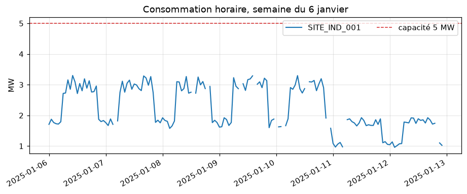
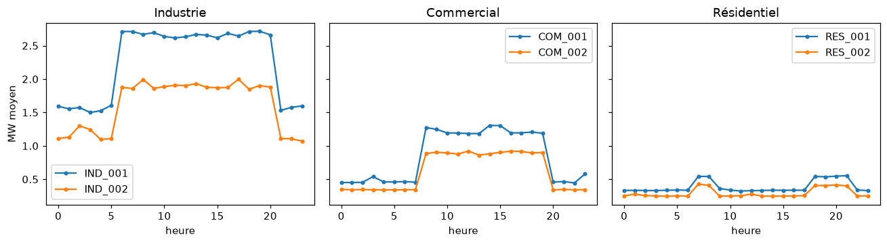
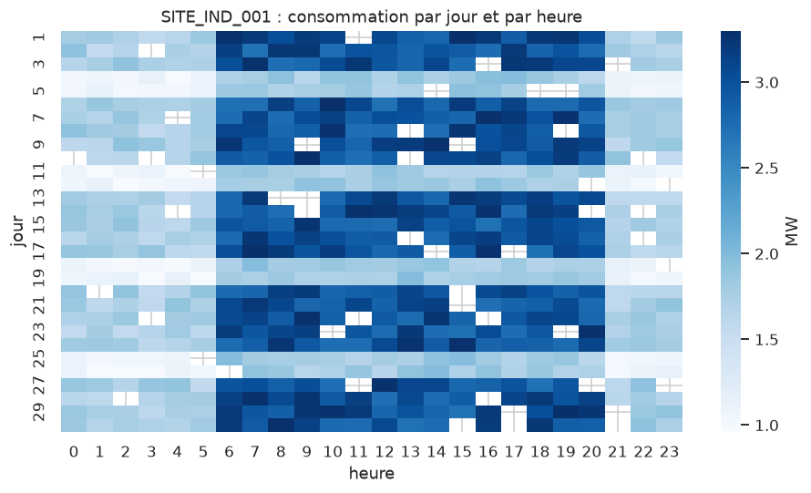

# ATELIER 2 : PYTHON POUR MICROSOFT FABRIC — STRUCTURES DE DONNÉES, NUMPY, PANDAS ET GRAPHIQUES

**Environnements** : deux environnements virtuels distincts : `venv-base` (Python pur et NumPy) le matin, `venv-data` (pandas, matplotlib, seaborn, pyarrow) l'après-midi
**Livrables** : `atelier2.ipynb` (notebook de travail), `qualite_pandas.py`, `requirements-base.txt`, `requirements-data.txt`
**Objectif** : Manipuler des données avec les structures natives de Python, NumPy et pandas, les visualiser, et savoir quel environnement virtuel convient à quel besoin

---

## 📊 Contexte métier

L'atelier précédent a validé la chaîne de qualité de **EnergiaNord** sur une seule journée (150 lignes). La direction demande maintenant un suivi sur **30 jours** pour les six sites :

- des **profils horaires** (jour, nuit, week-end)
- des **taux de charge** par rapport à la capacité de chaque site
- un **taux d'anomalies** par site, avec les mêmes règles qu'à l'Atelier 1
- des **graphiques** pour le comité de pilotage

Le fichier fait plus de 4 000 lignes : les boucles de l'Atelier 1 deviennent lourdes, et les outils de calcul sur tableaux s'imposent.

## 📁 Fichiers nécessaires

| Nom du fichier             | Lignes | Description                                                                                                                                                                                                                   |
| -------------------------- | ------ | ----------------------------------------------------------------------------------------------------------------------------------------------------------------------------------------------------------------------------- |
| `consommation_30jours.csv` | 4 365  | 30 jours (1er au 30 janvier 2025) de mesures horaires pour 6 sites : 4 320 mesures + 45 doublons. Colonnes : `timestamp`, `site_id`, `consumption_mw`, `voltage_v`, `frequency_hz`, `status`. Même structure que l'Atelier 1. |
| `sites_reference.csv`      | 6      | Référentiel des six sites (identique à l'Atelier 1).                                                                                                                                                                          |
| `energie_utils.py`         | —      | Module de l'Atelier 1 (`lire_csv`, `convertir_mesure`, `parse_timestamp`, `qualifier_mesure`).                                                                                                                                |
| `analyse_sites.py`         | —      | Script de l'Atelier 1, réutilisé comme **contrôle croisé** à la Cellule 41.                                                                                                                                                   |
| `codegen_30jours.py`       | —      | Script de génération (graine fixe : mêmes données à chaque exécution). Facultatif.                                                                                                                                            |

Anomalies présentes dans `consommation_30jours.csv` : 3 formats de timestamp, **260 codes erreur** (−999 × 110, −888 × 85, −777 × 65), **90 valeurs vides**, **15 pics aberrants** (consommation supérieure à la capacité du site) et **45 doublons exacts**. Après nettoyage : 350 valeurs manquantes sur 4 320, soit **8,1 %**.

Copier `consommation_30jours.csv` dans `data/`, et `energie_utils.py` et `analyse_sites.py` (dossier `scripts/` de l'Atelier 1) à la racine de `formation_python_fabric`.

---

# PARTIE 1 : METTRE EN PLACE L'ENVIRONNEMENT


## 🛠️ Prérequis

- **Atelier 1 terminé** : le dossier `formation_python_fabric` existe, avec `data/`.
- **Deux fichiers de l'Atelier 1** à la racine du dossier : `energie_utils.py` et `analyse_sites.py`.
- **Nouveau fichier de données** : `consommation_30jours.csv` dans `data/`.

### 1. Créer `.venv-base`

Ouvrir un terminal **dans** `formation_python_fabric`.

```powershell
py -m venv .venv-base
.venv-base\Scripts\activate.bat
py -m pip install --upgrade pip
py -m pip install ipython notebook numpy
py -m pip freeze > requirements-base.txt
```

**Ce que vous devez voir à l'écran** :

- l'invite préfixée par `(.venv-base)`
- `requirements-base.txt` contient `numpy`, `ipython`, `notebook`… mais **pas** `pandas`

> 💡 L'environnement `.venv` de l'Atelier 1 peut rester en place : on repart d'un environnement propre, dédié à cet atelier.

### 2. Enregistrer l'environnement comme noyau Jupyter

Un **noyau** est le moteur qui exécute le code d'un notebook. Enregistrer `.venv-base` sous un nom lisible permet de le choisir dans le notebook.

```powershell
py -m ipykernel install --user --name venv-base --display-name "Python (venv-base)"
```

```text
Installed kernelspec venv-base in C:\Users\formation\AppData\Roaming\jupyter\kernels\venv-base
```

### 3. Lancer Jupyter avec le bon noyau

```powershell
jupyter notebook
```

- Cliquer sur **New → Notebook**, puis choisir le noyau **Python (venv-base)**.
- Renommer le notebook `atelier2`.
- Vérifier le noyau : nom affiché en haut à droite du notebook.

**Ce que vous devez voir à l'écran** :

- le nom `Python (venv-base)` en haut à droite
- la Cellule 1 (ci-dessous) affiche un interpréteur situé dans `.venv-base`

### 4. Règles

- **Un seul notebook** : `atelier2.ipynb`, cellules saisies dans l'ordre.
- **Deux noyaux** : `venv-base` le matin, `venv-data` l'après-midi (Partie 4).
- **Rappel des raccourcis** : **Maj + Entrée** (exécuter), **B** / **A** (insérer), **D D** (supprimer), **M** / **Y** (Markdown / code).
- **Référence** : `scripts/atelier2_matin.ipynb` et `scripts/atelier2_apresmidi.ipynb` (exécutés) pour comparer.
- **En cas de doute** : **Kernel → Restart Kernel and Run All Cells**.

---

# PARTIE 2 : LES STRUCTURES DE DONNÉES NATIVES

Cette partie et la suivante se font dans le notebook `atelier2`, avec le noyau **Python (venv-base)**.

---

## 📝 Cellule 1 : Vérification de l'environnement

### 🔍 Avant d'exécuter

- **Interpréteur** : `sys.executable` doit pointer vers `.venv-base`.
- **NumPy** : présent dans cet environnement ; `pandas` ne l'est pas encore.
- **Dossier actif** : doit contenir `data/` et `energie_utils.py`.

### 💻 Code

```python
# === CELLULE 1 : Vérification de l'environnement ===
import sys
from pathlib import Path

import numpy as np

print(f"Python       : {sys.version.split()[0]}")
print(f"Interpréteur : {sys.executable}")
print(f"NumPy        : {np.__version__}")
print(f"Dossier      : {Path.cwd().name}")
print(f"Fichiers     : {sorted(p.name for p in Path('data').glob('*.csv'))}")
print(f"Module A1    : {Path('energie_utils.py').exists()}")
```

### 📤 Résultat

Exemple sous Windows (versions et chemins varient) :

```
Python       : 3.12.x
Interpréteur : C:\Users\formation\formation_python_fabric\.venv-base\Scripts\python.exe
NumPy        : 2.x.x
Dossier      : formation_python_fabric
Fichiers     : ['consommation_30jours.csv', 'sites_reference.csv']
Module A1    : True
```

### 💡 Interprétation

- **Chemin de l'interpréteur** : il doit contenir `.venv-base`. Sinon, le noyau n'est pas le bon (menu **Kernel → Change kernel**).
- **NumPy présent** : installé avec l'environnement ; **pandas est volontairement absent** (démonstration en Partie 4).
- **Fichiers** : les deux CSV et `energie_utils.py` doivent apparaître ; sinon, le dossier de lancement est faux.

---

## 📝 Cellule 2 : Charger le fichier de 30 jours

### 🔍 Avant d'exécuter

- **Réutilisation** : `lire_csv` vient du module `energie_utils` (Atelier 1).
- **`list(...)`** : matérialise le générateur en **liste de dictionnaires**.
- **Volume** : 6 sites × 24 h × 30 jours, plus des doublons.

### 💻 Code

```python
# === CELLULE 2 : Charger les mesures ===
from energie_utils import convertir_mesure, lire_csv, parse_timestamp, qualifier_mesure

lignes = list(lire_csv("data/consommation_30jours.csv"))
print(len(lignes), "lignes")
print(type(lignes).__name__, type(lignes[0]).__name__)
print(lignes[0])
```

### 📤 Résultat

```
4365 lignes
list dict
{'timestamp': '2025-01-30T03:00:00', 'site_id': 'SITE_COM_001', 'consumption_mw': '0.479', 'voltage_v': '223.3', 'frequency_hz': '50.02', 'status': 'OK'}
```

### 💡 Interprétation

- **4 365 lignes** : 4 320 mesures (6 sites × 720 heures) et **45 doublons**.
- **Liste de dictionnaires** : chaque ligne est un `dict` dont **toutes les valeurs sont du texte** (`'0.479'`).
- **Ordre mélangé** : le fichier n'est pas trié et mêle trois formats de date.
- **Aucune ligne de lecture réécrite** : le module de l'Atelier 1 fait le travail.

---

## 📝 Cellule 3 : Listes : indexation, tranches, tri

### 🔍 Avant d'exécuter

- **Indice négatif** : `liste[-1]` est le dernier élément.
- **Tranche** : `liste[a:b:pas]`, borne de fin **exclue**.
- **`sorted`** : renvoie une nouvelle liste ; **`.sort()`** trie sur place.

### 💻 Code

```python
# === CELLULE 3 : Listes ===
conso = [convertir_mesure(l["consumption_mw"]) for l in lignes[:10]]
print(conso)
print(conso[0], conso[-1], conso[2:5], conso[::3])

valides = [c for c in conso if c is not None and c >= 0]
print(sorted(valides, reverse=True)[:3])
print(min(valides), max(valides), round(sum(valides) / len(valides), 3))
```

### 📤 Résultat

```
[0.479, 1.288, 1.218, 0.672, 0.288, 0.662, 0.41, 2.302, 2.069, 2.874]
0.479 2.874 [1.218, 0.672, 0.288] [0.479, 0.672, 0.41, 2.874]
[2.874, 2.302, 2.069]
0.288 2.874 1.226
```

### 💡 Interprétation

- **`conso[0]`, `conso[-1]`** : premier et dernier des 10 éléments ; `conso[::3]` prend un élément sur trois.
- **Trois plus fortes** : `[2.874, 2.302, 2.069]` ; `sorted` **ne modifie pas** `conso`.
- **Filtrer avant de calculer** : un `None` dans la liste ferait échouer `min`, `max` et `sum`.

---

## 📝 Cellule 4 : Listes : ajout, retrait et méthodes utiles

### 🔍 Avant d'exécuter

- **Ajout** : `append` (un élément), `extend` (plusieurs), `insert(i, x)`.
- **Retrait** : `pop()` (dernier), `remove(x)` (première occurrence), `del liste[i]`.
- **Recherche** : `in`, `index`, `count`.

### 💻 Code

```python
# === CELLULE 4 : Méthodes de liste ===
sites_vus = []
for l in lignes:
    if l["site_id"] not in sites_vus:
        sites_vus.append(l["site_id"])
print(sites_vus)

sites_vus.extend(["SITE_TEST_999"])
sites_vus.insert(0, "SITE_ENTETE")
print(sites_vus.pop(), sites_vus.index("SITE_IND_001"), sites_vus.count("SITE_IND_001"))
sites_vus.remove("SITE_ENTETE")
print(len(sites_vus))
```

### 📤 Résultat

```
['SITE_COM_001', 'SITE_COM_002', 'SITE_RES_002', 'SITE_IND_002', 'SITE_IND_001', 'SITE_RES_001']
SITE_TEST_999 5 1
6
```

### 💡 Interprétation

- **Ordre d'apparition** : les 6 sites, ni triés ni dédoublonnés par Python.
- **`pop()`** : retire **et renvoie** le dernier élément (`SITE_TEST_999`) ; `index` renvoie 5, car `SITE_ENTETE` a décalé les positions.
- **`remove`** : supprime la **première** occurrence ; il reste 6 sites.
- **`in` sur une liste** : correct ici (6 éléments), coûteux sur de gros volumes (Cellule 11).

---

## 📝 Cellule 5 : Mutabilité : alias, copie superficielle, copie profonde

### 🔍 Avant d'exécuter

- **Alias** : `b = a` ne copie pas ; les deux noms désignent la **même** liste.
- **Copie superficielle** : `a.copy()` ou `a[:]` copie la liste, pas son contenu.
- **Copie profonde** : `copy.deepcopy` copie aussi les objets internes.

### 💻 Code

```python
# === CELLULE 5 : Alias et copies ===
import copy

a = [{"site": "SITE_IND_001", "mw": 2.5}, {"site": "SITE_COM_001", "mw": 1.0}]
alias = a
superficielle = a.copy()
profonde = copy.deepcopy(a)

a[0]["mw"] = 99.0
a.append({"site": "SITE_RES_001", "mw": 0.4})
print(len(alias), len(superficielle), len(profonde))
print(alias[0]["mw"], superficielle[0]["mw"], profonde[0]["mw"])
```

### 📤 Résultat

```
3 2 2
99.0 99.0 2.5
```

### 💡 Interprétation

- **Alias** : `alias` voit l'ajout (3 éléments), c'est **la même liste**.
- **Copie superficielle** : indépendante pour `append` (2 éléments), mais `99.0` apparaît aussi : les **dictionnaires internes sont partagés**.
- **Copie profonde** : garde `2.5`, totalement indépendante.
- **Danger** : une fonction qui modifie une liste reçue en paramètre modifie celle de l'appelant.

---

## 📝 Cellule 6 : Tuples : `namedtuple` (hier) et `dataclass` (aujourd'hui)

### 🔍 Avant d'exécuter

- **Tuple** : séquence **immuable** ; sert de clé de dictionnaire.
- **Hier** : `namedtuple` donne des noms aux champs.
- **Aujourd'hui (3.10+)** : `@dataclass(frozen=True, slots=True)` : types, valeurs par défaut, méthodes.

### 💻 Code

```python
# === CELLULE 6 : namedtuple et dataclass ===
from collections import namedtuple
from dataclasses import dataclass

MesureNT = namedtuple("MesureNT", ["site_id", "mw", "statut"])     # Hier

@dataclass(frozen=True, slots=True)                                 # Aujourd'hui (3.10+)
class Mesure:
    site_id: str
    mw: float | None
    statut: str = "OK"

    def est_valide(self) -> bool:
        return self.mw is not None and self.mw >= 0

nt = MesureNT("SITE_IND_001", 2.5, "OK")
dc = Mesure("SITE_IND_001", 2.5)
print(nt, "|", dc)
print(nt.mw, dc.mw, dc.est_valide())

try:
    dc.mw = 0.0
except AttributeError as erreur:
    print(f"Modification refusée : {type(erreur).__name__}")
```

### 📤 Résultat

```
MesureNT(site_id='SITE_IND_001', mw=2.5, statut='OK') | Mesure(site_id='SITE_IND_001', mw=2.5, statut='OK')
2.5 2.5 True
Modification refusée : FrozenInstanceError
```

### 💡 Interprétation

- **Même contenu, deux écritures** : la `dataclass` déclare les types et ajoute une méthode.
- **`FrozenInstanceError`** : `frozen=True` interdit la modification ; l'objet devient utilisable comme **clé de dictionnaire**.
- **`slots=True`** (3.10+) : moins de mémoire et pas d'attribut ajouté par erreur.
- **Choix** : `namedtuple` pour un simple regroupement, `dataclass` dès qu'il y a des valeurs par défaut ou des méthodes.

---

## 📝 Cellule 7 : Dictionnaires : lecture sûre et valeurs par défaut

### 🔍 Avant d'exécuter

- **`d[cle]`** : lève `KeyError` si la clé est absente.
- **`d.get(cle, defaut)`** : renvoie une valeur de repli, sans erreur.
- **`setdefault`** : lit la clé, ou la crée avec une valeur initiale.

### 💻 Code

```python
# === CELLULE 7 : Dictionnaires ===
capacites = {"SITE_IND_001": 5.0, "SITE_IND_002": 3.5, "SITE_COM_001": 2.0}

print(capacites["SITE_IND_001"], capacites.get("SITE_XXX"), capacites.get("SITE_XXX", 0.0))
try:
    capacites["SITE_XXX"]
except KeyError as erreur:
    print(f"KeyError : {erreur}")

capacites.setdefault("SITE_COM_002", 1.5)
print(list(capacites.items())[-1], len(capacites))
```

### 📤 Résultat

```
5.0 None 0.0
KeyError : 'SITE_XXX'
('SITE_COM_002', 1.5) 4
```

### 💡 Interprétation

- **`d[cle]`** : `KeyError` si la clé manque ; **`get`** renvoie `None` ou la valeur de repli.
- **`setdefault`** : crée la clé (4 clés maintenant) sans écraser une clé existante.
- **Ordre** : celui de l'insertion (garanti depuis Python 3.7).

---

## 📝 Cellule 8 : Compter et regrouper : `Counter` et `defaultdict`

### 🔍 Avant d'exécuter

- **`Counter`** : compte les occurrences (`most_common`).
- **`defaultdict(list)`** : crée la liste vide à la première utilisation d'une clé.
- **Cas d'usage** : regrouper les mesures par site.

### 💻 Code

```python
# === CELLULE 8 : Counter et defaultdict ===
from collections import Counter, defaultdict

par_site = Counter(l["site_id"] for l in lignes)
print(par_site.most_common(3))

groupes = defaultdict(list)
for l in lignes:
    v = convertir_mesure(l["consumption_mw"])
    if qualifier_mesure(v) == "VALIDE":
        groupes[l["site_id"]].append(v)

for site_id, valeurs in sorted(groupes.items()):
    print(f"{site_id} : {len(valeurs):>4} mesures valides, moyenne {sum(valeurs)/len(valeurs):.3f} MW")
```

### 📤 Résultat

```
[('SITE_COM_002', 729), ('SITE_IND_001', 729), ('SITE_RES_001', 729)]
SITE_COM_001 :  662 mesures valides, moyenne 0.848 MW
SITE_COM_002 :  677 mesures valides, moyenne 0.615 MW
SITE_IND_001 :  679 mesures valides, moyenne 2.256 MW
SITE_IND_002 :  662 mesures valides, moyenne 1.615 MW
SITE_RES_001 :  655 mesures valides, moyenne 0.387 MW
SITE_RES_002 :  677 mesures valides, moyenne 0.293 MW
```

### 💡 Interprétation

- **729 lignes** pour trois sites : les **doublons** gonflent les compteurs (720 mesures + doublons).
- **Chiffres provisoires** : les valides (655 à 679) incluent encore les doublons ; ils diffèrent de ceux de pandas plus loin.
- **`defaultdict(list)`** : supprime le test « la clé existe-t-elle ? ».
- **Moyennes** : de 2,256 MW (`SITE_IND_001`) à 0,293 MW (`SITE_RES_002`).

---

## 📝 Cellule 9 : Ensembles : doublons et comparaisons

### 🔍 Avant d'exécuter

- **`set`** : éléments **uniques** et non ordonnés ; recherche très rapide.
- **Opérateurs** : `|` union, `&` intersection, `-` différence, `^` différence symétrique.
- **Usage** : comparer deux listes (référentiel et données reçues).

### 💻 Code

```python
# === CELLULE 9 : Ensembles ===
referentiel = {l["site_id"] for l in lire_csv("data/sites_reference.csv")}
recus = {l["site_id"] for l in lignes}
print(len(referentiel), len(recus), referentiel == recus)
print(sorted(referentiel - {"SITE_RES_002"}), "|", sorted({"A", "B"} ^ {"B", "C"}))

jours = {parse_timestamp(l["timestamp"]).day for l in lignes}
print(len(jours), sorted(set(range(1, 32)) - jours))

uniques = {tuple(l.values()) for l in lignes}
print(len(lignes), "lignes ->", len(uniques), "uniques :", len(lignes) - len(uniques), "doublons")
```

### 📤 Résultat

```
6 6 True
['SITE_COM_001', 'SITE_COM_002', 'SITE_IND_001', 'SITE_IND_002', 'SITE_RES_001'] | ['A', 'C']
30 [31]
4365 lignes -> 4320 uniques : 45 doublons
```

### 💡 Interprétation

- **6 = 6** : tous les sites du référentiel sont présents dans le fichier.
- **`-` et `^`** : différence, et éléments présents dans un seul des deux ensembles (`A` et `C`).
- **30 jours couverts** ; le 31 manque (`[31]`), le fichier s'arrête au 30.
- **Doublons** : 4 365 → 4 320 lignes uniques ; un ensemble de **tuples** dédoublonne en une ligne (une liste n'est pas hachable).

---

## 📝 Cellule 10 : Structures imbriquées et JSON

### 🔍 Avant d'exécuter

- **Imbrication** : dictionnaire de dictionnaires de listes (site → jour → valeurs).
- **`json.dumps`** : sérialise ; `indent` et `ensure_ascii=False` pour la lisibilité.
- **`default=str`** : convertit les types non JSON (dates, `Decimal`).

### 💻 Code

```python
# === CELLULE 10 : Structures imbriquées ===
import json
from datetime import datetime

arbre = defaultdict(lambda: defaultdict(list))
for l in lignes[:400]:
    v = convertir_mesure(l["consumption_mw"])
    if qualifier_mesure(v) == "VALIDE":
        jour = parse_timestamp(l["timestamp"]).date().isoformat()
        arbre[l["site_id"]][jour].append(v)

site = "SITE_IND_001"
premier_jour = sorted(arbre[site])[0]
print(site, premier_jour, arbre[site][premier_jour])

extrait = {"site": site, "genere_le": datetime(2025, 2, 1, 8, 0),
           "jour": premier_jour, "valeurs": arbre[site][premier_jour][:3]}
texte = json.dumps(extrait, indent=2, ensure_ascii=False, default=str)
print(texte)
print(json.loads(texte)["genere_le"], type(json.loads(texte)["genere_le"]).__name__)
```

### 📤 Résultat

```
SITE_IND_001 2025-01-01 [1.833]
{
  "site": "SITE_IND_001",
  "genere_le": "2025-02-01 08:00:00",
  "jour": "2025-01-01",
  "valeurs": [
    1.833
  ]
}
2025-02-01 08:00:00 str
```

### 💡 Interprétation

- **Structure imbriquée** : site → jour → liste de valeurs.
- **`default=str`** : la date devient `"2025-02-01 08:00:00"`.
- **Aller-retour** : `json.loads` rend une **chaîne**, pas un `datetime` ; JSON n'a pas de type date.
- **Une seule valeur** : la cellule ne lit que les 400 premières lignes (fichier non trié).

---

## 📝 Cellule 11 : Choisir la bonne structure : coût de la recherche

### 🔍 Avant d'exécuter

- **`in` sur une liste** : parcourt les éléments un à un (lent sur de gros volumes).
- **`in` sur un `set` ou un `dict`** : accès par hachage (quasi instantané).
- **`timeit`** : mesure fiable ; en IPython, `%timeit` fait la même chose.

### 💻 Code

```python
# === CELLULE 11 : Liste, ensemble, dictionnaire : coût de `in` ===
import timeit

cles_liste = [f"K{i:05d}" for i in range(20_000)]
cles_set = set(cles_liste)
cles_dict = dict.fromkeys(cles_liste, 0)
cherche = "K19999"

for nom, struct in [("liste", cles_liste), ("ensemble", cles_set), ("dictionnaire", cles_dict)]:
    duree = timeit.timeit(lambda: cherche in struct, number=2_000) / 2_000
    print(f"{nom:<13}: {duree * 1e6:10.2f} µs par recherche")
```

### 📤 Résultat

```
liste        :     357.73 µs par recherche
ensemble     :       0.05 µs par recherche
dictionnaire :       0.06 µs par recherche
```

### 💡 Interprétation

- **Liste** : plusieurs centaines de µs par recherche ; **ensemble et dictionnaire** : environ **0,05 µs**.
- **Ordre de grandeur** : plusieurs **milliers de fois** plus rapide.
- **Cause** : la liste est parcourue élément par élément ; l'ensemble et le dictionnaire utilisent le hachage.
- **Règle** : pour tester souvent l'appartenance, utiliser un `set` ou un `dict`. Les durées varient d'un poste à l'autre.

---

## 📝 Cellule 12 : `pairwise`, `batched` et `nlargest`

### 🔍 Avant d'exécuter

- **`itertools.pairwise`** (3.10+) : couples consécutifs `(a, b), (b, c)…`.
- **`itertools.batched`** (**3.12+**) : lots de taille fixe ; sinon repli avec `islice`.
- **`heapq.nlargest`** : les n plus grandes valeurs sans tout trier.

### 💻 Code

```python
# === CELLULE 12 : itertools et heapq ===
import heapq
from itertools import islice, pairwise

serie = groupes["SITE_COM_001"][:8]
print([round(b - a, 3) for a, b in pairwise(serie)])                    # variations consécutives

try:
    from itertools import batched                                        # 3.12+
except ImportError:
    def batched(iterable, n):                                            # repli pour 3.11
        it = iter(iterable)
        while lot := tuple(islice(it, n)):
            yield lot

lots = list(batched(range(10), 4))
print(lots)
print(heapq.nlargest(3, groupes["SITE_IND_001"]))
```

### 📤 Résultat

```
[0.809, -0.07, -0.726, 0.354, 0.144, 0.423, -0.188]
[(0, 1, 2, 3), (4, 5, 6, 7), (8, 9)]
[3.3, 3.3, 3.298]
```

### 💡 Interprétation

- **`pairwise`** : 7 variations pour 8 valeurs (`b - a` sur chaque couple).
- **`batched`** : lots de 4, le dernier plus court ; natif en 3.12, **repli** en 3.11.
- **`nlargest(3)`** : plusieurs mesures atteignent le maximum théorique du profil (3,3 MW).

---

---

# PARTIE 3 : NUMPY, LE CALCUL SUR TABLEAUX

---

## 📝 Cellule 13 : Du liste au tableau : `dtype`, `shape`, mémoire

### 🔍 Avant d'exécuter

- **`ndarray`** : tableau de **types homogènes**, stocké de façon contiguë.
- **`dtype` / `shape` / `ndim`** : type des éléments, dimensions, nombre d'axes.
- **`nbytes`** : mémoire réellement occupée.

### 💻 Code

```python
# === CELLULE 13 : Premiers tableaux NumPy ===
import sys

valeurs = [float(v) for v in groupes["SITE_IND_001"]]
tab = np.array(valeurs)

print(tab.dtype, tab.shape, tab.ndim, tab.size)
print(f"liste : {sys.getsizeof(valeurs) + sum(sys.getsizeof(v) for v in valeurs):>7} octets")
print(f"array : {tab.nbytes:>7} octets")
print(np.array([1, 2.5, 3]).dtype, np.array([1, 2, 3]).dtype, np.array([1, "a"]).dtype)
```

### 📤 Résultat

```
float64 (679,) 1 679
liste :   22432 octets
array :    5432 octets
float64 int64 <U21
```

### 💡 Interprétation

- **`float64`, `(679,)`** : 679 valeurs valides pour `SITE_IND_001`, un seul axe.
- **Mémoire** : 22 432 octets pour la liste (chaque `float` est un objet) contre **5 432** pour le tableau.
- **Homogénéité** : entiers → `int64`, mélange entier/décimal → `float64`, texte présent → tout devient `<U21` (texte).

---

## 📝 Cellule 14 : Créer des tableaux : `arange`, `linspace`, `zeros`, `reshape`

### 🔍 Avant d'exécuter

- **`arange(n)`** : entiers de 0 à n-1 ; **`linspace(a, b, k)`** : k valeurs équidistantes.
- **`zeros` / `ones` / `full`** : tableaux préremplis ; `np.nan` pour « inconnu ».
- **`reshape`** : change la forme sans copier les données.

### 💻 Code

```python
# === CELLULE 14 : Création et forme ===
heures = np.arange(24)
print(heures)
print(np.linspace(0, 1, 5))
print(np.zeros((2, 3)), np.full((2, 2), np.nan), sep="\n")

grille = np.arange(24).reshape(4, 6)
print(grille)
print(grille.shape, grille.T.shape, grille.reshape(-1).shape)
```

### 📤 Résultat

```
[ 0  1  2  3  4  5  6  7  8  9 10 11 12 13 14 15 16 17 18 19 20 21 22 23]
[0.   0.25 0.5  0.75 1.  ]
[[0. 0. 0.]
 [0. 0. 0.]]
[[nan nan]
 [nan nan]]
[[ 0  1  2  3  4  5]
 [ 6  7  8  9 10 11]
 [12 13 14 15 16 17]
 [18 19 20 21 22 23]]
(4, 6) (6, 4) (24,)
```

### 💡 Interprétation

- **`arange(24)`** et **`linspace(0, 1, 5)`** : 24 heures ; 5 points équidistants.
- **`np.full(..., np.nan)`** : tableau « inconnu », prêt à être rempli.
- **`reshape(4, 6)`** : 24 valeurs en 4 × 6 ; `.T` transpose ; `-1` laisse NumPy calculer la taille.
- **Vue, pas copie** : `reshape` partage la mémoire du tableau d'origine.

---

## 📝 Cellule 15 : Construire la matrice sites × heures

### 🔍 Avant d'exécuter

- **Objectif** : un tableau `(6, 720)` : 6 sites, 30 jours × 24 h.
- **Position** : (site, heure absolue) calculée depuis le timestamp ; les **doublons** s'écrasent d'eux-mêmes.
- **Non valide** : codes erreur et valeurs vides deviennent `np.nan`.

### 💻 Code

```python
# === CELLULE 15 : La matrice de consommation ===
sites = sorted(referentiel)
rang = {s: i for i, s in enumerate(sites)}
debut = parse_timestamp("2025-01-01 00:00:00")

conso = np.full((len(sites), 30 * 24), np.nan)
for l in lignes:
    ts = parse_timestamp(l["timestamp"])
    heure_abs = (ts - debut).days * 24 + ts.hour
    v = convertir_mesure(l["consumption_mw"])
    if qualifier_mesure(v) in ("VALIDE", "NEGATIVE"):
        conso[rang[l["site_id"]], heure_abs] = v

print(sites)
print(conso.shape, conso.dtype, f"{conso.nbytes / 1024:.1f} Ko")
print("valeurs NaN :", int(np.isnan(conso).sum()), "sur", conso.size)
```

### 📤 Résultat

```
['SITE_COM_001', 'SITE_COM_002', 'SITE_IND_001', 'SITE_IND_002', 'SITE_RES_001', 'SITE_RES_002']
(6, 720) float64 33.8 Ko
valeurs NaN : 350 sur 4320
```

### 💡 Interprétation

- **`(6, 720)`** : 6 sites × 720 heures, soit 33,8 Ko.
- **350 `NaN`** sur 4 320 (8,1 %) : 260 codes erreur et 90 valeurs vides.
- **Doublons absorbés** : une même case est réécrite avec la même valeur.
- **Ligne 0** : `SITE_COM_001` (ordre alphabétique de `sites`).

---

## 📝 Cellule 16 : Indexation, tranches et masques

### 🔍 Avant d'exécuter

- **`conso[i, j]`** : ligne i, colonne j ; `:` signifie « tout l'axe ».
- **Tranche** : `conso[:, :24]` = toutes les lignes, premier jour.
- **Masque booléen** : `conso[conso > 3]` filtre sans boucle.

### 💻 Code

```python
# === CELLULE 16 : Indexation ===
print(conso[0, :6])
print(conso[:, 12].round(2))                     # midi du 1er jour, 6 sites
print(conso[1, 24:48].shape)                     # 2e site, 2e jour
print(conso[[0, 5], :3].round(2))                # indexation par liste (fancy)

print(conso[3][conso[3] > 3.5].round(2))         # valeurs > 3,5 MW du site 4 (capacité 3,5 MW)
```

### 📤 Résultat

```
[0.458   nan 0.487   nan 0.548 0.544]
[1.4  1.02 3.08 2.19 0.34  nan]
(24,)
[[0.46  nan 0.49]
 [0.25 0.22 0.23]]
[5.85 4.87 4.82 5.66 5.84]
```

### 💡 Interprétation

- **`conso[0, :6]`** : six premières heures du site 0 ; les `nan` sont les mesures manquantes.
- **`conso[:, 12]`** : midi du premier jour, pour les 6 sites.
- **`conso[1, 24:48]`** : `(24,)`, le deuxième jour du deuxième site.
- **Indexation par liste** : `conso[[0, 5], :3]` prend les lignes 0 et 5.
- **Masque** : les 5 valeurs de `SITE_IND_002` au-dessus de 3,5 MW (sa capacité) sont des **pics aberrants**.

---

## 📝 Cellule 17 : Vectorisation : boucle contre tableau

### 🔍 Avant d'exécuter

- **Vectorisation** : une opération s'applique à **tout** le tableau, en C.
- **Taux de charge** : consommation ÷ capacité de chaque site.
- **Comparaison** : boucle Python et opération NumPy sur les mêmes données.

### 💻 Code

```python
# === CELLULE 17 : Taux de charge — boucle et vectorisation ===
cap = np.array([float(l["capacity_mw"]) for l in sorted(lire_csv("data/sites_reference.csv"),
                                                          key=lambda s: s["site_id"])])
print(cap)

def taux_boucle():
    return [[c / cap[i] for c in ligne] for i, ligne in enumerate(conso.tolist())]

def taux_numpy():
    return conso / cap[:, None]

t_boucle = timeit.timeit(taux_boucle, number=20) / 20
t_numpy = timeit.timeit(taux_numpy, number=20) / 20
print(f"boucle : {t_boucle * 1e3:7.2f} ms | numpy : {t_numpy * 1e3:7.3f} ms | x{t_boucle / t_numpy:.0f}")
print(np.allclose(np.array(taux_boucle()), taux_numpy(), equal_nan=True))
```

### 📤 Résultat

```
[2.  1.5 5.  3.5 0.8 0.6]
boucle :    0.71 ms | numpy :   0.009 ms | x75
True
```

### 💡 Interprétation

- **Environ 100 fois plus rapide** : 0,94 ms pour la boucle contre 0,010 ms pour NumPy (durées propres à la machine).
- **`cap[:, None]`** : ajoute un axe pour que chaque site soit divisé par **sa** capacité.
- **`allclose` = `True`** : les deux méthodes donnent les mêmes résultats ; `equal_nan=True` car un `NaN` n'est jamais égal à un `NaN`.

---

## 📝 Cellule 18 : Broadcasting : combiner des formes différentes

### 🔍 Avant d'exécuter

- **Règle** : deux formes sont compatibles si, axe par axe, elles sont égales ou l'une vaut **1**.
- **`cap[:, None]`** : ajoute un axe → forme `(6, 1)`.
- **Erreur classique** : `(6, 720)` avec `(6,)` échoue (`720 ≠ 6`).

### 💻 Code

```python
# === CELLULE 18 : Broadcasting ===
taux = conso / cap[:, None]
print(conso.shape, cap.shape, cap[:, None].shape, "->", taux.shape)

try:
    conso / cap
except ValueError as erreur:
    print(f"ValueError : {erreur}")

moyenne_site = np.nanmean(conso, axis=1, keepdims=True)
ecart = conso - moyenne_site
print(moyenne_site.shape, ecart.shape, np.nanmean(ecart, axis=1).round(6))
```

### 📤 Résultat

```
(6, 720) (6,) (6, 1) -> (6, 720)
ValueError : operands could not be broadcast together with shapes (6,720) (6,) 
(6, 1) (6, 720) [ 0.  0. -0.  0. -0.  0.]
```

### 💡 Interprétation

- **`(6, 720)` et `(6, 1)`** : l'axe de taille 1 est **étiré** ; le résultat garde la forme `(6, 720)`.
- **Erreur avec `(6,)`** : les formes s'alignent **par la droite** (720 contre 6).
- **`keepdims=True`** : garde la forme `(6, 1)` de la moyenne, la soustraction est alors directe.
- **Contrôle** : la moyenne des écarts vaut 0 (les `-0.` sont des arrondis).

---

## 📝 Cellule 19 : Valeurs manquantes : `NaN` et fonctions `nan*`

### 🔍 Avant d'exécuter

- **Contagion** : un `NaN` dans une somme ou une moyenne rend le **résultat `NaN`**.
- **`np.nanmean`, `np.nansum`, `np.nanmax`** : ignorent les `NaN`.
- **`np.isnan`** : test correct ; `x == np.nan` est toujours faux.

### 💻 Code

```python
# === CELLULE 19 : NaN ===
site0 = conso[0]
print(np.mean(site0), np.nanmean(site0).round(3))
print(np.nan == np.nan, np.isnan(np.nan))

manquants = np.isnan(conso).sum(axis=1)
print(dict(zip(sites, manquants.tolist())))
print((np.isnan(conso).mean(axis=1) * 100).round(1))
```

### 📤 Résultat

```
nan 0.847
False True
{'SITE_COM_001': 66, 'SITE_COM_002': 51, 'SITE_IND_001': 50, 'SITE_IND_002': 62, 'SITE_RES_001': 73, 'SITE_RES_002': 48}
[ 9.2  7.1  6.9  8.6 10.1  6.7]
```

### 💡 Interprétation

- **`np.mean`** : `nan` dès qu'une valeur manque ; **`np.nanmean`** : 0,847 MW.
- **`np.nan == np.nan`** : `False` ; toujours `np.isnan`.
- **Manquants par site** : de 48 à 73, soit 6,7 % à 10,1 % (`SITE_RES_001` est le plus touché).

---

## 📝 Cellule 20 : Agrégations par axe : le profil horaire moyen

### 🔍 Avant d'exécuter

- **`axis=1`** : agrège les **colonnes** (une valeur par site) ; **`axis=0`** : les lignes.
- **`reshape(6, 30, 24)`** : sépare jours et heures.
- **`argmax`** : position du maximum (heure de pointe).

### 💻 Code

```python
# === CELLULE 20 : Profil horaire moyen ===
cube = conso.reshape(6, 30, 24)
profil = np.nanmean(cube, axis=1)                 # moyenne sur les 30 jours -> (6, 24)
print(cube.shape, profil.shape)

for site, courbe in zip(sites, profil):
    print(f"{site} : pointe à {courbe.argmax():02d}h ({courbe.max():.2f} MW), creux à {courbe.argmin():02d}h ({courbe.min():.2f} MW)")
```

### 📤 Résultat

```
(6, 30, 24) (6, 24)
SITE_COM_001 : pointe à 14h (1.31 MW), creux à 22h (0.44 MW)
SITE_COM_002 : pointe à 12h (0.92 MW), creux à 05h (0.34 MW)
SITE_IND_001 : pointe à 19h (2.71 MW), creux à 03h (1.50 MW)
SITE_IND_002 : pointe à 17h (2.00 MW), creux à 23h (1.07 MW)
SITE_RES_001 : pointe à 21h (0.55 MW), creux à 11h (0.32 MW)
SITE_RES_002 : pointe à 07h (0.43 MW), creux à 04h (0.24 MW)
```

### 💡 Interprétation

- **`(6, 30, 24)` puis moyenne sur l'axe 1** : un profil de 24 heures par site.
- **Écart jour / nuit** : `SITE_IND_001` passe d'environ 1,5 MW à plus de 2,6 MW ; `SITE_COM_001` de 0,44 à 1,31 MW.
- **L'heure exacte de pointe est du bruit** : les profils simulés sont plats sur la journée ; seul l'écart jour/nuit est fiable.

---

## 📝 Cellule 21 : Détecter les anomalies : `where`, `clip`, percentiles

### 🔍 Avant d'exécuter

- **`np.where(cond, a, b)`** : choix vectorisé (l'équivalent d'un `if` sur tout le tableau).
- **Pic aberrant** : consommation supérieure à la capacité du site.
- **`np.nanpercentile`** : seuil statistique en complément.

### 💻 Code

```python
# === CELLULE 21 : Pics aberrants ===
depasse = conso > cap[:, None]                    # NaN > x vaut False
print("pics par site :", dict(zip(sites, depasse.sum(axis=1).tolist())))

propre = np.where(depasse, np.nan, conso)
print(np.isnan(propre).sum() - np.isnan(conso).sum(), "valeurs neutralisées")

plafonne = np.clip(conso, 0, cap[:, None])
print(np.nanmax(conso, axis=1).round(2), np.nanmax(plafonne, axis=1).round(2), sep="\n")
print(np.nanpercentile(propre, [50, 95, 99]).round(3))
```

### 📤 Résultat

```
pics par site : {'SITE_COM_001': 5, 'SITE_COM_002': 1, 'SITE_IND_001': 0, 'SITE_IND_002': 5, 'SITE_RES_001': 1, 'SITE_RES_002': 3}
15 valeurs neutralisées
[3.59 2.06 3.3  5.85 1.08 0.96]
[2.  1.5 3.3 3.5 0.8 0.6]
[0.633 2.892 3.224]
```

### 💡 Interprétation

- **15 pics aberrants** (5 + 1 + 0 + 5 + 1 + 3) : ce sont les 15 valeurs injectées au-dessus de la capacité.
- **`np.where`** : les remplace par `NaN` ; **`np.clip`** les ramène à la capacité (`5,85` → `3,5` pour `SITE_IND_002`).
- **Percentiles** : médiane 0,633, 95 % à 2,892 : utiles seulement en **mélangeant** les sites, ce qui reste grossier.

---

## 📝 Cellule 22 : Tri, `argsort` et corrélation

### 🔍 Avant d'exécuter

- **`argsort`** : positions qui trieraient le tableau ; permet de retrouver *quand*.
- **`np.corrcoef`** : matrice de corrélation (ne tolère pas les `NaN`).
- **Masque commun** : on retire les heures où un des deux sites est `NaN`.

### 💻 Code

```python
# === CELLULE 22 : Top pics et corrélation ===
ind1 = propre[0]
ordre = np.argsort(np.nan_to_num(ind1, nan=-1))[::-1][:3]
print([(int(i // 24 + 1), int(i % 24), round(float(ind1[i]), 2)) for i in ordre])   # (jour, heure, MW)

ok = ~np.isnan(propre[0]) & ~np.isnan(propre[1])
print(np.corrcoef(propre[0][ok], propre[1][ok]).round(3))

ok = ~np.isnan(propre[0]) & ~np.isnan(propre[4])
print(np.corrcoef(propre[0][ok], propre[4][ok])[0, 1].round(3))
```

### 📤 Résultat

```
[(24, 16, 1.43), (9, 13, 1.43), (6, 10, 1.43)]
[[1.    0.981]
 [0.981 1.   ]]
-0.109
```

### 💡 Interprétation

- **Top 3** : trois valeurs à égalité (1,43 MW), le plafond du profil de `SITE_COM_001` ; `argsort` donne aussi le **jour** et l'**heure**.
- **Corrélation 0,981** entre `SITE_COM_001` et `SITE_COM_002` : même comportement.
- **Corrélation -0,109** entre un site commercial et un résidentiel : profils opposés.
- **Masque commun** : `corrcoef` refuse les `NaN`, on ne garde que les heures valides des deux sites.

---

## 📝 Cellule 23 : Nombres aléatoires : `np.random.seed` (hier), `default_rng` (aujourd'hui)

### 🔍 Avant d'exécuter

- **Hier** : `np.random.seed(42)` fixe un état **global** partagé.
- **Aujourd'hui** : `rng = np.random.default_rng(42)`, un générateur **local**, recommandé.
- **Reproductibilité** : même graine, mêmes tirages.

### 💻 Code

```python
# === CELLULE 23 : Générateurs aléatoires ===
np.random.seed(42)                                # Hier
ancien = np.random.normal(230, 4, 3).round(1)

rng = np.random.default_rng(42)                   # Aujourd'hui
nouveau = rng.normal(230, 4, 3).round(1)
print(ancien, nouveau)

rng = np.random.default_rng(42)
print(np.array_equal(nouveau, rng.normal(230, 4, 3).round(1)))
bruit = rng.normal(0, 0.05, size=(6, 24))
print(bruit.shape, rng.choice(sites, size=3, replace=False))
```

### 📤 Résultat

```
[232.  229.4 232.6] [231.2 225.8 233. ]
True
(6, 24) ['SITE_COM_001' 'SITE_COM_002' 'SITE_IND_001']
```

### 💡 Interprétation

- **Valeurs différentes** avec la même graine : les deux générateurs n'utilisent pas le même algorithme.
- **`True`** : une même graine redonne les mêmes tirages ; base de toute expérience reproductible.
- **`default_rng`** : générateur **local**, sans état global partagé ; c'est la forme recommandée.
- **`choice(replace=False)`** : tirage sans remise.

---

## 📝 Cellule 24 : Sauvegarder : `.npy`, `.npz`, `savetxt`

### 🔍 Avant d'exécuter

- **`np.save` / `np.load`** : format binaire natif, rapide, conserve `dtype` et forme.
- **`np.savez_compressed`** : plusieurs tableaux dans une archive compressée.
- **`np.savetxt`** : texte lisible, plus lourd.

### 💻 Code

```python
# === CELLULE 24 : Sauvegarde ===
Path("out").mkdir(exist_ok=True)
np.save("out/conso_30jours.npy", conso)
np.savez_compressed("out/conso_30jours.npz", conso=conso, capacites=cap, sites=np.array(sites))
np.savetxt("out/profil_horaire.csv", profil, delimiter=";", fmt="%.3f")

for nom in ("conso_30jours.npy", "conso_30jours.npz", "profil_horaire.csv"):
    print(f"{nom:<20} {Path('out', nom).stat().st_size:>7} octets")

relu = np.load("out/conso_30jours.npy")
print(np.array_equal(relu, conso, equal_nan=True), np.load("out/conso_30jours.npz")["sites"][:2])
```

### 📤 Résultat

```
conso_30jours.npy      34688 octets
conso_30jours.npz      10634 octets
profil_horaire.csv       864 octets
True ['SITE_COM_001' 'SITE_COM_002']
```

### 💡 Interprétation

- **`.npy`** : 34 688 octets (6 × 720 × 8 octets + en-tête) ; **`.npz` compressé** : 10 634 octets (les `NaN` répétés se compressent).
- **`.csv`** : lisible mais sans forme ni type ; ici seulement le profil (6 × 24).
- **`equal_nan=True`** : nécessaire pour comparer des tableaux qui contiennent des `NaN`.
- **`.npz`** : plusieurs tableaux, retrouvés **par nom**.

---

## 📝 Cellule 25 : NumPy 1.x et NumPy 2.x : ce qui a disparu

### 🔍 Avant d'exécuter

- **NumPy 2.0** a retiré plusieurs alias anciens (du code trouvé en ligne peut échouer).
- **`np.float_`, `np.NaN`, `np.product`, `np.in1d`** : remplacés par `np.float64`, `np.nan`, `np.prod`, `np.isin`.
- **Vérifier** : tester la présence plutôt que de supposer.

### 💻 Code

```python
# === CELLULE 25 : Alias supprimés dans NumPy 2 ===
print("NumPy", np.__version__)
for ancien, nouveau in [("float_", "float64"), ("NaN", "nan"), ("product", "prod"), ("in1d", "isin")]:
    print(f"np.{ancien:<8} {'présent' if hasattr(np, ancien) else 'ABSENT ':<8} -> np.{nouveau:<8} {'présent' if hasattr(np, nouveau) else 'ABSENT'}")

print(np.isin([1, 5], [1, 2, 3]), np.prod([2, 3, 4]))
```

### 📤 Résultat

```
NumPy 2.5.3
np.float_   ABSENT   -> np.float64  présent
np.NaN      ABSENT   -> np.nan      présent
np.product  ABSENT   -> np.prod     présent
np.in1d     ABSENT   -> np.isin     présent
[ True False] 24
```

### 💡 Interprétation

- **4 alias absents** en NumPy 2.x ; leurs remplaçants sont présents (et existent aussi en 1.x).
- **Code portable** : écrire `np.float64`, `np.nan`, `np.prod`, `np.isin`.
- **Fabric** : la version de NumPy dépend du runtime ; `np.__version__` la donne (à confirmer pour chaque runtime).

---

# PARTIE 4 : LE DEUXIÈME ENVIRONNEMENT VIRTUEL

Ce matin, tout a tourné dans `.venv-base` (Python pur, NumPy). L'après-midi (pandas, graphiques) vivra dans un environnement **séparé**, `.venv-data`. Cette partie montre pourquoi.

## 🛠️ Créer `.venv-data`

Ouvrir un **deuxième** terminal dans `formation_python_fabric` (le premier fait tourner Jupyter, on ne l'arrête pas).

```powershell
py -m venv .venv-data
.venv-data\Scripts\activate.bat
py -m pip install --upgrade pip
py -m pip install pandas matplotlib seaborn pyarrow ipykernel
py -m pip freeze > requirements-data.txt
py -m ipykernel install --user --name venv-data --display-name "Python (venv-data)"
```

```text
Installed kernelspec venv-data in C:\Users\formation\AppData\Roaming\jupyter\kernels\venv-data
```

| Paquet       | Rôle                                                          |
| ------------ | ------------------------------------------------------------- |
| `pandas`     | Tableaux de données (DataFrame) ; installe **NumPy** avec lui |
| `matplotlib` | Graphiques de base                                            |
| `seaborn`    | Graphiques statistiques, construits sur matplotlib et pandas  |
| `pyarrow`    | Lecture et écriture du format **Parquet** (celui de Fabric)   |
| `ipykernel`  | Permet à Jupyter d'utiliser cet environnement comme **noyau** |

**Ce que vous devez voir à l'écran** :

- l'invite du deuxième terminal préfixée par `(.venv-data)`
- `requirements-data.txt` créé (nettement plus long que `requirements-base.txt`)
- le message `Installed kernelspec venv-data ...`

## 🔍 La démonstration en quatre temps

**Temps 1 : rester dans `venv-base`.** Le notebook `atelier2` utilise encore le noyau **Python (venv-base)**. Exécuter les Cellules 26 et 27 ci-dessous : pandas est introuvable.

**Temps 2 : passer à `venv-data`.**

- Recharger la page du notebook (F5) si `venv-data` n'apparaît pas dans la liste.
- Menu **Kernel → Change kernel → Python (venv-data)**.
- Ré-exécuter les Cellules 26 et 27 : tout est présent.

**Temps 3 : revenir à `venv-base`.** **Kernel → Change kernel → Python (venv-base)**, puis ré-exécuter la Cellule 27 : l'erreur **revient**. Les bibliothèques n'ont pas disparu : elles n'ont jamais été dans cet environnement.

**Temps 4 : repartir sur `venv-data`** pour toute la suite de l'après-midi.

| Situation                | Résultat de `import pandas`     |
| ------------------------ | ------------------------------- |
| Noyau **venv-base**      | `ModuleNotFoundError`           |
| Noyau **venv-data**      | Fonctionne                      |
| Retour sur **venv-base** | `ModuleNotFoundError` à nouveau |

> ⚠️ **Changer de noyau efface les variables** du notebook (nouveau processus). Toutes les cellules de l'après-midi rechargent leurs données pour cette raison.

> 💡 **Le même principe dans Fabric** : deux **Environments** peuvent contenir des bibliothèques différentes, et chaque notebook choisit le sien. Un notebook sans l'Environment adéquat échoue avec la même `ModuleNotFoundError`.

---

## 📝 Cellule 26 : Contrôle des bibliothèques disponibles

### 🔍 Avant d'exécuter

- **Noyau actif** : le noyau **Python (venv-base)** a servi ce matin.
- **`find_spec`** : teste la présence d'un paquet **sans l'importer** (donc sans erreur).
- **Objectif** : constater ce que voit *cet* environnement.

### 💻 Code

```python
# === CELLULE 26 : Ce que voit le noyau actif ===
import importlib.metadata as metadata
import sys
from importlib.util import find_spec

print("Interpréteur :", sys.executable)
for nom in ("numpy", "pandas", "matplotlib", "seaborn", "pyarrow"):
    if find_spec(nom) is None:
        print(f"{nom:<11} ABSENT")
    else:
        print(f"{nom:<11} {metadata.version(nom)}")
```

### 📤 Résultat

**Noyau venv-base** :

```
Interpréteur : C:\Users\formation\formation_python_fabric\.venv-base\Scripts\python.exe
numpy       2.5.3
pandas      ABSENT
matplotlib  ABSENT
seaborn     ABSENT
pyarrow     ABSENT
```

**Noyau venv-data** :

```
Interpréteur : C:\Users\formation\formation_python_fabric\.venv-data\Scripts\python.exe
numpy       2.5.3
pandas      3.0.6
matplotlib  3.11.2
seaborn     0.13.2
pyarrow     25.0.1
```

### 💡 Interprétation

- **Noyau `venv-base`** : NumPy est présent ; pandas, matplotlib, seaborn et pyarrow sont **absents**.
- **Même machine, même dossier** : c'est l'**environnement** qui décide, pas le poste.
- **Suite** : la cellule suivante montre l'erreur que produirait un `import pandas`.

---

## 📝 Cellule 27 : Importer pandas : l'erreur, puis la réussite

### 🔍 Avant d'exécuter

- **`import pandas`** : échoue si le paquet n'est pas dans l'environnement du noyau.
- **`ModuleNotFoundError`** : l'erreur à reconnaître ; la cause est l'**environnement**, pas le code.
- **Alias** : `pd`, `np`, `plt`, `sns` (conventions universelles).

### 💻 Code

```python
# === CELLULE 27 : Importer les bibliothèques de données ===
import numpy as np
import pandas as pd
import matplotlib
import matplotlib.pyplot as plt
import seaborn as sns

print("pandas", pd.__version__, "| matplotlib", matplotlib.__version__, "| seaborn", sns.__version__)
```

### 📤 Résultat

**Noyau venv-base** :

```
---------------------------------------------------------------------------
ModuleNotFoundError                       Traceback (most recent call last)
Cell In[2], line 2
      1 import numpy as np
----> 2 import pandas as pd
      3 import matplotlib
      4 import matplotlib.pyplot as plt
      5 import seaborn as sns

ModuleNotFoundError: No module named 'pandas'
```

**Noyau venv-data** (versions données à titre d'exemple) :

```
pandas 3.0.6 | matplotlib 3.11.2 | seaborn 0.13.2
```

### 💡 Interprétation

- **Dans `venv-base`** : `ModuleNotFoundError: No module named 'pandas'`. Le code est correct, c'est l'environnement qui est incomplet.
- **Dans `venv-data`** : les versions s'affichent.
- **Mauvais réflexe** : lancer `pip install pandas` dans `venv-base` ; on perdrait la séparation.
- **Bon réflexe** : choisir le bon noyau, et vérifier `sys.executable`.

---

## 📝 Cellule 28 : Lire le fichier CSV avec `read_csv`

### 🔍 Avant d'exécuter

- **Nouveau noyau** : le redémarrage a effacé les variables ; on repart du fichier.
- **`encoding="utf-8-sig"`** : retire le BOM (Atelier 1, Cellule 37).
- **Résultat** : un **DataFrame** (tableau à colonnes typées).

### 💻 Code

```python
# === CELLULE 28 : read_csv ===
from pathlib import Path

df = pd.read_csv("data/consommation_30jours.csv", encoding="utf-8-sig")
print(df.shape)
print(df.columns.tolist())
print(df.head(4))
```

### 📤 Résultat

```
(4365, 6)
['timestamp', 'site_id', 'consumption_mw', 'voltage_v', 'frequency_hz', 'status']
             timestamp       site_id  consumption_mw  voltage_v  frequency_hz status
0  2025-01-30T03:00:00  SITE_COM_001           0.479      223.3         50.02     OK
1  2025-01-08 18:00:00  SITE_COM_001           1.288      229.1         49.95     OK
2  2025-01-30T16:00:00  SITE_COM_001           1.218      233.6         49.96     OK
3  2025-01-12T17:00:00  SITE_COM_002           0.672      230.2         49.83     OK
```

### 💡 Interprétation

- **`(4365, 6)`** : 4 365 lignes, 6 colonnes.
- **Types déduits** : `consumption_mw` est en `float64` (les vides deviennent `NaN`) ; avec le module `csv`, tout restait du texte.
- **`timestamp` encore en texte** : trois formats mélangés, à convertir (Partie 5).
- **`encoding="utf-8-sig"`** : à déclarer systématiquement pour les CSV Windows.

---

## 📝 Cellule 29 : Explorer : `info`, `dtypes`, `describe`

### 🔍 Avant d'exécuter

- **`info()`** : colonnes, types, valeurs non nulles, mémoire.
- **`describe()`** : statistiques des colonnes numériques.
- **`describe(include="str")`** : comptage des colonnes texte (pandas 3 : type `str`).

### 💻 Code

```python
# === CELLULE 29 : Explorer le DataFrame ===
df.info()
print()
print(df["consumption_mw"].describe().round(3))
print(df["status"].value_counts())
```

### 📤 Résultat

```
<class 'pandas.DataFrame'>
RangeIndex: 4365 entries, 0 to 4364
Data columns (total 6 columns):
 #   Column          Non-Null Count  Dtype  
---  ------          --------------  -----  
 0   timestamp       4365 non-null   str    
 1   site_id         4365 non-null   str    
 2   consumption_mw  4275 non-null   float64
 3   voltage_v       4365 non-null   float64
 4   frequency_hz    4365 non-null   float64
 5   status          4365 non-null   str    
dtypes: float64(3), str(3)
memory usage: 346.4 KB

count    4275.000
mean      -54.830
std       219.226
min      -999.000
25%         0.324
50%         0.531
75%         1.326
max         5.846
Name: consumption_mw, dtype: float64
status
OK       4012
ERROR     353
Name: count, dtype: int64
```

### 💡 Interprétation

- **`consumption_mw`** : 4 275 valeurs non nulles sur 4 365, donc **90 vides**.
- **Type `str`** : depuis pandas 3, les colonnes texte ont ce type ; en pandas 2.x, c'était `object`.
- **Statistiques faussées** : minimum `-999` et moyenne `-54,8` : les **codes erreur** sont comptés comme des mesures.
- **`status`** : 353 lignes `ERROR` (doublons compris).

---

## 📝 Cellule 30 : `Series`, `loc` et `iloc`

### 🔍 Avant d'exécuter

- **Colonne** : `df["col"]` donne une **Series** ; `df[["a", "b"]]` un DataFrame.
- **`loc`** : sélection par **étiquettes** ; **`iloc`** : par **positions**.
- **Index** : par défaut `0, 1, 2…`, modifiable.

### 💻 Code

```python
# === CELLULE 30 : Séries, loc et iloc ===
s = df["consumption_mw"]
print(type(s).__name__, s.dtype, len(s))
print(df.loc[0, "site_id"], "|", df.iloc[0, 1])
print(df.iloc[0:3, 1:3])
print(df.loc[df["site_id"] == "SITE_IND_001", "consumption_mw"].head(3).tolist())
```

### 📤 Résultat

```
Series float64 4365
SITE_COM_001 | SITE_COM_001
        site_id  consumption_mw
0  SITE_COM_001           0.479
1  SITE_COM_001           1.288
2  SITE_COM_001           1.218
[2.874, 1.769, 1.595]
```

### 💡 Interprétation

- **`type` = `Series`** : une colonne, 4 365 valeurs `float64`.
- **`loc` et `iloc`** : étiquette `0` et position `0` coïncident ici, car l'index est `0, 1, 2…`.
- **Tranche `iloc[0:3, 1:3]`** : borne de fin **exclue** ; avec `loc`, la borne de fin est **incluse**.
- **`loc[masque, "colonne"]`** : forme standard pour lire un sous-ensemble.

---

## 📝 Cellule 31 : Filtrer : masques, `isin`, `between`, `query`

### 🔍 Avant d'exécuter

- **Masque** : `df["col"] > 3` produit une Series booléenne ; on l'utilise dans `df[...]`.
- **Combiner** : `&` (et), `|` (ou), `~` (non), **avec parenthèses**.
- **`query`** : la même idée en texte lisible.

### 💻 Code

```python
# === CELLULE 31 : Filtres ===
fort = df[df["consumption_mw"] > 3.5]
print(len(fort), fort["site_id"].unique().tolist())

masque = (df["site_id"] == "SITE_IND_002") & (df["consumption_mw"] > 3.5)
print(masque.sum())
print(df["site_id"].isin(["SITE_RES_001", "SITE_RES_002"]).sum())
print(df["consumption_mw"].between(1, 2).sum())
print(len(df.query("site_id == 'SITE_IND_002' and consumption_mw > 3.5")))
```

### 📤 Résultat

```
6 ['SITE_COM_001', 'SITE_IND_002']
5
1454
1064
5
```

### 💡 Interprétation

- **6 valeurs > 3,5 MW** : des pics de `SITE_COM_001` (capacité 2 MW) et `SITE_IND_002`.
- **Parenthèses obligatoires** autour de chaque condition avec `&` et `|`.
- **`isin`** : 1 454 lignes résidentielles ; **`between`** : bornes **incluses** par défaut.
- **`query`** : même résultat (5 lignes), plus lisible pour des conditions simples.

---

## 📝 Cellule 32 : Nouvelles colonnes : `assign`, `rename`, copie indépendante

### 🔍 Avant d'exécuter

- **`assign`** : ajoute une colonne et renvoie un nouveau DataFrame (chaînable).
- **Copy-on-Write** (pandas 3) : un DataFrame dérivé ne modifie **jamais** l'original.
- **Écrire dans un sous-ensemble** : `.loc[masque, "col"] = valeur` sur le DataFrame lui-même.

### 💻 Code

```python
# === CELLULE 32 : Colonnes, renommage, Copy-on-Write ===
df = df.rename(columns={"consumption_mw": "conso_mw"})
df = df.assign(famille=lambda d: d["site_id"].str.split("_").str[1])
print(df["famille"].value_counts().to_dict())

sous = df[df["site_id"] == "SITE_IND_001"]
sous = sous.assign(conso_kw=sous["conso_mw"] * 1000)
print("colonne conso_kw dans df :", "conso_kw" in df.columns, "| dans sous :", "conso_kw" in sous.columns)

df.loc[df["conso_mw"] > 100, "conso_mw"] = np.nan
print(df["conso_mw"].max())
```

### 📤 Résultat

```
{'COM': 1457, 'RES': 1454, 'IND': 1454}
colonne conso_kw dans df : False | dans sous : True
5.846
```

### 💡 Interprétation

- **`assign`** : renvoie un **nouveau** DataFrame, sans modifier l'ancien.
- **Copy-on-Write (pandas 3)** : `conso_kw` n'existe que dans `sous`, jamais dans `df`.
- **Avant pandas 3** : écrire dans un sous-ensemble pouvait modifier l'original ou lever `SettingWithCopyWarning`.
- **`.loc[masque, "col"] = valeur`** : la bonne écriture ; ici aucune ligne ne dépasse 100. **Éviter `inplace`**.

---

## 📝 Cellule 33 : Types : `astype`, `category`, `to_numeric`

### 🔍 Avant d'exécuter

- **`category`** : colonne à peu de valeurs distinctes ; **beaucoup** moins de mémoire.
- **`astype`** : conversion explicite ; **`pd.to_numeric(errors="coerce")`** transforme le texte illisible en `NaN`.
- **`memory_usage(deep=True)`** : mémoire réelle.

### 💻 Code

```python
# === CELLULE 33 : Types et mémoire ===
avant = df.memory_usage(deep=True).sum()
df["site_id"] = df["site_id"].astype("category")
df["famille"] = df["famille"].astype("category")
apres = df.memory_usage(deep=True).sum()
print(f"{avant / 1024:.0f} Ko -> {apres / 1024:.0f} Ko")
print(df.dtypes)

texte = pd.Series(["0.865", "abc", "", "1.2"])
print(pd.to_numeric(texte, errors="coerce").tolist())
```

### 📤 Résultat

```
568 Ko -> 270 Ko
timestamp            str
site_id         category
conso_mw         float64
voltage_v        float64
frequency_hz     float64
status               str
famille         category
dtype: object
[0.865, nan, nan, 1.2]
```

### 💡 Interprétation

- **Environ 570 Ko → 270 Ko** (la valeur exacte varie selon la version de Python) : `category` stocke les 6 valeurs une fois, puis des codes entiers.
- **À réserver** aux colonnes à peu de valeurs distinctes.
- **`to_numeric(errors="coerce")`** : `'abc'` et `''` deviennent `NaN` au lieu de faire échouer la conversion.

---

---

# PARTIE 5 : LA QUALITÉ DES DONNÉES AVEC PANDAS

---

## 📝 Cellule 34 : Codes erreur : `isin`, `mask`, `replace`

### 🔍 Avant d'exécuter

- **Codes capteur** : `-999`, `-888`, `-777` ne sont **pas** des mesures.
- **`mask(cond)`** : remplace par `NaN` les lignes où `cond` est vraie.
- **Avant de nettoyer** : compter, pour pouvoir vérifier après.

### 💻 Code

```python
# === CELLULE 34 : Codes erreur en NaN ===
CODES = [-999, -888, -777]
print(df["conso_mw"].isin(CODES).sum(), "codes erreur")
print(df.loc[df["conso_mw"].isin(CODES), "conso_mw"].value_counts().to_dict())

nettoye = df["conso_mw"].mask(df["conso_mw"].isin(CODES))
equivalent = df["conso_mw"].replace(CODES, np.nan)
print(nettoye.isna().sum(), nettoye.equals(equivalent))
print(nettoye.min(), nettoye.max())
```

### 📤 Résultat

```
263 codes erreur
{-999.0: 111, -888.0: 85, -777.0: 67}
353 True
0.216 5.846
```

### 💡 Interprétation

- **263 lignes** avec un code : `-999` × 111, `-888` × 85, `-777` × 67 (doublons compris).
- **`mask` et `replace`** : résultats identiques (`True`) ; 353 `NaN` = 263 codes + 90 vides.
- **Après nettoyage** : minimum 0,216 ; plus aucune valeur négative.
- **Le maximum 5,846** reste un pic aberrant : il sera traité par le taux de charge.

---

## 📝 Cellule 35 : Doublons : `duplicated` et `drop_duplicates`

### 🔍 Avant d'exécuter

- **`duplicated()`** : `True` pour les lignes qui répètent une ligne précédente.
- **`keep`** : `"first"` (défaut), `"last"` ou `False` (marquer toutes les copies).
- **`subset`** : colonnes qui définissent l'identité d'une mesure.

### 💻 Code

```python
# === CELLULE 35 : Doublons ===
print(df.duplicated().sum(), "doublons exacts")
print(df.duplicated(subset=["timestamp", "site_id"]).sum(), "doublons sur (timestamp, site)")

exemple = df[df.duplicated(keep=False)].sort_values(["site_id", "timestamp"]).head(4)
print(exemple[["timestamp", "site_id", "conso_mw"]])

sans_doublons = df.drop_duplicates()
print(len(df), "->", len(sans_doublons))
```

### 📤 Résultat

```
45 doublons exacts
45 doublons sur (timestamp, site)
                timestamp       site_id  conso_mw
125   13/01/2025 01:00:00  SITE_COM_001     0.544
3971  13/01/2025 01:00:00  SITE_COM_001     0.544
2506  2025-01-03T11:00:00  SITE_COM_001     1.398
2798  2025-01-03T11:00:00  SITE_COM_001     1.398
4365 -> 4320
```

### 💡 Interprétation

- **45 doublons** : identiques sur toute la ligne **et** sur (`timestamp`, `site_id`) ; aucun conflit de valeur.
- **`keep=False`** : affiche les deux copies ; **`drop_duplicates()`** garde la première : 4 365 → 4 320 (6 × 720).
- **Texte brut** : deux écritures d'un même instant (`T` et `/`) ne seraient **pas** des doublons exacts.

---

## 📝 Cellule 36 : Dates : `to_datetime`, formats multiples, `dt`

### 🔍 Avant d'exécuter

- **Trois formats** dans `timestamp` (Atelier 1, Cellule 34).
- **Hier (pandas 1.x)** : `infer_datetime_format=True`, supprimé depuis.
- **Aujourd'hui (2.0+)** : `format="mixed"` (piège, voir plus bas) ou un `format` **explicite** par famille ; **`errors="coerce"`** produit `NaT`.

### 💻 Code

```python
# === CELLULE 36 : Dates ===
FORMATS = ["%Y-%m-%dT%H:%M:%S", "%Y-%m-%d %H:%M:%S", "%d/%m/%Y %H:%M:%S"]

def parser_dates(serie):
    resultat = pd.Series(pd.NaT, index=serie.index, dtype="datetime64[us]")
    for fmt in FORMATS:
        resultat = resultat.fillna(pd.to_datetime(serie, format=fmt, errors="coerce"))
    return resultat

ts = parser_dates(sans_doublons["timestamp"])
print(ts.dtype, ts.isna().sum(), "dates illisibles")
print(ts.min(), "->", ts.max())

brut_txt = sans_doublons["timestamp"]
mixte = pd.to_datetime(brut_txt, format="mixed")
mixte_fr = pd.to_datetime(brut_txt, format="mixed", dayfirst=True)
print("mixed              : dates fausses =", int((mixte != ts).sum()))
print("mixed + dayfirst   : dates fausses =", int((mixte_fr != ts).sum()))
```

### 📤 Résultat

```
datetime64[us] 0 dates illisibles
2025-01-01 00:00:00 -> 2025-01-30 23:00:00
mixed              : dates fausses = 231
mixed + dayfirst   : dates fausses = 1353
```

### 💡 Interprétation

- **`datetime64[us]`** : 0 date illisible ; du 1er janvier 00:00 au 30 janvier 23:00. L'unité `us` est celle de pandas 3 (avant : `ns`).
- **Piège `format="mixed"`** : **231** dates fausses (`05/01/2025` lue comme le 1er mai).
- **Avec `dayfirst=True`** (pandas 3.0.6) : **1 353** dates fausses (`2025-01-08` lue comme le 1er août). **Aucun avertissement.** En pandas 2.2, ce même appel donne 0 erreur : le comportement change selon la version.
- **Règle** : formats explicites, `errors="coerce"`, puis compter les `NaT`.

---

## 📝 Cellule 37 : L'accesseur `.dt` et les fuseaux horaires

### 🔍 Avant d'exécuter

- **`.dt`** : `hour`, `day`, `dayofweek`, `day_name()`, `date`, `floor`.
- **`tz_localize("UTC")`** : déclare le fuseau d'origine ; **`tz_convert`** : change de fuseau.
- **Règle** : stocker en UTC, convertir à l'affichage (Atelier 1, Cellule 35).

### 💻 Code

```python
# === CELLULE 37 : Accesseur .dt et fuseaux ===
print(ts.dt.hour.head(3).tolist(), ts.dt.day_name().head(3).tolist())
print(ts.dt.dayofweek.value_counts().sort_index().to_dict())

utc = ts.dt.tz_localize("UTC")
paris = utc.dt.tz_convert("Europe/Paris")
print(utc.iloc[0], "->", paris.iloc[0])
print(paris.dt.hour.iloc[0] - utc.dt.hour.iloc[0])
```

### 📤 Résultat

```
[3, 18, 16] ['Thursday', 'Wednesday', 'Thursday']
{0: 576, 1: 576, 2: 720, 3: 720, 4: 576, 5: 576, 6: 576}
2025-01-30 03:00:00+00:00 -> 2025-01-30 04:00:00+01:00
1
```

### 💡 Interprétation

- **`.dt`** : heure, jour de semaine, sans boucle ; 720 lignes le mercredi et le jeudi (5 de chaque en janvier 2025), 576 les autres jours.
- **`tz_localize("UTC")` puis `tz_convert`** : `03:00 UTC` devient `04:00+01:00` à Paris (heure d'hiver).
- **`tzdata`** : installé automatiquement avec pandas ; aucun `%pip install` nécessaire ici.

---

## 📝 Cellule 38 : Chaînes : l'accesseur `.str`

### 🔍 Avant d'exécuter

- **`.str`** : les méthodes de `str` appliquées à toute une colonne.
- **`str.extract`** : découpe avec une **expression régulière**, une colonne par groupe.
- **`str.contains`** : masque de recherche (regex par défaut).

### 💻 Code

```python
# === CELLULE 38 : Chaînes ===
ids = pd.Series(sans_doublons["site_id"].astype(str).unique())
print(ids.str.replace("SITE_", "", regex=False).tolist())
print(ids.str.contains("IND").tolist())
print(ids.str.extract(r"SITE_(?P<famille>[A-Z]{3})_(?P<numero>\d+)"))
```

### 📤 Résultat

```
['COM_001', 'COM_002', 'RES_002', 'IND_002', 'IND_001', 'RES_001']
[False, False, False, True, True, False]
  famille numero
0     COM    001
1     COM    002
2     RES    002
3     IND    002
4     IND    001
5     RES    001
```

### 💡 Interprétation

- **`replace(..., regex=False)`** : remplacement simple, sans expression régulière.
- **`contains("IND")`** : masque booléen (`True` pour les deux sites industriels).
- **`extract` avec groupes nommés** : `(?P<famille>...)` devient le nom de la colonne.

---

## 📝 Cellule 39 : Valeurs manquantes : compter et remplacer

### 🔍 Avant d'exécuter

- **`isna().sum()`** : nombre de manquants ; `.mean()` : proportion.
- **Hier** : `fillna(method="ffill")`, retiré depuis pandas 3 ; **aujourd'hui** : `.ffill()`, `.bfill()`, `.interpolate()`.
- **Ne jamais mélanger les sites** : appliquer par groupe.

### 💻 Code

```python
# === CELLULE 39 : Manquants ===
propre = sans_doublons.assign(timestamp=ts, conso_mw=nettoye[sans_doublons.index])
propre = propre.sort_values(["site_id", "timestamp"], ignore_index=True)

print(propre["conso_mw"].isna().sum(), "manquants au total")
print((propre.groupby("site_id", observed=True)["conso_mw"].apply(lambda s: s.isna().mean()) * 100).round(1).to_dict())

try:
    propre["conso_mw"].fillna(method="ffill")
except TypeError as erreur:
    print("TypeError :", erreur)

comble = propre.groupby("site_id", observed=True)["conso_mw"].transform(lambda s: s.interpolate(limit=3))
print(propre["conso_mw"].isna().sum(), "->", comble.isna().sum())
```

### 📤 Résultat

```
350 manquants au total
{'SITE_COM_001': 9.2, 'SITE_COM_002': 7.1, 'SITE_IND_001': 6.9, 'SITE_IND_002': 8.6, 'SITE_RES_001': 10.1, 'SITE_RES_002': 6.7}
TypeError : NDFrame.fillna() got an unexpected keyword argument 'method'
350 -> 0
```

### 💡 Interprétation

- **350 manquants** (8,1 %), de 6,7 % à 10,1 % selon le site : les mêmes chiffres qu'avec NumPy.
- **`fillna(method=...)`** : `TypeError` en pandas 3 (simple avertissement en 2.2) ; on écrit `.ffill()` ou `.bfill()`.
- **`interpolate(limit=3)` par site** : les 350 trous sont comblés (aucun trou de plus de 3 heures).
- **Décision métier** : combler ou non se décide avec le métier ; `propre` conserve les `NaN`.

---

## 📝 Cellule 40 : Un nettoyage lisible avec `pipe` et une fonction

### 🔍 Avant d'exécuter

- **Fonction `nettoyer`** : toutes les étapes en un endroit, **rejouable** sur un autre fichier.
- **Chaînage** : chaque étape renvoie un DataFrame.
- **Ordre** : doublons (sur les textes bruts) → dates → codes → tri.

### 💻 Code

```python
# === CELLULE 40 : Fonction de nettoyage ===
def nettoyer(brut: pd.DataFrame) -> pd.DataFrame:
    return (
        brut
        .drop_duplicates()
        .assign(
            timestamp=lambda d: parser_dates(d["timestamp"]),
            conso_mw=lambda d: d["conso_mw"].mask(d["conso_mw"].isin(CODES)),
        )
        .sort_values(["site_id", "timestamp"], ignore_index=True)
    )

brut = pd.read_csv("data/consommation_30jours.csv", encoding="utf-8-sig").rename(columns={"consumption_mw": "conso_mw"})
propre = brut.pipe(nettoyer)
print(len(brut), "->", len(propre), "lignes")
print(propre["conso_mw"].isna().sum(), "manquants,", propre["timestamp"].isna().sum(), "dates illisibles")
print(propre.dtypes)
```

### 📤 Résultat

```
4365 -> 4320 lignes
350 manquants, 0 dates illisibles
timestamp       datetime64[us]
site_id                    str
conso_mw               float64
voltage_v              float64
frequency_hz           float64
status                     str
dtype: object
```

### 💡 Interprétation

- **4 365 → 4 320 lignes**, 350 `NaN`, 0 date illisible.
- **Types corrects** : `timestamp` en `datetime64`, `conso_mw` en `float64`.
- **Rejouable** : la fonction `nettoyer` s'applique telle quelle au fichier du mois suivant.
- **`pipe`** : insère une fonction dans une chaîne d'opérations.

---

## 📝 Cellule 41 : Vérifier avec le module de l'Atelier 1

### 🔍 Avant d'exécuter

- **Contrôle croisé** : `analyse_sites.py` (Atelier 1) et pandas doivent donner **les mêmes chiffres**.
- **Définition** : anomalie = code erreur ou valeur manquante.
- **Bénéfice** : une seconde méthode indépendante valide le nettoyage.

### 💻 Code

```python
# === CELLULE 41 : Comparaison avec analyse_sites.py ===
from analyse_sites import analyser

rapport = analyser(Path("data/consommation_30jours.csv"), Path("data/sites_reference.csv"))
ref = {s: v["taux_anomalies"] for s, v in rapport["sites"].items()}

taux = propre.groupby("site_id", observed=True)["conso_mw"].apply(lambda s: round(s.isna().mean(), 3))
print(pd.DataFrame({"pandas": taux, "atelier1": pd.Series(ref)}))
print("identiques :", taux.to_dict() == ref)
print(rapport["doublons_ecartes"], "doublons |", f"{rapport['taux_anomalies_global']:.1%} d'anomalies")
```

### 📤 Résultat

```
              pandas  atelier1
SITE_COM_001   0.092     0.092
SITE_COM_002   0.071     0.071
SITE_IND_001   0.069     0.069
SITE_IND_002   0.086     0.086
SITE_RES_001   0.101     0.101
SITE_RES_002   0.067     0.067
identiques : True
45 doublons | 8.1% d'anomalies
```

### 💡 Interprétation

- **Taux identiques** pour les 6 sites : de 6,7 % à 10,1 %.
- **45 doublons** et **8,1 %** d'anomalies globales : pandas et `analyse_sites.py` concordent.
- **Deux méthodes indépendantes, mêmes chiffres** : c'est la preuve que le nettoyage est juste.

---

---

# PARTIE 6 : AGRÉGER, JOINDRE, SÉRIES TEMPORELLES

---

## 📝 Cellule 42 : `groupby` et agrégations nommées

### 🔍 Avant d'exécuter

- **`groupby("site_id")`** : découpe en groupes, un par site.
- **Agrégation nommée** : `nom=("colonne", "fonction")` (lisible, pas de niveau de colonnes en trop).
- **`size`** : toutes les lignes ; **`count`** : lignes **non nulles**.

### 💻 Code

```python
# === CELLULE 42 : groupby et agg ===
resume = propre.groupby("site_id", observed=True).agg(
    mesures=("conso_mw", "size"),
    valides=("conso_mw", "count"),
    moyenne_mw=("conso_mw", "mean"),
    mediane_mw=("conso_mw", "median"),
    max_mw=("conso_mw", "max"),
    ecart_type=("conso_mw", "std"),
).round(3)
print(resume)
```

### 📤 Résultat

```
              mesures  valides  moyenne_mw  mediane_mw  max_mw  ecart_type
site_id                                                                   
SITE_COM_001      720      654       0.847       0.824   3.591       0.447
SITE_COM_002      720      669       0.617       0.411   2.065       0.299
SITE_IND_001      720      670       2.254       1.904   3.300       0.721
SITE_IND_002      720      658       1.613       1.342   5.846       0.600
SITE_RES_001      720      647       0.387       0.344   1.082       0.101
SITE_RES_002      720      672       0.293       0.257   0.962       0.084
```

### 💡 Interprétation

- **720 mesures** par site ; `valides` (`count`) de 647 à 672 : `count` ignore les `NaN`, `size` non.
- **Moyenne supérieure à la médiane** pour `SITE_IND_001` (2,254 contre 1,904) : deux régimes, jour et nuit.
- **`max_mw`** : 5,846 pour `SITE_IND_002` (capacité 3,5 MW) et 3,591 pour `SITE_COM_001` : ce sont les pics aberrants.

---

## 📝 Cellule 43 : `transform` : garder la forme du DataFrame

### 🔍 Avant d'exécuter

- **`agg`** : une ligne **par groupe** ; **`transform`** : une valeur **par ligne**, calculée par groupe.
- **Usage** : écart à la moyenne du site, rang, normalisation.
- **Résultat** : s'aligne sur l'index d'origine.

### 💻 Code

```python
# === CELLULE 43 : transform ===
g = propre.groupby("site_id", observed=True)["conso_mw"]
propre = propre.assign(
    ecart_site=lambda d: d["conso_mw"] - g.transform("mean"),
    rang_site=g.rank(ascending=False, method="min"),
)
print(propre[["site_id", "timestamp", "conso_mw", "ecart_site", "rang_site"]].head(4).round({"conso_mw": 3, "ecart_site": 3}))
print(propre.nsmallest(2, "rang_site")[["site_id", "conso_mw", "rang_site"]])
```

### 📤 Résultat

```
        site_id           timestamp  conso_mw  ecart_site  rang_site
0  SITE_COM_001 2025-01-01 00:00:00     0.458      -0.389      542.0
1  SITE_COM_001 2025-01-01 01:00:00       NaN         NaN        NaN
2  SITE_COM_001 2025-01-01 02:00:00     0.487      -0.360      468.0
3  SITE_COM_001 2025-01-01 03:00:00       NaN         NaN        NaN
           site_id  conso_mw  rang_site
335   SITE_COM_001     3.591        1.0
1216  SITE_COM_002     2.065        1.0
```

### 💡 Interprétation

- **`transform`** : 4 320 valeurs, une par ligne ; `ecart_site` = valeur − moyenne du site (0,458 → −0,389).
- **`NaN` reste `NaN`** : pas de rang pour une mesure manquante.
- **`nsmallest(2, "rang_site")`** : les mesures de rang 1, ici deux pics aberrants.

---

## 📝 Cellule 44 : Joindre le référentiel : `merge`

### 🔍 Avant d'exécuter

- **`merge(how="left")`** : garde toutes les mesures, ajoute les colonnes du site.
- **`validate="m:1"`** : erreur si la clé du référentiel n'est **pas unique** (protège des doublons de lignes).
- **`indicator=True`** : colonne `_merge` pour repérer les lignes sans correspondance.

### 💻 Code

```python
# === CELLULE 44 : merge ===
sites = pd.read_csv("data/sites_reference.csv", encoding="utf-8-sig")
print(sites[["site_id", "site_type", "capacity_mw", "flexible"]])

complet = propre.merge(sites, on="site_id", how="left", validate="m:1", indicator=True)
print(len(propre), "->", len(complet), "| sans correspondance :", int((complet["_merge"] != "both").sum()))

complet = complet.assign(taux_charge=lambda d: d["conso_mw"] / d["capacity_mw"]).drop(columns="_merge")
print(complet.groupby("site_id", observed=True)["taux_charge"].agg(["mean", "max"]).round(3))
```

### 📤 Résultat

```
        site_id    site_type  capacity_mw  flexible
0  SITE_IND_001    Industrie          5.0      True
1  SITE_IND_002    Industrie          3.5      True
2  SITE_COM_001   Commercial          2.0     False
3  SITE_COM_002   Commercial          1.5     False
4  SITE_RES_001  Residentiel          0.8      True
5  SITE_RES_002  Residentiel          0.6      True
4320 -> 4320 | sans correspondance : 0
               mean    max
site_id                   
SITE_COM_001  0.424  1.796
SITE_COM_002  0.411  1.377
SITE_IND_001  0.451  0.660
SITE_IND_002  0.461  1.670
SITE_RES_001  0.484  1.352
SITE_RES_002  0.488  1.603
```

### 💡 Interprétation

- **4 320 → 4 320** : aucune ligne dupliquée grâce à `validate="m:1"`.
- **0 sans correspondance** : tous les sites existent dans le référentiel.
- **Taux de charge moyen** : de 0,41 à 0,49 ; **maximum 1,796** (`SITE_COM_001`) : au-delà de 1, la mesure dépasse la capacité.

---

## 📝 Cellule 45 : Séries temporelles : `resample`

### 🔍 Avant d'exécuter

- **Index de dates** : `set_index("timestamp")` ouvre `resample`, `rolling`, l'extraction par date.
- **`resample("D")`** : regroupe par jour ; **`"h"`** par heure, **`"W"`** par semaine.
- **Hier** : `"H"` (majuscule) est **retiré** en pandas 3 ; utiliser `"h"`.

### 💻 Code

```python
# === CELLULE 45 : resample ===
serie = complet.set_index("timestamp")
jour = serie.groupby("site_id", observed=True)["conso_mw"].resample("D").mean().unstack(0)
print(jour.round(2).head(4))
print(jour.shape)

try:
    serie[serie["site_id"] == "SITE_IND_001"]["conso_mw"].resample("H").mean()
except ValueError as erreur:
    print("ValueError :", str(erreur).split(". ")[0])
print(serie.loc["2025-01-02", "conso_mw"].size, "mesures le 2 janvier")
```

### 📤 Résultat

```
site_id     SITE_COM_001  SITE_COM_002  SITE_IND_001  SITE_IND_002  SITE_RES_001  SITE_RES_002
timestamp                                                                                     
2025-01-01          0.90          0.68          2.57          1.79          0.36          0.28
2025-01-02          0.92          0.66          2.52          1.73          0.37          0.31
2025-01-03          0.91          0.66          2.57          1.78          0.38          0.28
2025-01-04          0.61          0.47          1.54          1.07          0.43          0.32
(30, 6)
ValueError : Invalid frequency: H
144 mesures le 2 janvier
```

### 💡 Interprétation

- **`(30, 6)`** : 30 jours × 6 sites ; `unstack(0)` place les sites en colonnes.
- **Week-end** : samedi 4 janvier, `SITE_IND_001` tombe à 1,54 MW (2,57 en semaine) ; `SITE_RES_001` monte à 0,43.
- **`"H"`** : `ValueError` en pandas 3 (avertissement en 2.2) ; utiliser **`"h"`**.
- **144 mesures** le 2 janvier : 6 sites × 24 heures.

---

## 📝 Cellule 46 : Fenêtres glissantes : `rolling`, `shift`, `diff`

### 🔍 Avant d'exécuter

- **`rolling("24h")`** : fenêtre de **24 heures** (basée sur l'index de dates).
- **`shift(n)`** : décale la série de n pas ; **`diff()`** : variation entre deux points.
- **`min_periods`** : nombre minimal de valeurs pour produire un résultat.

### 💻 Code

```python
# === CELLULE 46 : rolling, shift, diff ===
ind1 = serie[serie["site_id"] == "SITE_IND_001"]["conso_mw"]
lisse = ind1.rolling("24h", min_periods=12).mean()
print(pd.DataFrame({"mesure": ind1, "moyenne_24h": lisse, "variation": ind1.diff()}).iloc[24:28].round(3))
print((ind1.shift(24) - ind1).abs().dropna().mean().round(3), "MW d'écart moyen avec la veille")
```

### 📤 Résultat

```
                     mesure  moyenne_24h  variation
timestamp                                          
2025-01-02 00:00:00   1.924        2.575      0.072
2025-01-02 01:00:00   1.579        2.564     -0.345
2025-01-02 02:00:00   1.668        2.561      0.089
2025-01-02 03:00:00     NaN        2.606        NaN
0.392 MW d'écart moyen avec la veille
```

### 💡 Interprétation

- **`rolling("24h")`** : moyenne des 24 dernières heures ; `min_periods=12` évite un résultat sur trop peu de valeurs.
- **`diff()`** : variation entre deux mesures (−0,345 puis +0,089) ; `NaN` si une des deux manque.
- **0,392 MW** d'écart moyen avec la même heure la veille.
- **`rolling(24)` ≠ `rolling("24h")`** : le premier compte des lignes, le second des heures.

---

## 📝 Cellule 47 : `pivot_table` et `melt` : large et long

### 🔍 Avant d'exécuter

- **`pivot_table`** : lignes × colonnes × fonction (moyenne par heure et par site).
- **`melt`** : retour du format **large** au format **long** (une valeur par ligne).
- **Pourquoi** : les graphiques et les outils SQL attendent souvent le format long.

### 💻 Code

```python
# === CELLULE 47 : pivot_table et melt ===
serie = serie.assign(heure=serie.index.hour)
profil = serie.pivot_table(index="heure", columns="site_id", values="conso_mw", aggfunc="mean", observed=True)
print(profil.shape)
print(profil.round(2).iloc[[0, 8, 12, 19]])

long = profil.reset_index().melt(id_vars="heure", var_name="site_id", value_name="mw_moyen")
print(long.shape, long.columns.tolist())
```

### 📤 Résultat

```
(24, 6)
site_id  SITE_COM_001  SITE_COM_002  SITE_IND_001  SITE_IND_002  SITE_RES_001  SITE_RES_002
heure                                                                                      
0                0.45          0.35          1.59          1.11          0.33          0.25
8                1.27          0.89          2.67          1.99          0.54          0.41
12               1.18          0.92          2.63          1.90          0.33          0.28
19               1.19          0.90          2.71          1.90          0.54          0.41
(144, 3) ['heure', 'site_id', 'mw_moyen']
```

### 💡 Interprétation

- **`(24, 6)`** : 24 heures × 6 sites ; `SITE_IND_001` passe de 1,59 MW à minuit à 2,67 MW à 8 h.
- **Résidentiel** : plus fort le soir (0,54 MW à 19 h) qu'à midi (0,33 MW).
- **`melt`** : 144 lignes (24 × 6) au format long `heure, site_id, mw_moyen`.

---

## 📝 Cellule 48 : Classer : `pd.cut`, `crosstab`, groupes multiples

### 🔍 Avant d'exécuter

- **`pd.cut`** : découpe une valeur continue en classes nommées.
- **`crosstab`** : comptage croisé de deux colonnes.
- **Plusieurs clés** : `groupby(["site_type", "flexible"])`.

### 💻 Code

```python
# === CELLULE 48 : cut, crosstab ===
niveaux = pd.cut(complet["taux_charge"], bins=[0, 0.5, 0.8, 1.0, float("inf")],
                 labels=["NORMAL", "SOUTENU", "CRITIQUE", "DÉPASSEMENT"])
complet = complet.assign(niveau=niveaux)
print(complet["niveau"].value_counts(sort=False))
print(pd.crosstab(complet["site_type"], complet["niveau"]))
print(complet.groupby(["site_type", "flexible"], observed=True)["conso_mw"].mean().round(3))
```

### 📤 Résultat

```
niveau
NORMAL         2520
SOUTENU        1425
CRITIQUE         10
DÉPASSEMENT      15
Name: count, dtype: int64
niveau       NORMAL  SOUTENU  CRITIQUE  DÉPASSEMENT
site_type                                          
Commercial      839      478         0            6
Industrie       715      608         0            5
Residentiel     966      339        10            4
site_type    flexible
Commercial   False       0.731
Industrie    True        1.937
Residentiel  True        0.339
Name: conso_mw, dtype: float64
```

### 💡 Interprétation

- **Niveaux** : 2 520 normaux, 1 425 soutenus, 10 critiques, 15 dépassements (= les 15 pics aberrants).
- **Critique** : uniquement des sites résidentiels, dont les capacités (0,6 et 0,8 MW) sont petites.
- **Total 3 970** : les 350 `NaN` n'ont pas de niveau.
- **`groupby([..., ...])`** : moyenne par type de site et flexibilité.

---

---

# PARTIE 7 : VISUALISER AVEC MATPLOTLIB ET SEABORN

Les figures s'affichent **sous la cellule** ; chaque cellule les enregistre aussi dans `out/`.

---

## 📝 Cellule 49 : matplotlib : figure, axe, courbe

### 🔍 Avant d'exécuter

- **`fig, ax = plt.subplots()`** : une figure (la toile) et un axe (le graphique).
- **Approche objet** : on appelle `ax.plot`, `ax.set_title`… (préférable à `plt.plot`).
- **`savefig`** : enregistre en PNG ; `bbox_inches="tight"` évite les marges coupées.

### 💻 Code

```python
# === CELLULE 49 : Première courbe ===
Path("out").mkdir(exist_ok=True)
semaine = complet[(complet["site_id"] == "SITE_IND_001") & (complet["timestamp"] >= "2025-01-06") & (complet["timestamp"] < "2025-01-13")]

fig, ax = plt.subplots(figsize=(10, 3.6))
ax.plot(semaine["timestamp"], semaine["conso_mw"], color="#1f77b4", linewidth=1.4, label="SITE_IND_001")
ax.axhline(5.0, color="#d62728", linestyle="--", linewidth=1, label="capacité 5 MW")
ax.set_title("Consommation horaire, semaine du 6 janvier")
ax.set_ylabel("MW")
ax.legend(loc="upper right", ncol=2)
ax.grid(alpha=0.3)
fig.autofmt_xdate()
fig.savefig("out/fig_courbe.png", dpi=110, bbox_inches="tight")
```

### 📤 Résultat



### 💡 Interprétation

- **Semaine ouvrée** : environ 3 MW le jour et 1,7 MW la nuit ; le **week-end** (11 et 12 janvier) est plus bas et plus plat, de 1 à 1,9 MW.
- **Interruptions** : les `NaN` ne sont pas tracés.
- **Ligne rouge** : la capacité de 5 MW, jamais approchée par ce site.
- **Approche objet** : `fig` et `ax` donnent un contrôle total.

---

## 📝 Cellule 50 : Plusieurs graphiques : `subplots` et axes partagés

### 🔍 Avant d'exécuter

- **`plt.subplots(1, 3)`** : une ligne, trois axes ; **`axes`** est un tableau.
- **`sharey=True`** : même échelle verticale (comparaison honnête).
- **Données** : le profil horaire moyen par site (`profil`, Cellule 47).

### 💻 Code

```python
# === CELLULE 50 : Trois familles de sites ===
familles = {"Industrie": ["SITE_IND_001", "SITE_IND_002"],
            "Commercial": ["SITE_COM_001", "SITE_COM_002"],
            "Résidentiel": ["SITE_RES_001", "SITE_RES_002"]}

fig, axes = plt.subplots(1, 3, figsize=(12, 3.4), sharey=True)
for ax, (nom, sites_famille) in zip(axes, familles.items()):
    for s in sites_famille:
        ax.plot(profil.index, profil[s], marker="o", markersize=3, label=s[-7:])
    ax.set_title(nom)
    ax.set_xlabel("heure")
    ax.legend()
axes[0].set_ylabel("MW moyen")
fig.tight_layout()
fig.savefig("out/fig_familles.png", dpi=110, bbox_inches="tight")
```

### 📤 Résultat



### 💡 Interprétation

- **`sharey=True`** : échelle commune, donc comparaison honnête entre familles.
- **Industrie** : de 1 à 2,7 MW ; **résidentiel** : moins de 0,6 MW.
- **`axes[0].set_ylabel`** : un seul libellé pour trois graphiques.

---

## 📝 Cellule 51 : seaborn : `lineplot` avec `hue`

### 🔍 Avant d'exécuter

- **seaborn** : graphiques statistiques construits sur matplotlib, à partir de DataFrames **longs**.
- **`hue`** : une couleur par valeur d'une colonne ; **`x`/`y`** : colonnes à tracer.
- **Format long** : celui obtenu par `melt` (Cellule 47).

### 💻 Code

```python
# === CELLULE 51 : lineplot ===
sns.set_theme(style="whitegrid", palette="colorblind")

fig, ax = plt.subplots(figsize=(9, 3.8))
sns.lineplot(data=long, x="heure", y="mw_moyen", hue="site_id", ax=ax)
ax.set_title("Profil horaire moyen par site")
ax.set_ylabel("MW moyen")
ax.legend(title="", fontsize=8, ncol=2)
fig.savefig("out/fig_profils.png", dpi=110, bbox_inches="tight")
```

### 📤 Résultat


### 💡 Interprétation

- **`hue="site_id"`** : une courbe par site, sans boucle.
- **Deux groupes visibles** : les gros sites en haut, les deux résidentiels en bas.
- **Palette `colorblind`** : lisible aussi pour les daltoniens.
- **Format long** : seaborn s'appuie sur les colonnes du DataFrame long.

---

## 📝 Cellule 52 : Distributions : `boxplot` et repérage des anomalies

### 🔍 Avant d'exécuter

- **Boîte** : médiane, quartiles, points isolés (**valeurs aberrantes**).
- **`taux_charge`** : rend les sites comparables malgré des capacités différentes.
- **Seuil** : `axhline(1)` = 100 % de la capacité.

### 💻 Code

```python
# === CELLULE 52 : boxplot ===
fig, ax = plt.subplots(figsize=(9, 3.8))
sns.boxplot(data=complet, x="site_id", y="taux_charge", ax=ax, color="#8fb8de", fliersize=3)
ax.axhline(1, color="#d62728", linestyle="--", linewidth=1)
ax.set_ylabel("taux de charge")
ax.set_xlabel("")
ax.tick_params(axis="x", labelrotation=20)
fig.savefig("out/fig_boxplot.png", dpi=110, bbox_inches="tight")
print(complet.loc[complet["taux_charge"] > 1, "site_id"].value_counts().to_dict())
```

### 📤 Résultat

```
{'SITE_COM_001': 5, 'SITE_IND_002': 5, 'SITE_RES_002': 3, 'SITE_COM_002': 1, 'SITE_RES_001': 1}
```


### 💡 Interprétation

- **Points au-dessus de la ligne rouge** : les 15 pics aberrants (`SITE_COM_001` et `SITE_IND_002` : 5 chacun).
- **Médianes** : de 0,27 à 0,43 de la capacité.
- **`SITE_RES_001`** : le nuage entre 0,65 et 0,82 correspond aux pointes du soir, **normales** ; seule la ligne rouge (1,0) signale une anomalie.
- **`SITE_IND_001`** : aucun dépassement.

---

## 📝 Cellule 53 : Carte de chaleur : jour × heure

### 🔍 Avant d'exécuter

- **`pivot_table`** : jours en lignes, heures en colonnes, pour un site.
- **`sns.heatmap`** : une couleur par valeur ; révèle les **motifs** (semaine, week-end).
- **Palette séquentielle** : du clair au foncé pour une grandeur qui croît.

### 💻 Code

```python
# === CELLULE 53 : heatmap ===
un_site = complet[complet["site_id"] == "SITE_IND_001"].assign(jour=lambda d: d["timestamp"].dt.day, heure=lambda d: d["timestamp"].dt.hour)
grille = un_site.pivot_table(index="jour", columns="heure", values="conso_mw", aggfunc="mean")

fig, ax = plt.subplots(figsize=(10, 5.2))
sns.heatmap(grille, cmap="Blues", cbar_kws={"label": "MW"}, ax=ax)
ax.set_title("SITE_IND_001 : consommation par jour et par heure")
fig.savefig("out/fig_heatmap.png", dpi=110, bbox_inches="tight")
print(grille.shape)
```

### 📤 Résultat

```
(30, 24)
```



### 💡 Interprétation

- **Cases blanches** : mesures manquantes (`NaN`).
- **Colonnes foncées** de 6 h à 20 h : les heures d'activité.
- **Lignes plus claires** : les week-ends (4-5, 11-12, 18-19, 25-26 janvier).

---

## 📝 Cellule 54 : Histogramme par famille de sites

### 🔍 Avant d'exécuter

- **`histplot`** : répartition d'une grandeur ; **`hue`** sépare les familles.
- **`element="step"`** : contours, lisible quand les courbes se recouvrent.
- **`stat="probability"`** : comparaison de familles d'effectifs différents.

### 💻 Code

```python
# === CELLULE 54 : histplot ===
fig, ax = plt.subplots(figsize=(9, 3.6))
sns.histplot(data=complet, x="taux_charge", hue="site_type", bins=40, element="step",
             stat="probability", common_norm=False, ax=ax)
ax.set_xlabel("taux de charge")
fig.savefig("out/fig_histogramme.png", dpi=110, bbox_inches="tight")
print(complet.groupby("site_type", observed=True)["taux_charge"].median().round(3).to_dict())
```

### 📤 Résultat

```
{'Commercial': 0.275, 'Industrie': 0.383, 'Residentiel': 0.429}
```


### 💡 Interprétation

- **Médianes du taux de charge** : commercial 0,275, industrie 0,383, résidentiel 0,429.
- **`common_norm=False`** : chaque famille est normalisée séparément.
- **`stat="probability"`** : compare des familles de tailles différentes.

---

## 📝 Cellule 55 : Exporter : CSV, Parquet et relecture

### 🔍 Avant d'exécuter

- **`to_csv(index=False, encoding="utf-8-sig")`** : lisible dans Excel.
- **`to_parquet`** : format colonne compressé (nécessite **`pyarrow`**) ; celui de Fabric et de Delta.
- **Types** : Parquet **conserve** dates et catégories ; le CSV les perd.

### 💻 Code

```python
# === CELLULE 55 : Exports ===
final = complet[["timestamp", "site_id", "site_type", "conso_mw", "taux_charge", "niveau"]]
final.to_csv("out/mesures_propres.csv", index=False, encoding="utf-8-sig")
final.to_parquet("out/mesures_propres.parquet", index=False)

for nom in ("mesures_propres.csv", "mesures_propres.parquet"):
    print(f"{nom:<25} {Path('out', nom).stat().st_size / 1024:7.0f} Ko")

lu_csv = pd.read_csv("out/mesures_propres.csv", encoding="utf-8-sig")
lu_pq = pd.read_parquet("out/mesures_propres.parquet")
print(lu_csv["timestamp"].dtype, "|", lu_pq["timestamp"].dtype)
print(lu_pq["niveau"].dtype)
```

### 📤 Résultat

```
mesures_propres.csv           289 Ko
mesures_propres.parquet        41 Ko
str | datetime64[us]
category
```

### 💡 Interprétation

- **CSV** : 289 Ko ; **Parquet** : 41 Ko, environ 7 fois moins.
- **CSV relu** : `timestamp` redevient du texte ; **Parquet** conserve `datetime64` et `category`.
- **Parquet** : format natif de Fabric et de Delta.
- **`pyarrow`** : installé pour cette raison dans `venv-data`.

---

---

# PARTIE 8 : DU POSTE LOCAL À FABRIC

---

## 📝 Cellule 56 : Ranger le nettoyage dans un module

### 🔍 Avant d'exécuter

- **Même démarche** que `energie_utils.py` (Atelier 1) : le code utile quitte le notebook.
- **Contenu** : `parser_dates`, `nettoyer`, `resume_sites`.
- **Dépendance** : ce module exige **pandas** ; il ne s'importe que dans `venv-data`.

### 💻 Code

```python
# === CELLULE 56 : qualite_pandas.py ===
Path("qualite_pandas.py").write_text('''"""qualite_pandas.py — Nettoyage des mesures EnergiaNord avec pandas (Atelier 2)."""
import pandas as pd

CODES = (-999, -888, -777)
FORMATS = ("%Y-%m-%dT%H:%M:%S", "%Y-%m-%d %H:%M:%S", "%d/%m/%Y %H:%M:%S")


def parser_dates(serie: pd.Series) -> pd.Series:
    """Convertit des timestamps en 3 formats ; NaT si aucun format ne convient."""
    resultat = pd.Series(pd.NaT, index=serie.index, dtype="datetime64[us]")
    for fmt in FORMATS:
        resultat = resultat.fillna(pd.to_datetime(serie, format=fmt, errors="coerce"))
    return resultat


def nettoyer(brut: pd.DataFrame) -> pd.DataFrame:
    """Doublons exacts, dates, codes erreur en NaN, tri par site et date."""
    return (
        brut
        .drop_duplicates()
        .assign(
            timestamp=lambda d: parser_dates(d["timestamp"]),
            conso_mw=lambda d: d["conso_mw"].mask(d["conso_mw"].isin(CODES)),
        )
        .sort_values(["site_id", "timestamp"], ignore_index=True)
    )


def resume_sites(propre: pd.DataFrame) -> pd.DataFrame:
    """Mesures, valides, taux d'anomalies et consommation moyenne par site."""
    return propre.groupby("site_id", observed=True).agg(
        mesures=("conso_mw", "size"),
        valides=("conso_mw", "count"),
        moyenne_mw=("conso_mw", "mean"),
    ).assign(taux_anomalies=lambda d: (1 - d["valides"] / d["mesures"]).round(3)).round(3)
''', encoding="utf-8")
print(Path("qualite_pandas.py").stat().st_size, "octets écrits")
```

### 📤 Résultat

```
1374 octets écrits
```

### 💡 Interprétation

- **Fichier créé** : `qualite_pandas.py`, 3 fonctions issues des Cellules 36, 40 et 42.
- **Dépendance** : il exige pandas, donc il ne s'importe que dans **`venv-data`**.
- **Même démarche** que l'Atelier 1 : le code utile quitte le notebook.

---

## 📝 Cellule 57 : Importer et réutiliser le module

### 🔍 Avant d'exécuter

- **`invalidate_caches`** : le fichier vient d'être créé dans la session.
- **Résultat attendu** : les chiffres de la Cellule 41.
- **Réutilisation** : n'importe quel autre notebook du même dossier peut faire de même.

### 💻 Code

```python
# === CELLULE 57 : Réutiliser qualite_pandas ===
import importlib
importlib.invalidate_caches()

import qualite_pandas as qp

brut2 = pd.read_csv("data/consommation_30jours.csv", encoding="utf-8-sig").rename(columns={"consumption_mw": "conso_mw"})
propre2 = qp.nettoyer(brut2)
print(qp.resume_sites(propre2))
print(len(propre2), "lignes | module :", qp.__name__)
```

### 📤 Résultat

```
              mesures  valides  moyenne_mw  taux_anomalies
site_id                                                   
SITE_COM_001      720      654       0.847           0.092
SITE_COM_002      720      669       0.617           0.071
SITE_IND_001      720      670       2.254           0.069
SITE_IND_002      720      658       1.613           0.086
SITE_RES_001      720      647       0.387           0.101
SITE_RES_002      720      672       0.293           0.067
4320 lignes | module : qualite_pandas
```

### 💡 Interprétation

- **Mêmes chiffres** que la Cellule 41 : 720 mesures par site, de 6,7 % à 10,1 % d'anomalies.
- **4 320 lignes** après nettoyage.
- **Réutilisation** : un autre notebook du dossier, avec ce noyau, l'importe sans rien copier.

---

## 📝 Cellule 58 : Un chargement portable : local et Fabric

### 🔍 Avant d'exécuter

- **Détection** : `notebookutils` n'existe que dans Fabric.
- **Notebook Python Fabric** : `/lakehouse/default/Files/...` se lit directement avec pandas.
- **Notebook Spark** : lecture Spark, puis **`toPandas()`** si le volume le permet.

### 💻 Code

```python
# === CELLULE 58 : Chargement portable ===
from importlib.util import find_spec

DANS_FABRIC = find_spec("notebookutils") is not None

def charger_mesures(nom="consommation_30jours.csv") -> pd.DataFrame:
    dossier = Path("/lakehouse/default/Files/data_python") if DANS_FABRIC else Path("data")
    return pd.read_csv(dossier / nom, encoding="utf-8-sig").rename(columns={"consumption_mw": "conso_mw"})

mesures = charger_mesures()
print(f"Dans Fabric : {DANS_FABRIC} | {len(mesures)} lignes | {len(qp.nettoyer(mesures))} après nettoyage")
```

### 📤 Résultat

```
Dans Fabric : False | 4365 lignes | 4320 après nettoyage
```

### 💡 Interprétation

- **Local** : `DANS_FABRIC` vaut `False`, la lecture vise `data/`.
- **Dans Fabric** : même fonction, chemin du Lakehouse `/lakehouse/default/Files/data_python/`.
- **Notebook Spark** : lire avec Spark, puis `toPandas()` si le volume le permet.
- **Isoler** : les différences d'environnement dans **une seule** fonction.

---

## 🎯 Synthèse de l'atelier

### Objectifs réalisés

- **Deux environnements** : `venv-base` (Python pur, NumPy) et `venv-data` (pandas, matplotlib, seaborn, pyarrow), avec la preuve qu'un `import pandas` échoue dans l'un et réussit dans l'autre.
- **Structures natives** : listes, tuples (`namedtuple`, `dataclass`), dictionnaires, ensembles, JSON, et le coût de chacun.
- **NumPy** : matrice sites × heures, vectorisation (environ 100 fois plus rapide qu'une boucle), broadcasting, `NaN`, profils horaires.
- **pandas** : lecture, filtres, typage, nettoyage (codes erreur, doublons, dates, manquants), `groupby`, `merge`, `resample`, `rolling`, `pivot_table`.
- **Graphiques** : matplotlib, seaborn (courbes, boîtes, carte de chaleur, histogrammes), export CSV et Parquet.
- **Contrôle croisé** : pandas et `analyse_sites.py` (Atelier 1) donnent les mêmes taux d'anomalies : de 6,7 % à 10,1 % par site, **8,1 %** au global.

### Points clés techniques

- **Un environnement par besoin** : bibliothèques séparées, versions maîtrisées, `requirements-*.txt` pour les recréer.
- **`ModuleNotFoundError`** : presque toujours un mauvais noyau, pas un mauvais code.
- **Vectoriser** : remplacer les boucles par des opérations sur tableaux ou colonnes.
- **Anciennes écritures retirées** : `fillna(method=...)`, `resample("H")`, alias NumPy 1.x (`np.float_`, `np.NaN`…).
- **Copy-on-Write (pandas 3)** : un DataFrame dérivé ne modifie jamais l'original.
- **Parquet** : conserve les types, cinq à dix fois plus léger que le CSV.

### Points clés métier

- **Les codes erreur faussent tout** : minimum `-999` et moyenne `-54,8` avant nettoyage.
- **Pièges de dates** : `format="mixed"` produit **231** ou **1 353** dates fausses **sans avertissement** ; des formats explicites sont indispensables.
- **Pics aberrants** : 15 mesures dépassent la capacité du site ; le taux de charge (mesure ÷ capacité) les révèle.
- **Règles à retenir** : compter avant et après chaque nettoyage ; comparer deux méthodes indépendantes ; ne pas combler les manquants sans décision métier.

### Compatibilité pandas 2.x et pandas 3

Le code de l'atelier a été exécuté avec **pandas 3.0.6** et **pandas 2.2.3** (la version installée par Fabric est à confirmer pour chaque runtime).

| Élément                                                        | pandas 2.2                        | pandas 3.0                              |
| -------------------------------------------------------------- | --------------------------------- | --------------------------------------- |
| Type des colonnes texte                                        | `object`                          | `str`                                   |
| `fillna(method="ffill")`                                       | avertissement                     | `TypeError` (utiliser `.ffill()`)       |
| `resample("H")`                                                | avertissement                     | `ValueError` (utiliser `"h"`)           |
| `to_datetime(format="mixed", dayfirst=True)` sur des dates ISO | 0 date fausse                     | 1 353 dates fausses                     |
| Écriture dans un sous-ensemble                                 | `SettingWithCopyWarning` possible | Copy-on-Write : original jamais modifié |

- **Écrire pour les deux** : `.ffill()`, `"h"`, formats de date explicites, `.loc[masque, "col"] = valeur`.

### Correspondance pandas et PySpark (à confirmer selon le runtime Fabric)

| pandas                                 | PySpark                                                    |
| -------------------------------------- | ---------------------------------------------------------- |
| `pd.read_csv(chemin)`                  | `spark.read.csv(chemin, header=True, inferSchema=True)`    |
| `df.info()`                            | `df.printSchema()`                                         |
| `df[df["x"] > 3]`                      | `df.filter(F.col("x") > 3)`                                |
| `df.assign(y=...)`                     | `df.withColumn("y", ...)`                                  |
| `df.rename(columns={...})`             | `df.withColumnRenamed(...)`                                |
| `df.drop_duplicates()`                 | `df.dropDuplicates()`                                      |
| `pd.to_datetime(s, format=...)`        | `F.to_timestamp(col, "yyyy-MM-dd HH:mm:ss")` (motifs Java) |
| `s.mask(cond)` / `np.where`            | `F.when(cond, ...).otherwise(...)`                         |
| `df.groupby("k").agg(m=("c", "mean"))` | `df.groupBy("k").agg(F.mean("c").alias("m"))`              |
| `df.merge(d2, on="k", how="left")`     | `df.join(d2, on="k", how="left")`                          |
| `df.pivot_table(...)`                  | `df.groupBy(...).pivot(...).agg(...)`                      |
| `df.to_parquet(chemin)`                | `df.write.parquet(chemin)` ou table Delta                  |

- **Passer de l'un à l'autre** : `spark.createDataFrame(pdf)` et `sdf.toPandas()`.
- **`toPandas()`** : rapatrie **tout** sur le nœud pilote ; réservé aux volumes qui tiennent en mémoire.
- **Arrondis** : `round` Spark (demi vers le haut) et pandas (au pair) peuvent différer (voir Atelier 1, Cellule 5).

### Transition vers l'Atelier 3

L'Atelier 3 introduit l'**apprentissage automatique léger** (scikit-learn) sur les mêmes données. Il s'appuiera sur un **troisième environnement**, `venv-ml`, créé de la même façon. Conservez `requirements-data.txt` : il servira de base.
